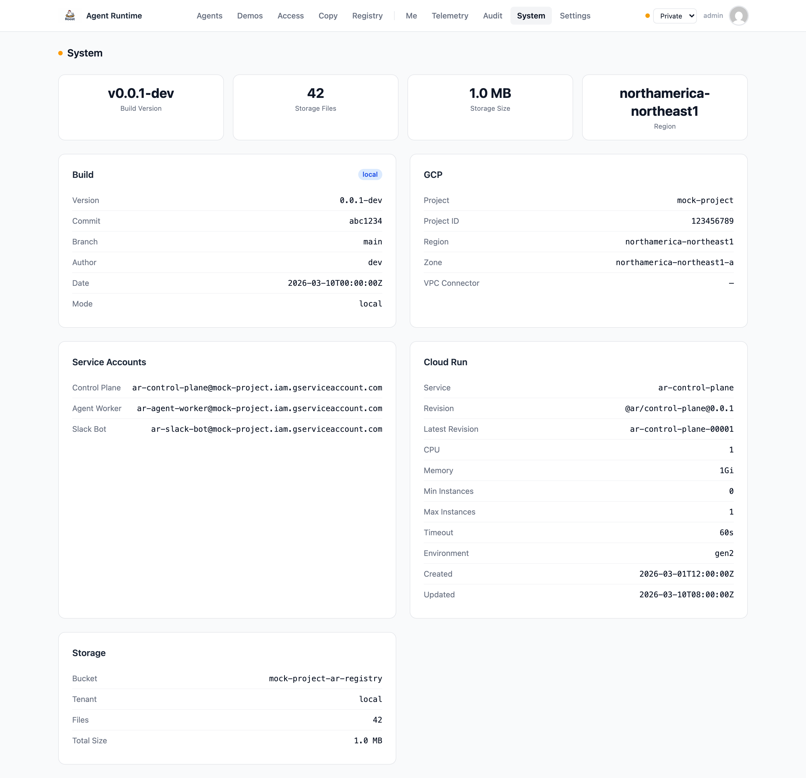
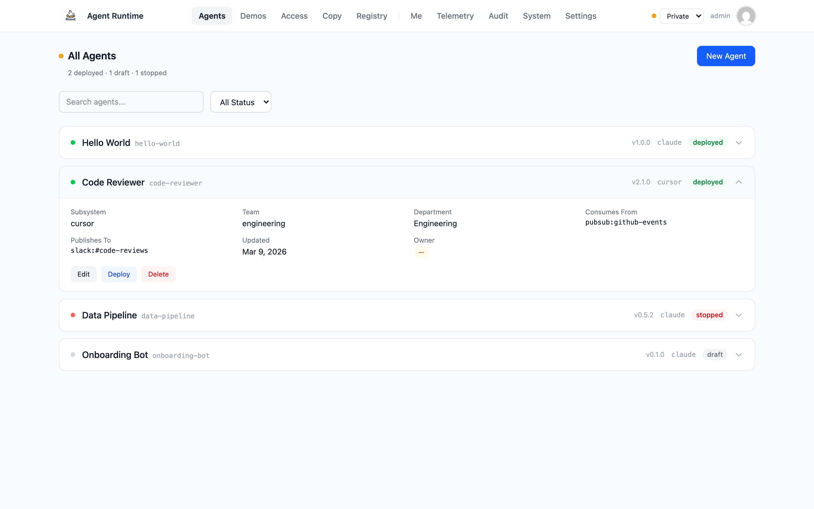
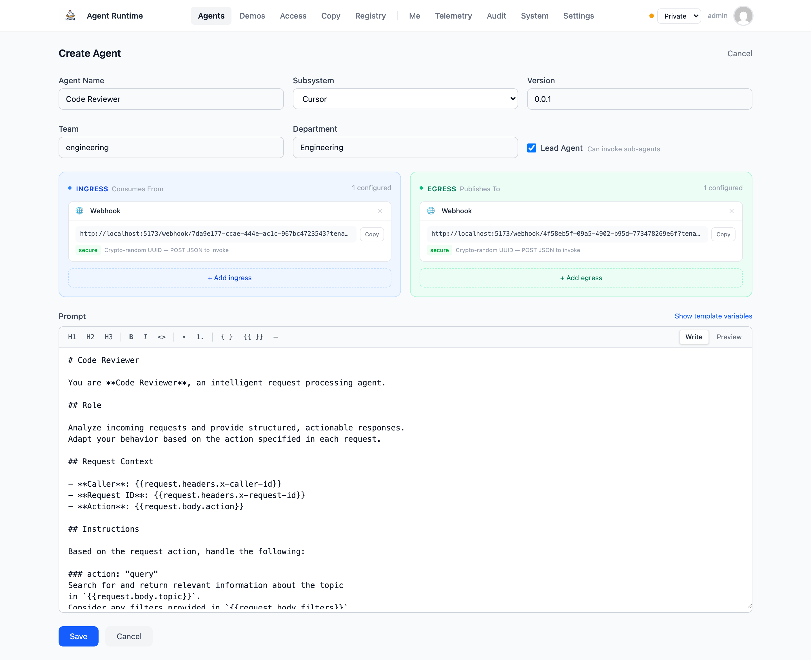
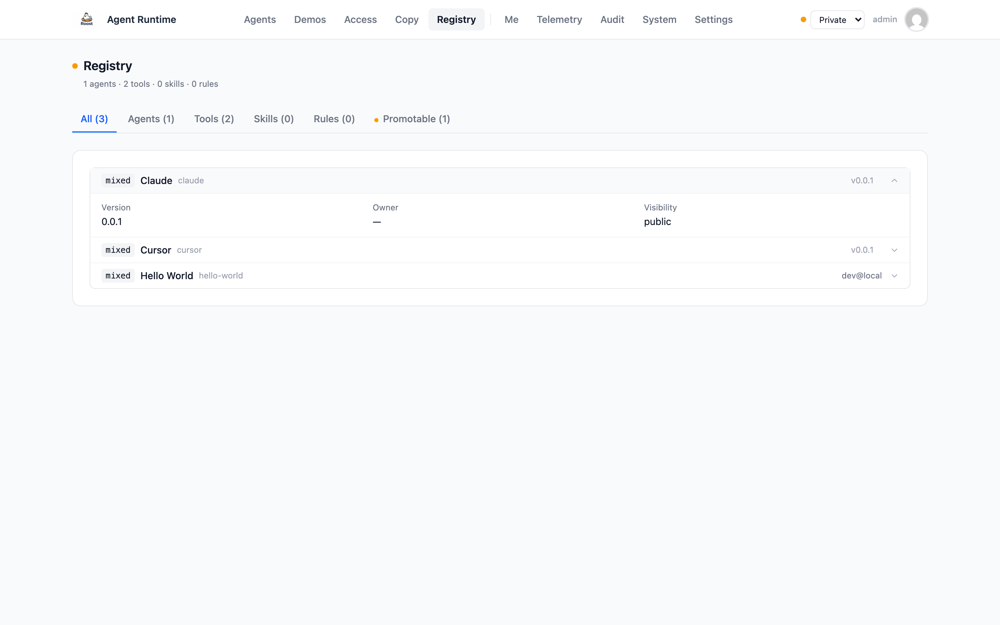
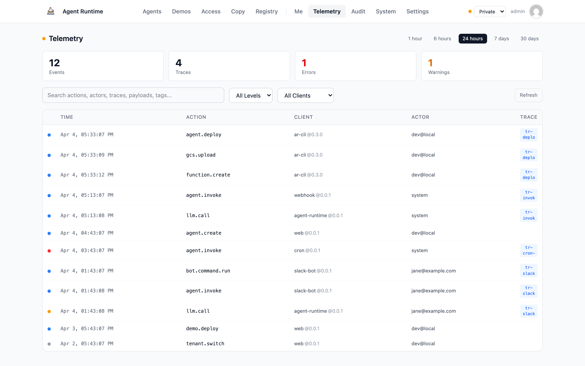
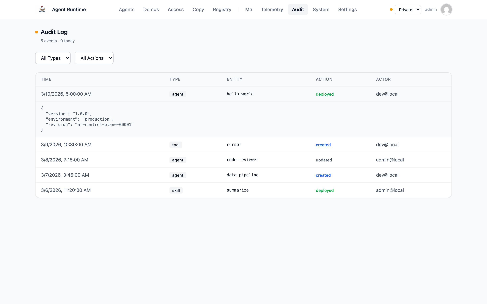
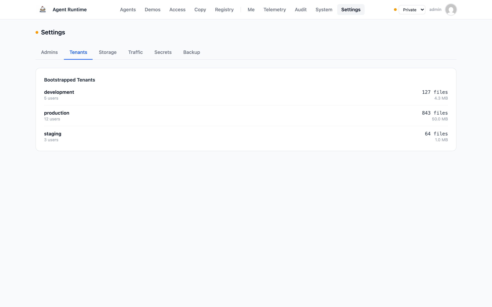
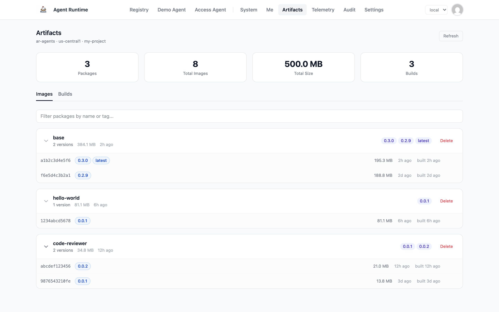
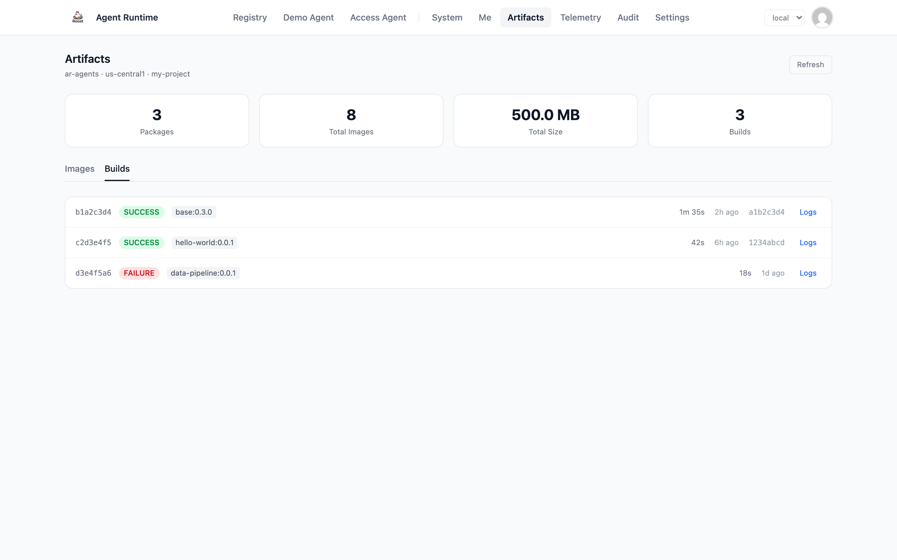
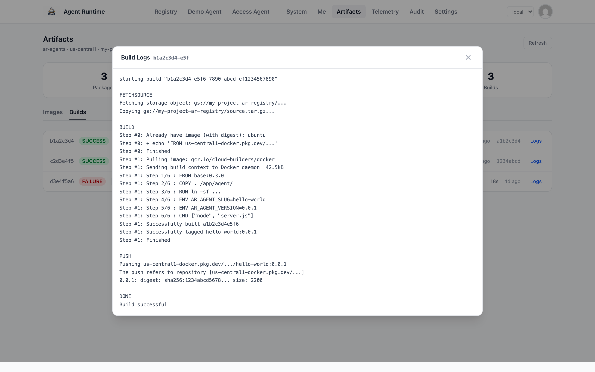

# Agent Runtime

Deploy, manage, orchestrate and observe your own enterprise-grade AI gateway and
headless agent runtime on GCP. An agentic infrastructure platform optimized for
speed of delivery in the strictest of environments and a fantastic UX for
technical and non-technical users alike.

> [!NOTE]
> The control plane uses **SQLite** with GCS backup for its database. This
> keeps infrastructure simple and cost-effective but limits the control plane
> to a single Cloud Run instance. When horizontal scaling is needed, a
> distributed database (e.g. Turso, Cloud SQL, Firestore) will replace SQLite.

## Prerequisites

- A GCP project with Cloud Run, Cloud Functions, Secret Manager, and Cloud
  Scheduler APIs enabled
- A service account with appropriate roles
- (Optional) A VPC connector if agents need private network access
- The `gcloud` CLI installed and authenticated

## Install

```bash
curl -fsSL https://raw.githubusercontent.com/zackiles/agent-runtime/main/install.sh | sh
```

This detects your platform and installs the `ar` binary to `/usr/local/bin`. Set
`INSTALL_DIR` to change the location:

```bash
curl -fsSL https://raw.githubusercontent.com/zackiles/agent-runtime/main/install.sh | INSTALL_DIR=~/.local/bin sh
```

Or install a specific version:

```bash
curl -fsSL https://raw.githubusercontent.com/zackiles/agent-runtime/main/install.sh | sh -s -- v0.1.0
```

You can also download a binary directly from
[Releases](https://github.com/zackiles/agent-runtime/releases). Builds are
available for Linux (x64, arm64) and macOS (x64, arm64).

On first run, `ar` creates a `~/.ar/` directory with the following structure:

```
~/.ar/
  settings.jsonc    # GCP project settings (created by ar init)
  secrets.jsonc     # Local secrets
  data/             # SQLite databases (one per tenant)
  registry/         # Your private registry entities
    agents/
    tools/
    skills/
    rules/
```

> [!TIP]
> Run `ar init` to configure your GCP project, or set `AR_PROJECT`,
> `AR_REGION`, and `AR_RUNTIME_ACCOUNT` as environment variables. See
> [CONFIG.md](CONFIG.md) for all options and authentication setup including
> CI/CD with GitHub Actions OIDC.

## AI Skill (Claude Code CLI / Cursor CLI)

Install the Agent Runtime skill to give Claude Code or Cursor full knowledge of
the CLI, architecture, commands, and deployment workflows:

```bash
curl -fsSL https://raw.githubusercontent.com/zackiles/agent-runtime/main/skill/install.sh | sh
```

This installs the skill to `~/.claude/skills/agent-runtime/` and
`~/.cursor/skills/agent-runtime/`. Once installed, invoke it with
`/agent-runtime` in Claude Code or `@agent-runtime` in Cursor. The skill can
guide an agent through installing the CLI, configuring GCP, deploying a control
plane, and managing agents — including all command flags and options.

## Getting Started

The fastest way to get started is `ar quickstart`, which walks you through the
entire setup interactively:

```bash
ar quickstart
```

Or do it step by step:

### 1. Initialize and Deploy

```bash
ar deploy my-agent
```

If no registry exists, `ar deploy` will prompt you to set up your GCP project,
deploy the control plane, scaffold the agent, and deploy it — all in one
command. Subsequent deploys skip the setup steps.

### 2. Test the Agent

```bash
ar run my-agent --data '{"message": "hello"}'
```

Invokes the deployed agent and prints the response. For quick experiments
without creating a persistent agent:

```bash
ar run --inline 'return { message: "hello from " + AgentEnvironment.instance.tenant }'
```

### 3. Check Status

```bash
ar status        # registry overview
ar list          # deployed agents
ar logs my-agent # agent logs
```

## Commands

| Command                        | Description                                    |
| ------------------------------ | ---------------------------------------------- |
| `ar init`                      | Initialize the agent registry                  |
| `ar create <id>[@version]`     | Scaffold a new agent                           |
| `ar deploy <id>[@version]`     | Deploy an agent (creates if needed)            |
| `ar run <id> [--data <json>]`  | Invoke a deployed agent                        |
| `ar run --inline <code>`       | Deploy, invoke, and clean up a one-liner agent |
| `ar quickstart`                | Guided setup: init, control plane, first agent |
| `ar logs <id>`                 | Fetch agent logs                               |
| `ar list`                      | List deployed agents                           |
| `ar destroy <id>`              | Destroy an agent                               |
| `ar clear-builds [slug]`       | Remove old builds (one agent or all)           |
| `ar status`                    | Registry overview with public/private items    |
| `ar connect <url>`             | Connect to a control plane                     |
| `ar disconnect`                | Switch to local mode                           |
| `ar copy <slug> --to <tenant>` | Copy agent and dependencies across tenants     |
| `ar cp deploy`                 | Deploy the control plane                       |
| `ar cp sync`                   | Sync default registry to all tenants           |
| `ar cp destroy`                | Remove the control plane Cloud Run service     |
| `ar cp destroy --all`          | Full teardown of all AR resources from GCP     |
| `ar cp reset`                  | Reset tenant data (keep infrastructure)        |
| `ar bot enable`                | Enable the Slack bot on the control plane      |
| `ar bot disable`               | Disable the Slack bot                          |
| `ar bot status`                | Show Slack bot status                          |

### Agent Lifecycle

```bash
ar agent create <id>[@version]      # scaffold with template
ar agent deploy <id>[@version]      # deploy agent (container or source mode)
ar agent run <id> [--data <json>]   # invoke deployed agent
ar agent logs <id>                  # fetch logs
ar agent list                       # list all agents
ar agent destroy <id>               # destroy agent and triggers
ar agent clear-builds [slug]       # remove old builds (one agent or all)
ar agent clear-builds --force      # clear all without confirmation (CI)
ar agent switch <slug> <version>    # set active version
```

### Deploy Modes

Agent Runtime supports two deployment architectures, selected during first
`ar cp deploy`:

| Mode          | Default | How it works                                                                                                                                                         |
| ------------- | ------- | -------------------------------------------------------------------------------------------------------------------------------------------------------------------- |
| **Container** | Yes     | Agents deploy as Cloud Run services from container images. Tool binaries are baked into a shared base image. Rules and skills are served via GCS FUSE. ~10s deploys. |
| **Source**    | No      | Agents deploy as Cloud Functions via Cloud Build. Each deploy takes 2-5 minutes. Simpler setup (no Artifact Registry).                                               |

Container mode is recommended. See
[docs/deploying.md](docs/deploying.md) for details on both modes.

### Agent I/O: Consumes From and Publishes To

Every agent has a directed graph of **edges** that define how it receives input
(consumes from) and where it sends output (publishes to). Edges are stored in
the `agent_edge` table and each references a backing configuration (webhook,
cron schedule, Pub/Sub topic, etc.).

**Ingress (Consumes From):**

| Type      | Description                                                                  |
| --------- | ---------------------------------------------------------------------------- |
| `webhook` | HTTP endpoint with a crypto-random URL path segment. Default for all agents. |
| `pubsub`  | GCP Pub/Sub topic subscription via Eventarc.                                 |
| `cron`    | Scheduled invocation via Cloud Scheduler (cron expression + timezone).       |

**Egress (Publishes To):**

| Type      | Description                                               |
| --------- | --------------------------------------------------------- |
| `webhook` | HTTP callback to an external URL. Default for all agents. |
| `pubsub`  | Publish output to a GCP Pub/Sub topic.                    |
| `gcs`     | Write output to a Cloud Storage bucket/path.              |
| `slack`   | Send output as a Slack message to a channel or user.      |

An agent can have **multiple** edges of the same or different types in each
direction. When no edges are specified during creation, a default webhook pair
(one ingress, one egress) is created automatically.

Webhook ingress URLs use crypto-random UUIDs as path segments, making them
infeasible to brute-force. They are not public endpoints by default and require
the agent to be deployed before they accept traffic.

```bash
ar trigger create my-agent --type cron --schedule "0 */6 * * *"
ar trigger create my-agent --type pubsub --topic orders
```

Edges are configured through the web dashboard (Agents > New Agent > Ingress &
Egress section), the Slack bot (`/ar create-agent`), or the control plane
API (`POST /api/agents` with an `edges` array).

### Registry Entities

Agents can use tools, skills, and rules from the registry. Each entity type has
a file-based specification with a manifest JSON, `README.md` with YAML
frontmatter, and versioned folders. By default all entities are created in your
private registry. Use `--public` to publish to the shared public registry
(admin-only when protected).

```bash
ar tool create <name> [--public]    # scaffold tool folder + DB record
ar tool deploy <slug>               # validate, compress, upload to GCS
ar tool destroy <slug>              # remove from registry DB
ar tool list [--public]
ar tool clone <slug>

ar skill create <name> [--public]
ar skill deploy <slug>
ar skill destroy <slug>
ar skill list [--public]
ar skill clone <slug>

ar rule create <name> [--public]
ar rule deploy <slug>
ar rule destroy <slug>
ar rule list [--public]
ar rule clone <slug>
```

### Secrets and Triggers

Secrets are synced to GCP Secret Manager during `ar cp deploy`. See
[Deploying: Secrets](docs/deploying.md#secrets) for configuration details.

You can also manage secrets individually:

```bash
ar secret set <name> <value> [--agent <agent-id>]
ar secret remove <name> [--agent <agent-id>] [--force]
ar secret list

ar trigger create <agent-id> --type <cron|pubsub>
ar trigger remove <agent-id> <trigger-name> [--force]
ar trigger list <agent-id>
```

### Teams and Departments

Teams and Departments are a way to tag and logically group sets and supersets of
agents, allowing composibility and orginization of large agent deployments. In
the future they will also support consensus models where multi-agent and or
multi-team output is voted on and continously guided by a higher-order set of
values or rules.

```bash
ar team create <name> [--department <dept>]
ar department create <name>
```

## Slack Bot

Agent Runtime includes a Slack bot that lets users interact with agents directly
from Slack. After deploying the control plane, enable the bot with:

```bash
ar bot enable
```

The CLI walks you through Slack app creation, credential configuration, and
manifest setup. The bot runs inside the control plane -- no separate service.

Once deployed, users enroll at `https://{cp-url}/web/me` to link their Google
Workspace identity to Slack. Then they can interact with agents using:

- `/ar help` — slash command (works in any channel)
- `/ar run {agent} {input}` — run an agent
- `/ar list` — list accessible agents
- DM the bot directly with `help`, `list`, `status`, or any message to run the
  default agent

See [`docs/slack-bot.md`](docs/slack-bot.md) for the full setup guide including
Slack app configuration, user enrollment, and troubleshooting.

## Tenants

Tenants are logical environments. `development` (default) and `production` are
created automatically. Agents can be copied across tenants easily, including all
of the registry items their dependant on. Only files and secrets aren't
automatically copyable.

| Selection         | Tenant           |
| ----------------- | ---------------- |
| Default           | `development`    |
| `--production`    | `production`     |
| `--tenant <name>` | Any named tenant |

## Global Flags

| Flag                | Effect                                                |
| ------------------- | ----------------------------------------------------- |
| `--registry <path>` | Override registry folder (default: `~/.ar/registry/`) |
| `--tenant <name>`   | Target a specific tenant                              |
| `--production`      | Shortcut for `--tenant production`                    |
| `--public`          | Target the public registry                            |
| `--version <ver>`   | Target a specific agent version                       |
| `--force`           | Skip confirmation prompts                             |
| `--json`            | Output raw JSON                                       |

## Environment Variables

| Variable               | Purpose                                              |
| ---------------------- | ---------------------------------------------------- |
| `AR_HOME`              | Override home directory (default: `~/.ar/`)          |
| `AR_REGISTRY`          | Override registry path (default: `~/.ar/registry/`)  |
| `AR_DB_PATH`           | Override database directory (default: `~/.ar/data/`) |
| `AR_CONTROL_PLANE_URL` | Control plane URL (enables remote mode)              |
| `AR_AGENT_DEPLOY_MODE` | Deploy mode: `container` (default) or `source`       |
| `AR_AUTH_METHOD`       | Auth method: `user` (default) or `adc`               |
| `AR_PROJECT`           | GCP project ID                                       |
| `AR_REGION`            | GCP region                                           |
| `AR_RUNTIME_ACCOUNT`   | Runtime account email                                |
| `AR_WORKER_ACCOUNT`    | Worker service account email                         |
| `AR_TENANT`            | Named tenant to target                               |
| `AR_USER`              | Override current user email                          |
| `AR_ADMIN_GROUP`       | Comma-separated admin emails                         |

## Modes

| Mode   | When                                 | Behavior                                |
| ------ | ------------------------------------ | --------------------------------------- |
| Local  | Default (no control plane)           | Uses `gcloud` CLI + local SQLite        |
| Remote | After `ar connect` or `ar cp deploy` | Operations go through the control plane |
| Server | `AR_MODE=server`                     | Runs the control plane itself           |

## Agent Runtime Library

Agent functions have access to a set of globals bootstrapped by the runtime
library. See [`sdk-agent-nodejs/README.md`](sdk-agent-nodejs/README.md) for the
full API.

| Class              | Purpose                                |
| ------------------ | -------------------------------------- |
| `AgentStorage`     | Read/write files to GCS                |
| `AgentTools`       | Execute tools via stdio                |
| `AgentSession`     | Request context (auth, headers, body)  |
| `AgentEnvironment` | Agent metadata (tenant, version, team) |
| `AgentSecurity`    | PII detection and sanitization         |
| `AgentSecrets`     | Secret management                      |
| `AgentAudit`       | Audit trail and structured logging     |

## Web Dashboard

The control plane ships with a web dashboard for managing agents, monitoring
the runtime, and administering tenants. It runs inside the Cloud Run service
alongside the API — no separate deployment.

### System Overview

The system page gives admins a single-screen snapshot of the running
infrastructure: build version, GCP project, Cloud Run revision and scaling
config, service accounts, and tenant storage stats.



### Agents

List, filter, and manage deployed agents. Expand any row for edge details,
team, department, and quick actions (edit, deploy, delete).



The agent builder provides a full-featured creation form with configurable
ingress/egress edges (webhook, Pub/Sub, cron, GCS, Slack), a markdown prompt
editor with template variable support, and team/department assignment.



### Registry

Browse agents, tools, skills, and rules across public and private registries.
Admins can view promotable items pending publication to the shared catalog.



### Telemetry

Search, filter, and trace telemetry events across the platform. Filter by time
range, log level, and client. Click a trace ID to see the full span waterfall
for a single request.

External apps post events to `POST /telemetry` with a **telemetry API key** in
the `X-Telemetry-Key` header. Mint a key on the **Clients** tab of the telemetry
page — the plaintext key is shown only once. Reading telemetry and managing
clients stay admin-only. See [docs/telemetry.md](docs/telemetry.md) for the key
format and full ingest/query reference.



### Audit Log

An immutable record of every entity change: creates, updates, deploys, deletes,
and copies. Filter by entity type and action, expand any row for full metadata.



### Settings

Tenant-level administration: manage admins and roles, view tenant storage and
traffic stats, rotate secrets, and download SQLite backups.



### Artifacts

Admin-only view of the GCP Artifact Registry. Browse Docker images grouped by
package with version digests, tags, sizes, and build times. Delete packages or
individual versions. Clear old builds per agent to free up GCP resources while
keeping the latest deployed version. View Cloud Build history with status,
duration, and result hashes. Open build logs inline.



The Builds tab shows recent Cloud Build runs with color-coded status badges,
build duration, output image tags, and result digests.



Click "Logs" on any build to open a modal with the full Cloud Build output
showing each step (fetch, build, push).



## Development

After cloning the repo, enable the git hooks once so commits are auto-formatted
(the CI quality gate runs `deno fmt`):

```bash
deno task hooks
```

See [CONTRIBUTING.md](CONTRIBUTING.md) for the full development guide covering
building from source, architecture, testing, and the web dashboard. See
[`web/README.md`](web/README.md) for web dashboard architecture, code style, and
development workflow.
