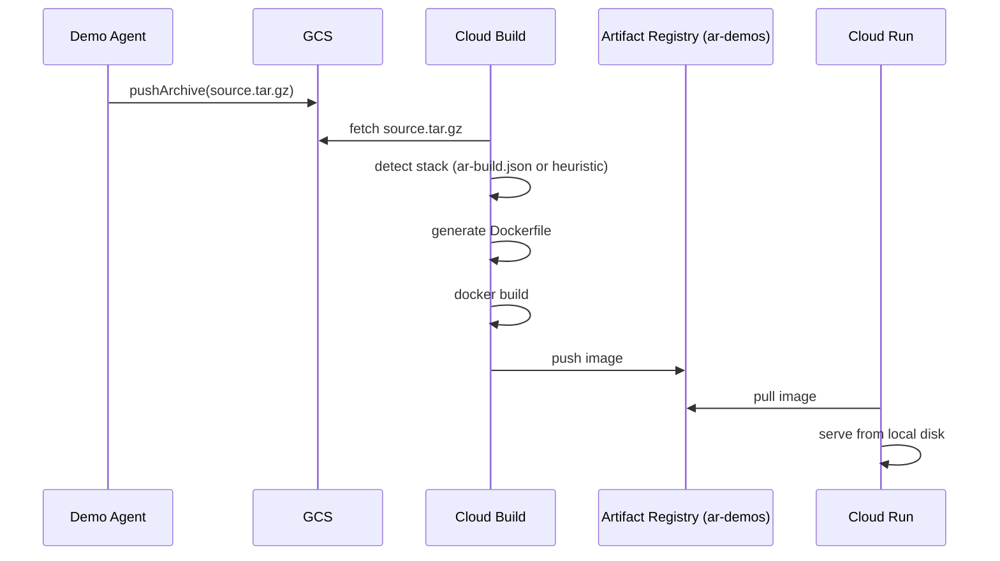

# Container Builds & Artifact Registry

How agent container images are built, stored, and deployed in container mode.

---

## Overview

Container mode (the default) deploys agents as Cloud Run services from
container images. A shared **base image** contains the Node.js runtime, the
agent SDK (`_runtime.cjs`), and all tool binaries. Per-agent images add only
the agent's source code as a thin layer (~5KB).

```
Base image (~250MB compressed, cached at Cloud Run node level)
├── node:22-slim
├── curl + ca-certificates
├── /app/runtime/_runtime.cjs    (agent SDK bundle)
├── /app/runtime/agent-host.js   (HTTP server with Express-like shims)
└── /app/tools/
    ├── cursor/tool              (cursor-agent binary + node)
    ├── claude/tool              (claude CLI)
    ├── github/tool              (gh CLI)
    ├── auth0/tool               (auth0 CLI)
    └── datadog/tool             (datadog CLI)

Per-agent image (~5KB layer on top of base)
├── /app/agent/index.js          (agent handler)
├── /app/agent/agent.json        (manifest)
├── /app/agent/package.json
├── /app/agent/prompt-template.md
└── /app/agent/_runtime.cjs → /app/runtime/_runtime.cjs (symlink)
```

---

## Artifact Registry

Container images are stored in a Docker repository in Google Artifact Registry.

| Resource    | Name                                                           | Created by                                     |
| ----------- | -------------------------------------------------------------- | ---------------------------------------------- |
| Repository  | `ar-agents`                                                    | `ar cp deploy` (auto-created if missing)       |
| Base image  | `{region}-docker.pkg.dev/{project}/ar-agents/base:{version}`   | `ar cp deploy`                                 |
| Agent image | `{region}-docker.pkg.dev/{project}/ar-agents/{slug}:{version}` | Control plane during `POST /agents/:id/deploy` |

The repository is created in the same region as the control plane. Image pulls
from Artifact Registry to Cloud Run in the same region are free.

### Cost

- Artifact Registry: 0.5GB free/month. A base image (~250MB) + 50 agent
  images (~1MB each) = ~300MB. Well within free tier.
- Cloud Build: 120 free min/day. Per-agent thin-layer builds take <30s each.

---

## Base Image

### `Dockerfile.agent-base`

Located at the repo root. Built during `ar cp deploy` or CI release.

```dockerfile
FROM node:22-slim
WORKDIR /app

RUN apt-get update && apt-get install -y --no-install-recommends \
    curl ca-certificates && rm -rf /var/lib/apt/lists/*

COPY sdk-agent-nodejs/bin/index.cjs /app/runtime/_runtime.cjs
COPY default-registry/tools/ /tmp/tools/

RUN for d in /tmp/tools/*/0.0.1; do \
      if [ -f "$d/install.sh" ]; then \
        slug="$(basename $(dirname $d))"; \
        export TOOLS_DIR="/app/tools/$slug"; \
        mkdir -p "$TOOLS_DIR"; \
        cp "$d/tool.json" "$TOOLS_DIR/" 2>/dev/null; \
        cp "$d/install.sh" "$TOOLS_DIR/"; \
        (cd "$TOOLS_DIR" && sh install.sh) || echo "WARN: $slug install failed"; \
      fi; \
    done && rm -rf /tmp/tools

COPY sdk-agent-nodejs/agent-host.js /app/runtime/agent-host.js
```

Key details:

- `curl` is installed because tool `install.sh` scripts download binaries
- Each tool's `install.sh` runs in a subshell so one failure doesn't block
  others
- The slug is derived from the directory name (e.g. `cursor` from
  `/tmp/tools/cursor/0.0.1`)
- `agent-host.js` provides an HTTP server with `res.json()`, `res.status()`,
  and `res.send()` shims for Express-compatible agent handlers

### Building the base image

During `ar cp deploy`, the `buildBaseImage` function:

1. Checks if the `ar-agents` Artifact Registry repository exists; creates it
   if not
2. If Docker is available locally: `docker build` + `docker push`
3. If Docker is not available: stages the build context to a temp directory and
   submits via `gcloud builds submit`

The base image is tagged with the CLI version (e.g. `base:0.0.1`). Rebuilding
the base image is only necessary when:

- A tool's `install.sh` changes
- The SDK (`sdk-agent-nodejs/bin/index.cjs`) is rebuilt
- `sdk-agent-nodejs/agent-host.js` changes
- A new tool is added to `default-settings.jsonc`

### Rebuilding the SDK

After modifying `sdk-agent-nodejs/src/`, you must rebuild:

```bash
cd sdk-agent-nodejs && npm run build
```

The compiled `bin/index.cjs` is baked into the base image as `_runtime.cjs`.
Forgetting to rebuild means deployed agents use stale runtime code. The next
`ar cp deploy` will pick up the new bundle.

---

## Per-Agent Image Build

When `POST /agents/:id/deploy` is called in container mode, the control plane:

1. Submits a Cloud Build with an inline Dockerfile:

   ```dockerfile
   FROM {region}-docker.pkg.dev/{project}/ar-agents/base:{version}
   COPY . /app/agent/
   RUN ln -sf /app/runtime/_runtime.cjs /app/agent/_runtime.cjs
   ENV AR_AGENT_SLUG={slug}
   ENV AR_AGENT_VERSION={version}
   CMD ["node", "/app/runtime/agent-host.js"]
   ```

2. The source comes from GCS (`source.tar.gz` uploaded via
   `POST /agents/:id/source`)

3. Cloud Build pushes the image to
   `{region}-docker.pkg.dev/{project}/ar-agents/{slug}:{version}`

4. The control plane deploys a Cloud Run service with the image, GCS FUSE
   volume mount, secrets, and environment variables

The symlink at `/app/agent/_runtime.cjs` ensures the bootstrap wrapper in
`index.js` (which does `require('./_runtime.cjs')`) resolves to the runtime
in the base image.

### Async deploy

The deploy is asynchronous. `POST /agents/:id/deploy` returns 202 immediately
with a `deployId` and `statusUrl`. The CLI polls
`GET /agents/:id/deploy/status` every 3 seconds until the status is `done` or
`failed`. Status progression: `building` → `deploying` → `done`.

---

## Cloud Run Service Configuration

Each agent Cloud Run service is created with:

| Setting         | Value                                                          |
| --------------- | -------------------------------------------------------------- |
| Image           | `{region}-docker.pkg.dev/{project}/ar-agents/{slug}:{version}` |
| Port            | 8080                                                           |
| Memory          | 2Gi                                                            |
| CPU             | 1                                                              |
| Min instances   | 0 (scale to zero)                                              |
| Max instances   | 1                                                              |
| Service account | Worker SA (`agent-worker-sp`)                                  |
| Ingress         | All traffic                                                    |
| Auth            | No allow-unauthenticated (IAM-gated)                           |

### Environment variables

| Variable               | Value                   | Purpose                           |
| ---------------------- | ----------------------- | --------------------------------- |
| `AR_CONTROL_PLANE_URL` | CP Cloud Run URL        | Storage, secrets, audit callbacks |
| `AR_BUCKET`            | `{project}-ar-registry` | GCS bucket name                   |
| `AR_TENANT_ID`         | Default tenant          | Tenant scope                      |
| `AR_AGENT_SLUG`        | Agent slug              | Agent identity                    |
| `AR_TOOLS_DIR`         | `/app/tools`            | Tool binary location              |

### Secrets

All secrets from `default-settings.jsonc` that exist in Secret Manager are
mounted as environment variables via the Cloud Run secret reference syntax.
The worker SA requires `roles/secretmanager.secretAccessor` to read them.

### GCS FUSE volume mount

A read-only GCS FUSE volume is mounted at `/registry/` giving agents
filesystem access to the entire registry bucket. Rules are at
`/registry/{tenantId}/rules/...`, skills at
`/registry/{tenantId}/skills/...`.

---

## IAM Roles

### Admin SA (`agent-runtime-sp`)

| Role                             | Purpose                          |
| -------------------------------- | -------------------------------- |
| `roles/artifactregistry.writer`  | Push images to Artifact Registry |
| `roles/cloudbuild.builds.editor` | Submit Cloud Build requests      |

### Worker SA (`agent-worker-sp`)

| Role                                 | Purpose                            |
| ------------------------------------ | ---------------------------------- |
| `roles/artifactregistry.reader`      | Pull images from Artifact Registry |
| `roles/storage.objectViewer`         | GCS FUSE read-only mount           |
| `roles/secretmanager.secretAccessor` | Read mounted secrets at runtime    |

These roles are provisioned automatically by `ar cp deploy` via the
`ensureRoles` function.

---

## Adding a New Tool

1. Create `default-registry/tools/{slug}/0.0.1/` with:
   - `tool.json` — manifest with `name`, `slug`, `version`, `flags`, `env`
   - `install.sh` — downloads the binary at build time
   - `README.md` — documentation
2. Add the tool to `default-settings.jsonc` under `tools`
3. Rebuild the base image (`ar cp deploy` or manual Cloud Build)
4. Redeploy agents (each is a thin-layer rebuild, ~30s)

---

## Troubleshooting

### Tool install fails during base image build

Check the Cloud Build logs: `gcloud builds log <build-id>`. Common causes:

- Download URL changed or is rate-limited
- Missing `curl` (should be installed in the Dockerfile)
- `install.sh` has a syntax error

Tool install failures are non-fatal — the build continues and other tools
still install. The failing tool will fall back to runtime install via
`resolveBinary` in `AgentTools`.

### Agent container fails to start

Check the agent's Cloud Run logs. Common causes:

- `_runtime.cjs` symlink missing (rebuild the per-agent image)
- `AR_TOOLS_DIR` not set (redeploy the CP and agent)
- OOM — increase memory in the deploy handler

### Cloud Build permission denied

Ensure the admin SA has `roles/cloudbuild.builds.editor` and
`roles/artifactregistry.writer`. Run `ar cp deploy` to re-provision IAM.

---

## Demo Builds

Demo applications are built using a separate pipeline from agent images.
Instead of layering on a shared base image, demo builds produce standalone
container images from the source code the demo agent generates.

### Architecture



### Stack Detection

Cloud Build runs two shell steps before `docker build`:

1. **Detect** — reads `ar-build.json` from the source root (if present) or
   runs heuristic detection based on file presence (`package.json`,
   `Dockerfile`, `deno.json`, `index.html`, `server.js`). Writes
   `build-config.json`.

2. **Generate Dockerfile** — reads `build-config.json` and writes the
   appropriate `Dockerfile` into `/workspace/`. Supports Node (with
   TypeScript and build scripts), static sites (nginx), Deno, and custom
   Dockerfiles.

### `ar-build.json` Manifest

The demo agent is instructed to include this file in the project root:

```json
{ "type": "node", "entrypoint": "server.js", "build": true }
```

| Field        | Values                                    |
| ------------ | ----------------------------------------- |
| `type`       | `node`, `static`, `deno`, `custom`        |
| `entrypoint` | Entry file (default: `server.js`)         |
| `outputDir`  | Static output directory (default: `dist`) |
| `build`      | Whether to run `npm run build`            |

### Artifact Registry

Demo images are stored in a dedicated `ar-demos` repository (separate from
`ar-agents`). The repository is auto-created on first build.

```
{region}-docker.pkg.dev/{project}/ar-demos/{tenantId}/{userHash}/{slug}:latest
```

### Differences from Agent Builds

| Aspect      | Agent builds               | Demo builds                |
| ----------- | -------------------------- | -------------------------- |
| Base image  | Shared `ar-agents/base`    | None (standalone)          |
| Source      | Agent source + SDK symlink | Full app with dependencies |
| Build steps | Single `docker build`      | Detect + generate + build  |
| Registry    | `ar-agents`                | `ar-demos`                 |
| Image size  | ~5KB layer on base         | 50-200MB (full app)        |
| FUSE mount  | Yes (rules/skills)         | No                         |
