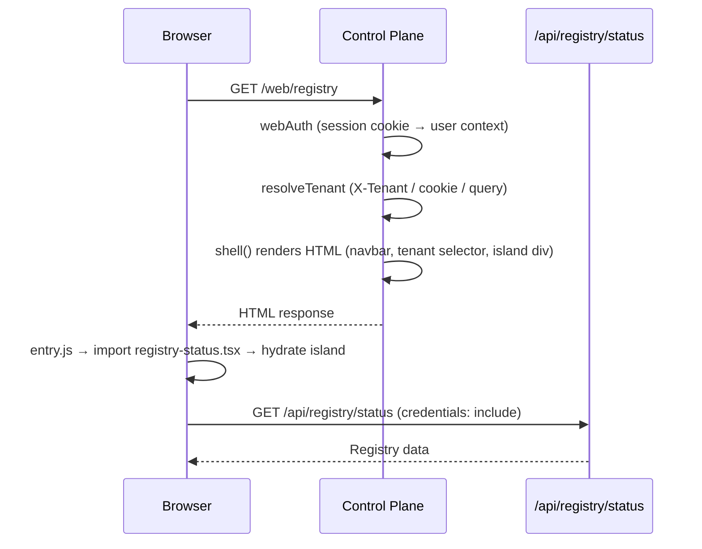

# Control Plane Web Client

The web client is a Preact-based dashboard served by the control plane at
`/web/`. It provides a browser interface for managing agents, demos, access
grants, registry entities, and system configuration. All pages require
authentication via Google OAuth — see [IAM: Web UI Authentication](iam.md#web-ui-authentication)
for the login flow, session cookies, and domain restrictions.

---

## Architecture

The dashboard is a server-rendered shell with client-side islands. The control
plane renders the HTML frame (navbar, tenant selector, layout) at request time
using the authenticated user's identity, then the browser hydrates a single
Preact island per page via dynamic import.

Static assets (JS, CSS, images) are served from `/web/static/` and built by
Vite into the `web/dist/` directory. The control plane embeds these in the
compiled binary.

### Key Files

| File                    | Purpose                                             |
| ----------------------- | --------------------------------------------------- |
| `web/mod.ts`            | Server-side shell rendering, static file serving    |
| `web/src/entry.ts`      | Client-side bootstrap, tenant selector, mobile menu |
| `web/src/pages.ts`      | Page registry (routes, groups, admin flags)         |
| `web/src/context.ts`    | `useApp()` hook (user, tenant switching)            |
| `web/src/api.ts`        | `api()` fetch wrapper with credentials              |
| `web/src/islands/*.tsx` | One Preact component per page                       |

---

## Tenants

The navbar contains a tenant selector dropdown populated from the control
plane's bootstrapped tenant list. When only one tenant exists, the dropdown is
disabled. Switching tenants posts to `POST /api/user/tenant`, which sets the
`ar_tenant` cookie, then reloads the page. All API calls and page renders are
scoped to the active tenant.

The Me page also provides a tenant switcher in the Account card for users who
prefer that location.

---

## Navigation

Pages are split into two groups in the navbar:

- **Main** — Registry, Demo Agent, Access Agent
- **Utility** — System, Me (visible to all), plus Artifacts, Telemetry, Audit,
  Settings (admin-only, separated by a vertical divider)

Admin-only pages are hidden from the navbar for non-admin users via the
`data-admin-only` attribute.

On mobile (below `md` breakpoint), the navbar collapses into a hamburger menu
with the same grouping.

### Legacy Redirects

`/web/agents` and `/web/copy` redirect to `/web/registry`. These were
standalone pages before being consolidated into the Registry view.

---

## Pages

### Registry

| Property   | Value           |
| ---------- | --------------- |
| Path       | `/web/registry` |
| Admin only | No              |

The central hub for all registry entities. A public/private scope selector
next to the title controls which items are shown.

**Tabs:** Agents, All, Tools, Skills, Rules, Promotable (admin only).

The **Agents tab** (default) renders the full agent management UI including
search, status filters, expandable rows with edges and metadata, and
create/edit/deploy/delete actions. It also includes a **Copy Agent** toggle
that opens the cross-tenant copy workflow inline below the agent list.

For non-agent tabs, registry items are shown with expandable rows displaying
version, owner, and visibility.

Features:

- Public/Private scope selector
- Search and filter agents by name/status
- Create prompt agents with markdown editor, subsystem selector, scaffold prompt
- Configure ingress (webhook, Pub/Sub, cron) and egress (webhook, Pub/Sub, GCS,
  Slack) edges with type-specific config fields and validation
- Edit agent metadata, prompt, and edges
- Deploy agents to Cloud Functions
- Copy agent configuration across tenants
- Promotable tab (admin only) — entities eligible for public promotion

API endpoints: `GET /api/registry/status`, `GET /api/agents`,
`POST /api/agents`, `PUT /api/agents/:id`, `POST /api/agents/:id/deploy`,
`DELETE /api/agents/:id`, `GET /copy/options`, `POST /copy/preview`,
`POST /copy`.

### Demo Agent

| Property   | Value        |
| ---------- | ------------ |
| Path       | `/web/demos` |
| Admin only | No           |

Create fullstack demo applications from natural language prompts. The demo
agent generates source code, stores it in GCS, and optionally deploys to Cloud
Run.

Features:

- Create demo (prompt, optional name, subsystem, attachments)
- Feedback/update loop with the demo agent
- Deploy demo to Cloud Run / stop running demo
- Download demo source as JSON
- Delete demo and its container

API endpoints: `GET /api/demos`, `POST /api/demos`,
`POST /api/demos/:name/update`, `POST /api/demos/:name/deploy`,
`POST /api/demos/:name/stop`, `DELETE /api/demos/:name`,
`GET /api/demos/:name/download`.

### Access Agent

| Property   | Value         |
| ---------- | ------------- |
| Path       | `/web/access` |
| Admin only | No            |

Guided access setup for connecting third-party services, APIs, and data
sources. Uses a two-turn flow: the access agent builds a custom UI to collect
credentials, then processes the collected data to store secrets.

Features:

- Request access (resource name, scope, description)
- Common resource quick-select chips
- Complete setup by pasting a context string from the generated UI
- View grant details (secrets, demo URL, instructions)
- Delete access grants
- Public scope option available to admins only

For secret storage details, see [IAM: Secret Rotation](iam.md#secret-rotation).

API endpoints: `GET /api/access`, `POST /api/access`,
`POST /api/access/callback`, `DELETE /api/access/:id`.

### System

| Property   | Value         |
| ---------- | ------------- |
| Path       | `/web/system` |
| Admin only | No            |

System dashboard showing build metadata and infrastructure details.

Features:

- Summary cards: version, storage files, storage size, region
- Build card: version, commit, branch, author, date, mode
- GCP card: project, project ID, region, zone, VPC connector
- Service Accounts card: Agent Runtime, Agent Worker, Slack Bot
- Cloud Run card: service, revision, CPU, memory, scaling, timeouts
- Storage card: bucket, tenant, file count, total size

API endpoints: `GET /system`.

### Me

| Property   | Value     |
| ---------- | --------- |
| Path       | `/web/me` |
| Admin only | No        |

Personal account view and Slack bot integration.

Features:

- Account card: email, role (Admin/Member), tenant, tenant switcher
- Slack bot enrollment: connect via OAuth, view connection status, disconnect
- Paginated Slack message history table

For Slack bot authentication details, see
[IAM: Slack Bot Authentication](iam.md#slack-bot-authentication).

API endpoints: `POST /api/bots/slack/identity/resolve`,
`POST /api/bots/slack/oauth/start`, `POST /api/bots/slack/oauth/revoke`,
`GET /api/bots/slack/messages/list`.

---

## Admin-Only Pages

The following pages are only accessible to users with admin privileges. They
do not appear in the navbar for non-admin users. For how admin status is
determined, see [IAM: Authorization](iam.md#authorization).

### Artifacts

| Property   | Value            |
| ---------- | ---------------- |
| Path       | `/web/artifacts` |
| Admin only | Yes              |

Artifact Registry browser and Cloud Build history for the tenant's GCP
project. Provides a hierarchical view of Docker images grouped by package,
with detailed stats per version and management actions.

Features:

- Summary cards: package count, total images, total size, build count
- **Images tab** — packages as expandable cards with name, tag badges, version
  count, total size, and relative timestamps. Each version row shows truncated
  SHA-256 digest, tags, size, upload time, and build time. Filter/search by
  package name or tag. Delete entire packages or individual versions with a
  confirmation dialog.
- **Clear Builds** — per-package button that removes all old image versions and
  associated GCS source archives, keeping only the latest deployed version.
  Frees up Artifact Registry storage and reduces GCP costs. The action is
  logged as a `builds_cleared` audit event with the full list of deleted
  builds. Only shown when a package has more than one version.
- **Builds tab** — recent Cloud Build history with color-coded status badges
  (SUCCESS, FAILURE, WORKING, QUEUED), image names, build duration, result
  digest, and relative timestamps.
- **Log viewer** — modal that fetches and displays raw Cloud Build logs for any
  build, showing each phase (FETCHSOURCE, BUILD, PUSH, DONE).

The control plane proxies requests to the GCP Artifact Registry REST API
(`artifactregistry.googleapis.com/v1`) and Cloud Build API
(`cloudbuild.googleapis.com/v1`) using the runtime service account's access
token. No additional IAM configuration is needed beyond the existing
`roles/artifactregistry.writer` role on the runtime account.

API endpoints: `GET /api/artifacts`, `GET /api/artifacts/packages/:name/versions`,
`DELETE /api/artifacts/packages/:name`,
`DELETE /api/artifacts/packages/:name/versions/:version`,
`DELETE /api/artifacts/packages/:name/builds`,
`GET /api/artifacts/builds`, `GET /api/artifacts/builds/:id`,
`GET /api/artifacts/builds/:id/logs`.

### Telemetry

| Property   | Value            |
| ---------- | ---------------- |
| Path       | `/web/telemetry` |
| Admin only | Yes              |

Event viewer for runtime telemetry with trace correlation.

Features:

- Events tab with time range filters (24h, 7d, 30d)
- Search by content, level filter, client filter
- Trace viewer: correlated spans by trace ID
- Expandable event details with full metadata

API endpoints: `GET /telemetry`.

### Audit

| Property   | Value        |
| ---------- | ------------ |
| Path       | `/web/audit` |
| Admin only | Yes          |

Full audit log viewer. All mutating API requests (POST, PUT, PATCH, DELETE)
are automatically logged by the audit middleware.

Features:

- Filter by entity type and action
- Expandable rows with full JSON metadata (method, path, status)
- Timestamp display

API endpoints: `GET /audit`.

### Settings

| Property   | Value           |
| ---------- | --------------- |
| Path       | `/web/settings` |
| Admin only | Yes             |

Tabbed admin dashboard for tenant configuration and operations. Six tabs:

**Users** — User management.

- List all users with email, role, and creation date
- Add a new user by email with a role selector (Admin or Member)
- Change a user's role via inline dropdown
- Remove a user with a confirmation step
- The last admin (excluding `system@ar-cli`) cannot be demoted or removed

API endpoints: `GET /api/settings/users`, `POST /api/settings/users`,
`PUT /api/settings/users/:email`, `DELETE /api/settings/users/:email`.

**Tenants** — Read-only view of all bootstrapped tenants.

- User count, file count, and storage size per tenant
- Current tenant highlighted

API endpoints: `GET /api/settings/tenants`.

**Storage** — GCS object browser for the current tenant.

- Scrollable table: path, size (formatted), last modified date
- Summary: total file count and total size

API endpoints: `GET /api/settings/storage`.

**Activity** — Audit and telemetry statistics.

- Six summary cards: audit counts and telemetry counts at 24h, 7d, 30d
- Recent audit entries table (last 20)

API endpoints: `GET /api/settings/activity`.

**Secrets** — GCP Secret Manager integration.

- List all secrets with name and creation date
- Add or rotate a secret (name + value)
- Delete a secret with confirmation step

For how secrets are stored and granted to agent functions, see
[IAM: Secret Rotation](iam.md#secret-rotation).

API endpoints: `GET /secrets`, `POST /secrets`, `DELETE /secrets/:name`.

**Backup** — Database export.

- Download a gzipped copy of the current tenant's SQLite database
- Includes agents, teams, audit logs, telemetry, and configuration

API endpoints: `GET /api/settings/backup`.

---

## Authentication & Authorization Summary

All web client pages are protected by the `webAuth` middleware which validates
the session cookie set during Google OAuth login. API calls from islands are
authenticated via the same cookie (`credentials: 'include'`).

Admin-only pages and API endpoints enforce `isAdmin` checks at the application
layer. Admin status is determined by the `is_admin` flag in the user table or
membership in the `AR_ADMIN_GROUP` environment variable.

For full details on authentication flows, session management, domain
restrictions, JWT verification, and service account roles, see
[Identity & Access Management](iam.md).
