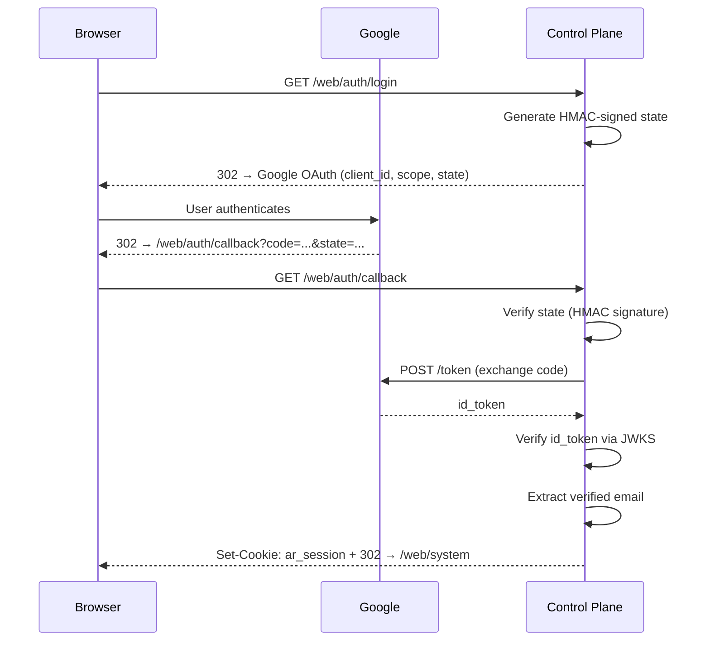
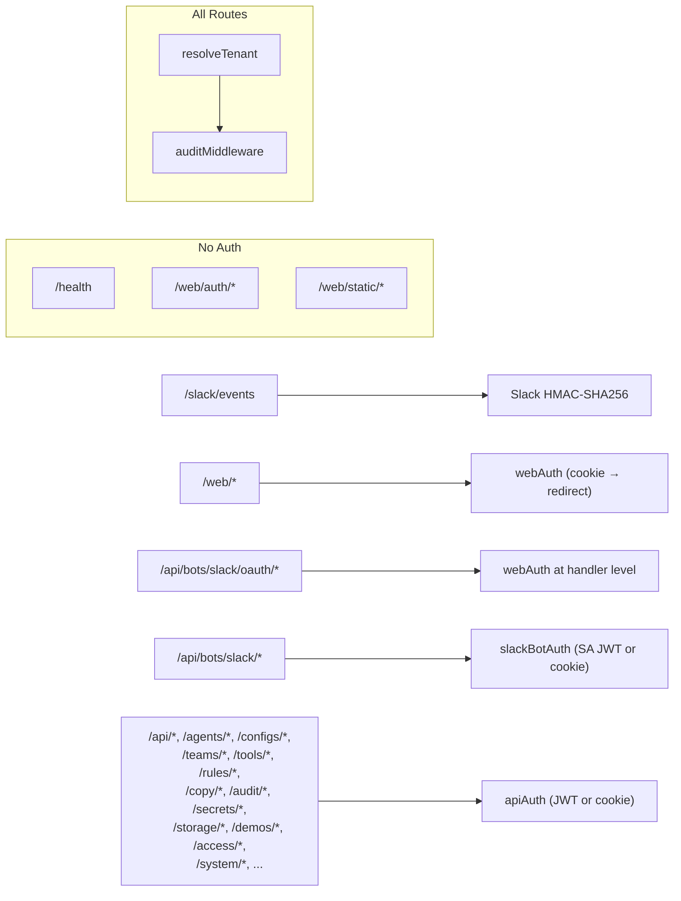
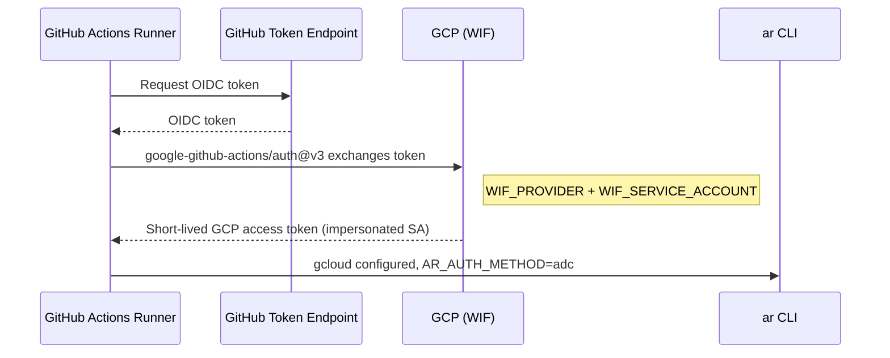

# Identity & Access Management

How authentication and authorization work across the Agent Runtime monorepo.
Every external call — CLI commands, web logins, agent invocations, Slack
interactions, CI pipelines — passes through one of the flows described here.

---

## Overview

| Dimension                                         | Identity Source                       | Credential Type                | Target                    |
| ------------------------------------------------- | ------------------------------------- | ------------------------------ | ------------------------- |
| [CLI](#cli-authentication)                        | `gcloud auth login` or ADC            | Access token / identity token  | GCP APIs or control plane |
| [Web UI](#web-ui-authentication)                  | Google OAuth 2.0                      | Session cookie (HMAC-signed)   | Control plane             |
| [Agent Functions](#agent-function-authentication) | GCP metadata server                   | Identity token (OIDC)          | Control plane             |
| [Slack Bot](#slack-bot-authentication)            | Service account JWT or session cookie | Identity token + Slack headers | Control plane             |
| [Slack Events](#slack-event-verification)         | HMAC-SHA256 signature                 | `SLACK_SIGNING_SECRET`         | Control plane             |
| [CI / GitHub Actions](#ci-authentication)         | Workload Identity Federation          | ADC (impersonated SA)          | GCP APIs                  |
| [Service Accounts](#service-accounts)             | GCP IAM                               | Access token / identity token  | GCP APIs                  |

There is no API key authentication. All programmatic access to the control
plane requires a Google-signed JWT (identity token) or a valid session cookie.

---

## CLI Authentication

The CLI supports two methods. Selection is automatic but can be overridden.

### Method Resolution

Resolved by `cli/src/auth.ts` `resolveAuthMethod()`, checked in order (first
match wins):

1. `AR_AUTH_METHOD` environment variable (`user` or `adc`)
2. `settings.jsonc` → `auth.method`
3. **Automatic:** `user` if stdin is a TTY, `adc` if not

### User Auth (default for interactive terminals)

Uses the active `gcloud auth login` session. Every token request shells out to
`gcloud`:

| Token                          | Command                                              |
| ------------------------------ | ---------------------------------------------------- |
| Access token                   | `gcloud auth print-access-token`                     |
| Identity token                 | `gcloud auth print-identity-token`                   |
| Identity token (with audience) | `gcloud auth print-identity-token --audiences=<url>` |
| Account                        | `gcloud config get-value account`                    |

Identity tokens with `--audiences` only work for service accounts. For user
accounts, gcloud issues tokens with its own OAuth client ID
(`32555940559.apps.googleusercontent.com`) as the audience. The control plane
accepts both.

### ADC Auth (default for CI and headless)

Uses Application Default Credentials through the platform adapter. Token
acquisition follows a fallback chain:

**Access token:**

1. GCP metadata server (`http://metadata.google.internal/.../default/token`)
   — cached based on the server's `expires_in` (typically ~59 minutes)
2. `gcloud auth application-default print-access-token` — cached for 50
   minutes

**Identity token:**

1. GCP metadata server (`http://metadata.google.internal/.../default/identity?audience=<url>`)
   — when no audience is provided, `https://unspecified.invalid` is used as a
   synthetic audience
2. `gcloud auth print-identity-token --audiences=<url>` — only appends
   `--audiences` when an explicit audience is provided

**Account resolution (ADC):**

1. Metadata server email endpoint
2. `gcloud auth list --filter=status:ACTIVE`
3. Falls back to the string `'adc-service-account'`

ADC works with: Workload Identity Federation (GitHub OIDC), GCE/Cloud Run
metadata, `GOOGLE_APPLICATION_CREDENTIALS` key file, or
`gcloud auth application-default login`.

### What Tokens Are Used For

- **Access tokens** — GCP API calls (deploying functions, managing secrets,
  Cloud Run, GCS). These are OAuth 2.0 access tokens.
- **Identity tokens (OIDC)** — calling the control plane's `/api/*` endpoints
  and invoking authenticated Cloud Functions. These are Google-signed JWTs with
  `email`, `iss`, `aud`, and `exp` claims.

### Platform Adapter

Mode is detected by `sdk-client-deno/src/mode.ts`. The mode determines which
platform adapter handles GCP API calls; the auth method (`user`/`adc`) is
orthogonal and only applies in `local` mode.

| Condition                                                   | Mode   | Adapter                | Token Strategy                |
| ----------------------------------------------------------- | ------ | ---------------------- | ----------------------------- |
| `AR_MODE=server`                                            | server | REST (metadata server) | Metadata → ADC fallback       |
| `AR_CONTROL_PLANE_URL` env or `controlPlaneUrl` in settings | remote | Control plane client   | Identity token against CP URL |
| Default + `adc`                                             | local  | REST (metadata server) | Metadata → ADC fallback       |
| Default + `user`                                            | local  | gcloud CLI wrapper     | Shells out to `gcloud`        |

---

## Web UI Authentication

The web dashboard uses Google OAuth 2.0 with authorization code flow,
resulting in an HMAC-signed session cookie.

### Login Flow

### Session Cookie

| Property    | Value                                                                                                                                      |
| ----------- | ------------------------------------------------------------------------------------------------------------------------------------------ |
| Name        | `ar_session`                                                                                                                               |
| Format      | `base64(JSON({email})).base64url(HMAC-SHA256(base64_string, key))`                                                                         |
| Signing key | `AR_SESSION_SECRET` env var (falls back to `'ar-default-session-key'` for local dev — **required on Cloud Run, startup fails if missing**) |
| TTL         | 24 hours                                                                                                                                   |
| Flags       | HttpOnly, SameSite=Lax, Secure                                                                                                             |

The HMAC signs the base64-encoded string (not the raw JSON). The `Secure` flag
means the cookie is only sent over HTTPS — local development on
`http://localhost` will not preserve sessions unless TLS is configured.

Logout clears the cookie via `POST /web/auth/logout`.

### Required Secrets

| Env Var                | Purpose                       |
| ---------------------- | ----------------------------- |
| `GOOGLE_CLIENT_ID`     | OAuth client ID (GCP console) |
| `GOOGLE_CLIENT_SECRET` | OAuth client secret           |
| `AR_SESSION_SECRET`    | HMAC key for session cookies  |

---

## Control Plane API Authentication

### `apiAuth` — API and resource routes

Protects all control plane endpoints except health, static assets, auth
callbacks, and Slack events. Applied to: `/api/*`, `/agents/*`, `/configs/*`,
`/teams/*`, `/departments/*`, `/tools/*`, `/skills/*`, `/rules/*`, `/copy/*`,
`/audit/*`, `/secrets/*`, `/runtime/*`, `/telemetry/*`, `/storage/*`,
`/demos/*`, `/api/demos/*`, `/access/*`, `/api/access/*`, `/system/*`.

Accepts two credential types, tried in order:

**Path 1: Bearer JWT (primary)**

1. Extract `Authorization: Bearer <token>`
2. Verify RS256 signature against
   [Google JWKS](https://www.googleapis.com/oauth2/v3/certs) (keys cached 1h)
3. Validate issuer ∈ `{accounts.google.com, https://accounts.google.com}`
4. Validate audience (when `AR_AUDIENCE` is set):
   - Accepted: the control plane's own URL (for SA/function tokens)
   - Accepted: `32555940559.apps.googleusercontent.com` (gcloud user tokens)
   - Rejected: any other audience, or missing audience claim
5. Validate expiration
6. Extract and verify email claim (`email_verified` must be true)
7. Check email domain against `AR_ALLOWED_DOMAINS` (if set)
8. Resolve admin status via `AR_ADMIN_GROUP` env var OR DB `is_admin` column

**Path 2: Session cookie (fallback)**

1. Extract `ar_session` cookie
2. Verify HMAC with `AR_SESSION_SECRET`
3. Same domain validation as above

### `webAuth` — Web UI routes

Protects `/web/*` (excluding `/web/auth/*` and `/web/static/*`). Accepts only
session cookies. Redirects to `/web/auth/login` on failure. Does **not** check
`AR_ADMIN_GROUP` — admin status comes only from the DB `is_admin` column for
web-authenticated requests.

### Route Middleware Ordering

---

## Agent Function Authentication

Deployed agents authenticate to the control plane using the GCP metadata
server. No static tokens are stored. In **container mode** (default), agents
run as Cloud Run services. In **source mode**, agents run as Cloud Functions
Gen2. The auth mechanism is identical — both use the metadata server.

### Token Acquisition

On each invocation, the bundled runtime calls `_ensureToken()`:

1. If `AR_TOKEN` is already set → skip (uses cached token from prior
   invocation on the same instance)
2. If `AR_CONTROL_PLANE_URL` is not set → skip
3. Fetch identity token from the metadata server with the CP URL as audience
4. Set `process.env.AR_TOKEN`
5. Re-initialize `AgentStorage`, `AgentSecrets`, and `AgentAudit` with the
   fresh token

The token persists in `process.env` for the lifetime of the Cloud Function
instance (across warm invocations). Metadata server identity tokens expire
after ~1 hour. A long-lived warm instance may use an expired token — this is a
known limitation.

### Environment Variables Set at Deploy

`ar agent deploy` sets these on the agent service (Cloud Run in container
mode, Cloud Function in source mode):

| Variable               | Value                              | Purpose                                   |
| ---------------------- | ---------------------------------- | ----------------------------------------- |
| `AR_CONTROL_PLANE_URL` | Cloud Run URL of the control plane | Storage, secrets, audit, deploy callbacks |
| `AR_BUCKET`            | `{project}-ar-registry`            | GCS bucket name for storage operations    |
| `AR_TENANT_ID`         | Default tenant from settings       | Tenant scope for GCS path prefixes        |
| `AR_AGENT_SLUG`        | Agent slug                         | Agent identity (container mode)           |
| `AR_TOOLS_DIR`         | `/app/tools`                       | Tool binary location (container mode)     |

### Secrets as Environment Variables

Agent secrets are mounted from GCP Secret Manager via
`--set-secrets=ENV_VAR=secret-name:latest` during deploy. The mapping is
defined in `default-settings.jsonc` under `secrets`. Common examples:

| Secret Manager Name | Env Var             | Consumer    |
| ------------------- | ------------------- | ----------- |
| `cursor-api-key`    | `CURSOR_API_KEY`    | Cursor tool |
| `anthropic-api-key` | `ANTHROPIC_API_KEY` | Claude tool |
| `gh-token`          | `GH_TOKEN`          | GitHub tool |

### SDK Auth Pattern

All agent SDK classes use `Bearer <AR_TOKEN>` to control plane endpoints:

| Class           | Endpoint     | Scope                                                                  |
| --------------- | ------------ | ---------------------------------------------------------------------- |
| `AgentStorage`  | `/storage/*` | `{tenantId}/agent/{agentId}/files/`                                    |
| `AgentSecrets`  | `/secrets/*` | Falls back to env vars first                                           |
| `AgentAudit`    | `/audit`     | Sends `X-Tenant` header                                                |
| `AgentSecurity` | (local)      | Sanitizes sensitive data (API keys, PII, bearer tokens) from agent I/O |

---

## Slack Bot Authentication

The Slack integration has three auth paths depending on the caller.

### Bot Backend (Service Account)

When the Slack bot backend sends requests to the control plane:

1. Bot presents a Google identity token as `Authorization: Bearer <token>`
2. `slackBotAuth` verifies the JWT signature and checks that the email matches
   `AR_BOT_SLACK_SA` env var (exact service account email match)
3. Bot must include `X-Slack-User-Email` and `X-Slack-User-Id` headers
   identifying the Slack user who triggered the action
4. The `slack_identity` table is checked: the Slack user must be linked,
   `enabled`, **and** the `X-Slack-User-Id` header must match the stored
   `slackUserId` for that email
5. The request proceeds as the mapped AR user (not the service account)

### Web UI (Session Cookie Fallback)

When no `Authorization` header is present, `slackBotAuth` falls back to
session cookie authentication. This allows web UI users to manage Slack
settings and trigger agent runs through the `/api/bots/slack/*` endpoints.

### OAuth Routes

Paths containing `/oauth/` bypass `slackBotAuth` entirely. The individual
OAuth route handlers (`/oauth/start`, `/oauth/callback`) apply `webAuth`
at the handler level, requiring a session cookie.

### User-Facing Slack OAuth

Users link their AR identity to Slack through the web UI:

1. User authenticates to web UI (Google OAuth → session cookie)
2. `POST /api/bots/slack/oauth/start` → redirect to Slack OAuth
   (scope: `identity.basic,identity.email`, state signed with session key)
3. Slack callback → verify state matches session email
4. Exchange code for Slack access token, fetch user identity
5. Upsert `slack_identity` record: maps AR email ↔ Slack user ID per tenant

### Group Authorization Gate

When `AR_BOT_SLACK_AUTH_GROUP` is set, the `/identity/verify` endpoint queries
the Google Cloud Identity API to verify the Slack user is a member of the
specified Google group. This provides an additional authorization layer beyond
the `slack_identity` table.

### Required Secrets

| Env Var                   | Purpose                                                  |
| ------------------------- | -------------------------------------------------------- |
| `SLACK_BOT_TOKEN`         | Bot API calls                                            |
| `SLACK_SIGNING_SECRET`    | Event payload HMAC verification                          |
| `SLACK_CLIENT_ID`         | OAuth flow (also `AR_BOT_SLACK_CLIENT_ID`)               |
| `SLACK_CLIENT_SECRET`     | OAuth token exchange (also `AR_BOT_SLACK_CLIENT_SECRET`) |
| `AR_BOT_SLACK_SA`         | Service account email for bot auth                       |
| `AR_BOT_SLACK_AUTH_GROUP` | Optional Google group gate for Slack users               |

---

## Slack Event Verification

The `/slack/events` endpoint does **not** use `apiAuth` or session cookies.
Instead it verifies Slack's HMAC-SHA256 request signature:

1. Extract `x-slack-request-timestamp` and `x-slack-signature` headers
2. Reject if timestamp is older than 5 minutes (replay protection)
3. Compute HMAC-SHA256 of `v0:{timestamp}:{body}` using `SLACK_SIGNING_SECRET`
4. Timing-safe comparison of computed signature against `x-slack-signature`
5. Returns 401 on mismatch

---

## CI Authentication

CI uses Workload Identity Federation (WIF) — GitHub's OIDC token is exchanged
for a short-lived GCP service account credential without storing any keys.

### Flow

### Required Repository Variables

See [releasing.md — Required GitHub Configuration](releasing.md#required-github-configuration)
for the full list of repository variables and secrets. The integration job
only runs when `vars.WIF_PROVIDER` is set.

---

## Service Accounts

The runtime uses two GCP service accounts to enforce least-privilege.

### Admin SA (`agent-runtime-sp`)

Used by the CLI and control plane for provisioning.

| Role                                   | Purpose                                         |
| -------------------------------------- | ----------------------------------------------- |
| `roles/cloudfunctions.developer`       | Deploy and manage Cloud Functions (source mode) |
| `roles/run.admin`                      | Manage Cloud Run services                       |
| `roles/run.invoker`                    | Invoke Cloud Functions and Cloud Run services   |
| `roles/iam.serviceAccountUser`         | Act as the worker SA when deploying             |
| `roles/secretmanager.admin`            | Create, delete, and manage secrets              |
| `roles/storage.admin`                  | Read/write the registry GCS bucket              |
| `roles/cloudscheduler.admin`           | Create and delete cron triggers                 |
| `roles/artifactregistry.writer`        | Push container images (container mode)          |
| `roles/cloudbuild.builds.editor`       | Submit Cloud Build requests (container mode)    |
| `roles/iam.serviceAccountTokenCreator` | Generate signed URLs for direct GCS access      |

### Worker SA (`agent-worker-sp`)

Runtime identity for deployed agents (Cloud Run services in container mode,
Cloud Functions in source mode).

| Role                                 | Purpose                                           |
| ------------------------------------ | ------------------------------------------------- |
| `roles/run.invoker`                  | Invoke other services                             |
| `roles/logging.logWriter`            | Write structured logs                             |
| `roles/artifactregistry.reader`      | Pull container images (container mode)            |
| `roles/storage.objectViewer`         | GCS FUSE read-only volume mount (container mode)  |
| `roles/secretmanager.secretAccessor` | Read secrets mounted as env vars (container mode) |

In **container mode**, secrets from Secret Manager are mounted directly as
environment variables on the Cloud Run service. The worker SA needs
project-level `secretAccessor` to read them at runtime.

In **source mode**, per-secret access is granted individually via
`secretGrantAccess()` during deploy.

### Container Mode IAM

Cloud Run deployments with Artifact Registry images, Cloud Build, GCS FUSE
volume mounts, and Secret Manager env mounts use the following roles on top
of the [Admin SA](#admin-sa-agent-runtime-sp) and
[Worker SA](#worker-sa-agent-worker-sp) tables above.

| Role                                   | SA     | Purpose              |
| -------------------------------------- | ------ | -------------------- |
| `roles/artifactregistry.writer`        | Admin  | Push images          |
| `roles/artifactregistry.reader`        | Worker | Pull images          |
| `roles/cloudbuild.builds.editor`       | Admin  | Submit builds        |
| `roles/storage.objectViewer`           | Worker | GCS FUSE read        |
| `roles/secretmanager.secretAccessor`   | Worker | Read mounted secrets |
| `roles/iam.serviceAccountTokenCreator` | Admin  | Sign URLs            |

**Demo builds** also require `roles/artifactregistry.writer` and
`roles/cloudbuild.builds.editor` on the Admin SA. Demo images are pushed to
a separate `ar-demos` repository (auto-created on first build). The Worker SA
needs `roles/artifactregistry.reader` to pull demo images at runtime.

### Signed URLs

The admin SA needs `roles/iam.serviceAccountTokenCreator` so the control plane
can mint V4 signed URLs for direct GCS access from agents. Agents request them
via `GET /storage/sign` using their usual bearer token; the handler validates
tenant scope on the object path and returns a JSON body with `url` and
`expires`. Time-to-live defaults to 300 seconds; the `ttl` query parameter is
capped at 3600 seconds.

### Per-Agent SA (optional)

Created with `--with-sa` during `ar agent create`. Named
`{agentId}-fn@{project}.iam.gserviceaccount.com`. Used as the function's
`--run-service-account` for fine-grained isolation.

---

## Authorization

### Admin Determination

A user is admin if **either** condition is true:

1. Their email is in the `AR_ADMIN_GROUP` env var (comma-separated list)
2. The `is_admin` column is set in the SQLite `user` table

Both are checked on API-authenticated requests (`apiAuth`, OR'd together).
Web UI requests (`webAuth`) only check the database `is_admin` column —
`AR_ADMIN_GROUP` is not consulted for cookie-only auth.

### Domain Restriction

`AR_ALLOWED_DOMAINS` (comma-separated) restricts which email domains can
authenticate. Empty means all domains are allowed. Checked at auth time —
users outside allowed domains get 403 before any resource access.

### Tenant Isolation

Tenants are resolved per-request from:

1. `X-Tenant` request header
2. `?tenant=` query parameter
3. Default: `development`

Tenant identifiers are validated against `^[a-z0-9][a-z0-9_-]{0,62}$` —
lowercase alphanumeric with hyphens and underscores, maximum 63 characters.
Invalid identifiers return 400.

Each tenant has its own SQLite database. GCS paths are prefixed with
`{tenantId}/`. There is no per-tenant authorization gate — any authenticated
user can access any tenant by setting the header.

### Admin vs Non-Admin Capabilities

| Capability                                 | Admin | Non-Admin                                                     |
| ------------------------------------------ | ----- | ------------------------------------------------------------- |
| List any user's demos (`?user=`)           | Yes   | Own demos only                                                |
| Run demo cleanup                           | Yes   | 403                                                           |
| Create public access grants                | Yes   | Private only                                                  |
| Publish to registry                        | Yes   | Only when tenant's `registry_protected` is disabled (default) |
| System info and tenant reset (`/system/*`) | Yes   | 403                                                           |

### Demo Sharing

A demo owner can share a demo with other users in the same tenant as a
**viewer** (read-only) or **editor** (full control except deletion). Access is
resolved per request by `control-plane/src/api/demos/access.ts`, which folds
together ownership, `demo_share` grants, and admin status into a single role.
Sharing does **not** create any new Cloud Run IAM binding — viewers reach the
demo through the authenticated `/web/d/{slug}` proxy and editors mutate it
through `/api/demos/*` under the owner's storage scope.

| Capability                      | Owner | Editor | Viewer | Admin |
| ------------------------------- | ----- | ------ | ------ | ----- |
| View / open (`/web/d/{slug}`)   | Yes   | Yes    | Yes    | Yes   |
| Deploy, stop, update, download  | Yes   | Yes    | No     | Yes   |
| Manage shares (invite / revoke) | Yes   | Yes    | No     | Yes   |
| Delete the demo                 | Yes   | No     | No     | Yes   |

Share targets are validated against `AR_ALLOWED_DOMAINS` (the same allow-list
used at auth time). When a slug is shared by more than one owner, the proxy
returns a `300 Multiple Choices` disambiguation page and callers pass
`?owner={email}` to pick one. See
[RFC-010](rfc/rfc-010-demo-sharing.md) for the full design.

---

## Secret Rotation

Running `ar secret set <name> <value>` updates the secret in GCP Secret Manager
and automatically discovers and refreshes any deployed Cloud Functions that
reference it. This forces a new Cloud Run revision so the function picks up the
latest secret value without a manual redeploy.

Cloud Functions mount secrets as environment variables via
`--set-secrets=ENV=name:latest`. The `latest` alias is resolved once at revision
creation time — not per-request — which is why the refresh step is necessary.

---

## Security Considerations

- **Session secret:** `AR_SESSION_SECRET` falls back to a hard-coded string for
  local development. On Cloud Run (`K_SERVICE` set), the control plane refuses
  to start if `AR_SESSION_SECRET` is missing.
- **JWT audience:** When `AR_AUDIENCE` is not explicitly set, the control plane
  auto-derives audience from `K_SERVICE` on Cloud Run. Local development skips
  audience validation. The OAuth client ID (`GOOGLE_CLIENT_ID`) and gcloud
  client ID are always in the allowed audience set.
- **OAuth CSRF protection:** The Google OAuth login flow uses an HMAC-signed
  `state` parameter to prevent login CSRF attacks.
- **Security headers:** Web UI responses include `X-Frame-Options: DENY`,
  `X-Content-Type-Options: nosniff`, and
  `Referrer-Policy: strict-origin-when-cross-origin`.
- **No rate limiting:** No request throttling is implemented. Public-facing
  deployments should add a rate-limiting layer (Cloud Armor, API Gateway) in
  front of the control plane.
- **Tenant isolation is logical:** Any authenticated user can access any tenant
  by setting the `X-Tenant` header. Isolation is by database separation, not
  per-tenant authorization.
- **Agent token expiry:** Metadata server identity tokens expire after ~1 hour.
  Long-lived warm Cloud Function instances do not refresh the token
  automatically.
