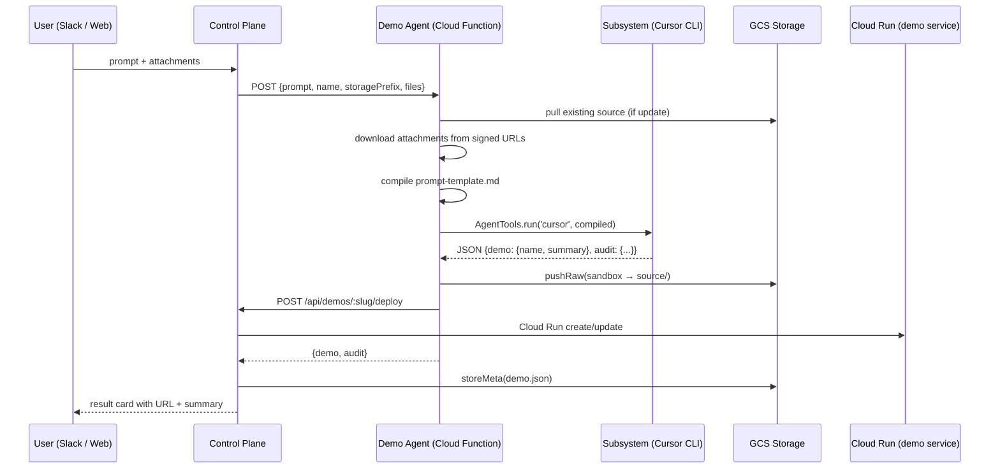

# Demo Agent Refactor — Architecture Options

> **Status:** Research\
> **Date:** 2026-04-08\
> **Scope:** `default-registry/agents/demo-agent/`, `sdk-client-deno/src/templates/agent-demo.ts`, `control-plane/src/api/demos/`

---

## 1. Context

The demo-agent is a code-generating agent that turns natural-language prompts
into deployed web applications. A user says "build a todo app" in Slack or the
web client; the platform invokes the demo-agent Cloud Function, which shells out
to a subsystem (Cursor CLI), pushes the generated source to GCS, triggers a
Cloud Run deploy, and returns metadata.

This document analyses the current implementation, identifies structural
problems, and proposes five distinct refactor options.

---

## 2. Current Architecture

### Data flow



### Files involved

| File                                                          | Role                                                    |
| ------------------------------------------------------------- | ------------------------------------------------------- |
| `default-registry/agents/demo-agent/0.0.1/index.js`           | Pre-built handler deployed to Cloud Function            |
| `default-registry/agents/demo-agent/0.0.1/prompt-template.md` | Prompt sent to the subsystem                            |
| `default-registry/agents/demo-agent/0.0.1/agent.json`         | Deployment manifest                                     |
| `sdk-client-deno/src/templates/agent-demo.ts`                 | Template that generates handler + prompt for new agents |
| `control-plane/src/api/demos/routes.ts`                       | CP HTTP routes for create/deploy/download/update        |
| `control-plane/src/api/demos/deploy.ts`                       | CP-side deploy orchestration (Cloud Run, IAM)           |
| `control-plane/src/bots/slack/commands/demo.ts`               | Slack bot command handler                               |

### What the handler does today (238 lines)

1. Parse and sanitize the HTTP request body
2. Resolve slug, mode (create vs update), sandbox path
3. Pull existing source from GCS if updating
4. Download attachments from signed URLs to the sandbox
5. Compile the prompt template with mustache-style variables
6. Invoke the subsystem via `AgentTools.instance.run('cursor', compiled)`
7. Parse the JSON response from the subsystem
8. Push generated source to GCS via `AgentStorage.instance.pushRaw`
9. Call the CP deploy API (`POST /api/demos/:slug/deploy`) to trigger Cloud Run
10. Sanitize and return the result

---

## 3. Problems

### 3.1 Monolithic handler with six distinct responsibilities

The handler simultaneously acts as an HTTP parser, storage orchestrator, file
downloader, prompt compiler, subsystem invoker, and deploy client. These are
different concerns with different failure modes, but they're woven into one
imperative script with no separation.

### 3.2 Two divergent copies of the same handler

The pre-built `index.js` in `default-registry/` and the `HANDLER_TEMPLATE`
string in `agent-demo.ts` are semantically identical but textually different.
The pre-built uses `const`/`let` and `pull`; the template uses `var` and
`pullRaw`. They've already drifted — the template has `getIdentityToken` and
`writeRaw` for metadata; the pre-built doesn't. Every fix must be applied
twice, and they keep diverging.

### 3.3 Circular dependency with the control plane

The agent calls `POST /api/demos/:slug/deploy` back to the CP from inside its
handler. But the Slack handler _also_ calls `deployContainer` after
`invokeAgent` returns. This creates a double-deploy race. Whoever finishes
second overwrites the first's metadata. The CP → agent → CP call chain also
makes failure modes harder to reason about.

### 3.4 Duplicate metadata writes

The agent writes `demo.json` to GCS. The CP also writes it via `storeMeta`.
Whoever writes last wins. The two copies can contain different data (the agent
doesn't set `visibility`, `createdBy`, or `status`; the CP does).

### 3.5 No structured output validation

The subsystem returns free-form text that the handler attempts to parse as JSON.
If the model returns malformed JSON or omits `summary`, the handler silently
degrades — `demo.summary` is simply absent, and downstream consumers (Slack
cards, web UI) show nothing. There is no schema enforcement or retry.

### 3.6 Zero testability

The handler depends on six globals (`AgentStorage`, `AgentTools`,
`AgentSecurity`, `AgentAudit`, `AgentEnvironment`, `AgentSecrets`), the
filesystem, `process.env`, `process.chdir`, and HTTP `fetch`. There are zero
unit tests for the handler logic. The only existing test checks that the file
is valid CJS.

### 3.7 Prompt template carries no structured guidance

The prompt is 47 lines of XML tags. The subsystem receives a text blob and is
expected to generate a full app, return valid JSON with specific fields, avoid
adding auth, and bind to the right port. There's no schema, no tool for the
subsystem to call for structured output, and no validation of what it produces.

---

## 4. Design Goals

1. **Minimal handler surface** — the agent's `index.js` should only do what
   _only_ the agent can do: compile the prompt and invoke the subsystem.
2. **Single source of truth** — one handler definition, not two drifting copies.
3. **No circular dependencies** — the agent should never call back to the CP.
4. **Testable** — handler logic should be testable without globals or network.
5. **Deterministic lifecycle** — storage, metadata, and deploy should follow a
   predictable, auditable sequence controlled by one party.
6. **Schema-enforced output** — the subsystem response should be validated
   before downstream consumers see it.

---

## 5. Options

### Option A: Thin Handler + Runtime Lifecycle Hooks

Reduce `index.js` to prompt compilation and subsystem invocation. Move all
infrastructure concerns into the runtime (`agent-host.js`) via lifecycle hooks.

**Handler (~40 lines):**

```javascript
exports.handler = async (req, res) => {
  const { prompt, name, mode, sandboxPath, scaffoldPath } = req.body

  const template = fs.readFileSync(
    path.join(__dirname, 'prompt-template.md'),
    'utf-8',
  )
  const compiled = compileTemplate(template, {
    TASK: mode === 'update' ? TASK_UPDATE : TASK_CREATE,
    SANDBOX_PATH: sandboxPath,
    SCAFFOLD_PATH: scaffoldPath,
    REQUEST: prompt,
    DEMO_NAME: name,
    ACTION: mode,
  })

  const result = AgentTools.instance.run(
    AgentEnvironment.instance.subsystem,
    compiled,
    { timeout: 300000 },
  )
  res.json(JSON.parse(result))
}
```

**What moves to the runtime:**

- `agent-host.js` reads `agent.json` for lifecycle config
- `beforeInvoke`: slug generation, mode detection, existing source pull,
  attachment download, sandbox setup
- `afterInvoke`: source push to GCS, response validation
- Deploy and metadata writes stay entirely in the CP

**Pros:**

- Handler is trivially testable (pure function: template in → JSON out)
- Single source of truth for lifecycle logic (runtime, not agent)
- Clean separation of agent logic from infrastructure

**Cons:**

- Requires new hook infrastructure in `agent-host.js`
- The `agent.json` schema needs extending to declare lifecycle behavior
- Hooks add an abstraction layer that every agent implicitly depends on

---

### Option B: Extract Orchestration Into a Tool

Create a `demo-lifecycle` tool (same model as `cursor` or `claude`) that the
handler calls for storage and deploy operations via the existing tool
infrastructure.

**Tool structure:**

```
default-registry/tools/demo-lifecycle/0.0.1/
  tool.json
  tool.js
  README.md
```

**Tool interface:**

```bash
demo-lifecycle stage  --slug=my-app --sandbox=/tmp/demos/my-app
demo-lifecycle push   --slug=my-app --sandbox=/tmp/demos/my-app
demo-lifecycle status --slug=my-app
```

**Handler calls the tool:**

```javascript
await AgentTools.instance.exec('demo-lifecycle', [
  'stage',
  '--slug',
  slug,
  '--sandbox',
  sandboxPath,
])
// ... invoke subsystem ...
await AgentTools.instance.exec('demo-lifecycle', [
  'push',
  '--slug',
  slug,
  '--sandbox',
  sandboxPath,
])
```

**Pros:**

- Fits the existing tool model — no new abstractions
- Testable in isolation (tool is a standalone script)
- Other agents can reuse the same lifecycle tool

**Cons:**

- Tool needs runtime context (tenant, token) passed via env vars
- Adds a new tool to maintain and deploy in the base image
- Still leaves some orchestration in the handler (sequencing the tool calls)

---

### Option C: Move All Orchestration to the Control Plane

The demo-agent becomes a pure code-generation function. It receives a prompt
and a sandbox path, invokes the subsystem, and returns the generated JSON.
Everything else stays in the CP.

**CP-side flow:**

1. CP stages existing source into the sandbox (via GCS FUSE mount)
2. CP downloads attachments to the sandbox
3. CP calls the agent with `{ prompt, sandboxPath, mode, name }`
4. Agent compiles template → invokes subsystem → returns JSON
5. CP reads generated source from the sandbox
6. CP pushes to GCS, stores metadata, deploys Cloud Run

**Pros:**

- Cleanest separation — agent has zero infrastructure concerns
- No duplicate deploy, no circular dependency
- CP has full lifecycle control and single metadata source of truth

**Cons:**

- Requires shared filesystem between CP and agent (GCS FUSE or sidecar model)
- Currently the agent runs as a separate Cloud Function — the CP can't read
  its `/tmp`; this would require an architectural change to the agent hosting
  model (e.g., Cloud Run sidecar, synchronous subprocess)
- Couples CP more tightly to demo-agent's internal directory structure

---

### Option D: Declarative Agent Manifest with Lifecycle Phases

Extend `agent.json` with a declarative lifecycle that the runtime interprets.
The handler only implements the `invoke` phase — or disappears entirely,
replaced by just a prompt template.

**Extended manifest:**

```json
{
  "slug": "demo-agent",
  "subsystem": "cursor",
  "lifecycle": {
    "before": {
      "stage": {
        "from": "storage",
        "path": "{{storagePrefix}}/{{slug}}/source"
      },
      "attachments": { "download": true, "dir": "attachments" }
    },
    "invoke": {
      "template": "prompt-template.md",
      "vars": [
        "TASK",
        "SANDBOX_PATH",
        "SCAFFOLD_PATH",
        "REQUEST",
        "DEMO_NAME",
        "ACTION"
      ],
      "timeout": 300000,
      "outputSchema": {
        "required": ["demo"],
        "properties": {
          "demo": { "required": ["name", "summary"] }
        }
      }
    },
    "after": {
      "push": {
        "to": "storage",
        "path": "{{storagePrefix}}/{{slug}}/source"
      }
    }
  }
}
```

The runtime reads this manifest and handles each phase. The agent has no
`index.js` — the prompt template is the entire agent.

**Pros:**

- Most maintainable — new agents are just a prompt file + manifest
- Zero agent code to test
- Fully deterministic, auditable lifecycle
- Output schema validation is declarative and reusable

**Cons:**

- Most ambitious — requires a new manifest schema, lifecycle executor, and
  migration of existing agents
- Declarative model may not cover edge cases (e.g., the access-agent's
  two-turn flow with base64 context exchange)
- Harder to debug when the abstraction doesn't fit

---

### Option E: Hybrid — Thin Handler with CP Post-Processing Pipeline

A pragmatic middle ground that requires minimal new infrastructure. Keep a thin
handler in the agent for prompt compilation and subsystem invocation. Move all
post-invocation work (storage push, metadata, deploy) into a CP-side
post-processing pipeline that runs after `invokeAgent` returns.

**Agent handler (~50 lines):**

The handler does only: sanitize input → detect mode → compile prompt → invoke
subsystem → parse and validate JSON → return `{ demo, audit, sandbox }`.

It does NOT push to GCS, write metadata, or call the deploy API.

**CP post-processing (in `routes.ts` and `demo.ts`):**

After `invokeAgent` returns, the CP:

1. Validates the response schema (requires `demo.name`, `demo.summary`)
2. Pushes source from the agent's sandbox to GCS (via a new
   `POST /api/demos/:slug/source` endpoint the agent calls, or by reading
   the sandbox from the GCS FUSE mount on the agent's Cloud Run service)
3. Writes canonical metadata via `storeMeta`
4. Deploys the Cloud Run service

The source push can work today without shared filesystems: the agent's
`pushRaw` already works. The difference is the agent does _only_ the push —
no metadata, no deploy call. The CP handles the rest after the agent returns.

**Unifying the two handler copies:**

Add a build step (e.g., `deno task build-demo-agent`) that runs
`compileDefault` from `agent-demo.ts` and writes the output to
`default-registry/agents/demo-agent/0.0.1/`. The pre-built copy becomes a
build artifact, not a hand-maintained file. The template is the single source
of truth.

**Pros:**

- Lowest implementation cost — no new runtime hooks or manifest schema
- Eliminates the circular deploy call and duplicate metadata immediately
- Handler is testable (mock `AgentTools.run`, assert on compiled prompt)
- Build step eliminates handler drift between pre-built and template
- Can be done incrementally without changing agent hosting model

**Cons:**

- Storage push still happens in the agent (necessary until shared filesystem)
- Handler still has some orchestration (mode detection, sandbox setup)
- Doesn't solve the long-term vision of fully declarative agents (Option D)

---

## 6. Comparison

| Option                             | Handler size | New infra needed                     | Eliminates circular deploy | Single handler source             | Testability | Incremental |
| ---------------------------------- | ------------ | ------------------------------------ | -------------------------- | --------------------------------- | ----------- | ----------- |
| **A — Lifecycle hooks**            | ~40 lines    | Runtime hooks in agent-host.js       | Yes                        | Yes (runtime owns logic)          | High        | Medium      |
| **B — Lifecycle tool**             | ~60 lines    | New tool in base image               | Yes                        | No (handler still has sequencing) | Medium      | High        |
| **C — CP orchestration**           | ~20 lines    | Shared filesystem / sidecar model    | Yes                        | Yes (CP owns everything)          | Highest     | Low         |
| **D — Declarative manifest**       | 0 lines      | Manifest schema + lifecycle executor | Yes                        | Yes (no handler at all)           | Highest     | Low         |
| **E — Thin handler + CP pipeline** | ~50 lines    | Build step only                      | Yes                        | Yes (build from template)         | High        | Highest     |

| Option | Primary pro                                   | Primary con                                              |
| ------ | --------------------------------------------- | -------------------------------------------------------- |
| **A**  | Clean separation via runtime hooks            | Requires new hook infrastructure                         |
| **B**  | Fits existing tool model, no new abstractions | Adds a tool to maintain and deploy in every base image   |
| **C**  | Agent has zero infrastructure concerns        | Requires agent hosting architecture change               |
| **D**  | Zero agent code — prompt-only agents          | Most ambitious; may not cover complex agent patterns     |
| **E**  | Lowest cost, can ship incrementally today     | Storage push remains in the agent until shared FS exists |
