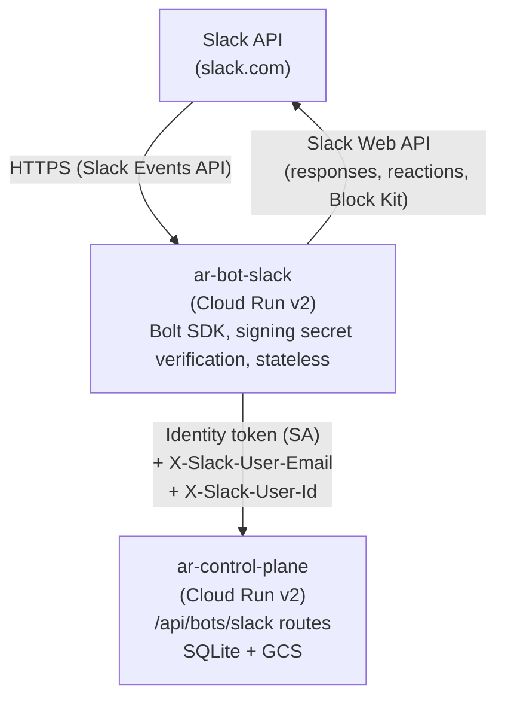
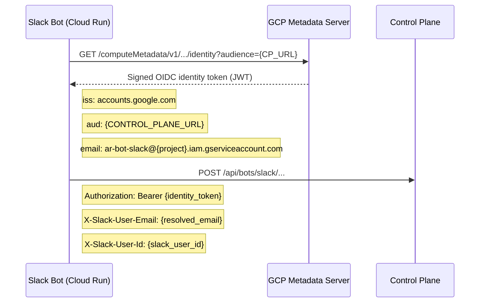
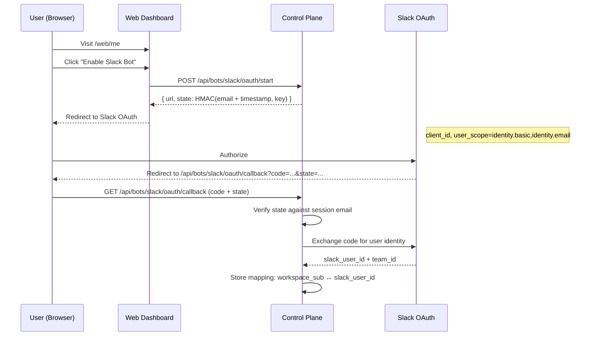
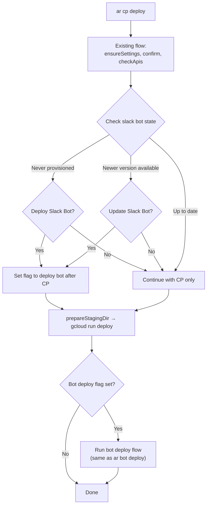
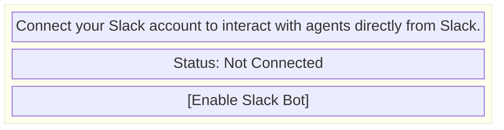
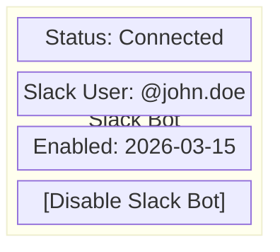
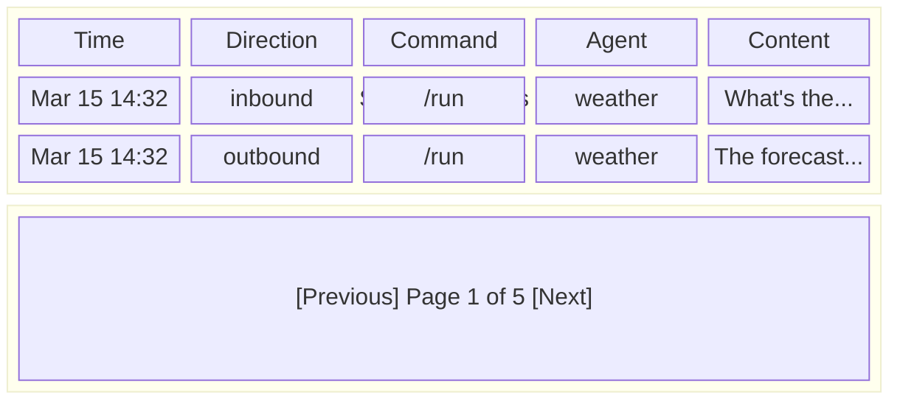
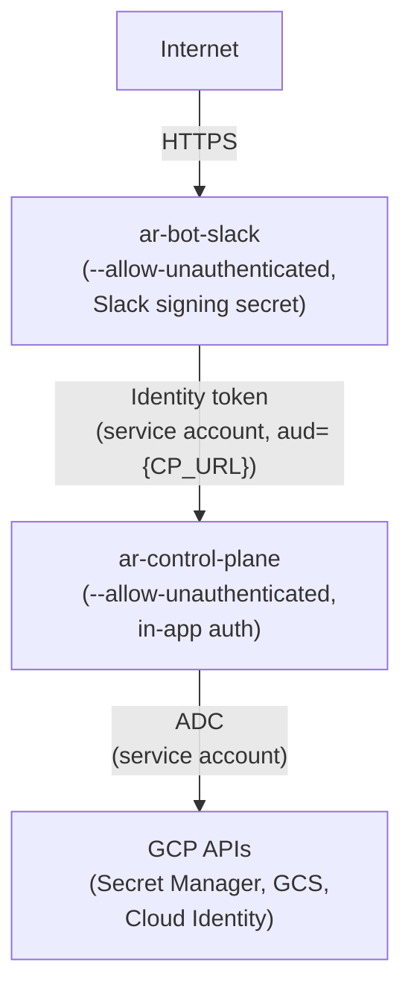

# RFC-002: Slack Bot — Slack Interface for Agent Runtime

**Status:** Superseded **Authors:** Agent Runtime Team **Created:** 2026-03-15

> **Implementation note:** The bot was implemented as an in-process Deno module
> inside the control plane (`control-plane/src/bots/slack/`), not as a separate
> Cloud Run service as originally proposed. Cross-service authentication,
> separate Dockerfiles, and the `bot-slack/` package described below do not
> exist. See [docs/slack-bot.md](../slack-bot.md) for the current setup guide.

---

## Abstract

This RFC introduces a Slack bot that acts as a first-party client to the Agent
Runtime control plane. The bot is deployed as a standalone Cloud Run v2 service
(Node.js) in the same GCP project as the control plane, one instance per tenant.
It provides a conversational interface for triggering agents, creating new
private registry agents, and managing per-user settings — all proxied through
the control plane's existing APIs. The bot is stateless; all persistence flows
through the control plane. Identity is resolved by mapping Slack user IDs to
Google Workspace IDs established during an opt-in enrollment flow in the web
dashboard.

---

## Table of Contents

1. [Motivation](#1-motivation)
2. [Architecture Overview](#2-architecture-overview)
3. [Folder Structure](#3-folder-structure)
4. [Cross-Service Authentication](#4-cross-service-authentication)
5. [User Identity and Authorization](#5-user-identity-and-authorization)
6. [Control Plane Changes](#6-control-plane-changes)
7. [Database Schema Changes](#7-database-schema-changes)
8. [Slack Bot Service Design](#8-slack-bot-service-design)
9. [Slack Commands and Interactions](#9-slack-commands-and-interactions)
10. [Interactive Response Component](#10-interactive-response-component)
11. [CLI Integration](#11-cli-integration)
12. [Web Dashboard Changes](#12-web-dashboard-changes)
13. [Build, Test, and Release](#13-build-test-and-release)
14. [Configuration and Settings](#14-configuration-and-settings)
15. [Security Model](#15-security-model)
16. [References](#16-references)

---

## 1. Motivation

The CLI and web dashboard serve power users and administrators well, but many
team members interact with AI agents through the tools they already live in.
Slack is the dominant workspace communication tool in enterprise environments. A
Slack bot that proxies agent interactions through the control plane:

- Lowers the barrier to entry for non-technical users
- Keeps the control plane as the single chokepoint for auth, audit, and state
- Enables rapid agent experimentation without leaving Slack
- Provides a natural conversational interface for agent invocation
- Maintains full audit trails of all Slack-originated interactions

---

## 2. Architecture Overview



**Key architectural decisions:**

- **Slack bot is a separate Cloud Run v2 service**, not a Cloud Function. Cloud
  Run services support long-lived HTTP connections needed for Slack's 3-second
  acknowledgment window and streaming responses. Cloud Functions have cold start
  and timeout characteristics that conflict with Slack's interaction model.
- **No IAP on the slack bot.** Slack's Events API sends webhooks to a public
  HTTPS endpoint. The slack bot validates all inbound requests using Slack's
  signing secret (HMAC-SHA256). IAP would block Slack's webhook delivery.
- **The control plane remains IAM-protected** (deployed with
  `--allow-unauthenticated` with in-app auth as today). The slack bot
  authenticates to the control plane using its service account's identity token.
  The control plane validates the token's `aud` claim and service account
  identity before accepting requests.
- **One slack bot per tenant.** A development slack bot targets the development
  tenant; a production slack bot targets production. They are independent Slack
  apps with independent signing secrets and bot tokens.
- **The slack bot is stateless.** All user data, settings, agent state, and
  audit logs are managed by the control plane. The slack bot is a thin
  translation layer between Slack's interaction model and the control plane's
  HTTP API.

---

## 3. Folder Structure

```
bot-slack/
├── src/
│   ├── index.ts              # Entry point, Bolt app init, Cloud Run serve
│   ├── secrets.ts            # Volume-mounted secret reader with TTL cache
│   ├── middleware/
│   │   └── auth.ts           # Slack user → control plane identity resolution
│   ├── commands/
│   │   ├── settings.ts       # /settings command handler
│   │   ├── help.ts           # /help command handler
│   │   ├── create-agent.ts   # /create-agent command handler
│   │   ├── run.ts            # /run command handler
│   │   ├── list.ts           # /list command handler
│   │   └── status.ts         # /status command handler
│   ├── events/
│   │   ├── mention.ts        # @bot mention handler (channels)
│   │   └── message.ts        # DM message handler
│   ├── actions/
│   │   └── handlers.ts       # Block Kit interactive action handlers
│   ├── views/
│   │   └── component.ts      # Standard interactive response component builder
│   └── client.ts             # Control plane HTTP client
├── test/
│   ├── contract.test.ts      # Integration contract tests
│   └── commands.test.ts      # Unit tests for command handlers
├── package.json
├── tsconfig.json
├── Dockerfile
├── .gcloudignore
└── README.md
```

**Design rationale:**

- Self-contained Node.js package with its own `package.json`, build, and
  Dockerfile. No Deno dependency — the slack bot runs on the Node.js 22 runtime
  to align with `@slack/bolt` which is a Node.js-native SDK.
- Minimal folder structure: commands map 1:1 to Slack slash commands, events
  handle message routing (split by `mention.ts` for channels and `message.ts`
  for DMs), actions handle Block Kit interactions, and views provide the shared
  response component.
- `client.ts` is a thin HTTP wrapper that handles identity token acquisition and
  request signing for all control plane communication.
- `secrets.ts` reads volume-mounted secrets from `/secrets/` with a configurable
  TTL cache (default 5 minutes) so secret rotation takes effect without
  redeployment.

---

## 4. Cross-Service Authentication

The slack bot authenticates to the control plane using GCP's native
service-to-service identity token mechanism. This is the same pattern used by
agent functions today (see `sdk-client-deno/src/platform/control-plane.ts`).

### Service Account Setup

A dedicated service account `ar-bot-slack@{project}.iam.gserviceaccount.com` is
created during slack bot provisioning by the CLI using the existing
`platform.serviceAccountCreate()` method. This account is granted:

| Role                                 | Resource                   | Purpose                   |
| ------------------------------------ | -------------------------- | ------------------------- |
| `roles/run.invoker`                  | `ar-control-plane` service | Invoke control plane APIs |
| `roles/secretmanager.secretAccessor` | `ar-bot-slack--*` secrets  | Read mounted secrets      |

The `roles/run.invoker` binding is applied using the existing
`platform.grantRunInvoker()` method. The secret access binding uses the existing
`platform.secretGrantAccess()` method.

### Token Flow



### Control Plane Auth Changes

#### Audience Validation (Pre-existing Gap)

The existing `verifyJwt` in `control-plane/src/middleware/auth.ts` does not
validate the JWT `aud` (audience) claim. This must be fixed before the slack bot
is deployed. Without audience validation, a token minted for a different Cloud
Run service in the same project could be replayed against the control plane.

**Change to `control-plane/src/middleware/auth.ts`:**

Add `aud` to the `JwtPayload` type and validate it in `verifyJwt`. Note that
`verifyJwt` is an internal function — the public export is `verifyToken` which
wraps it and returns `{ email }`. The `aud` validation happens inside
`verifyJwt` before `verifyToken` strips the payload down to `email`:

```typescript
type JwtPayload = {
  iss?: string
  aud?: string
  email?: string
  email_verified?: boolean | string
  exp?: number
}

// In verifyJwt, after signature verification and issuer check:
const expectedAudience = Deno.env.get('AR_AUDIENCE')
if (expectedAudience && payload.aud && payload.aud !== expectedAudience) {
  throw new Error('Invalid audience')
}
```

`AR_AUDIENCE` is set to the control plane's own URL during deployment (added to
the `--set-env-vars` in `cli/src/commands/control-plane.ts`). When unset
(backwards compatible), audience validation is skipped.

#### Bot Auth Middleware

A new middleware function `slackBotAuth` is added to
`control-plane/src/middleware/auth.ts`:

```typescript
async function slackBotAuth(
  c: Context<Env>,
  next: Next,
): Promise<Response | void> {
  const header = c.req.header('Authorization')
  if (!header?.startsWith('Bearer ')) {
    return c.json({ error: 'Missing Authorization header' }, 401)
  }

  const token = header.slice(7)
  const { email: serviceEmail } = await verifyToken(token)

  const expectedSa = Deno.env.get('AR_BOT_SLACK_SA')
  if (!expectedSa || serviceEmail !== expectedSa) {
    return c.json({ error: 'Unauthorized service account' }, 403)
  }

  const userEmail = c.req.header('X-Slack-User-Email')
  const slackUserId = c.req.header('X-Slack-User-Id')
  if (!userEmail || !slackUserId) {
    return c.json(
      { error: 'Missing X-Slack-User-Email or X-Slack-User-Id' },
      400,
    )
  }

  // Resolve tenant directly — resolveTenant middleware has not run yet at this
  // point in the middleware chain. The bot sends X-Tenant or the env var
  // AR_TENANT determines the tenant.
  const tenantId = c.req.header('X-Tenant') || Deno.env.get('AR_TENANT') ||
    'development'
  c.set('tenantId', tenantId)

  const identity = getSlackIdentity(tenantId, userEmail)
  if (!identity?.enabled) {
    return c.json({ error: 'Slack bot not enabled for this user' }, 403)
  }
  if (identity.slackUserId !== slackUserId) {
    return c.json({ error: 'Slack user ID mismatch' }, 403)
  }

  const user = ensure(userEmail)
  c.set('user', user)
  c.set('email', userEmail)
  return await next()
}
```

This middleware resolves the tenant directly from the `X-Tenant` header (sent by
the bot) or the `AR_TENANT` environment variable, because `slackBotAuth` runs
before `resolveTenant` in the middleware chain. It then cross-validates both the
email and the Slack user ID against the stored `slack_identity` record,
preventing impersonation even if the slack bot service is compromised.

#### Route Registration in `mod.ts`

The `/api/bots/slack/*` routes must be registered BEFORE the `/api/*` wildcard
in `control-plane/src/mod.ts`. Hono matches middleware in registration order, so
the more-specific `/api/bots/slack/*` path matches first and `apiAuth` never
fires for bot routes. No modification to `apiAuth` itself is needed:

```typescript
import slackBotApi from './api/bots/slack.ts'

// Register bot auth + routes BEFORE the /api/* wildcard:
app.use('/api/bots/slack/*', slackBotAuth)
app.route('/api/bots/slack', slackBotApi)

// Existing wildcard — already in mod.ts, unchanged:
app.use('/api/*', apiAuth)
```

The OAuth callback endpoint (`/api/bots/slack/oauth/callback`) is a special case
— it is called during the web enrollment flow and is protected by `webAuth`
(session cookie), not `slackBotAuth`. This is handled by excluding the OAuth
paths from `slackBotAuth` and applying `webAuth` inline.

### Why Not IAP?

IAP is designed for browser-based user authentication. It intercepts requests
before they reach the application and requires a Google-authenticated session.
This is incompatible with:

- Slack's webhook delivery (Slack sends POST requests from its own servers)
- Service-to-service communication patterns (identity tokens bypass IAP)

The control plane's existing in-app JWT verification provides equivalent
security. The slack bot's service account identity token is cryptographically
verified against Google's public JWKS keys (with `aud` validation), and the
`roles/run.invoker` IAM binding ensures only authorized service accounts can
reach the control plane.

---

## 5. User Identity and Authorization

### Enrollment Flow

Users must explicitly opt in to the Slack bot through the web dashboard. This
creates a verified mapping between their Google Workspace identity and their
Slack user ID.



The `state` parameter prevents CSRF attacks where an attacker could craft a
malicious OAuth redirect that links their Slack account to a victim's Google
Workspace identity. The state is signed with an HMAC using `AR_SESSION_SECRET`,
the same signing key used by the session module in
`control-plane/src/session.ts` (already available, no new secret needed).

**Identity resolution at runtime:**

1. Slack sends an event/command with `user_id` (Slack's internal user ID)
2. Slack bot looks up the user's email via Slack's `users.info` API
3. Slack bot sends both `X-Slack-User-Email` and `X-Slack-User-Id` headers
4. Control plane verifies: a. Email exists in `slack_identity` with
   `enabled = 1` b. The `slack_user_id` in the record matches the
   `X-Slack-User-Id` header
5. Control plane resolves the user record and proceeds with normal auth

**Why Workspace ID, not email?** The `slack_identity` table stores the Google
Workspace `sub` (stable, immutable identifier from the OAuth `id_token`) rather
than the email address. Email changes (name changes, domain migrations) do not
break the mapping. The email is used only for lookup; the `sub` is the anchor.

**Implementation note:** The existing `/web/auth/callback` handler in
`control-plane/src/mod.ts` currently parses only `email` from the Google
`id_token` (line 74). The Slack enrollment OAuth callback must also extract the
`sub` claim from the same `id_token` to populate `workspace_sub`. This requires
parsing `payload.sub` alongside `payload.email` in the enrollment flow.

### Authorization: Google Group Membership

Authorization uses a Google Group to control who can use the slack bot. This is
the simplest approach that works with GCP Workforce SSO environments without
requiring Google Workspace Admin SDK or domain-wide delegation.

**How it works:**

- During `ar bot deploy`, the CLI prompts for a Google Group email (e.g.,
  `ar-bot-slack-users@company.com`). The CLI creates this group if it doesn't
  exist, or validates it does.
- The control plane's service account is granted
  `roles/cloudidentity.groupsViewer` to check membership.
- On each Slack interaction, the control plane calls the Cloud Identity Groups
  API to verify the user's membership:
  ```
  GET https://cloudidentity.googleapis.com/v1/
      groups/{groupId}/memberships:lookup?memberKey.id={email}
  ```
- Membership changes take effect immediately without redeployment.

**Required GCP API:** `cloudidentity.googleapis.com` — added to the API check
during `ar bot deploy`.

**Required IAM:** The control plane service account
(`agent-runtime-sp@{project}.iam.gserviceaccount.com`) needs
`roles/cloudidentity.groupsViewer` on the organization or project.

**Fallback:** If the `AR_BOT_SLACK_AUTH_GROUP` env var is not set, the control
plane skips group membership checks and only requires a valid `slack_identity`
enrollment. This allows a simpler setup where enrollment alone is sufficient.

### Authorization Matrix

| Action                          | Required                                |
| ------------------------------- | --------------------------------------- |
| Message the bot (default agent) | Enrolled + group member (if configured) |
| `/settings`                     | Enrolled + group member (if configured) |
| `/help`                         | Enrolled + group member (if configured) |
| `/run {agent}`                  | Above + agent read access               |
| `/create-agent`                 | Above                                   |
| `/list`                         | Above                                   |
| `/status`                       | Above                                   |
| Admin settings (in `/settings`) | Above + `is_admin` in user table        |

---

## 6. Control Plane Changes

### New Route Module: `control-plane/src/api/bots/slack.ts`

All slack bot endpoints live under `/api/bots/slack/`. This namespace allows
future bot integrations (Teams, Discord) under `/api/bots/{platform}/` while
keeping the existing agent/registry APIs untouched. The route module is a single
file (`control-plane/src/api/bots/slack.ts`) with Hono sub-routing, consistent
with the existing API modules (`agents.ts`, `audit.ts`, `copy.ts`, etc.).

```
/api/bots/slack/
├── oauth/
│   ├── start             POST   Generate Slack OAuth URL + signed state
│   ├── callback          GET    Slack OAuth callback (enrollment)
│   └── revoke            POST   Disable slack bot for user
├── identity/
│   ├── resolve           POST   Resolve Slack user → AR user
│   └── verify            POST   Verify user authorization (group check)
├── settings/
│   ├── get               GET    Get user's bot settings
│   └── set               POST   Update user's bot settings
├── agents/
│   ├── run               POST   Invoke an agent (supports SSE streaming)
│   ├── create            POST   Create a private registry agent
│   ├── delete            DELETE Delete a private registry agent
│   └── list              GET    List user's accessible agents
├── messages/
│   ├── log               POST   Log a slack bot message exchange
│   └── list              GET    List user's message history (paginated)
└── config/
    └── get               GET    Get tenant bot configuration
```

### Agent Invocation

The existing `POST /agents/:id/invoke` endpoint is a placeholder. The new
`/api/bots/slack/agents/run` endpoint implements actual agent invocation by
resolving the agent's Cloud Function URI and forwarding the request:

```typescript
app.post('/agents/run', async (c) => {
  const { tenantId, email } = context(c)
  const { agentId, input } = await c.req.json()

  const agent = get(agentId, tenantId)
  if (!agent) return c.json({ error: 'Agent not found' }, 404)

  const project = Deno.env.get('GCP_PROJECT') || ''
  const region = Deno.env.get('GCP_REGION') || ''
  const uri = await platform.functionDescribeUri(
    agent.slug,
    region,
    project,
  )

  const token = await platform.getIdentityToken()
  const agentRes = await fetch(uri, {
    method: 'POST',
    headers: {
      'Authorization': `Bearer ${token}`,
      'Content-Type': 'application/json',
    },
    body: JSON.stringify({
      input,
      tenant: tenantId,
      user: email,
    }),
  })

  if (c.req.header('Accept') === 'text/event-stream') {
    return streamResponse(c, agentRes)
  }

  const result = await agentRes.json()
  return c.json(result)
})
```

This uses the existing `platform.functionDescribeUri()` and
`platform.getIdentityToken()` methods from `@ar/client/platform`. The project
and region are read from environment variables (`GCP_PROJECT`, `GCP_REGION`) set
during control plane deployment, consistent with other control plane API modules
(see `access.ts`). Note that `getIdentityToken()` does not accept a custom
audience parameter — it uses the metadata server's default audience. Agent
functions validate the calling service account identity rather than the token
audience, so this is sufficient.

### Streaming Support

The `/api/bots/slack/agents/run` endpoint supports two response modes:

- **HTTP (default):** Standard JSON response after agent completes
- **SSE (streaming):** `Accept: text/event-stream` header triggers Server-Sent
  Events. The control plane streams agent output as it becomes available:
  ```
  event: status
  data: {"step": "thinking", "message": "Analyzing request..."}

  event: status
  data: {"step": "executing", "message": "Running tool: cursor"}

  event: result
  data: {"output": "...", "complete": true}
  ```

The slack bot uses SSE mode to post incremental status updates to the Slack
thread while the agent executes, then posts the final result.

### OAuth Endpoints

The OAuth endpoints (`/api/bots/slack/oauth/*`) are special — they are called
from the web dashboard during enrollment, not from the slack bot service. They
are protected by `webAuth` (session cookie), not `slackBotAuth`:

```typescript
// /api/bots/slack/oauth/start — generates signed state + Slack OAuth URL
app.post('/oauth/start', webAuth, (c) => {
  const { email } = context(c)
  const clientId = Deno.env.get('AR_BOT_SLACK_CLIENT_ID')
  const timestamp = Date.now()
  const signingKey = Deno.env.get('AR_SESSION_SECRET') ||
    'ar-default-session-key'
  const state = sign(`${email}:${timestamp}`, signingKey)

  const redirectUri = `${origin}/api/bots/slack/oauth/callback`
  const url = `https://slack.com/oauth/v2/authorize` +
    `?client_id=${clientId}` +
    `&user_scope=identity.basic,identity.email` +
    `&redirect_uri=${encodeURIComponent(redirectUri)}` +
    `&state=${state}`

  return c.json({ url, state })
})

// /api/bots/slack/oauth/callback — exchanges code, stores identity
app.get('/oauth/callback', webAuth, async (c) => {
  const { email } = context(c)
  const { code, state } = c.req.query()

  const signingKey = Deno.env.get('AR_SESSION_SECRET') ||
    'ar-default-session-key'
  if (!verifyState(state, email, signingKey)) {
    return c.text('Invalid state parameter', 403)
  }

  // Exchange code with Slack for user identity...
  // Store in slack_identity table (including workspace_sub from id_token)...
})
```

The state parameter is signed with `AR_SESSION_SECRET`, the same key used by
the session module in `control-plane/src/session.ts`. This avoids coupling the
CSRF state to `GOOGLE_CLIENT_SECRET` (the OAuth client secret), which has a
different lifecycle and rotation cadence.

---

## 7. Database Schema Changes

### Migration (SCHEMA_VERSION 7)

The `MIGRATIONS` array in `sdk-client-deno/src/db/schema.ts` currently has 6
entries (indices 0–5). The `migrate()` function applies migrations sequentially
and sets `schema_version` to `MIGRATIONS.length` after running. The exported
`SCHEMA_VERSION` constant is currently `5` (a stale value that should also be
updated to match). This RFC adds migration index 6, making `MIGRATIONS.length`
7\. Update `SCHEMA_VERSION` from `5` to `7`:

```sql
CREATE TABLE IF NOT EXISTS slack_identity (
  id TEXT PRIMARY KEY,
  tenant_id TEXT NOT NULL REFERENCES tenant(id),
  user_id TEXT NOT NULL REFERENCES user(id),
  workspace_sub TEXT NOT NULL,
  slack_user_id TEXT NOT NULL,
  slack_team_id TEXT NOT NULL,
  enabled INTEGER NOT NULL DEFAULT 1,
  created_at TEXT NOT NULL DEFAULT (datetime('now')),
  updated_at TEXT NOT NULL DEFAULT (datetime('now')),
  UNIQUE(tenant_id, slack_user_id),
  UNIQUE(tenant_id, user_id)
);

CREATE INDEX IF NOT EXISTS idx_slack_identity_user
  ON slack_identity(tenant_id, user_id);
CREATE INDEX IF NOT EXISTS idx_slack_identity_slack
  ON slack_identity(tenant_id, slack_user_id);

CREATE TABLE IF NOT EXISTS slack_settings (
  id TEXT PRIMARY KEY,
  tenant_id TEXT NOT NULL REFERENCES tenant(id),
  user_id TEXT NOT NULL REFERENCES user(id),
  settings TEXT NOT NULL DEFAULT '{}',
  created_at TEXT NOT NULL DEFAULT (datetime('now')),
  updated_at TEXT NOT NULL DEFAULT (datetime('now')),
  UNIQUE(tenant_id, user_id)
);

CREATE TABLE IF NOT EXISTS slack_message (
  id INTEGER PRIMARY KEY AUTOINCREMENT,
  tenant_id TEXT NOT NULL REFERENCES tenant(id),
  user_id TEXT NOT NULL REFERENCES user(id),
  slack_channel_id TEXT NOT NULL,
  slack_thread_ts TEXT,
  direction TEXT NOT NULL,
  command TEXT,
  content TEXT,
  agent_id TEXT,
  metadata TEXT,
  created_at TEXT NOT NULL DEFAULT (datetime('now'))
);

CREATE INDEX IF NOT EXISTS idx_slack_message_user
  ON slack_message(tenant_id, user_id, created_at);
CREATE INDEX IF NOT EXISTS idx_slack_message_agent
  ON slack_message(tenant_id, agent_id);

CREATE TABLE IF NOT EXISTS slack_agent_ref (
  id TEXT PRIMARY KEY,
  tenant_id TEXT NOT NULL REFERENCES tenant(id),
  user_id TEXT NOT NULL REFERENCES user(id),
  agent_id TEXT NOT NULL REFERENCES agent(id),
  cleanup_unused INTEGER NOT NULL DEFAULT 1,
  created_at TEXT NOT NULL DEFAULT (datetime('now')),
  UNIQUE(tenant_id, user_id, agent_id)
);

CREATE INDEX IF NOT EXISTS idx_slack_agent_ref_user
  ON slack_agent_ref(tenant_id, user_id);
```

This migration is appended to the `MIGRATIONS` array in
`sdk-client-deno/src/db/schema.ts` as a single template literal string at
index 6. The `SCHEMA_VERSION` constant is updated from `5` to `7`.

### Table Descriptions

| Table             | Purpose                                                                                                                                     |
| ----------------- | ------------------------------------------------------------------------------------------------------------------------------------------- |
| `slack_identity`  | Maps Google Workspace ID (`workspace_sub`) to Slack user ID. One row per user per tenant. `enabled` flag allows disabling without deleting. |
| `slack_settings`  | Per-user bot settings stored as JSON. Schema-flexible for new settings without migrations.                                                  |
| `slack_message`   | Audit log of all bot interactions. `direction` is `inbound` or `outbound`. Captures command, content, agent, and metadata.                  |
| `slack_agent_ref` | Tracks agents created through the slack bot with `cleanup_unused` for future garbage collection.                                            |

### Settings JSON Schema

The `settings` column in `slack_settings` stores a JSON object:

```json
{
  "defaultAgent": "my-agent",
  "notifications": true,
  "streamingMode": true
}
```

New settings are added by extending this schema. The control plane validates
known fields and preserves unknown fields for forward compatibility.

---

## 8. Slack Bot Service Design

### Technology Stack

| Component  | Choice                            | Rationale                                                                                           |
| ---------- | --------------------------------- | --------------------------------------------------------------------------------------------------- |
| Runtime    | Node.js 22                        | Aligns with `@slack/bolt` SDK, agent functions, and `platform.runtime` in `default-settings.jsonc`  |
| Framework  | `@slack/bolt` 4.x                 | Official Slack SDK with built-in signing secret verification, event handling, and Block Kit support |
| HTTP       | `ExpressReceiver` (Bolt built-in) | Handles Slack's HTTP contract including signature verification                                      |
| Deployment | Cloud Run v2 service              | Long-lived connections, auto-scaling, managed TLS                                                   |

### Entry Point (`src/index.ts`)

```typescript
import { App, ExpressReceiver } from '@slack/bolt'
import { readSecret } from './secrets.js'

const receiver = new ExpressReceiver({
  signingSecret: readSecret('slack-signing-secret'),
})

const app = new App({
  token: readSecret('slack-bot-token'),
  receiver,
})

// Channel mentions — requires app_mention event subscription
app.event('app_mention', async ({ event, client }) => {
  await client.reactions.add({
    channel: event.channel,
    timestamp: event.ts,
    name: 'eyes',
  })
  const text = event.text.replace(/<@[A-Z0-9]+>/g, '').trim()
  await routeCommand(text, event, client)
})

// DMs — no @mention needed
app.event('message', async ({ event, client }) => {
  if (event.channel_type !== 'im') return
  await client.reactions.add({
    channel: event.channel,
    timestamp: event.ts,
    name: 'eyes',
  })
  await routeCommand(event.text, event, client)
})

// Register interactive action handlers
import './actions/handlers.js'

const port = parseInt(process.env.PORT || '8080', 10)
receiver.app.listen(port, () => {
  console.log(`Slack bot listening on :${port}`)
})

export { app }
```

**Slack's 3-second deadline:** Bolt's default behavior (without
`processBeforeResponse`) sends an immediate HTTP 200 acknowledgment to Slack
before running the handler. This is the correct behavior for long-running
operations like agent invocation. The `processBeforeResponse: true` option is
NOT used — it would cause Slack to show "This app didn't respond" errors for any
operation taking longer than 3 seconds.

### Secret Reader (`src/secrets.ts`)

```typescript
import { readFileSync } from 'node:fs'

const cache = new Map<string, { value: string; expiry: number }>()
const TTL = 5 * 60 * 1000

export function readSecret(name: string): string {
  const cached = cache.get(name)
  if (cached && Date.now() < cached.expiry) return cached.value
  const value = readFileSync(`/secrets/${name}`, 'utf-8').trim()
  cache.set(name, { value, expiry: Date.now() + TTL })
  return value
}
```

### Control Plane Client (`src/client.ts`)

```typescript
const CP_URL = process.env.CONTROL_PLANE_URL!
const METADATA_URL = 'http://metadata.google.internal/computeMetadata/v1' +
  '/instance/service-accounts/default/identity'

async function getToken(): Promise<string> {
  const url = `${METADATA_URL}?audience=${encodeURIComponent(CP_URL)}`
  const res = await fetch(url, {
    headers: { 'Metadata-Flavor': 'Google' },
  })
  if (!res.ok) throw new Error('Failed to get identity token')
  return res.text()
}

async function request(
  path: string,
  userEmail: string,
  slackUserId: string,
  options: RequestInit = {},
): Promise<Response> {
  const token = await getToken()
  return fetch(`${CP_URL}${path}`, {
    ...options,
    headers: {
      ...options.headers,
      'Authorization': `Bearer ${token}`,
      'X-Slack-User-Email': userEmail,
      'X-Slack-User-Id': slackUserId,
      'Content-Type': 'application/json',
    },
  })
}

async function stream(
  path: string,
  userEmail: string,
  slackUserId: string,
  body: unknown,
): Promise<ReadableStream> {
  const token = await getToken()
  const res = await fetch(`${CP_URL}${path}`, {
    method: 'POST',
    headers: {
      'Authorization': `Bearer ${token}`,
      'X-Slack-User-Email': userEmail,
      'X-Slack-User-Id': slackUserId,
      'Content-Type': 'application/json',
      'Accept': 'text/event-stream',
    },
    body: JSON.stringify(body),
  })
  if (!res.ok) throw new Error(`Control plane error: ${res.status}`)
  return res.body!
}
```

### Message Acknowledgment Pattern

Every message the bot receives is immediately acknowledged with an "eyes" emoji
reaction (handled in the event listeners above). After processing:

- **white_check_mark**: Command/task completed successfully
- **exclamation**: Error occurred (connection failure, auth failure, agent
  error)

---

## 9. Slack Commands and Interactions

All commands are triggered by mentioning the bot in a channel (`@bot /command`)
or sending a DM (`/command`). The bot recognizes commands by prefix matching on
the message text after stripping the `@mention`.

### Command: `/help`

**Trigger:** `@bot /help` or DM `/help`

**Response:** A Block Kit message listing all available commands.

```
Available Commands:
  /help                    Show this help message
  /settings                Configure your bot preferences
  /run {agent} {input}     Run an agent with the given input
  /create-agent {prompt}   Create a new private agent
  /list                    List your accessible agents
  /status                  Show your account and bot status
```

### Command: `/settings`

**Trigger:** `@bot /settings` in a channel or DM

**Response:** A Block Kit form posted in a thread with the current settings:

| Field          | Type           | Description                                                         |
| -------------- | -------------- | ------------------------------------------------------------------- |
| Default Agent  | Text input     | Agent name (no version) to use when no agent is specified in `/run` |
| Notifications  | Radio (on/off) | Receive DM notifications for long-running agent completions         |
| Streaming Mode | Radio (on/off) | Show real-time status updates during agent execution                |

**Flow:**

1. Bot fetches current settings from `GET /api/bots/slack/settings/get`
2. Bot posts a Block Kit form with current values pre-filled
3. User modifies fields and clicks "Save"
4. Bot sends updated settings to `POST /api/bots/slack/settings/set`
5. Bot updates the message with a confirmation

**Extensibility:** New settings are added by:

1. Adding the field to the settings JSON schema
2. Adding a Block Kit element to the settings form builder
3. No migration required — the JSON column accommodates new fields

### Command: `/run {agent} {input}`

**Trigger:** `@bot /run my-agent What is the weather?` or
`@bot What is the
weather?` (uses default agent)

**Flow:**

1. Parse agent name and input from message text
2. If no agent specified, fetch default agent from user settings
3. Post initial status message in thread using the standard component
4. Call `POST /api/bots/slack/agents/run` with SSE streaming
5. Update the thread with status events as they arrive
6. Post final result when the agent completes

### Command: `/create-agent {prompt}`

**Trigger:** `@bot /create-agent A bot that summarizes Jira tickets`

**Flow:**

1. Bot posts a Block Kit form in a thread with:
   - **Agent name**: Pre-filled from prompt analysis (editable text input)
   - **Version**: Text input, defaults to `0.0.1`
   - **Subsystem**: Dropdown selector (`cursor` or `claude`)
   - **Cleanup if Unused**: Radio button, default `true`
2. User fills out the form and submits
3. Bot validates:
   - If agent name + version already exists: re-prompt with error and suggest
     incrementing version or changing name
   - If version is empty: default to `0.0.1`
4. Bot calls `POST /api/bots/slack/agents/create` with:
   ```json
   {
     "name": "jira-summarizer",
     "prompt": "A bot that summarizes Jira tickets",
     "version": "0.0.1",
     "subsystem": "cursor",
     "visibility": "private"
   }
   ```
5. Control plane creates the agent and records it in `slack_agent_ref` with
   `cleanup_unused` set per the user's choice
6. Bot posts confirmation with agent details

**Visibility enforcement:** The slack bot ALWAYS creates agents with
`visibility: 'private'`. The `/api/bots/slack/agents/create` endpoint hardcodes
this regardless of request payload. Only the user who created the agent (and
people they've explicitly shared it with via the web dashboard or CLI) can
interact with it through Slack.

### Command: `/list`

**Trigger:** `@bot /list`

**Response:** A paginated list of agents the user can access (private agents
they own + public agents), fetched from `GET /api/bots/slack/agents/list`.

### Command: `/status`

**Trigger:** `@bot /status`

**Response:** Account information including enrollment status, default agent,
number of private agents, and recent activity summary.

---

## 10. Interactive Response Component

A standard Block Kit component builder is used for all bot responses that
involve structured content. This ensures visual consistency and supports
progressive disclosure of information.

### Component Structure

```typescript
type ResponseComponent = {
  title?: string
  summary?: string
  body?: string | Block[]
  status?: string
  actions?: Action[]
}
```

### Block Kit Layout

```mermaid
block-beta
    columns 1
    block:header["Header block (optional): {title}"]
    end
    block:summary["Section block (optional): {summary}"]
    end
    block:status["Context block (optional): {status} — streaming progress, replaced by body when done"]
    end
    block:body["Section/rich text blocks: {body} — main content area"]
    end
    block:actions["Actions block (optional): [Action 1] [Action 2]"]
    end
```

### Streaming Behavior

During agent execution, the component is posted with `status` visible and `body`
hidden. As SSE events arrive, the `status` field is updated in-place using
Slack's `chat.update` API. When the final result arrives, `status` is removed
and `body` is populated with the result.

### Builder API

```typescript
function buildResponse(component: ResponseComponent): KnownBlock[] {
  const blocks: KnownBlock[] = []

  if (component.title) {
    blocks.push({
      type: 'header',
      text: { type: 'plain_text', text: component.title },
    })
  }

  if (component.summary) {
    blocks.push({
      type: 'section',
      text: { type: 'mrkdwn', text: component.summary },
    })
  }

  if (component.status) {
    blocks.push({
      type: 'context',
      elements: [{ type: 'mrkdwn', text: component.status }],
    })
  }

  if (component.body) {
    if (typeof component.body === 'string') {
      blocks.push({
        type: 'section',
        text: { type: 'mrkdwn', text: component.body },
      })
    } else {
      blocks.push(...component.body)
    }
  }

  if (component.actions?.length) {
    blocks.push({
      type: 'actions',
      elements: component.actions,
    })
  }

  return blocks
}
```

---

## 11. CLI Integration

### New Command: `ar bot`

```
ar bot deploy      Deploy or update the slack bot
ar bot destroy     Tear down the slack bot
ar bot status      Show slack bot deployment status
ar bot logs        Fetch slack bot logs
```

**File:** `cli/src/commands/bot.ts` (follows the pattern in
`cli/src/commands/example.disabled.ts`)

### Deploy Flow (`ar bot deploy`)

The CLI automates as much as possible. The user needs only their Slack app
credentials (created at https://api.slack.com/apps). The CLI handles service
account creation, secret storage, IAM bindings, and deployment.

```
1. Load GCP settings (project, region, service account)
   └─ Uses existing loadGcp() from cli/src/settings.ts (same as ar cp deploy)

2. Verify control plane is deployed (controlPlaneUrl exists in CLI settings)
   └─ Uses loadSettings() from cli/src/settings.ts
   └─ If not: error with "Deploy the control plane first: ar cp deploy"

3. Check if slack bot is already deployed
   └─ gcloud run services describe ar-bot-slack --project={project}

4. Check required APIs (cloudidentity.googleapis.com added to list)
   └─ Uses same checkApis() pattern from control-plane.ts

5. Prompt for Slack credentials (if not already in Secret Manager):
   a. Slack Bot Token (xoxb-...)
   b. Slack Signing Secret
   c. Slack Client ID
   d. Slack Client Secret
   └─ Uses existing text() from cli/src/terminal/prompts.ts

6. Prompt for authorization group:
   └─ "Google Group for slack bot access (e.g., ar-bot-slack-users@company.com):"
   └─ Uses text() with a sensible default

7. Store credentials in Secret Manager:
   └─ Uses existing platform.secretCreate() + platform.secretAddVersion()
   └─ ar-bot-slack--slack-bot-token
   └─ ar-bot-slack--slack-signing-secret
   └─ ar-bot-slack--slack-client-id
   └─ ar-bot-slack--slack-client-secret

8. Create service account (if not exists):
   └─ Uses existing platform.serviceAccountCreate()
   └─ ar-bot-slack@{project}.iam.gserviceaccount.com

9. Grant IAM roles:
   └─ platform.grantRunInvoker('ar-control-plane', region, project, botSa)
      (first param is the Cloud Run service name, not an agent ID)
   └─ platform.secretGrantAccess() on each secret

10. Deploy to Cloud Run with secrets mounted as volumes:
    └─ The CLI prepares a staging directory containing the bot's built
       artifacts + Dockerfile (same pattern as prepareStagingDir() in
       control-plane.ts). For source builds, --source points to bot-slack/.
    └─ gcloud run deploy ar-bot-slack \
         --source={staging} \
         --project={project} \
         --region={region} \
         --allow-unauthenticated \
         --service-account=ar-bot-slack@{project}.iam.gserviceaccount.com \
         --set-secrets=/secrets/slack-bot-token=ar-bot-slack--slack-bot-token:latest,\
                       /secrets/slack-signing-secret=ar-bot-slack--slack-signing-secret:latest,\
                       /secrets/slack-client-id=ar-bot-slack--slack-client-id:latest,\
                       /secrets/slack-client-secret=ar-bot-slack--slack-client-secret:latest \
         --set-env-vars=CONTROL_PLANE_URL={controlPlaneUrl},\
                        AR_TENANT={tenant},\
                        AR_VERSION={version} \
         --port=8080 \
         --memory=256Mi \
         --min-instances=0 \
         --max-instances=3 \
         --labels=version=v{version},managed-by=ar-cli

11. Update control plane env vars (without redeploying):
    └─ gcloud run services update ar-control-plane \
         --update-env-vars=AR_BOT_SLACK_SA=ar-bot-slack@{project}.iam.gserviceaccount.com,\
                           AR_BOT_SLACK_URL={slackbot_url},\
                           AR_BOT_SLACK_AUTH_GROUP={group_email},\
                           AR_BOT_SLACK_CLIENT_ID={client_id},\
                           AR_BOT_SLACK_CLIENT_SECRET={client_secret},\
                           AR_AUDIENCE={controlPlaneUrl}

12. Print slack bot URL and Slack app configuration instructions
```

**Deploying user prerequisites:** The user running `ar bot deploy` needs the
following IAM roles on their own account (same roles needed for `ar cp deploy`
plus service account management):

| Role                            | Purpose                                   |
| ------------------------------- | ----------------------------------------- |
| `roles/iam.serviceAccountAdmin` | Create `ar-bot-slack` service account     |
| `roles/iam.serviceAccountUser`  | Deploy Cloud Run with the service account |
| `roles/run.admin`               | Deploy Cloud Run services                 |
| `roles/secretmanager.admin`     | Create and manage secrets                 |

### Control Plane Deploy Integration

The existing `ar cp deploy` command in `cli/src/commands/control-plane.ts` is
modified to check for slack bot state before deploying:



The prompt happens BEFORE the control plane build starts so the user can make an
informed decision. The actual bot deployment happens AFTER the control plane is
successfully deployed.

### Version Detection

The slack bot version is read from `bot-slack/package.json`. During
`ar cp
deploy`, the CLI:

1. Reads the local `bot-slack/package.json` version
2. Queries the deployed slack bot's version via:
   ```
   gcloud run services describe ar-bot-slack --format='value(metadata.labels.version)'
   ```
3. Compares using semver — if local > deployed, prompts for update

### default-settings.jsonc Changes

Add to `default-settings.jsonc`:

```jsonc
{
  "botSlack": {
    "serviceName": "ar-bot-slack",
    "port": 8080,
    "memory": "256Mi",
    "timeout": 300,
    "minInstances": 0,
    "maxInstances": 3,
    "runtimeAccountPattern": "ar-bot-slack@${project}.iam.gserviceaccount.com"
  }
}
```

This also requires updating the `RuntimeConfig` type in
`sdk-client-deno/src/runtime.ts` to include an optional `botSlack` field:

```typescript
type RuntimeConfig = {
  // ... existing fields ...
  botSlack?: {
    serviceName: string
    port: number
    memory: string
    timeout: number
    minInstances: number
    maxInstances: number
    runtimeAccountPattern: string
  }
}
```

---

## 12. Web Dashboard Changes

### "Me" Page (`web/src/islands/me.tsx`)

The `/web/me` route and island already exist as a placeholder stub implemented
by RFC-003 (web modes). The stub uses `useApp()` and renders a mode-aware page
header with "Personal dashboard coming soon." text. Routing is handled by
`pages.ts` (with `modes: ['private']` and `landing: 'private'`), and the nav
link with `data-modes="private"` is already in `index.html`. No routing changes
are needed.

The Me island must be updated to contain three widgets:

1. **Account Info Widget** — email, role, tenant
2. **Slack Bot Enrollment Widget** — enable/disable, OAuth flow
3. **Slack Message History Widget** — full-width table at the bottom

### Slack Bot Enrollment Widget



After enrollment:



### Slack Message History Widget

A full-width table below all other widgets showing the user's Slack bot message
history. Fetches from `GET /api/bots/slack/messages/list` with pagination.



### Routing Changes

All routing for the Me page was implemented by RFC-003:

- `web/src/pages.ts` includes the `me` page descriptor with
  `modes: ['private']` and `landing: 'private'`
- `web/src/entry.ts` hydrates islands via the pages descriptor (no per-page
  routing code needed)
- `web/index.html` already has the nav link
  (`<a href="/web/me" data-nav="me" data-modes="private">Me</a>`) and the
  island placeholder (`<div data-island="me"></div>`)
- `web/mod.ts` renders the nav link server-side via `forMode()`

No routing changes are needed for this RFC.

### Mock API Additions

**`web/dev/fixtures/bot-messages.json`:** Mock data for the message history.

**`web/dev/mock.ts`:** Add routes:

- `GET /api/bots/slack/messages/list` → `bot-messages.json`
- `GET /api/bots/slack/identity/resolve` → mock identity response

---

## 13. Build, Test, and Release

### Build Pipeline

The slack bot has its own build pipeline independent of the control plane:

```
bot-slack/
├── package.json          # Dependencies, scripts
├── tsconfig.json         # TypeScript config (target: ES2022, module: NodeNext)
└── Dockerfile            # Production container
```

**`package.json`:**

```json
{
  "name": "@ar/bot-slack",
  "version": "0.0.1",
  "private": true,
  "type": "module",
  "ar": {
    "controlPlaneVersion": ">=0.0.1"
  },
  "scripts": {
    "build": "tsc",
    "test": "node --test test/*.test.ts",
    "test:contract": "node --test test/contract.test.ts",
    "lint": "eslint src/",
    "typecheck": "tsc --noEmit"
  },
  "dependencies": {
    "@slack/bolt": "^4.x"
  }
}
```

**Dockerfile:**

```dockerfile
FROM node:22-slim
WORKDIR /app
COPY package.json package-lock.json ./
RUN npm ci --production
COPY dist/ ./dist/
ENV PORT=8080
EXPOSE 8080
CMD ["node", "dist/index.js"]
```

### Deno Workspace Exclusion

The `bot-slack/` directory must be excluded from the Deno workspace in the root
`deno.jsonc` (same pattern as `sdk-agent-nodejs/`):

```jsonc
{
  "exclude": [
    "sdk-agent-nodejs/",
    "bot-slack/"
  ]
}
```

### Contract Tests

Production builds MUST pass contract tests before deployment. The contract test
suite (`test/contract.test.ts`) validates the critical path against a live
control plane:

```typescript
import { describe, it } from 'node:test'
import assert from 'node:assert/strict'

describe('slack bot contract', () => {
  it('authenticates to control plane', async () => {
    const res = await client.request(
      '/api/bots/slack/config/get',
      testEmail,
      testSlackId,
    )
    assert.strictEqual(res.status, 200)
  })

  it('resolves user identity', async () => {
    const res = await client.request(
      '/api/bots/slack/identity/resolve',
      testEmail,
      testSlackId,
      { method: 'POST', body: JSON.stringify({ slackUserId: testSlackId }) },
    )
    assert.strictEqual(res.status, 200)
    const body = await res.json()
    assert.ok(body.email)
  })

  it('invokes agent through control plane', async () => {
    const res = await client.request(
      '/api/bots/slack/agents/run',
      testEmail,
      testSlackId,
      {
        method: 'POST',
        body: JSON.stringify({ agentId: testAgentId, input: 'test' }),
      },
    )
    assert.ok([200, 202].includes(res.status))
  })
})
```

**Enforcement:** `ar bot deploy` runs contract tests before deploying to
production (when `--tenant production` or `--production`). For development
deployments, contract tests are optional (skippable with `--force`).

### CI/CD Workflow

GitHub Actions workflows already exist in `.github/workflows/` (`ci.yml`,
`release.yml`, `test-deno.yml`). The slack bot adds a new workflow that follows
the same patterns (WIF authentication, `actions/checkout@v4`,
`google-github-actions/auth@v3`):

**`.github/workflows/bot-slack.yml`:**

```yaml
name: Slack Bot CI

on:
  push:
    paths: ['bot-slack/**']
  pull_request:
    paths: ['bot-slack/**']

jobs:
  check:
    runs-on: ubuntu-latest
    steps:
      - uses: actions/checkout@v4
      - uses: actions/setup-node@v4
        with: { node-version: 22 }
      - run: npm ci
        working-directory: bot-slack
      - run: npm run lint
        working-directory: bot-slack
      - run: npm run typecheck
        working-directory: bot-slack
      - run: npm test
        working-directory: bot-slack

  contract:
    needs: check
    if: github.event_name == 'push' && github.ref == 'refs/heads/main'
    runs-on: ubuntu-latest
    steps:
      - uses: actions/checkout@v4
      - uses: google-github-actions/auth@v3
        with:
          workload_identity_provider: ${{ vars.WIF_PROVIDER }}
          service_account: ${{ vars.WIF_SERVICE_ACCOUNT }}
      - uses: actions/setup-node@v4
        with: { node-version: 22 }
      - run: npm ci
        working-directory: bot-slack
      - run: npm run build
        working-directory: bot-slack
      - run: npm run test:contract
        working-directory: bot-slack
        env:
          CONTROL_PLANE_URL: ${{ vars.CONTROL_PLANE_URL }}
```

### Versioning

The slack bot follows the same semver convention as the rest of the monorepo.
Its version is tracked in `bot-slack/package.json` and stamped as a Cloud Run
label during deployment. The version is independent of the control plane version
but must target a compatible control plane version (tracked in the `ar` field of
`package.json`).

The CLI validates this constraint during `ar bot deploy` by comparing against
the deployed control plane's version (from `GET /system/`).

---

## 14. Configuration and Settings

### Environment Variables (Slack Bot Service)

| Variable            | Source  | Description                                   |
| ------------------- | ------- | --------------------------------------------- |
| `CONTROL_PLANE_URL` | Env var | Control plane URL                             |
| `AR_TENANT`         | Env var | Target tenant (`development` or `production`) |
| `AR_VERSION`        | Env var | Deployed slack bot version                    |
| `PORT`              | Env var | HTTP port (default: 8080)                     |

### Volume-Mounted Secrets (Slack Bot Service)

Secrets are mounted as files at `/secrets/` rather than injected as environment
variables. Volume-mounted secrets are re-read from Secret Manager on each file
access, so rotating a secret in Secret Manager takes effect without
redeployment. The slack bot caches values with a 5-minute TTL.

| Mount Path                      | Secret Name                          | Description                        |
| ------------------------------- | ------------------------------------ | ---------------------------------- |
| `/secrets/slack-bot-token`      | `ar-bot-slack--slack-bot-token`      | Slack bot OAuth token (`xoxb-...`) |
| `/secrets/slack-signing-secret` | `ar-bot-slack--slack-signing-secret` | Slack app signing secret           |
| `/secrets/slack-client-id`      | `ar-bot-slack--slack-client-id`      | Slack app client ID                |
| `/secrets/slack-client-secret`  | `ar-bot-slack--slack-client-secret`  | Slack app client secret            |

### Environment Variables (Control Plane — New)

These are set by `ar bot deploy` step 11 using
`gcloud run services update
--update-env-vars` (does not require a full
redeployment of the control plane):

| Variable                     | Description                                        |
| ---------------------------- | -------------------------------------------------- |
| `AR_BOT_SLACK_SA`            | Expected slack bot service account email           |
| `AR_BOT_SLACK_URL`           | Deployed slack bot URL (for OAuth callbacks)       |
| `AR_BOT_SLACK_AUTH_GROUP`    | Google Group email for access control              |
| `AR_BOT_SLACK_CLIENT_ID`     | Slack client ID (for OAuth enrollment flow)        |
| `AR_BOT_SLACK_CLIENT_SECRET` | Slack client secret (for OAuth enrollment flow)    |
| `AR_AUDIENCE`                | Control plane's own URL (for JWT `aud` validation) |

### Initial Deployment Prompts

When deploying the slack bot for the first time (via `ar bot deploy` or during
`ar cp deploy`), the CLI guides the user through configuration:

```
Slack Bot Setup
───────────────

Before deploying, you'll need a Slack app configured at
https://api.slack.com/apps with:

  Bot Token Scopes:
    chat:write, reactions:write, users:read, users:read.email,
    im:history, channels:history, groups:history

  Event Subscriptions:
    message.im, message.channels, message.groups, app_mention

  Interactivity:
    Enabled (Request URL will be set after deployment)

? Slack Bot Token (xoxb-...): ****
? Slack Signing Secret: ****
? Slack Client ID: ****
? Slack Client Secret: ****

? Google Group for slack bot access
  (ar-bot-slack-users@company.com): ar-bot-slack-users@company.com

Storing credentials in Secret Manager...
  ar-bot-slack--slack-bot-token
  ar-bot-slack--slack-signing-secret
  ar-bot-slack--slack-client-id
  ar-bot-slack--slack-client-secret

Creating service account...
  ar-bot-slack@my-project.iam.gserviceaccount.com

Granting IAM roles...
  roles/run.invoker on ar-control-plane
  roles/secretmanager.secretAccessor

Building and deploying slack bot...
  Deployed to https://ar-bot-slack-xxxxx.run.app

Updating control plane configuration...
  Done

Next steps:
  1. Set your Slack app's Request URL to:
     https://ar-bot-slack-xxxxx.run.app/slack/events
  2. Set the OAuth Redirect URL to:
     {controlPlaneUrl}/api/bots/slack/oauth/callback
  3. Install the app to your Slack workspace
```

---

## 15. Security Model

### Threat Model

| Threat                            | Mitigation                                                                                                                                                        |
| --------------------------------- | ----------------------------------------------------------------------------------------------------------------------------------------------------------------- |
| Spoofed Slack requests            | HMAC-SHA256 signing secret verification (Bolt SDK built-in). Timestamp validation rejects requests >5 minutes old.                                                |
| Unauthorized control plane access | Service account identity token with `aud` validation. `slackBotAuth` middleware verifies the SA email matches `AR_BOT_SLACK_SA`.                                  |
| User impersonation                | Slack user ID → email resolution via Slack API (not user-provided). Control plane cross-validates both email AND `slack_user_id` against `slack_identity` record. |
| CSRF on OAuth enrollment          | Signed `state` parameter using HMAC with `AR_SESSION_SECRET` (same key as the session module). Verified against session email on callback.                        |
| Credential exposure               | All secrets stored in GCP Secret Manager, mounted as volumes (never in env vars or source). 5-minute TTL cache for rotation.                                      |
| Privilege escalation              | Bot always creates private agents. Admin operations require `is_admin` flag in the user record.                                                                   |
| Replay attacks                    | Slack signing secret includes timestamp. Identity tokens have short TTL (~1 hour). JWT `aud` claim prevents cross-service replay.                                 |
| Data exfiltration via bot         | All data access goes through control plane's existing visibility/ownership checks (`canRead`, `canWriteAgent` in `sdk-client-deno/src/db/access.ts`).             |
| Token audience confusion          | `verifyJwt` validates `aud` claim against `AR_AUDIENCE` env var. Tokens minted for other services are rejected.                                                   |

### Network Security



The slack bot is the only service that accepts unauthenticated internet traffic
from Slack, and it validates every request using Slack's signing secret before
processing. The control plane validates the slack bot's identity token including
the `aud` claim, the service account identity, and the user's enrollment status.

### Secret Rotation

All Slack credentials are stored in Secret Manager with versioning and mounted
as volumes. To rotate:

1. Create new credentials in the Slack app admin panel
2. `ar secret set ar-bot-slack--slack-bot-token {new_value}`
3. The slack bot picks up the new value automatically on its next secret refresh
   cycle (no redeployment required)

Volume-mounted secrets are re-read from Secret Manager on each file access. The
slack bot's secret reader caches values with a 5-minute TTL to balance freshness
with read performance.

### Audit Trail

Every slack bot interaction is logged in two places:

1. **`slack_message` table:** Captures the full request/response pair with
   timestamps, user, command, agent, and content
2. **`audit` table:** Standard audit entries with `entity_type: 'slack_bot'` for
   all mutations (settings changes, agent creation, agent deletion), using the
   existing `auditMiddleware` in `control-plane/src/middleware/audit.ts`

The web dashboard's message history widget provides users visibility into their
own Slack interactions. Admins can query all users' interactions via the
existing audit API with `entityType=slack_bot`.

---

## 16. References

- [Slack Bolt for JavaScript — Official SDK](https://docs.slack.dev/tools/bolt-js/reference)
  — v4.x, event listeners, slash commands, Block Kit interactions
- [Slack Block Kit Reference](https://docs.slack.dev/reference/block-kit/) —
  Interactive components, input blocks, select menus, radio buttons
- [Slack Request Verification](https://api.slack.com/authentication/verifying-requests-from-slack)
  — HMAC-SHA256 signing secret, timestamp validation
- [Slack Security Best Practices](https://api.slack.com/authentication/best-practices)
  — Credential management, least privilege, token handling
- [Slack OAuth v2](https://api.slack.com/authentication/oauth-v2) — User
  identity scopes, OAuth flow for user enrollment
- [Slack Events API — app_mention](https://api.slack.com/events/app_mention) —
  Required for @bot mentions in channels
- [Google Cloud Run — Service-to-Service Authentication](https://cloud.google.com/run/docs/authenticating/service-to-service)
  — Identity tokens, `roles/run.invoker`, metadata server, audience validation
- [Google Cloud Run — Ingress Settings](https://cloud.google.com/run/docs/securing/ingress)
  — `all`, `internal`, `internal-and-cloud-load-balancing`
- [Google Cloud Identity — Membership Lookup](https://cloud.google.com/identity/docs/reference/rest/v1/groups.memberships/lookup)
  — Google Group membership verification without Admin SDK
- [GCP Secret Manager — Cloud Run Volume Mounts](https://cloud.google.com/run/docs/configuring/services/secrets)
  — Volume-mounted secrets, automatic rotation, `--set-secrets` flag
- [GCP Cloud Run — Updating Services](https://cloud.google.com/run/docs/deploying#revision)
  — `gcloud run services update --update-env-vars` for non-destructive config
  changes
