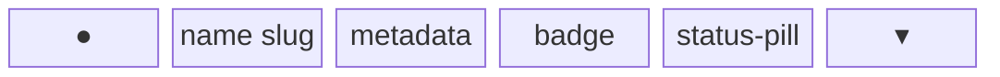
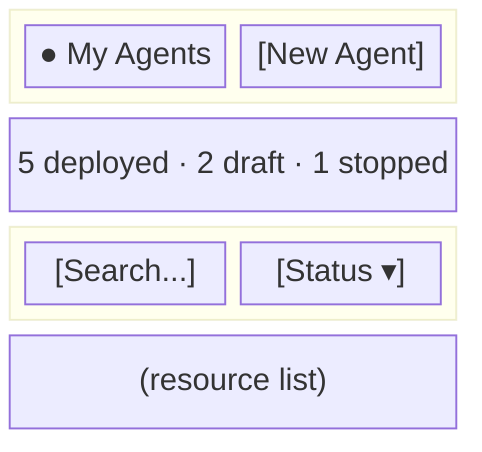
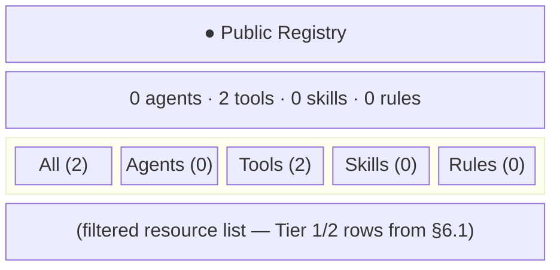
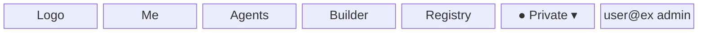
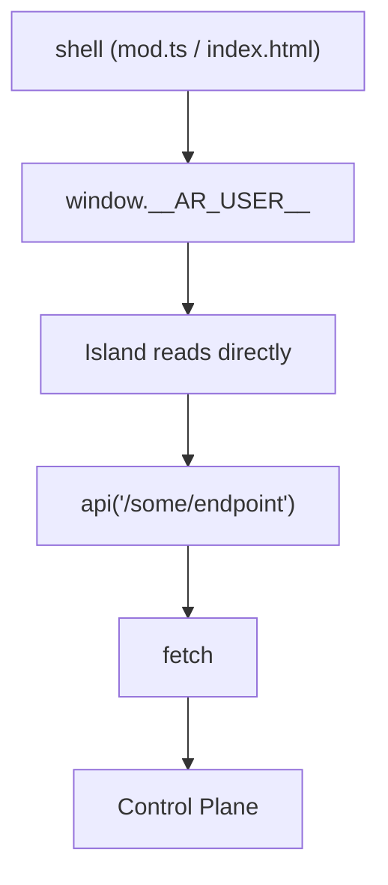
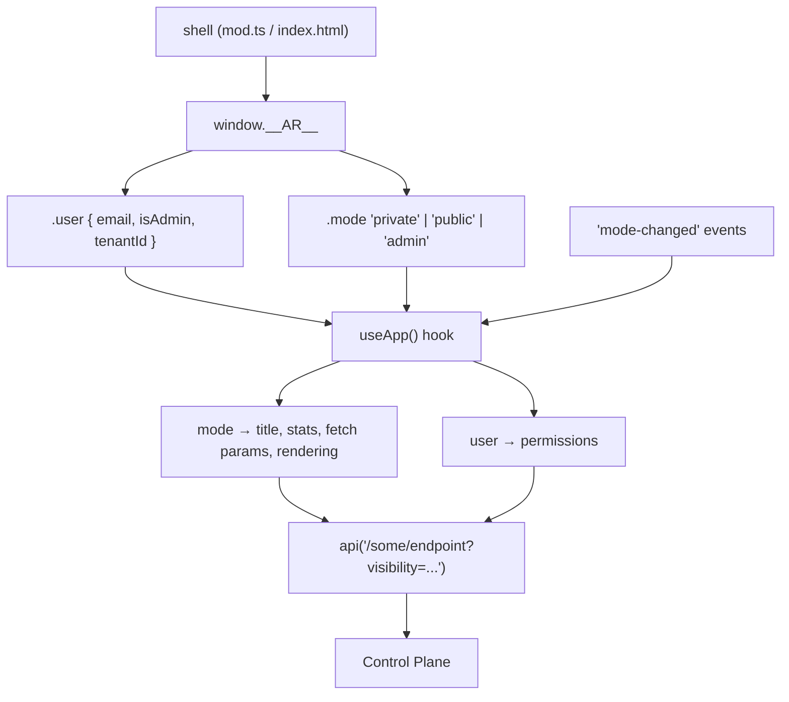

# RFC-003: Web Modes — Private, Public, and Admin Views

> **Superseded.** The global Private/Public/Admin mode system described in this
> RFC has been removed. The navbar now uses a tenant selector instead of a mode
> dropdown. Registry visibility (public/private) is a local control on the
> registry page. Pages are gated by `adminOnly` flags rather than mode
> membership. See [docs/control-plane-web-client.md](../control-plane-web-client.md)
> for the current architecture.

**Status:** Superseded **Authors:** Agent Runtime Team **Created:** 2026-03-15
**Depends on:** RFC-002 (Slackbot — "Me" page)

---

## Abstract

The web dashboard currently presents a flat list of seven navigation tabs that
blend public registry management, private user data, and admin-only
infrastructure concerns into a single view. As the product matures — and
especially as RFC-002 introduces the personal "Me" page — the dashboard needs a
first-class concept of **web modes** that partition the UI into three coherent
views: **Private**, **Public**, and **Admin**.

This RFC introduces a global mode selector in the navbar, a declarative page
visibility system, per-mode component behavior, and the architectural
refactoring needed to support these two filtering hierarchies (tenant + mode) as
clean data flows through the island architecture. It also establishes three
component-level interaction patterns — a three-tier progressive disclosure
model, a mode-aware page header, and in-page entity tabs — that give every
current and future island a shared UX vocabulary designed for progressive
extension from first-time users to power users.

---

## Table of Contents

1. [Motivation](#1-motivation)
2. [Design Principles](#2-design-principles)
3. [Mode Definitions](#3-mode-definitions)
4. [Page Visibility Matrix](#4-page-visibility-matrix)
5. [Component Behavior by Mode](#5-component-behavior-by-mode)
6. [Component Interaction Patterns](#6-component-interaction-patterns)
7. [Architecture Changes](#7-architecture-changes)
8. [Navbar and Mode Selector](#8-navbar-and-mode-selector)
9. [Shell and Server-Side Rendering](#9-shell-and-server-side-rendering)
10. [Island Context and Data Flow](#10-island-context-and-data-flow)
11. [Routing Changes](#11-routing-changes)
12. [Mock API and Dev Fixtures](#12-mock-api-and-dev-fixtures)
13. [Migration of Existing Pages](#13-migration-of-existing-pages)
14. [Security Considerations](#14-security-considerations)
15. [Rollout Plan](#15-rollout-plan)

---

## 1. Motivation

Today the web dashboard has these navigation tabs:

| Tab      | What it shows                                                            |
| -------- | ------------------------------------------------------------------------ |
| System   | GCP infrastructure, Cloud Run, storage — admin concern                   |
| Agents   | All agents (public + private mixed) — both concerns                      |
| Builder  | Prompt agent CRUD — private concern                                      |
| Registry | Public + private registry items side by side — both concerns             |
| Copy     | Cross-tenant agent copy — admin concern                                  |
| Audit    | Mutation log — admin concern                                             |
| Settings | Tenant-level config (domains, protection, admin invites) — admin concern |

After RFC-002 lands, a "Me" page is added for personal dashboard and Slackbot
enrollment — a private concern.

Several problems emerge:

1. **Non-admin users see tabs they cannot meaningfully use.** System, Copy,
   Audit, and Settings are admin-only operations. Non-admins see them but hit
   permission walls or empty states.

2. **Public and private registry data are conflated.** The Registry page shows
   both in one view. The Agents page shows all agents without distinguishing
   ownership. A user managing their private agents must mentally filter out
   public ones.

3. **The existing "Registry" dropdown is underused.** The Private/Public
   selector in the navbar only affects the Registry Status island via a
   `registry-changed` custom event. No other page reacts to it.

4. **RFC-002's "Me" page creates a clear private-mode precedent.** Once users
   have a personal dashboard, the expectation of a coherent "my stuff" view
   becomes natural.

5. **The flat tab list will not scale.** As more features land (telemetry
   dashboards, config editors, team management), a single flat navigation
   becomes unwieldy.

6. **Every island reinvents its interaction model.** Agents is an expandable
   list with metadata. Builder is a list that swaps to a full-page form.
   Registry is four vertically-stacked sections. Audit is a table. System is a
   card grid. There is no shared interaction vocabulary, which means each new
   page is a design exercise from scratch and users must re-learn navigation
   patterns on every tab.

Web modes solve the first five problems by giving users a single control that
reshapes the entire dashboard to match their current intent. The component
interaction patterns introduced in this RFC solve the sixth by establishing a
shared UX vocabulary that scales to every future island.

---

## 2. Design Principles

1. **Mode is a lens, not a silo.** Switching modes does not navigate away — it
   reconfigures which tabs are visible and how components render. The URL stays
   stable; mode is stored as client state.

2. **Tenant first, mode second.** The tenant selector remains the dominant
   global control. Mode operates within a tenant. Changing tenant resets mode to
   the user's default (Private for non-admins, Admin for admins).

3. **Progressive disclosure.** Non-admin users see only Private and Public
   modes. The Admin mode appears only for users with `isAdmin: true`.

4. **Progressive extension.** Every page follows the same three-tier interaction
   model: summary at a glance, detail on expansion, full-page focus on explicit
   action. First-time users orient via summaries; power users expand and act
   inline. The same component patterns serve both audiences without branching UX
   paths.

5. **Islands remain independent.** Each island receives mode as a prop or
   context value and adapts its own rendering. No island needs to know about
   other islands.

6. **Server and client agree.** The control-plane shell (`mod.ts`) renders the
   correct initial tabs for the mode. The client hydrates and takes over mode
   switching without full-page reloads.

---

## 3. Mode Definitions

### Private

The user's personal workspace. Shows resources the user owns or has been granted
access to. Editing is unrestricted — this is the user's own registry.

**Intent:** "Show me my stuff."

### Public

The tenant's shared public registry. Shows resources visible to all users in the
tenant. Editing is restricted: only admins can modify public registry items
(when `registryProtected` is enabled). Non-admins see a read-only view.

**Intent:** "Show me what's available to everyone."

### Admin

Full infrastructure and tenant management view. Only visible to users with
`isAdmin: true`. Shows system health, audit logs, cross-tenant operations, and
tenant configuration.

**Intent:** "Show me how the platform is running."

---

## 4. Page Visibility Matrix

Each page declares which modes it appears in. When the active mode changes, only
pages in that mode's set are shown as navigation tabs.

| Page     | Private | Public | Admin | Notes                                                         |
| -------- | ------- | ------ | ----- | ------------------------------------------------------------- |
| Me       | yes     | —      | —     | Personal dashboard (RFC-002)                                  |
| Agents   | yes     | yes    | yes   | Filtered by visibility per mode                               |
| Builder  | yes     | —      | yes   | Private: user's prompt agents. Admin: all prompt agents       |
| Registry | —       | yes    | yes   | Public: read-only for non-admins. Admin: full promote/publish |
| System   | —       | —      | yes   | Infrastructure health                                         |
| Copy     | —       | —      | yes   | Cross-tenant operations                                       |
| Audit    | —       | —      | yes   | Mutation log                                                  |
| Settings | —       | —      | yes   | Tenant configuration                                          |

**Default landing page per mode:**

| Mode    | Landing page |
| ------- | ------------ |
| Private | Me           |
| Public  | Agents       |
| Admin   | System       |

---

## 5. Component Behavior by Mode

Some pages appear in multiple modes but render differently depending on the
active mode. This section defines those behavioral differences.

### Agents

| Aspect            | Private                              | Public                              | Admin                               |
| ----------------- | ------------------------------------ | ----------------------------------- | ----------------------------------- |
| Page header title | My Agents                            | Public Agents                       | All Agents                          |
| Summary stats     | Counts by status (own)               | Counts by status (public)           | Counts by status (all)              |
| Primary action    | New Agent                            | —                                   | New Agent                           |
| Data filter       | `visibility=private` + owned by user | `visibility=public`                 | All agents (no filter)              |
| API call          | `GET /api/agents?visibility=private` | `GET /api/agents?visibility=public` | `GET /api/agents`                   |
| Row expansion     | Metadata + action bar                | Metadata only                       | Metadata + action bar + owner badge |
| Create button     | Shown                                | Hidden                              | Shown                               |
| Edit/Delete       | Shown (own agents)                   | Hidden                              | Shown (all agents)                  |
| Deploy            | Shown (own agents)                   | Hidden                              | Shown                               |

### Builder

| Aspect            | Private                             | Admin                               |
| ----------------- | ----------------------------------- | ----------------------------------- |
| Page header title | My Prompt Agents                    | All Prompt Agents                   |
| Summary stats     | Count by status (own)               | Count by status (all)               |
| Primary action    | New Agent                           | New Agent                           |
| Data filter       | `sourceType=prompt` + owned by user | `sourceType=prompt` (all)           |
| Row expansion     | Action bar + versions               | Action bar + versions + owner badge |
| Create button     | Shown                               | Shown                               |
| Edit/Delete       | Shown (own agents)                  | Shown (all agents)                  |

### Registry

| Aspect            | Public                          | Admin                                    |
| ----------------- | ------------------------------- | ---------------------------------------- |
| Page header title | Public Registry                 | Registry                                 |
| Summary stats     | Counts per entity type (public) | Counts per entity type (all)             |
| Primary action    | —                               | Publish                                  |
| Entity tabs       | Agents, Tools, Skills, Rules    | Agents, Tools, Skills, Rules, Promotable |
| Data shown        | Public registry items only      | Public + private + promotable            |
| Promote button    | Hidden                          | Shown                                    |
| Publish button    | Hidden                          | Shown (when `registryProtected`)         |
| Item editing      | Hidden                          | Shown                                    |

---

## 6. Component Interaction Patterns

This section defines three interaction patterns that all islands adopt. These
patterns are not a shared component library — they are documented conventions
with consistent structure, so that each island can implement them with its own
markup while maintaining a uniform user experience across the dashboard.

### 6.1 Three-Tier Progressive Disclosure

Every resource-oriented island follows a three-tier model:

**Tier 1 — Summary row.** A compact, scannable row showing the resource's name,
a status indicator, and one key piece of metadata. This is the default view.
First-time users see a clean list; power users scan it quickly.

The summary row follows a consistent layout across all islands:



- Left: status dot + name + slug (monospace)
- Right: one metadata value (version, subsystem, team) + status pill + chevron

Today, `agents.tsx` (lines 79–140) and `agent-builder.tsx` (`AgentCard`, lines
376–408) both implement this pattern independently with slightly different
layouts. `registry-status.tsx` (`Section`, lines 39–88) uses a simpler flat row
without expansion. This RFC standardizes the layout so all three converge.

**Tier 2 — Inline detail.** Expanding a row reveals a detail panel within the
list. The panel always follows this order:

1. **Context strip** — a grid of metadata key-value pairs (subsystem, owner,
   updated, consumes-from, etc.). Today, `agents.tsx` renders this as a 4-column
   `<dl>` grid (lines 143–168). `agent-builder.tsx` skips it entirely and jumps
   straight to actions.

2. **Action bar** — a horizontal row of small action buttons. Visibility is
   mode-gated: hidden entirely in public mode, shown in private/admin. Today,
   `agent-builder.tsx` renders this (lines 411–428) but `agents.tsx` has no
   actions at all in its expanded state.

3. **Nested content** — optional sub-resources like version lists, config
   entries, or related entities. Today, `agent-builder.tsx` renders a version
   list (lines 429–457). `agents.tsx` has no nested content.

The key behavioral rule: **mode determines which parts of Tier 2 appear.** In
public mode, only the context strip renders (read-only browsing). In private
mode, context strip + action bar + nested content. In admin mode, all three plus
an owner badge on the context strip.

**Tier 3 — Full-page focus.** Only when the user explicitly enters a creation or
deep-editing flow does the island swap to a full-page view. Today,
`agent-builder.tsx` uses this for its `AgentForm` (lines 464–618) — the entire
island body is replaced with the form. This is correct for complex creation
flows (writing a multi-page prompt). But simple field edits (renaming an agent,
changing subsystem) should happen inline at Tier 2 in a future iteration.

The rule: **Tier 3 is reserved for flows that require sustained focus** —
creating a new resource, writing a prompt, configuring a complex multi-field
entity. It is never the default path for viewing or quick edits.

#### Applying the tiers to existing islands

| Island   | Tier 1 (today)         | Tier 2 (today)                  | Tier 3 (today) | Changes needed                     |
| -------- | ---------------------- | ------------------------------- | -------------- | ---------------------------------- |
| Agents   | Expandable row         | Metadata grid, no actions       | —              | Add action bar (mode-gated)        |
| Builder  | Expandable row         | Actions + versions, no metadata | Full-page form | Add context strip before actions   |
| Registry | Flat row, no expansion | —                               | —              | Add expansion with context strip   |
| Audit    | Table row              | Metadata JSON expand            | —              | Already follows the pattern        |
| System   | Card grid              | —                               | —              | N/A (dashboard, not resource list) |
| Copy     | Form                   | —                               | —              | N/A (workflow, not resource list)  |
| Settings | Form                   | —                               | —              | N/A (config, not resource list)    |

### 6.2 Mode-Aware Page Header

Every island renders a page header as its first element. The header replaces the
current bare `<h2>` (e.g., `agents.tsx` line 43: `<h2>Agents</h2>`) with a
structured block containing three elements:

**Title line.** The page name qualified by mode context, with the mode-colored
dot as a persistent orientation cue.

| Page     | Private title    | Public title    | Admin title       |
| -------- | ---------------- | --------------- | ----------------- |
| Agents   | My Agents        | Public Agents   | All Agents        |
| Builder  | My Prompt Agents | —               | All Prompt Agents |
| Registry | —                | Public Registry | Registry          |
| System   | —                | —               | System            |
| Audit    | —                | —               | Audit Log         |
| Copy     | —                | —               | Copy Agent        |
| Settings | —                | —               | Tenant Settings   |
| Me       | Me               | —               | —                 |

**Summary strip.** 2–4 compact stat pills computed from already-fetched data. No
extra API calls. These orient the user instantly and give power users an
at-a-glance health check.

| Page     | Summary stats                                           |
| -------- | ------------------------------------------------------- |
| Agents   | `{n} deployed` / `{n} draft` / `{n} stopped`            |
| Builder  | `{n} agents` / `{n} deployed`                           |
| Registry | `{n} agents` / `{n} tools` / `{n} skills` / `{n} rules` |
| System   | `v{version}` / `{n} files` / `{size}` / `{region}`      |
| Audit    | `{n} events` / `{n} today`                              |
| Copy     | — (workflow page, no summary)                           |
| Settings | — (config page, no summary)                             |
| Me       | — (personal dashboard, widgets serve this purpose)      |

System already implements this pattern (lines 132–157 of `system.tsx`) as a
4-column stat card grid. The difference is that System uses large centered cards
because it is a dashboard page, not a resource list. For resource-list pages,
the stats are rendered as a compact inline strip below the title, not as cards:



**Primary action.** The single most important action for this page,
right-aligned in the title line. Today, `agent-builder.tsx` places "New Agent"
in the header (line 297–303). `agents.tsx` has no primary action.
`registry-status.tsx` buries promote buttons inside sub-sections.

| Page     | Private action | Public action | Admin action  |
| -------- | -------------- | ------------- | ------------- |
| Agents   | New Agent      | —             | New Agent     |
| Builder  | New Agent      | —             | New Agent     |
| Registry | —              | —             | Publish       |
| System   | —              | —             | —             |
| Audit    | —              | —             | —             |
| Copy     | —              | —             | —             |
| Settings | —              | —             | Save Settings |

#### Implementation

The page header is not a shared Preact component (that would create a coupling
point between islands). Each island renders its own header following the
pattern. The `useApp()` hook provides the mode for title qualification and
action visibility:

```typescript
export function Agents() {
  const { user, mode } = useApp()
  const [agents, setAgents] = useState<Agent[]>([])

  const title = mode === 'private'
    ? 'My Agents'
    : mode === 'public'
    ? 'Public Agents'
    : 'All Agents'

  const deployed = agents.filter((a) => a.status === 'deployed').length
  const draft = agents.filter((a) => a.status === 'draft').length
  const stopped = agents.filter((a) => a.status === 'stopped').length
  const canCreate = mode !== 'public'

  return (
    <div class='space-y-6'>
      <div>
        <div class='flex items-center justify-between'>
          <div class='flex items-center gap-2'>
            <span class={`w-2 h-2 rounded-full ${modeDotColor(mode)}`} />
            <h2 class='text-lg font-semibold'>{title}</h2>
          </div>
          {canCreate && <button type='button' class='...'>New Agent</button>}
        </div>
        {agents.length > 0 && (
          <p class='text-xs text-gray-500 mt-1'>
            {deployed} deployed · {draft} draft · {stopped} stopped
          </p>
        )}
      </div>
      {/* filter bar, resource list */}
    </div>
  )
}
```

#### Second-order effects

- **`mod.ts` SSR:** The server-rendered shell does not need to produce the page
  header — it only renders the `<nav>` and the island placeholder. The page
  header is rendered entirely by the hydrated island, which has access to both
  mode and fetched data for the summary stats.

- **Mock fixtures:** No changes needed. Summary stats are computed client-side
  from the same data the island already fetches.

- **Loading state:** While data is loading, the title and primary action render
  immediately (they depend only on mode, not on fetched data). The summary strip
  shows a subtle skeleton or is hidden until data arrives. This means the page
  feels responsive even before the API responds.

### 6.3 In-Page Entity Tabs

Pages that display multiple entity types — today, only Registry — use a
horizontal tab bar below the page header to let users filter by entity type.
This replaces the current pattern of vertically stacking four `Section`
components (lines 187–207, 215–236 of `registry-status.tsx`), which creates a
long scrollable page that gets worse as the registry grows.

#### Tab bar layout



#### Tab definitions by page and mode

**Registry (public mode):**

| Tab    | Content                                                            |
| ------ | ------------------------------------------------------------------ |
| All    | Unified list of all public entity types, each row has a type badge |
| Agents | Public agents only                                                 |
| Tools  | Public tools only                                                  |
| Skills | Public skills only                                                 |
| Rules  | Public rules only                                                  |

**Registry (admin mode):**

| Tab        | Content                                                           |
| ---------- | ----------------------------------------------------------------- |
| All        | Unified list of all entity types (public + private)               |
| Agents     | All agents                                                        |
| Tools      | All tools                                                         |
| Skills     | All skills                                                        |
| Rules      | All rules                                                         |
| Promotable | Items eligible for promotion (replaces the current amber section) |

The "Promotable" tab replaces the current standalone amber-colored section at
the bottom of `registry-status.tsx` (lines 238–275). In admin mode it appears as
a tab with an amber dot indicator when items are available. In public mode it is
hidden.

#### Data flow

The entity tabs are a client-side filter over already-fetched data. The
`/api/registry/status` endpoint already returns all entity types in a single
response (tools, skills, rules, agents — see `registry-status.ts` lines 51–68 in
the control plane). The tab selection simply controls which subset is rendered.
No additional API calls.

For the "All" tab, the island merges all entity arrays into a single list,
sorted by name, with each row displaying a type badge (the
`font-mono text-xs
bg-gray-100 px-1.5 py-0.5 rounded` pill that `Section`
already renders at `registry-status.tsx` line 69–71).

#### Where entity tabs apply today and in the future

| Page         | Entity tabs today                              | Entity tabs future                                     |
| ------------ | ---------------------------------------------- | ------------------------------------------------------ |
| Registry     | Yes (agents, tools, skills, rules, promotable) | Same                                                   |
| Agents       | No (single entity type)                        | No                                                     |
| Builder      | No (single entity type)                        | No                                                     |
| Audit        | No, but has filter dropdowns                   | Could add entity-type tabs as alternative to dropdowns |
| Me (RFC-002) | No                                             | Could add tabs for personal agents, tools, skills      |

The pattern is designed so that any island can adopt it when it grows to manage
multiple entity types. The tab state is local to the island (a `useState` for
the active tab) — no global state or routing changes needed.

#### Second-order effects

- **`registry-status.tsx` refactor:** The current `Section` component (lines
  39–88) is replaced by entity-tab-aware rendering. The `Section` function
  itself can remain as the renderer for a single entity type's list within a
  tab, but the outer structure changes from stacked sections to a tab container
  with a single visible section.

- **Mock fixtures:** No changes needed. The existing `registry-status.json`
  fixture already contains all entity types in a single response. The tabs are a
  client-side filter.

- **Control plane `scope` parameter:** The `scope` query parameter proposed in
  §10 for the registry status endpoint still applies — it controls whether the
  API returns public-only or all data. The entity tabs filter within whatever
  the API returns.

- **Audit page consideration:** The audit page currently uses two `<select>`
  dropdowns for entity type and action filtering (lines 48–73 of `audit.tsx`).
  Entity tabs could replace the entity-type dropdown in a future iteration,
  giving the audit page the same interaction vocabulary as Registry. This RFC
  does not require this change but the pattern supports it.

---

## 7. Architecture Changes

### 7.1 Page Descriptor

Today, pages are defined implicitly across four locations: `entry.ts` (routing),
`index.html` (nav links + island divs), `mod.ts` (nav links + `pageContent`),
and each island file. This makes adding or reconfiguring pages error-prone.

This RFC introduces a single `pages.ts` descriptor that is the source of truth
for all page metadata:

```typescript
// web/src/pages.ts

type Mode = 'private' | 'public' | 'admin'

type Page = {
  id: string
  label: string
  path: string
  island: string
  modes: Mode[]
  adminOnly?: boolean
  landing?: Mode
  titles?: Partial<Record<Mode, string>>
}

const MODE_COLORS: Record<Mode, string> = {
  private: 'bg-blue-500',
  public: 'bg-green-500',
  admin: 'bg-amber-500',
}

const pages: Page[] = [
  {
    id: 'me',
    label: 'Me',
    path: '/me',
    island: 'me',
    modes: ['private'],
    landing: 'private',
    titles: { private: 'Me' },
  },
  {
    id: 'agents',
    label: 'Agents',
    path: '/agents',
    island: 'agents',
    modes: ['private', 'public', 'admin'],
    landing: 'public',
    titles: {
      private: 'My Agents',
      public: 'Public Agents',
      admin: 'All Agents',
    },
  },
  {
    id: 'builder',
    label: 'Builder',
    path: '/builder',
    island: 'agent-builder',
    modes: ['private', 'admin'],
    titles: {
      private: 'My Prompt Agents',
      admin: 'All Prompt Agents',
    },
  },
  {
    id: 'registry',
    label: 'Registry',
    path: '/registry',
    island: 'registry-status',
    modes: ['public', 'admin'],
    titles: {
      public: 'Public Registry',
      admin: 'Registry',
    },
  },
  {
    id: 'system',
    label: 'System',
    path: '/system',
    island: 'system',
    modes: ['admin'],
    adminOnly: true,
    landing: 'admin',
    titles: { admin: 'System' },
  },
  {
    id: 'copy',
    label: 'Copy',
    path: '/copy',
    island: 'copy-agent',
    modes: ['admin'],
    adminOnly: true,
    titles: { admin: 'Copy Agent' },
  },
  {
    id: 'audit',
    label: 'Audit',
    path: '/audit',
    island: 'audit',
    modes: ['admin'],
    adminOnly: true,
    titles: { admin: 'Audit Log' },
  },
  {
    id: 'settings',
    label: 'Settings',
    path: '/settings',
    island: 'settings',
    modes: ['admin'],
    adminOnly: true,
    titles: { admin: 'Tenant Settings' },
  },
]

function forMode(mode: Mode, isAdmin: boolean): Page[] {
  return pages.filter((p) => {
    if (p.adminOnly && !isAdmin) return false
    return p.modes.includes(mode)
  })
}

function landing(mode: Mode): Page | undefined {
  return pages.find((p) => p.landing === mode)
}

export { forMode, landing, MODE_COLORS, pages }
export type { Mode, Page }
```

This descriptor is consumed by:

- `entry.ts` — to resolve which island to hydrate
- `mod.ts` — to render the correct nav links and island placeholder
- The mode selector — to know which tabs to show
- Each island — to resolve its mode-qualified title via `titles[mode]`

### 7.2 Shared Context via `window.__AR__`

Today, `window.__AR_USER__` carries user info and the registry selector uses
localStorage + custom events. This RFC consolidates all global context into a
single `window.__AR__` object:

```typescript
// Set by the shell (mod.ts or index.html)
window.__AR__ = {
  user: {
    email: 'user@example.com',
    isAdmin: true,
    tenantId: 'production',
  },
  mode: 'admin', // active web mode
  tenant: 'production', // active tenant (mirrors user.tenantId)
}
```

The `mode` field is initialized from:

1. `localStorage` key `ar_mode_{tenantId}` (persisted preference)
2. Fallback: `'admin'` for admins, `'private'` for non-admins

### 7.3 Mode Change Event

When the mode selector changes, it:

1. Updates `window.__AR__.mode`
2. Persists to `localStorage` as `ar_mode_{tenantId}`
3. Dispatches
   `window.dispatchEvent(new CustomEvent('mode-changed', { detail: newMode }))`
4. Updates the visible nav tabs (DOM manipulation of `[data-nav]` elements)
5. If the current page is not in the new mode's page set, navigates to the new
   mode's landing page

This replaces the existing `registry-changed` event. Islands that previously
listened for `registry-changed` will listen for `mode-changed` instead, since
the mode now subsumes the old registry selector's purpose.

### 7.4 Island Props via Context

Each island currently reads `window.__AR_USER__` directly when it needs user
info. With the new architecture, islands receive mode and user context through a
lightweight wrapper:

```typescript
// web/src/context.ts

import { useEffect, useState } from 'preact/hooks'
import type { Mode } from './pages.ts'
import { MODE_COLORS } from './pages.ts'

type AppContext = {
  user: { email: string; isAdmin: boolean; tenantId: string }
  mode: Mode
}

function useApp(): AppContext {
  const ar = (globalThis as any).__AR__
  const [mode, setMode] = useState<Mode>(ar?.mode ?? 'private')

  useEffect(() => {
    const handler = (e: CustomEvent) => setMode(e.detail)
    globalThis.addEventListener('mode-changed', handler)
    return () => globalThis.removeEventListener('mode-changed', handler)
  }, [])

  return {
    user: ar?.user ?? { email: '', isAdmin: false, tenantId: '' },
    mode,
  }
}

function modeDotColor(mode: Mode): string {
  return MODE_COLORS[mode]
}

export { modeDotColor, useApp }
export type { AppContext }
```

Islands use `useApp()` to reactively respond to mode changes:

```typescript
export function Agents() {
  const { user, mode } = useApp()
  // mode determines title, stats, what to fetch, and what actions to show
}
```

---

## 8. Navbar and Mode Selector

### Layout

The navbar has three sections today: logo (left), tabs (center), controls
(right). The mode selector replaces the existing "Registry: Private/Public"
dropdown in the right-side controls area.



### Selector Design

The mode selector is a compact `<select>` element styled to match the existing
navbar aesthetic. It uses a subtle visual indicator for the active mode:

```html
<div class="flex items-center gap-1.5">
  <span class="w-2 h-2 rounded-full" data-mode-dot></span>
  <select
    id="mode-select"
    class="
      text-sm border border-gray-300 rounded px-2 py-1 bg-white
      focus:outline-none focus:ring-2 focus:ring-blue-500
    "
  >
    <option value="private">Private</option>
    <option value="public">Public</option>
    <option value="admin">Admin</option>
  </select>
</div>
```

The colored dot provides a persistent visual cue that is echoed in the page
header (§6.2), creating a visual thread between the global mode selector and the
page-level context:

| Mode    | Dot color      | Rationale         |
| ------- | -------------- | ----------------- |
| Private | `bg-blue-500`  | Personal, calm    |
| Public  | `bg-green-500` | Shared, available |
| Admin   | `bg-amber-500` | Elevated, caution |

### Behavior

The Admin option is only rendered when `user.isAdmin` is true. Non-admin users
see only Private and Public.

When mode changes:

1. Nav tabs animate out (opacity transition, 150ms)
2. New tab set renders
3. Nav tabs animate in
4. If current page is not in the new mode, navigate to the mode's landing page

---

## 9. Shell and Server-Side Rendering

### `mod.ts` Changes

The `shell()` function in `mod.ts` currently renders all seven nav links
unconditionally. It must be updated to:

1. Accept a `mode` parameter (resolved from cookie or default)
2. Render only the nav links for that mode
3. Render the mode selector with the correct initial value
4. Replace `window.__AR_USER__` with `window.__AR__`

The `renderPage` signature changes:

```typescript
type RenderOptions = {
  email: string
  isAdmin: boolean
  tenantId: string
  mode?: 'private' | 'public' | 'admin'
}

type WebModule = {
  serveStatic: (file: string) => Promise<Response>
  renderPage: (pagePath: string, options: RenderOptions) => string
}
```

The mode is resolved server-side from a cookie (`ar_mode`) if present, otherwise
defaults based on `isAdmin`. This ensures the initial HTML render matches the
client state, avoiding a flash of incorrect tabs.

### `pageContent()` Changes

The `pageContent()` function remains path-based — it renders the island
placeholder for the requested path regardless of mode. Mode filtering only
affects which nav tabs are visible. If a user navigates directly to a URL that
is not in their current mode (e.g., bookmarked `/web/system` while in Private
mode), the page still renders but the mode selector auto-switches to the
appropriate mode for that page.

### Mode Cookie

The control plane sets a `ar_mode` cookie when the web client sends a mode
change. This is a convenience cookie for SSR — it is not used for authorization.

```
POST /api/user/preferences
Content-Type: application/json

{ "mode": "admin" }
```

The control plane stores this in the session or as a cookie:

```
Set-Cookie: ar_mode=admin; Path=/web; SameSite=Lax; Secure
```

---

## 10. Island Context and Data Flow

### Current Flow



### New Flow



### API Filtering

Islands that fetch data use the mode to determine query parameters:

| Mode    | Agents endpoint                      | Registry endpoint                       |
| ------- | ------------------------------------ | --------------------------------------- |
| Private | `GET /api/agents?visibility=private` | N/A (page hidden)                       |
| Public  | `GET /api/agents?visibility=public`  | `GET /api/registry/status?scope=public` |
| Admin   | `GET /api/agents` (all)              | `GET /api/registry/status` (all)        |

The control plane already supports `visibility` filtering on agents (see
`control-plane/src/api/agents.ts` — `listByTenant` accepts a visibility option).
The `/api/registry/status` endpoint currently returns both public and private
data in a single response (see `control-plane/src/api/registry-status.ts` lines
51–68); a `scope` query parameter will be added to allow requesting only one
side.

---

## 11. Routing Changes

### `entry.ts`

The entry file is refactored to use the page descriptor:

```typescript
import './tailwind.css'
import { h, render } from 'preact'
import { pages } from './pages.ts'

function hydrate(selector: string, Component: () => preact.VNode) {
  const el = document.querySelector(selector)
  if (el) render(h(Component, null), el)
}

async function init() {
  const path = globalThis.location.pathname.replace(/^\/web/, '')

  for (const page of pages) {
    if (
      path.startsWith(page.path) ||
      (page.landing && path === '/' || path === '')
    ) {
      const island = page.island
      const mod = await import(`./islands/${island}.tsx`)
      const Component = mod[Object.keys(mod)[0]]
      hydrate(`[data-island="${island}"]`, Component)
      break
    }
  }

  initModeSelector()
}

function initModeSelector() {
  const sel = document.getElementById('mode-select') as HTMLSelectElement
  if (!sel) return

  const ar = (globalThis as any).__AR__
  const tenantId = ar?.user?.tenantId ?? ''
  const stored = localStorage.getItem(`ar_mode_${tenantId}`)

  if (stored && ['private', 'public', 'admin'].includes(stored)) {
    sel.value = stored
    ar.mode = stored
  }

  sel.addEventListener('change', () => {
    const mode = sel.value
    ar.mode = mode
    localStorage.setItem(`ar_mode_${tenantId}`, mode)
    globalThis.dispatchEvent(
      new CustomEvent('mode-changed', { detail: mode }),
    )
    updateNavTabs(mode, ar.user.isAdmin)
    maybeNavigate(mode)
  })
}

init()
```

### `index.html`

The dev `index.html` is updated to:

1. Replace `window.__AR_USER__` with `window.__AR__`
2. Replace the "Registry" dropdown with the mode selector
3. Add `data-modes` attributes to nav links for client-side filtering
4. Add the "Me" island placeholder (from RFC-002)

```html
<div class="flex items-center gap-1" id="nav-links">
  <a href="/web/me" data-nav="me" data-modes="private" ...>Me</a>
  <a href="/web/agents" data-nav="agents" data-modes="private,public,admin" ...
  >Agents</a>
  <a href="/web/builder" data-nav="builder" data-modes="private,admin" ...
  >Builder</a>
  <a href="/web/registry" data-nav="registry" data-modes="public,admin" ...
  >Registry</a>
  <a href="/web/system" data-nav="system" data-modes="admin" ...>System</a>
  <a href="/web/copy" data-nav="copy" data-modes="admin" ...>Copy</a>
  <a href="/web/audit" data-nav="audit" data-modes="admin" ...>Audit</a>
  <a href="/web/settings" data-nav="settings" data-modes="admin" ...
  >Settings</a>
</div>
```

The inline script filters tabs on load:

```javascript
function updateNavTabs(mode, isAdmin) {
  var links = document.querySelectorAll('#nav-links a[data-nav]')
  links.forEach(function (a) {
    var modes = (a.getAttribute('data-modes') || '').split(',')
    var adminOnly = modes.length === 1 && modes[0] === 'admin'
    if (adminOnly && !isAdmin) {
      a.style.display = 'none'
    } else if (modes.includes(mode)) {
      a.style.display = ''
    } else {
      a.style.display = 'none'
    }
  })
}
```

---

## 12. Mock API and Dev Fixtures

### New Fixture: `dev/fixtures/agents-private.json`

A filtered agent list representing only the user's private agents:

```json
[
  {
    "id": "a1",
    "name": "My Weather Bot",
    "slug": "my-weather-bot",
    "status": "deployed",
    "visibility": "private",
    "team": "personal",
    "version": "0.0.3",
    "updatedAt": "2026-03-14T10:00:00Z"
  }
]
```

### New Fixture: `dev/fixtures/agents-public.json`

A filtered agent list representing only public agents:

```json
[
  {
    "id": "a2",
    "name": "Company Summarizer",
    "slug": "company-summarizer",
    "status": "deployed",
    "visibility": "public",
    "team": "platform",
    "version": "1.2.0",
    "updatedAt": "2026-03-10T08:00:00Z"
  }
]
```

### Mock Route Changes

The mock plugin (`dev/mock.ts`) is updated to respect the `visibility` query
parameter on agent routes:

```typescript
if (method === 'GET' && /^\/api\/agents\/?$/.test(path)) {
  const sourceType = params.get('sourceType')
  const visibility = params.get('visibility')

  if (sourceType === 'prompt') {
    stubJson(res, loadFixture('prompt-agents') ?? [])
  } else if (visibility === 'private') {
    stubJson(res, loadFixture('agents-private') ?? [])
  } else if (visibility === 'public') {
    stubJson(res, loadFixture('agents-public') ?? [])
  } else {
    stubJson(res, loadFixture('agents') ?? [])
  }
  return true
}
```

The registry status endpoint gains a `scope` parameter:

```typescript
{
  method: 'GET',
  pattern: /^\/api\/registry\/status\/?$/,
  handler(params) {
    const scope = params.get('scope')
    const full = loadFixture('registry-status')
    if (scope === 'public') return { ...full, private: undefined }
    return full
  },
}
```

### Dev `index.html` User Variants

The dev `index.html` gains a small debug toggle (only in dev) to switch between
admin and non-admin user contexts, making it easy to test mode visibility:

```javascript
window.__AR__ = {
  user: {
    email: 'dev@local',
    isAdmin: true,
    tenantId: 'development',
  },
  mode: 'admin',
}
```

---

## 13. Migration of Existing Pages

Each island migration follows the same pattern: adopt `useApp()`, render the
mode-aware page header (§6.2), apply the three-tier disclosure model (§6.1)
where applicable, and add entity tabs (§6.3) where the page manages multiple
entity types.

### Agents (`agents.tsx`)

**Before:** Bare `<h2>Agents</h2>` heading. Fetches all agents with no
visibility filter. Expandable rows show metadata grid but no actions. No summary
stats.

**After:**

- Page header with mode-qualified title ("My Agents" / "Public Agents" / "All
  Agents"), summary stats (deployed/draft/stopped counts), and primary action
  ("New Agent" in private/admin, hidden in public).
- `useApp()` provides mode. `useEffect` refetches when mode changes, passing
  `visibility` query parameter.
- Tier 2 expansion adds an action bar (Edit, Deploy, Delete) below the existing
  metadata grid, gated by mode: hidden in public, shown in private/admin.
- In admin mode, an owner badge appears in the context strip.

```typescript
export function Agents() {
  const { user, mode } = useApp()
  const [agents, setAgents] = useState<Agent[]>([])

  useEffect(() => {
    const params = new URLSearchParams()
    if (mode === 'private') params.set('visibility', 'private')
    if (mode === 'public') params.set('visibility', 'public')

    api(`/api/agents?${params}`)
      .then((r) => r.json())
      .then((d) => setAgents(d as Agent[]))
  }, [mode])

  const canEdit = mode !== 'public'
  // page header, summary stats, resource list with mode-gated Tier 2
}
```

### Builder (`agent-builder.tsx`)

**Before:** Bare `<h2>Prompt Agent Builder</h2>`. Shows all prompt agents.
`AgentCard` expansion shows actions + versions but no metadata context strip.
Full-page form for create/edit.

**After:**

- Page header with mode-qualified title, summary stats, primary action.
- Tier 2 expansion adds a context strip (subsystem, updated, owner in admin
  mode) above the existing action bar and version list.
- `useApp()` provides mode for API filtering (own agents in private, all in
  admin).
- Full-page form (Tier 3) remains for create/edit — prompt editing requires
  sustained focus.

### Registry Status (`registry-status.tsx`)

**Before:** Shows both public and private sections as vertically-stacked
`Section` components. Listens for `registry-changed` event. Promotable section
at the bottom.

**After:**

- Page header with mode-qualified title ("Public Registry" / "Registry"),
  summary stats (entity counts), primary action ("Publish" in admin, hidden in
  public).
- Entity tabs (§6.3): All, Agents, Tools, Skills, Rules. In admin mode, a
  "Promotable" tab replaces the standalone amber section.
- Each tab renders a list of Tier 1 rows with type badges. Expanding a row shows
  a context strip (version, owner, visibility).
- Listens for `mode-changed` instead of `registry-changed`.
- In public mode, action bar is hidden on Tier 2 expansion. In admin mode,
  promote/publish actions appear in the action bar.

### Copy Agent (`copy-agent.tsx`)

**Before:** Available to all users, with `canPublish` gated by `isAdmin`. Reads
`window.__AR_USER__`.

**After:**

- Only shown in admin mode. Page header with title "Copy Agent".
- Reads `useApp()` instead of `window.__AR_USER__`. The `canPublish` guard is
  removed (admin mode implies admin user).
- No structural changes to the form layout — Copy is a workflow page, not a
  resource list, so the three-tier model does not apply.

### Audit (`audit.tsx`)

**Before:** Bare `<h2>Audit Log</h2>`. Available to all users.

**After:**

- Only shown in admin mode. Page header with title "Audit Log" and summary stats
  (total events, events today computed from `createdAt` timestamps).
- The existing table + expandable metadata row already follows the three-tier
  pattern naturally (Tier 1 = table row, Tier 2 = expanded metadata JSON).
- No structural changes beyond the page header.

### Settings (`settings.tsx`)

**Before:** Available to all users, with `isAdmin` checks on individual
controls. Reads `window.__AR_USER__`.

**After:**

- Only shown in admin mode. Page header with title "Tenant Settings".
- Reads `useApp()` instead of `window.__AR_USER__`. The `isAdmin` guards on
  individual controls are removed (page is only reachable by admins).
- No structural changes — Settings is a config page, not a resource list.

### System (`system.tsx`)

**Before:** Available to all users. Already has summary stat cards and a card
grid layout.

**After:**

- Only shown in admin mode. Page header with title "System" (the existing
  `<h2>System Overview</h2>` is replaced).
- The existing stat card grid (lines 132–157) serves as the summary strip. No
  changes needed to the card layout — System is a dashboard page, not a resource
  list, so it keeps its card-based Tier 1.

### Me (`me.tsx`, from RFC-002)

**Before (RFC-002):** Available to all users.

**After:** Only shown in private mode. Page header with title "Me". The
widget-based layout from RFC-002 (Account Info, Slackbot Enrollment, Message
History) serves as the page body. No three-tier model — Me is a personal
dashboard with widgets, not a resource list.

---

## 14. Security Considerations

### Mode is a UI concern, not an authorization boundary

Mode filtering happens entirely in the client. The control plane does not
enforce mode — it enforces permissions. A user who manually crafts API requests
to admin endpoints will still be rejected by the control plane's `apiAuth` and
`isAdmin` checks. Mode is a UX optimization, not a security gate.

### No new API permissions

This RFC does not introduce new permission levels. The existing `isAdmin` flag
and entity-level `canRead`/`canWrite`/`canPublish` checks in
`sdk-client-deno/src/db/access.ts` remain the authorization layer.

### The `ar_mode` cookie is not sensitive

The mode preference cookie contains only the string `private`, `public`, or
`admin`. It is used solely for SSR tab rendering. It is not used for
authorization decisions. It is set with `SameSite=Lax` and `Secure` flags.

### Admin mode does not grant admin access

Selecting admin mode in the UI does not elevate privileges. If a non-admin user
somehow renders the admin mode selector (e.g., by manipulating the DOM), the
control plane will still reject unauthorized requests. The client hides the
admin option for non-admins as a UX convenience, not a security measure.

---

## 15. Rollout Plan

### Phase 1: Foundation (pages.ts, context.ts, window.**AR**)

**Files changed:** `web/src/pages.ts` (new), `web/src/context.ts` (new),
`web/mod.ts`, `web/index.html`, `web/src/entry.ts`

1. Create `web/src/pages.ts` with the page descriptor including `titles` and
   `MODE_COLORS`
2. Create `web/src/context.ts` with `useApp()` and `modeDotColor()`
3. Migrate `window.__AR_USER__` to `window.__AR__` in `mod.ts` and `index.html`
   (keep deprecated `__AR_USER__` shim during transition)
4. Update `entry.ts` to use the page descriptor for routing
5. Add `data-modes` attributes to nav links in `index.html`
6. Update `mod.ts` shell to accept mode and render filtered nav links

**Second-order effects:**

- `copy-agent.tsx` and `settings.tsx` read `window.__AR_USER__` directly — the
  deprecated shim ensures they keep working until Phase 3 migrates them.
- The Vite build (`vite.config.ts`) is unaffected — `pages.ts` and `context.ts`
  are standard TypeScript modules imported by existing entry points.
- No control plane API changes in this phase.

### Phase 2: Mode Selector

**Files changed:** `web/mod.ts`, `web/index.html`, `web/src/entry.ts`

1. Replace the "Registry: Private/Public" dropdown with the mode selector in
   both `mod.ts` (SSR shell) and `index.html` (dev)
2. Implement `mode-changed` event dispatch and `updateNavTabs()`
3. Implement auto-navigation when current page leaves the active mode's set
4. Add mode preference persistence to localStorage
5. Add `ar_mode` cookie support in the control plane

**Second-order effects:**

- `registry-status.tsx` listens for `registry-changed` — this event still fires
  (dual-emit) until Phase 3 migrates it.
- The `mod.ts` `navLink()` function (lines 52–66) needs to accept a `modes`
  parameter and emit `data-modes` attributes, or be replaced by a loop over
  `forMode()`.
- The control plane `webAuth` middleware or the `/web/*` route handler needs to
  read the `ar_mode` cookie and pass it to `renderPage()`.

### Phase 3: Page Header Pattern

**Files changed:** All island files in `web/src/islands/`

1. Update each island to use `useApp()` instead of reading `window.__AR_USER__`
   directly
2. Replace bare `<h2>` headings with the mode-aware page header pattern (§6.2):
   mode-qualified title, summary stats, primary action
3. Remove the deprecated `window.__AR_USER__` shim from `mod.ts` and
   `index.html`

**Second-order effects:**

- Summary stats are computed from already-fetched data, so no API changes.
- The `modeDotColor()` helper from `context.ts` is used in every island's page
  header — this is the only cross-island visual coupling and it flows through
  the shared module, not through DOM.
- `system.tsx` already has stat cards — its migration is minimal (replace the
  `<h2>` and `<span>Tenant:...</span>` with the standard header pattern, keep
  the stat card grid as the page body).

### Phase 4: Three-Tier Disclosure and Entity Tabs

**Files changed:** `web/src/islands/agents.tsx`,
`web/src/islands/agent-builder.tsx`, `web/src/islands/registry-status.tsx`

1. **`agents.tsx`:** Add action bar to Tier 2 expansion (Edit, Deploy, Delete),
   gated by `mode !== 'public'`. Add owner badge in admin mode.
2. **`agent-builder.tsx`:** Add context strip (subsystem, updated, owner) to
   Tier 2 expansion, above the existing action bar and version list.
3. **`registry-status.tsx`:** Replace vertically-stacked `Section` components
   with entity tab bar. Add "Promotable" tab in admin mode. Each tab renders
   Tier 1 rows with expansion support.

**Second-order effects:**

- `registry-status.tsx` currently has a `Section` component used for rendering
  entity lists. This component remains but is used within a tab panel instead of
  being stacked. The `Section` function signature does not change.
- The `registry-changed` event listener in `registry-status.tsx` (lines 113–118)
  is replaced by `mode-changed` via the `useApp()` hook's `useEffect`. The
  dual-emit shim from Phase 2 is removed.
- The Agents page gains actions that were previously only available in Builder.
  This means the Agents island now calls `POST /api/agents/:id/deploy` and
  `DELETE /api/agents/:id` — endpoints that already exist in the control plane
  (`control-plane/src/api/agents.ts`) and the mock API (`dev/mock.ts`). No new
  endpoints needed.

### Phase 5: Mock API and Testing

**Files changed:** `web/dev/mock.ts`, `web/dev/fixtures/agents-private.json`
(new), `web/dev/fixtures/agents-public.json` (new)

1. Add `agents-private.json` and `agents-public.json` fixtures
2. Update `mock.ts` to respect `visibility` query parameter on agent routes
3. Add `scope` parameter support to registry status mock
4. Add dev user toggle for admin/non-admin testing in `index.html`
5. Verify all mode transitions work in `npm run dev`:
   - Switch between all three modes, confirm correct tabs appear
   - Confirm page header title changes per mode
   - Confirm summary stats render from fetched data
   - Confirm entity tabs filter correctly on Registry page
   - Confirm Tier 2 actions are hidden in public mode
   - Confirm auto-navigation when switching to a mode that excludes current page
   - Test as non-admin (only Private/Public modes available)

### Phase 6: Control Plane Integration

**Files changed:** `control-plane/src/mod.ts`,
`control-plane/src/api/registry-status.ts`, `control-plane/src/api/agents.ts`
(if `visibility` filter not yet supported on GET list)

1. Add `POST /api/user/preferences` endpoint for mode persistence
2. Add `ar_mode` cookie handling in the web auth flow
3. Update `renderPage` call in `control-plane/src/mod.ts` (line 122) to pass
   mode from cookie
4. Add `scope` query parameter support to
   `control-plane/src/api/registry-status.ts` — when `scope=public`, omit the
   `private` key and `promotable` from the response
5. Verify `GET /api/agents` in `control-plane/src/api/agents.ts` supports
   `visibility` query parameter for list filtering (the `listByTenant` function
   in `@ar/client/db/agents` already accepts a visibility option — confirm the
   HTTP handler passes it through from the query string)

---

## Appendix A: Full Nav State by Mode and Role

### Admin user

| Mode    | Visible tabs                                             |
| ------- | -------------------------------------------------------- |
| Private | Me, Agents, Builder                                      |
| Public  | Agents, Registry                                         |
| Admin   | Agents, Builder, Registry, System, Copy, Audit, Settings |

### Non-admin user

| Mode    | Visible tabs        |
| ------- | ------------------- |
| Private | Me, Agents, Builder |
| Public  | Agents, Registry    |

(Admin mode is not available to non-admin users.)

## Appendix B: Backward Compatibility

### URL stability

All existing URLs (`/web/system`, `/web/agents`, etc.) continue to work. Direct
navigation to a URL auto-selects the appropriate mode. Bookmarks are not broken.

### `window.__AR_USER__` deprecation

`window.__AR_USER__` is replaced by `window.__AR__.user`. For a transitional
period (Phases 1–2), both are set:

```javascript
window.__AR__ = { user: userObj, mode: initialMode }
window.__AR_USER__ = userObj // removed in Phase 3
```

### `registry-changed` event deprecation

The `registry-changed` custom event is replaced by `mode-changed`. During Phase
2, both events fire when mode changes. The `registry-changed` event is removed
in Phase 4 when `registry-status.tsx` is migrated.

## Appendix C: Component Pattern Summary

This table summarizes which interaction patterns from §6 apply to each island:

| Island   | Page header (§6.2)      | Three-tier (§6.1)       | Entity tabs (§6.3)    |
| -------- | ----------------------- | ----------------------- | --------------------- |
| Agents   | Yes                     | Yes (add action bar)    | No                    |
| Builder  | Yes                     | Yes (add context strip) | No                    |
| Registry | Yes                     | Yes (add expansion)     | Yes                   |
| Audit    | Yes                     | Already follows pattern | No (future candidate) |
| System   | Yes (dashboard variant) | N/A (card grid)         | No                    |
| Copy     | Yes                     | N/A (workflow form)     | No                    |
| Settings | Yes                     | N/A (config form)       | No                    |
| Me       | Yes                     | N/A (widget dashboard)  | No (future candidate) |

## Appendix D: Future Considerations

### Per-mode URL prefixes

A future RFC may introduce URL prefixes like `/web/private/agents` vs
`/web/public/agents` to make mode part of the URL. This RFC intentionally avoids
this to keep URLs stable and simple, but the page descriptor makes it
straightforward to add later.

### Team mode

As team management matures, a fourth mode (`team`) could show resources scoped
to the user's team. The `Mode` type and page descriptor are designed to be
extended.

### Mode-specific widgets

Individual islands may evolve to show entirely different widget layouts per mode
(not just filtered data). The `useApp()` hook and mode-changed event provide the
foundation for this without architectural changes.

### Entity tabs on additional pages

The entity tab pattern (§6.3) is designed to be adopted by any island that grows
to manage multiple entity types. Likely candidates:

- **Me** — personal agents, tools, skills, rules as tabs
- **Audit** — entity-type tabs replacing the current dropdown filter
- **Future search page** — unified search results filtered by entity type tabs

### Inline editing at Tier 2

The three-tier model (§6.1) currently reserves Tier 3 for all editing. A future
iteration could introduce inline editing at Tier 2 for simple field changes
(renaming, status toggles), reducing the number of full-page transitions. The
action bar in Tier 2 is the natural place for an "Edit" button that toggles
fields to editable state without leaving the list view.
