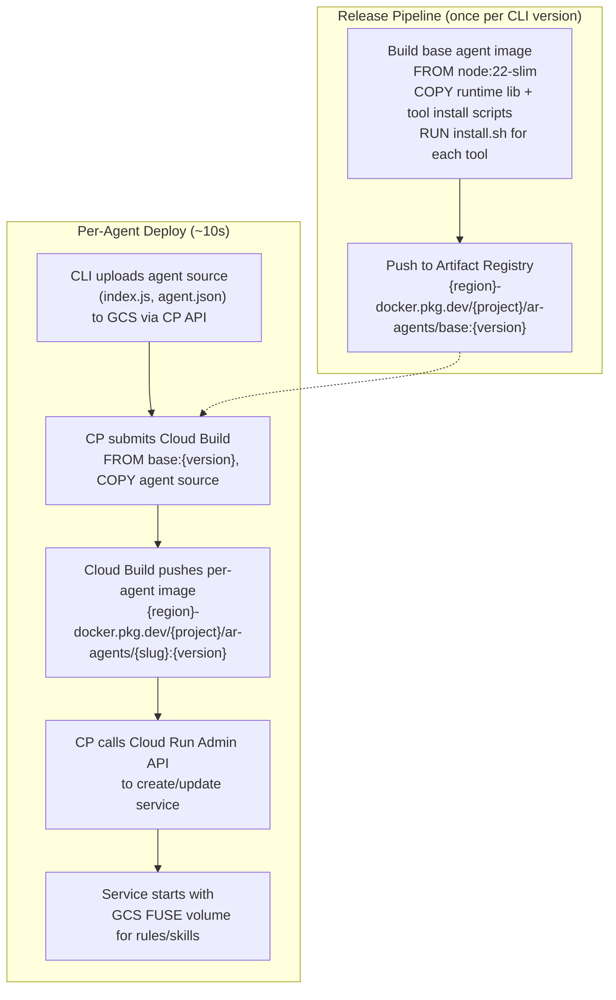
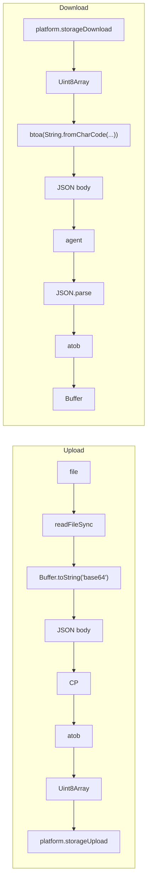

# RFC-004: Agent Deployment Architecture

**Status:** Draft
**Authors:** Agent Runtime Team
**Created:** 2026-04-05
**Updated:** 2026-04-06
**Depends on:** None

---

## Abstract

Agent deployment currently uses a single path: the CLI assembles a 300MB+
directory (agent source + runtime lib + tool binaries), then shells out to
`gcloud functions deploy --gen2 --source=<dir>`. This triggers Cloud Build on
every deploy, takes 2-5 minutes, causes OOMs on machines with limited memory,
and cannot run from the standalone compiled CLI binary (which does not embed the
default-registry binaries).

This RFC replaces that path with a layered architecture built on three
primitives:

1. **Container images** for agents and tool binaries. A shared base image
   contains the runtime and all tool binaries (cursor, claude, etc.). Per-agent
   images add a thin source layer. Both Cloud Run services and Cloud Functions
   Gen 2 use these images.

2. **GCS FUSE volume mounts** for rules, skills, and configs. These small
   text-based registry artifacts change frequently and are shared across all
   agents in a tenant. A read-only GCS volume mount makes them available
   instantly without image rebuilds.

3. **Signed URLs** for agent working storage. Agents that need to read/write
   their own data (demo source, workspace files, outputs) use time-limited
   signed URLs to access GCS directly, bypassing the control plane's JSON+base64
   proxy.

A source-mode fallback is retained for teams that do not want to manage
Artifact Registry, but container mode is the default and recommended path.

---

## Table of Contents

1. [Motivation](#1-motivation)
2. [Design Principles](#2-design-principles)
3. [Registry Artifact Strategy](#3-registry-artifact-strategy)
4. [Container Images (Agents + Tools)](#4-container-images-agents--tools)
5. [GCS FUSE Volume Mounts (Rules + Skills + Configs)](#5-gcs-fuse-volume-mounts-rules--skills--configs)
6. [Signed URLs (Agent Working Storage)](#6-signed-urls-agent-working-storage)
7. [Source Mode Fallback](#7-source-mode-fallback)
8. [Shared Architecture](#8-shared-architecture)
9. [Control Plane Changes](#9-control-plane-changes)
10. [CLI Changes](#10-cli-changes)
11. [SDK and Runtime Changes](#11-sdk-and-runtime-changes)
12. [CI and Release Pipeline](#12-ci-and-release-pipeline)
13. [Default Registry Refactor](#13-default-registry-refactor)
14. [Configuration and Settings](#14-configuration-and-settings)
15. [IAM and Security](#15-iam-and-security)
16. [Migration Path](#16-migration-path)
17. [Appendix: File Change Inventory](#17-appendix-file-change-inventory)

---

## 1. Motivation

### Assumptions about the target system

- There will be many agents in the registry, each with multiple versions. The
  demo agent is one of many — not a special case.
- All agents in a tenant get access to all tools, rules, and skills in that
  tenant's registry.
- Agents spin up and down frequently (scale-to-zero is common).
- Agents are a mix of Cloud Run services and Cloud Run functions (Gen 2). Both
  must access registry artifacts the same way.
- Cursor and Claude tool binaries (~160MB and ~80MB respectively) are needed on
  virtually every agent.

### Problems with the current deploy path

**OOM on client and server.** `bundleTools` copies 160MB+ of tool binaries into
the agent directory. `compress()` tried to tar 328MB into a single Uint8Array.
The control plane's `/storage/download` endpoint still uses
`String.fromCharCode(...data)` which crashes on files >64KB. The storage proxy
wraps all I/O in JSON+base64, causing ~4x memory amplification. We patched the
worst client-side symptoms, but the architecture is fundamentally memory-hungry.

**Slow deploys.** Every `ar agent deploy` triggers Cloud Build (2-5 min) to
containerize 300MB of source. Deploying the default registry's 2 agents after
`ar cp deploy` adds 10+ minutes to the setup flow.

**Cold start penalty scales with agent count.** If tool binaries are not baked
into the image, every cold start downloads 300MB+ from GCS. With many agents
spinning up frequently, this means continuous bandwidth consumption and
multi-second latency penalties on every scale-from-zero event.

**Standalone CLI cannot deploy default agents.** The compiled `ar` binary
embeds `default-settings.jsonc` and the control plane archive, but NOT the
`default-registry/` tree (which contains 500MB+ of tool binaries tracked by
Git LFS). Users who install via `curl | sh` cannot deploy the default agents.

**Git LFS complexity.** Tool binaries (`cursor` at 161MB, `auth0` at 57MB) are
tracked by Git LFS. Contributors who forget `git lfs pull` get pointer files
instead of binaries. CI needs explicit LFS checkout. The repo's `.gitattributes`
and contributor docs must account for this.

**Broken REST deploy path.** `gcp-rest.ts` `functionDeploy` has an empty
`storageSource: {}` — the server-mode deploy path for agents is a placeholder
that does not work.

**`syncRegistry` is fragile.** After `ar cp deploy`, the registry sync spawns
child processes for each entity type and tenant. Agent deploys in these
subprocesses hit the same OOM and speed issues.

---

## 2. Design Principles

1. **Agents are containers.** Container images are the primary deployment unit.
   Tool binaries live in a shared base image layer that Cloud Run caches at the
   node level. Per-agent images add only source code.

2. **Rules and skills are files, not images.** These are small, text-based, and
   change frequently. They should not require image rebuilds. GCS FUSE gives
   agents a filesystem view of the registry without network round-trips or
   memory overhead.

3. **The control plane is not a storage proxy.** Agents access GCS directly via
   FUSE mounts (for registry artifacts) or signed URLs (for working storage).
   The control plane generates credentials and coordinates deploys, but bytes
   do not flow through it.

4. **Container mode is the default.** It provides the best cold-start
   performance, the lowest runtime memory overhead, and the most reproducible
   deploys. Source mode is retained as a fallback.

5. **Agent handlers are identical in all modes.** A `module.exports.handler`
   function that takes `(req, res)` works the same whether it runs in a Cloud
   Function or a Cloud Run service. The runtime lib, tool access, secrets, and
   environment variables do not change.

6. **Mode is a project-level setting, not per-agent.** All agents in a project
   use the same deploy mode. This avoids mixed infrastructure and simplifies
   IAM, destroy, and status operations.

---

## 3. Registry Artifact Strategy

Each artifact type has different characteristics that dictate its delivery
mechanism:

| Artifact type      | Typical size  | Change frequency      | Delivery mechanism              |
| ------------------ | ------------- | --------------------- | ------------------------------- |
| Tool binaries      | 50-200MB each | Rarely (per release)  | Baked into base container image |
| Tool configs       | <1KB each     | Occasionally          | Baked into base image           |
| Agent source       | <100KB        | Per deploy            | Thin container layer on base    |
| Rules              | <50KB each    | Often (user-authored) | GCS FUSE read-only volume mount |
| Skills             | <50KB each    | Often (user-authored) | GCS FUSE read-only volume mount |
| Agent working data | Variable      | Per request           | GCS direct via signed URLs      |

### Why this split?

**Tool binaries in images:** Cursor and claude are needed on virtually every
agent. At 160MB+ each, downloading them on every cold start would add 2-4
seconds of latency and hundreds of MB of bandwidth per spin-up. Baked into the
base image, they are cached at the Cloud Run node level — after the first agent
on a node pulls the base layer, every subsequent agent gets a cache hit. The
binaries live in the container's overlay filesystem (backed by disk), not in
memory.

**Rules and skills via FUSE:** These are small text files that users create
and update frequently. Requiring an image rebuild for every rule change would
be impractical. GCS FUSE presents the GCS bucket as a read-only filesystem with
60-second stat cache TTL. Agents see updated rules within a minute of upload,
with no redeploy. Memory overhead is ~32MB for the stat cache — negligible.

**Signed URLs for working storage:** When agents push/pull their own working
data (demo source files, workspace artifacts), the current path through the
control plane's JSON+base64 proxy causes ~4x memory amplification on both
sides. Signed URLs let agents talk to GCS directly — binary, streaming, no
intermediary.

---

## 4. Container Images (Agents + Tools)

### Architecture



### Base image

Built during CI release or on first `ar cp deploy`. Contains:

- `node:22-slim` base (matches the `nodejs22` Cloud Functions runtime)
- `sdk-agent-nodejs/bin/index.cjs` as `/app/runtime/_runtime.cjs`
- Tool binaries installed via `install.sh` into `/app/tools/{slug}/`
- Tool configs (`tool.json`) for each tool in `/app/tools/{slug}/`
- The bootstrap wrapper that wires `_runtime.cjs` into agent handlers
- A minimal HTTP server (`agent-host.js`) using the Functions Framework

The base image is tagged with the CLI version (e.g. `base:0.0.2`) and stored in
a project-scoped Artifact Registry repository (`ar-agents`).

### Per-agent image

A single-layer extension of the base:

```dockerfile
FROM {region}-docker.pkg.dev/{project}/ar-agents/base:{version}
COPY agent-source/ /app/agent/
ENV AR_AGENT_SLUG={slug}
ENV AR_AGENT_VERSION={version}
CMD ["node", "/app/runtime/agent-host.js"]
```

The per-agent source is typically <50KB. The layer push takes <5s. Cloud Build
processes this in <30s (the base image layers are fully cached).

### Cold start performance

With tool binaries in the base image layer:

- **First agent on a node:** Pulls the full base image (~200MB compressed). This
  takes 2-5 seconds. Subsequent layer pulls (per-agent source) add <1 second.
- **Subsequent agents on the same node:** Base layer is already cached. Only the
  thin per-agent layer is pulled. Cold start overhead from image pull: <1 second.
- **Tool binary access at runtime:** `execFileSync("/app/tools/cursor/tool", ...)`
  reads from the overlay filesystem. No network fetch, no memory buffering, no
  tmpfs. Latency is equivalent to reading from local disk.

### Adding a new tool

1. Add `install.sh` + `tool.json` to `default-registry/tools/{slug}/{version}/`
2. Rebuild the base image (CI, ~5 min)
3. Redeploy agents — each is a thin-layer rebuild (~10s, parallelizable)

With many agents, step 3 scales linearly but each build is trivially fast.
Even 50 agents redeploy in <2 minutes wall-clock with parallel Cloud Build
submissions.

### Artifact Registry setup and cost

On first deploy, the control plane creates the repository:

```
gcloud artifacts repositories create ar-agents \
  --repository-format=docker \
  --location={region} \
  --project={project}
```

- Artifact Registry: 0.5GB free/month. A base image (~200MB compressed) +
  50 agent images (~1MB each) = ~250MB. Well within free tier.
- Cloud Build: 120 free min/day. Per-agent thin-layer builds take <30s each.
- Cloud Run: Same pricing as Cloud Functions Gen2 (they share the platform).
- Pulls from Artifact Registry to Cloud Run in the same region: free.

---

## 5. GCS FUSE Volume Mounts (Rules + Skills + Configs)

### How it works

Cloud Run supports mounting GCS buckets as read-only filesystem volumes via
Cloud Storage FUSE. Each agent service is configured with a volume mount at
`/registry/` that maps to the tenant's registry prefix in the GCS bucket.

The bucket layout:

```
gs://{project}-ar-registry/
  {tenantId}/
    rules/
      my-rule/0.0.1/
        rule.md
        README.md
    skills/
      my-skill/0.0.1/
        skill.md
        README.md
    configs/
      ...
```

The mount:

```yaml
volumes:
  - name: registry
    gcs:
      bucket: '{project}-ar-registry'
      readOnly: true
containers:
  - volumeMounts:
      - name: registry
        mountPath: /registry
        readOnly: true
```

### Agent access pattern

The runtime reads rules and skills from `/registry/{tenantId}/rules/...` and
`/registry/{tenantId}/skills/...` using standard filesystem operations. No HTTP
calls, no base64, no JSON parsing.

### Update propagation

GCS FUSE uses a stat cache with a default TTL of 60 seconds. When a user
deploys a new rule via `ar rule deploy my-rule`, the rule file is uploaded to
GCS. All running agents see the new content within 60 seconds — no redeploy
needed.

### Memory overhead

- Stat cache: default max 32MB (configurable)
- Type cache: default max 4MB
- Per-file read: ~1MB per concurrent file read

Total overhead: ~37MB worst case. Negligible compared to the current approach
of downloading and base64-decoding every file into memory.

### Cloud Functions Gen 2 compatibility

Cloud Functions Gen 2 runs on Cloud Run infrastructure but does not expose
volume mount configuration through the `gcloud functions deploy` command. For
agents deployed as Cloud Functions, the runtime falls back to fetching rules
and skills via the control plane API (acceptable since these files are small).
Container-mode agents (the default) get full FUSE support.

---

## 6. Signed URLs (Agent Working Storage)

### The problem with the current storage proxy

The control plane's `/storage/*` endpoints proxy all GCS I/O through
JSON+base64:



This causes ~4x memory amplification (original bytes + base64 string + JSON
wrapper + parsed copy). The download path still uses
`String.fromCharCode(...data)` which crashes on files >64KB. The upload path
was patched to chunk the spread, but the design remains fundamentally wasteful.

### Signed URL approach

Instead of proxying bytes, the control plane generates time-limited signed URLs
that agents use to access GCS directly.

**New endpoint:** `GET /storage/sign`

```
GET /storage/sign?path={gcs-path}&method=GET&ttl=300
→ { url: "https://storage.googleapis.com/...?X-Goog-Signature=..." }
```

**Agent-side usage:**

```javascript
const signRes = await fetch(
  `${cpUrl}/storage/sign?path=${encodeURIComponent(path)}&method=GET`,
  { headers: { Authorization: `Bearer ${token}` } },
)
const { url } = await signRes.json()
const data = await fetch(url)
const bytes = new Uint8Array(await data.arrayBuffer())
```

### Security model

- Signed URLs are scoped to a single GCS object and HTTP method (GET or PUT)
- TTL defaults to 300 seconds (5 minutes) — long enough for a transfer, short
  enough to limit exposure
- The control plane validates tenant scope before signing (same `validatePath`
  logic as today)
- The signing key is the service account's private key (available via IAM
  `signBlob` API or directly in server mode)

### What this replaces

- `AgentStorage.read()` / `write()` — currently JSON+base64 through `/storage/`
- `AgentStorage.push()` / `pull()` — file-by-file through the proxy
- `AgentStorage.readRaw()` / `writeRaw()` — same proxy, different path prefix

The `_runtime.cjs` `AgentStorage` class is updated to use signed URLs for
all read/write operations. The `list` and `exists` operations remain thin
HTTP calls to the control plane (they return only metadata, not file content).

### When signed URLs are not used

- **Tool binaries:** baked into the container image (section 4)
- **Rules and skills:** served via GCS FUSE mount (section 5)
- **Small metadata:** `list`, `exists`, `delete` — thin CP API calls (no bytes)

Signed URLs are specifically for agent working data — the per-request,
variable-size files that agents create and consume as part of their work.

---

## 7. Source Mode Fallback

Source mode is retained as a fallback for teams that do not want to manage
Artifact Registry or container images. It is offered during first
`ar cp deploy` but is not the default.

### What changes from today

1. **Server-side bundling replaces client-side bundling.** The CLI uploads only
   the agent's own source files to GCS via the control plane API. The control
   plane assembles the full deployment package server-side.

2. **`gcp-rest.ts` `functionDeploy` is implemented.** The placeholder
   `storageSource: {}` is replaced with a real implementation.

3. **Tool binaries install on Cloud Build, not the client.** `install.sh`
   scripts run during the Cloud Build step, not during `bundleTools`.

### Limitations

- Each deploy triggers Cloud Build (30-60s with cached layers, up to 5 min on
  cold cache).
- No GCS FUSE support — rules/skills are fetched via the CP API.
- Tool binaries install at build time for each agent deploy (not cached across
  agents like the shared base image).
- Cold starts may trigger `install.sh` via `resolveBinary` if the binary was
  not successfully installed at build time (writes to tmpfs, consuming memory).

---

## 8. Shared Architecture

### Agent handler format (unchanged)

```javascript
exports.handler = async (req, res) => {
  const data = req.body
  // Agent logic using AgentTools, AgentStorage, etc.
  res.json({ result: 'ok' })
}
```

Both modes use the Functions Framework to serve this handler. The runtime
bootstrap (`_runtime.cjs`) injects globals identically.

### Agent invocation (unchanged)

Agents are invoked via HTTP POST. The URL format differs:

- Source mode: `https://{slug}-{hash}-{region}.cloudfunctions.net`
- Container mode: `https://{slug}-{hash}-{region}.a.run.app`

Both are stored in the agent's `uri` field in the database and `agent.json`.
The control plane, web dashboard, Slack bot, and CLI all use this URI — they
never construct URLs by convention.

### Secrets (unchanged)

Both modes use `--set-secrets` to mount Secret Manager values as environment
variables. The `gcloud functions deploy` and `gcloud run deploy` commands
support identical secret syntax.

### Triggers (mode-dependent)

- **Cron:** Cloud Scheduler -> HTTP POST to agent URI. Works identically.
- **Pub/Sub:** Eventarc trigger with `destination.cloudRun.service={slug}`.
  Cloud Functions Gen2 already uses this under the hood. Container mode uses
  it directly.
- **Webhook:** Direct HTTP POST to agent URI. Works identically.

### Agent lifecycle in the database (unchanged)

The `agent` table stores `slug`, `version`, `visibility`, `sourceType`,
`subsystem`, `uri`, etc. None of these fields are mode-specific. The `uri`
field stores whatever URL the deployed agent is reachable at.

---

## 9. Control Plane Changes

### Updated: `POST /agents/:id/deploy`

Today this endpoint stores the source archive to GCS and returns a stub
response. After this RFC, it becomes the primary deploy mechanism.

**Container mode behavior:**

1. Download agent source from GCS
2. Submit Cloud Build request with inline Dockerfile (FROM base, COPY source)
3. Wait for build to complete (~30s)
4. Call Cloud Run Admin API to deploy the image with GCS FUSE volume mount
5. Wait for revision to become ready
6. Store the service URI in the database

**Source mode behavior:**

1. Download agent source from GCS
2. Assemble full package: source + runtime lib + tool configs
3. Upload assembled zip to GCS source bucket
4. Call Cloud Functions v2 REST API to create/update the function
5. Wait for operation to complete
6. Store the function URI in the database

### New: `POST /agents/:id/source`

Accepts a binary body (tar.gz of agent source files). Stores to GCS at
`{tenant}/agents/{slug}/{version}/source.tar.gz`. Returns `{ gcsPath }`.

### New: `GET /storage/sign`

Generates a time-limited signed URL for direct GCS access. Parameters:

- `path` — GCS object path (validated against tenant scope)
- `method` — `GET` or `PUT`
- `ttl` — seconds until expiry (default 300, max 3600)
- `contentType` — required for PUT (e.g. `application/octet-stream`)

### Updated: `DELETE /agents/:id`

Dispatches to Cloud Run service deletion (container mode) or Cloud Functions
deletion (source mode) based on the project's deploy mode setting.

### Fixed: `GET /storage/download`

Replace `btoa(String.fromCharCode(...data))` with a chunked encoding that
does not overflow the call stack. This is a prerequisite bugfix independent of
the architecture changes.

---

## 10. CLI Changes

### `ar agent deploy` — both modes

```
ar agent deploy demo-agent --public
```

New flow (both modes):

1. Read agent manifest from local registry
2. Compress agent source only (index.js, agent.json, prompt.md — <50KB)
3. Upload source to control plane via `POST /agents/:id/source`
4. Trigger deploy via `POST /agents/:id/deploy`
5. Poll for completion
6. Update local `agent.json` with URI

**Removed:** `bundleRuntime`, `bundleTools`, local `compress` of 300MB dirs,
`platform.functionDeploy` from CLI. The CLI becomes a thin client.

### `ar cp deploy` — mode prompt

On the first `ar cp deploy` when no `agentDeployMode` exists:

```
Agent deploy mode:

  (a) Container (recommended) — deploy agent containers to Cloud Run via
      Artifact Registry. Fastest deploys (~10s). One-time base image build.

  (b) Source — deploy agent source to Cloud Functions via Cloud Build.
      Simpler setup. Each deploy takes 2-5 minutes.

Choose [a/b] (default: a):
```

Container mode triggers:

1. Create Artifact Registry repository (`ar-agents`) if it does not exist
2. Build and push the base agent image
3. Deploy all agents as Cloud Run services with GCS FUSE mounts

### `ar agent destroy`

CLI calls `DELETE /agents/:id`. The control plane handles mode-specific
deletion (Cloud Run service vs Cloud Function).

### Standalone CLI binary

With the default-registry stripped of binaries (see section 13), it becomes
small enough to embed via `--include` in the `deno compile` step. The compiled
CLI can then deploy all default agents without a repo checkout.

---

## 11. SDK and Runtime Changes

### `sdk-agent-nodejs` runtime changes

**`AgentTools`:** In container mode, `resolveBinary` looks for tools at
`/app/tools/{slug}/tool` (baked into the image). The fallback to
`install.sh` at runtime is retained but should never trigger in container mode.

**`AgentStorage`:** Updated to use signed URLs for read/write operations:

- `read(path)` → `GET /storage/sign?method=GET` → `fetch(signedUrl)`
- `write(path, data)` → `GET /storage/sign?method=PUT` → `fetch(signedUrl, { method: 'PUT', body })`
- `push(localDir, remotePath)` → sign + upload per file
- `pull(remotePath, localDir)` → sign + download per file
- `list(prefix)`, `exists(path)`, `remove(path)` → unchanged CP API calls

**Rules/skills access (new):** When a GCS FUSE mount is available at
`/registry/`, the runtime reads rules and skills from the filesystem. When the
mount is not available (source mode), it falls back to CP API calls.

### `sdk-client-deno` platform adapters

**`gcp-rest.ts` (server mode):**

- Implement the missing `functionDeploy` for source mode
- Add `containerDeploy` using Cloud Run Admin API v2 with GCS FUSE volume
  configuration
- Add `storageSign` for signed URL generation

**`gcp.ts` (local mode):**

- Add `gcloud run deploy --image` path for container mode
- Add `gsutil signurl` for signed URL generation

**`control-plane.ts` (remote mode):**

- Both modes: `POST /agents/:id/source` + `POST /agents/:id/deploy`
- The remote client does not need to know which mode is active

### `Platform` interface (`types.ts`)

Add:

- `containerDeploy(opts: ContainerDeployOptions): Promise<void>`
- `storageSign(bucket, path, method, ttl): Promise<string>`

The existing `functionDeploy` remains for backward compatibility in source mode.

---

## 12. CI and Release Pipeline

### `.github/workflows/release.yml`

**Updated steps:**

1. Cross-compile CLI binaries
2. Build and push base agent image to Artifact Registry
3. Create GitHub Release (include base image tag in release notes)
4. Deploy control plane (`ar cp deploy`)
5. `syncRegistry` runs automatically within `ar cp deploy` — no manual loop

```yaml
- name: Build and push base agent image
  run: |
    docker build -f Dockerfile.agent-base \
      -t $REGION-docker.pkg.dev/$PROJECT/ar-agents/base:$VERSION .
    docker push $REGION-docker.pkg.dev/$PROJECT/ar-agents/base:$VERSION
```

### `.github/workflows/ci.yml`

Integration tests should cover both modes. The `integration` job can run
twice (or use a matrix) with `AR_AGENT_DEPLOY_MODE=source` and
`AR_AGENT_DEPLOY_MODE=container`.

---

## 13. Default Registry Refactor

### Strip binaries

Remove all LFS-tracked tool binaries from `default-registry/`:

```
default-registry/
  agents/
    demo-agent/
      agent.json
      0.0.1/
        agent.json
        index.js              # handler source (<10KB)
        package.json
        prompt-template.md
        README.md
        # NO tools/ directory, NO _runtime.cjs
    access-agent/
      agent.json
      0.0.1/
        agent.json
        README.md
        # NO tools/ directory
  tools/
    cursor/0.0.1/
      tool.json               # manifest
      install.sh              # downloads binary at image build time
      README.md
    claude/0.0.1/
      tool.json
      install.sh
      README.md
    # ... same for github, auth0, datadog
  skills/
    example-skill/...         # unchanged (small files)
  rules/
    example-rule/...          # unchanged (small files)
```

### Remove `.gitattributes` LFS rules

Delete the LFS tracking patterns for tool binaries and SDK binaries.

### Embed in CLI binary

With binaries removed, `default-registry/` drops from ~500MB to <1MB.
`cli/scripts/build.ts` adds `--include=${REGISTRY_DIR}` to the compile step.

---

## 14. Configuration and Settings

### `default-settings.jsonc`

New fields:

```jsonc
{
  "agents": {
    "deployMode": "container",
    "baseImage": "node:22-slim",
    "artifactRepo": "ar-agents"
  }
}
```

### `settings.jsonc` (user settings)

```jsonc
{
  "agentDeployMode": "container"
}
```

### Environment variables

| Variable               | Purpose                              |
| ---------------------- | ------------------------------------ |
| `AR_AGENT_DEPLOY_MODE` | Override deploy mode (for CI)        |
| `AR_AGENT_BASE_IMAGE`  | Override base image tag              |
| `AR_ARTIFACT_REPO`     | Override Artifact Registry repo name |

---

## 15. IAM and Security

### Container mode IAM (default)

| Role                                   | SA             | Purpose                            |
| -------------------------------------- | -------------- | ---------------------------------- |
| `roles/artifactregistry.writer`        | Admin          | Push images to Artifact Registry   |
| `roles/artifactregistry.reader`        | Worker         | Pull images from Artifact Registry |
| `roles/run.admin`                      | Admin          | Deploy Cloud Run services          |
| `roles/run.invoker`                    | Admin + Worker | Invoke services                    |
| `roles/cloudbuild.builds.editor`       | Admin          | Submit builds                      |
| `roles/storage.admin`                  | Admin          | GCS for source, DB, registry       |
| `roles/storage.objectViewer`           | Worker         | GCS FUSE read-only volume mount    |
| `roles/secretmanager.admin`            | Admin          | Manage secrets                     |
| `roles/iam.serviceAccountTokenCreator` | Admin          | Generate signed URLs               |

### Source mode IAM (fallback)

| Role                                   | SA             | Purpose                              |
| -------------------------------------- | -------------- | ------------------------------------ |
| `roles/cloudfunctions.developer`       | Admin          | Deploy Cloud Functions               |
| `roles/run.admin`                      | Admin          | Manage underlying Cloud Run services |
| `roles/run.invoker`                    | Admin + Worker | Invoke functions                     |
| `roles/storage.admin`                  | Admin          | Upload source to GCS                 |
| `roles/secretmanager.admin`            | Admin          | Manage secrets                       |
| `roles/iam.serviceAccountTokenCreator` | Admin          | Generate signed URLs                 |

### Security comparison

Container mode has a smaller runtime attack surface:

- Agent containers are immutable — the image digest is pinned
- Artifact Registry supports vulnerability scanning on pushed images
- Worker SA only needs `artifactregistry.reader`, `storage.objectViewer`, and
  `run.invoker` at runtime
- No Cloud Build permissions needed at invocation time
- GCS FUSE mounts are read-only — agents cannot modify registry artifacts
- Signed URLs are time-limited and path-scoped to tenant scope

---

## 16. Migration Path

### Phase 1: Container images + GCS FUSE + immediate fixes

The primary phase. Eliminates the OOM problem, enables fast deploys, and
establishes the long-term architecture.

- Fix `String.fromCharCode(...data)` in `storage.ts` (prerequisite bugfix)
- Create `Dockerfile.agent-base` with runtime + tool binaries
- Implement container deploy path in the control plane (Cloud Build + Cloud
  Run Admin API with GCS FUSE volume configuration)
- Implement `POST /agents/:id/source` for agent source upload
- Add deploy mode setting with container as default
- Build and push base image during `ar cp deploy`
- Create Artifact Registry repository automatically
- Add GCS FUSE volume mount to Cloud Run service specs
- Update `AgentTools` to resolve binaries from `/app/tools/` in container mode
- Update runtime to read rules/skills from `/registry/` when FUSE is available
- CLI becomes a thin client: upload source -> trigger deploy
- `syncRegistry` uses CP API instead of subprocess spawning
- Add `roles/storage.objectViewer` to worker SA for FUSE access

### Phase 2: Signed URLs for agent working storage

Decouple agent working data from the control plane proxy.

- Implement `GET /storage/sign` endpoint in the control plane
- Add `storageSign` to the Platform interface and all adapters
- Update `AgentStorage` in `_runtime.cjs` to use signed URLs for read/write
- Add `roles/iam.serviceAccountTokenCreator` to admin SA
- Retain `list`, `exists`, `delete` as thin CP API calls
- Deprecate `/storage/upload` and `/storage/download` JSON+base64 endpoints

### Phase 3: Source mode server-side assembly (fallback)

For teams that choose source mode, move assembly off the client.

- Implement real `functionDeploy` in `gcp-rest.ts`
- Server-side agent assembly in the CP deploy handler
- `bundleRuntime`/`bundleTools` move to the control plane

### Phase 4: Default registry cleanup + polish

- Strip tool binaries and `_runtime.cjs` from `default-registry/`
- Remove LFS tracking from `.gitattributes`
- Embed `default-registry/` in CLI compile step
- Deploy mode indicator on System page
- `ar registry set agent-deploy-mode` for switching
- Re-deploy all agents on mode switch
- CI matrix for testing both modes

---

## 17. Appendix: File Change Inventory

### Control Plane

| File                                    | Change                                                              |
| --------------------------------------- | ------------------------------------------------------------------- |
| `control-plane/src/api/agents.ts`       | `POST /:id/deploy` dispatches by mode; `POST /:id/source` new route |
| `control-plane/src/api/storage.ts`      | Fix spread bug; add `GET /sign` endpoint                            |
| `control-plane/src/api/demos/deploy.ts` | Add GCS FUSE volume mount to Cloud Run service spec                 |
| `control-plane/src/mod.ts`              | No mode-specific changes                                            |

### SDK

| File                                            | Change                                                                 |
| ----------------------------------------------- | ---------------------------------------------------------------------- |
| `sdk-client-deno/src/platform/types.ts`         | Add `containerDeploy`, `storageSign` to `Platform`                     |
| `sdk-client-deno/src/platform/gcp.ts`           | Add `gcloud run deploy --image`; add `gsutil signurl`                  |
| `sdk-client-deno/src/platform/gcp-rest.ts`      | Implement real `functionDeploy`; add container deploy; add signed URLs |
| `sdk-client-deno/src/platform/control-plane.ts` | `functionDeploy` -> upload source + trigger CP deploy                  |
| `sdk-client-deno/src/defaults/tools.ts`         | Unchanged (builtin fallbacks still used for DB seeding)                |

### Agent Runtime

| File                                                    | Change                                       |
| ------------------------------------------------------- | -------------------------------------------- |
| `sdk-agent-nodejs/src/storage.ts`                       | Use signed URLs for read/write               |
| `sdk-agent-nodejs/src/tools.ts`                         | Resolve from `/app/tools/` in container mode |
| `default-registry/agents/demo-agent/0.0.1/_runtime.cjs` | Rebuilt from updated `sdk-agent-nodejs`      |

### CLI

| File                                | Change                                                                       |
| ----------------------------------- | ---------------------------------------------------------------------------- |
| `cli/src/commands/agent.ts`         | Remove `bundleRuntime`/`bundleTools`; upload source + trigger deploy via API |
| `cli/src/commands/control-plane.ts` | Mode prompt; `syncRegistry` simplified; base image build trigger             |
| `cli/src/commands/quickstart.ts`    | Include mode prompt in guided flow                                           |
| `cli/src/settings.ts`               | Add `agentDeployMode` to `GcpSettings`                                       |
| `cli/src/utils/archive.ts`          | Streaming compress stays (used for small source archives)                    |
| `cli/scripts/build.ts`              | Add `--include=${REGISTRY_DIR}`                                              |

### New Files

| File                             | Purpose                                       |
| -------------------------------- | --------------------------------------------- |
| `Dockerfile.agent-base`          | Base agent image with runtime + tool binaries |
| `sdk-agent-nodejs/agent-host.js` | Agent HTTP host for container mode            |

### Configuration

| File                     | Change                                                             |
| ------------------------ | ------------------------------------------------------------------ |
| `default-settings.jsonc` | Add `agents.deployMode`, `agents.baseImage`, `agents.artifactRepo` |

### CI

| File                            | Change                                      |
| ------------------------------- | ------------------------------------------- |
| `.github/workflows/release.yml` | Base image build + push; simplify sync step |
| `.github/workflows/ci.yml`      | Test matrix for both modes                  |

### Default Registry

| File                                           | Change                           |
| ---------------------------------------------- | -------------------------------- |
| `default-registry/agents/*/0.0.1/tools/`       | Remove vendored tool directories |
| `default-registry/agents/*/0.0.1/_runtime.cjs` | Remove pre-bundled runtime       |
| `default-registry/tools/*/0.0.1/tool`          | Remove LFS-tracked binaries      |
| `.gitattributes`                               | Remove LFS tracking rules        |

### Documentation

| File                                | Change                                                 |
| ----------------------------------- | ------------------------------------------------------ |
| `README.md`                         | Update deploy commands, add mode documentation         |
| `CONTRIBUTING.md`                   | Remove LFS instructions, update deploy flow            |
| `CONFIG.md`                         | Add deploy mode settings, update IAM roles             |
| `docs/deploying.md`                 | Document both modes                                    |
| `docs/iam.md`                       | Add container mode roles, FUSE roles, signed URL roles |
| `default-registry/README.md`        | Update deploy flow                                     |
| `default-registry/agents/README.md` | Update for both modes                                  |
| `AGENTS.md`                         | Reference this RFC                                     |
