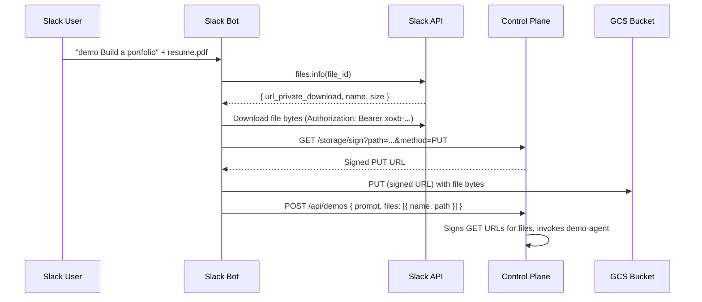

# RFC-005: Slack Bot Demo Command

**Status:** Implemented **Authors:** Agent Runtime Team **Created:** 2026-04-07

---

## Abstract

This RFC adds `demo` and `demos` commands to the Slack bot, enabling users to
create, list, update, deploy, delete, and manage demos entirely from Slack. The
commands reuse the existing demo API (`/api/demos/`) and demo-agent
infrastructure. File attachments sent in Slack messages are uploaded to GCS and
forwarded to the demo agent, matching the web client's upload flow. Status
feedback is delivered via in-thread message updates as the demo agent works.

---

## Table of Contents

1. [Motivation](#1-motivation)
2. [Commands](#2-commands)
3. [Demo Lifecycle via Slack](#3-demo-lifecycle-via-slack)
4. [File Attachment Handling](#4-file-attachment-handling)
5. [Status Feedback and Progress](#5-status-feedback-and-progress)
6. [Visibility Control](#6-visibility-control)
7. [Implementation Plan](#7-implementation-plan)
8. [Control Plane Changes](#8-control-plane-changes)
9. [Slack Bot Changes](#9-slack-bot-changes)
10. [Security Considerations](#10-security-considerations)

---

## 1. Motivation

The web dashboard provides a full demo creation and management experience, but
users who primarily interact through Slack must context-switch to the browser to
create or iterate on demos. The demo agent already handles the heavy lifting
(code generation, scaffolding, deployment) — the Slack bot just needs a thin
command layer that translates Slack interactions into the existing demo API
calls.

This aligns with RFC-002's principle: the Slack bot is a stateless translation
layer over the control plane's HTTP API.

---

## 2. Commands

### New Commands

| Command                                    | Description                                                 |
| ------------------------------------------ | ----------------------------------------------------------- |
| `demo {prompt}`                            | Create, deploy, and return a live URL for a new demo        |
| `demo {name} {feedback}`                   | Update an existing demo by name with follow-up instructions |
| `demos`                                    | List your demos with status, visibility, and URLs           |
| `demo deploy {name}`                       | Redeploy a stopped demo to a live URL                       |
| `demo stop {name}`                         | Stop a running demo                                         |
| `demo delete {name}`                       | Delete a demo and all its storage                           |
| `demo visibility {name} {public\|private}` | Change a demo's visibility                                  |
| `demo download {name}`                     | Get a link to download the source from the web dashboard    |

All commands work as both `/ar demo ...` slash commands and DM messages.

### Updated Help Output

```
Available Commands
Slash command: /ar {command}

/ar help — Show this help message
/ar settings — Configure your bot preferences
/ar run {agent} {input} — Run an agent
/ar create-agent {prompt} — Create a private agent
/ar list — List your accessible agents
/ar status — Show your account and bot status
/ar demo {prompt} — Create or update a demo
/ar demos — List your demos with status and URLs

In DMs, you can also type commands without /ar:
help, list, demos, status, settings
Or just send a message to run your default agent.
```

---

## 3. Demo Lifecycle via Slack

### Creating a Demo

```
User: demo Build a landing page for a coffee shop called Bean Scene
Bot:  👀 (reaction)
Bot:  ┌─ Creating Demo ─────────────────────────────┐
      │ ⏳ Validating... bean-scene                  │
      └──────────────────────────────────────────────┘
Bot:  (updates in place)
      ┌─ Creating Demo ─────────────────────────────┐
      │ 🔨 Agent is generating the demo...           │
      └──────────────────────────────────────────────┘
Bot:  (updates in place)
      ┌─ Demo Created ──────────────────────────────┐
      │ Name:       bean-scene                       │
      │ Status:     created                          │
      │ Visibility: private                          │
      │ Summary:    A landing page for Bean Scene... │
      │                                              │
      │ [Deploy]  [Delete]                           │
      └──────────────────────────────────────────────┘
```

The bot calls `POST /api/demos` with the user's prompt. The SSE phases
(`validating`, `resolving`, `building`, `saving`, `done`) map to in-thread
status updates via `chat.update`.

### Updating a Demo

Users reference an existing demo by name as the first argument:

```
User: demo bean-scene Make the hero section darker and add a menu section
Bot:  ┌─ Updating Demo ─────────────────────────────┐
      │ 🔨 Agent is applying your feedback...        │
      └──────────────────────────────────────────────┘
Bot:  (final)
      ┌─ Demo Updated ──────────────────────────────┐
      │ Name:       bean-scene                       │
      │ Status:     running (auto-redeployed)        │
      │ URL:        https://demo-prod-bean-scene-... │
      │                                              │
      │ [Stop]  [Delete]                             │
      └──────────────────────────────────────────────┘
```

The bot calls `POST /api/demos/:name/update`. If the demo was previously
running, the API auto-redeploys it.

### Disambiguation

When the first argument to `demo` matches an existing demo name, the bot treats
the rest as update feedback. Otherwise it creates a new demo. The resolution
logic:

1. Parse first token as potential demo name (`slugify(firstToken)`)
2. Call `GET /api/demos/:name` to check if it exists
3. If it exists: treat remaining text as update prompt, call
   `/api/demos/:name/update`
4. If it doesn't exist: treat entire text as creation prompt, call
   `POST /api/demos`

### Listing Demos

```
User: demos
Bot:  ┌─ Your Demos ────────────────────────────────┐
      │                                              │
      │ ● bean-scene (running, private)              │
      │   https://demo-prod-bean-scene-xxx.run.app   │
      │                                              │
      │ ○ portfolio (created, public)                │
      │   Not deployed                               │
      │                                              │
      │ ○ api-docs (stopped, private)                │
      │   Not deployed                               │
      │                                              │
      └──────────────────────────────────────────────┘
```

Calls `GET /api/demos`.

### Deploy / Stop / Delete

```
User: demo deploy bean-scene
Bot:  ┌─ Deploying Demo ────────────────────────────┐
      │ ⏳ Deploying bean-scene...                   │
      └──────────────────────────────────────────────┘
Bot:  (final)
      ┌─ Demo Deployed ─────────────────────────────┐
      │ Name: bean-scene                             │
      │ URL:  https://demo-prod-bean-scene-xxx...    │
      │ Visibility: private                          │
      │                                              │
      │ [Stop]  [Delete]                             │
      └──────────────────────────────────────────────┘
```

Deploy calls `POST /api/demos/:name/deploy`. Stop calls
`POST /api/demos/:name/stop`. Delete calls `DELETE /api/demos/:name`.

Each action posts a status message first, then updates it on completion.

### Visibility

```
User: demo visibility bean-scene public
Bot:  ✅ bean-scene is now public.
```

This redeploys with the new visibility by calling
`POST /api/demos/:name/deploy` with `{ visibility: 'public' }`.

### Download

```
User: demo download bean-scene
Bot:  To download the source code for bean-scene, visit:
      https://ar-control-plane-xxx.run.app/web/demos
```

The Slack bot does not serve file downloads directly. It links users to the web
dashboard where the existing download-as-ZIP feature works.

---

## 4. File Attachment Handling

Slack messages can include file attachments. When a user sends a `demo` command
with attached files, the bot must forward them to the demo agent in the same
format the web client uses: `{ name, path }` references to GCS objects.

### Flow



### Implementation

1. When a Slack event has `event.files`, iterate over each file object.
2. For each file:
   - Download from `file.url_private_download` using the bot token as
     `Authorization: Bearer {SLACK_BOT_TOKEN}`.
   - Compute GCS path:
     `{tenantId}/demos/attachments/{timestamp}/{file.name}`.
   - Request a signed PUT URL from
     `GET /storage/sign?path={gcsPath}&method=PUT&contentType={file.mimetype}`.
   - Upload the file bytes to the signed URL.
3. Include `files: [{ name, path }]` in the demo create/update API call.

### Constraints

- Maximum total upload size: **50 MB** (matching the web client).
- The bot validates total size before uploading and returns an error if
  exceeded.
- Slack's own file size limits apply upstream (varies by workspace plan).

---

## 5. Status Feedback and Progress

The demo agent takes 30–120 seconds to generate a demo. During this time the
bot must provide feedback so the user knows work is happening.

### SSE-to-Slack Mapping

The demo API supports SSE via `Accept: text/event-stream`. The bot consumes
this stream and maps phases to Slack message updates:

| SSE Phase    | Slack Status Update                             |
| ------------ | ----------------------------------------------- |
| `validating` | `:hourglass_flowing_sand: Validating... {slug}` |
| `resolving`  | `:mag: Looking for demo-agent...`               |
| `building`   | `:hammer: Agent is generating the demo...`      |
| `saving`     | `:floppy_disk: Storing demo metadata...`        |
| `deploying`  | `:rocket: Redeploying live demo...`             |
| `done`       | Final result card with demo details             |
| `error`      | `:exclamation: {error message}`                 |

Each phase update calls `client.chat.update` on the same status message,
replacing the previous content. This avoids spamming the thread with multiple
messages and provides a clean progress experience.

### Non-SSE Fallback

If the SSE connection fails or the API doesn't support streaming for a
particular call (deploy, stop, delete), the bot posts a "working..." message
and updates it when the HTTP response completes.

---

## 6. Visibility Control

### On Creation

Demos created via Slack default to **private**. Users can specify visibility
inline:

```
demo --public Build a landing page for Bean Scene
demo --private Build an internal dashboard
```

The `--public` / `--private` flag is parsed from the prompt before sending it
to the API. If omitted, defaults to `private`.

### Changing After Creation

```
demo visibility {name} public
demo visibility {name} private
```

This calls `POST /api/demos/:name/deploy` with the new visibility. If the demo
is not currently running, it deploys it with the requested visibility. If it is
running, it redeploys with the updated IAM policy.

### Visibility in Listings

The `demos` command shows visibility as a badge next to each demo name:
`(running, private)` or `(created, public)`.

---

## 7. Implementation Plan

### Phase 1: Core Commands (demo, demos)

New files:

```
control-plane/src/bots/slack/commands/demo.ts      # demo command handler
control-plane/src/bots/slack/commands/demos.ts      # demos list command
```

Changes to existing files:

| File               | Change                                                         |
| ------------------ | -------------------------------------------------------------- |
| `dispatch.ts`      | Add `demo` and `demos` to `COMMANDS` map and `dispatch` switch |
| `commands/help.ts` | Add demo/demos to help text                                    |

### Phase 2: File Attachments

Changes to existing files:

| File                | Change                                                                      |
| ------------------- | --------------------------------------------------------------------------- |
| `commands/demo.ts`  | Parse `event.files`, download from Slack, upload to GCS via signed URLs     |
| `dispatch.ts`       | Pass `files` array from the Slack event through to the demo command handler |
| `events/message.ts` | Forward `event.files` to `routeCommand`                                     |
| `events/mention.ts` | Forward `event.files` to `routeCommand`                                     |

The `routeCommand` and `dispatch` signatures need a new optional `files`
parameter to thread Slack file metadata through to the demo command.

### Phase 3: Interactive Actions

New action handlers in `actions/handlers.ts`:

| Action ID     | Trigger                       | Behavior                             |
| ------------- | ----------------------------- | ------------------------------------ |
| `demo_deploy` | "Deploy" button on demo card  | Calls `POST /api/demos/:name/deploy` |
| `demo_stop`   | "Stop" button on running demo | Calls `POST /api/demos/:name/stop`   |
| `demo_delete` | "Delete" button on demo card  | Calls `DELETE /api/demos/:name`      |

Button values encode `{ name, tenantId }` as JSON, same pattern as the
existing `create_agent_submit` action.

---

## 8. Control Plane Changes

### Storage Sign Endpoint

The existing `GET /storage/sign` endpoint is already available and supports
`method=PUT` for uploads. No changes needed — the bot authenticates via the
`slackBotAuth` cookie path (session cookie) or the service account path
(Bearer token). Since the bot's demo command runs in the context of the Slack
event handler (not an HTTP request with cookies), the bot must call the control
plane's storage sign endpoint using its service account identity.

The `/storage/sign` endpoint is behind `apiAuth`, which currently skips
`/api/bots/` paths. The bot needs to call `/storage/sign` (not under
`/api/bots/`), so it must authenticate via the standard `apiAuth` path using
its service account Bearer token. This already works because `apiAuth` accepts
Bearer tokens via `verifyToken`.

### Demo API Tenant Scoping

All demo API endpoints already scope operations to `tenantId` and `email` from
the request context. The bot's demo commands will call these endpoints through
the control plane's HTTP API using the authenticated user's identity, so
ownership and visibility are enforced by the existing demo routes.

No new API endpoints are needed. The bot calls:

- `GET /api/demos` — list
- `GET /api/demos/:name` — check existence (for create vs update disambiguation)
- `POST /api/demos` — create (with `Accept: text/event-stream`)
- `POST /api/demos/:name/update` — update (with `Accept: text/event-stream`)
- `POST /api/demos/:name/deploy` — deploy (with optional `{ visibility }`)
- `POST /api/demos/:name/stop` — stop
- `DELETE /api/demos/:name` — delete
- `GET /storage/sign` — sign URLs for file upload

---

## 9. Slack Bot Changes

### Command Parser Updates (`dispatch.ts`)

Add `demo` and `demos` to the `COMMANDS` map. The `demo` command is routed to
`commands/demo.ts` with the full argument string. The `demos` command (no args)
is routed to `commands/demos.ts`.

### File Threading

The `routeCommand` function signature and the `dispatch` function must accept
an optional `files` parameter. Event handlers (`message.ts`, `mention.ts`) pass
`event.files` through when present.

```typescript
type SlackFile = {
  id: string
  name: string
  mimetype: string
  size: number
  url_private_download: string
}
```

The demo command handler receives these, downloads them from Slack's CDN, and
uploads them to GCS before calling the demo API.

### Demo Command Handler (`commands/demo.ts`)

The handler parses the subcommand from the argument string:

| Pattern                              | Action                        |
| ------------------------------------ | ----------------------------- |
| `deploy {name}`                      | Deploy                        |
| `stop {name}`                        | Stop                          |
| `delete {name}`                      | Delete                        |
| `visibility {name} {value}`          | Change visibility             |
| `download {name}`                    | Show web link                 |
| `{name} {feedback...}` (name exists) | Update                        |
| `{prompt...}` (no match)             | Create                        |
| `--public {prompt...}`               | Create with public visibility |

The handler posts an initial status message using `buildResponse`, then
consumes the SSE stream (for create/update) or awaits the HTTP response (for
deploy/stop/delete), updating the message at each phase.

### Demos List Handler (`commands/demos.ts`)

Fetches `GET /api/demos` and formats the response using `buildResponse` with a
body of section blocks, one per demo, showing name, status, visibility, and URL.

---

## 10. Security Considerations

### File Downloads from Slack

The bot downloads files from Slack's CDN using the bot token. These files are
then uploaded to GCS under the user's demo attachments prefix
(`{tenantId}/demos/attachments/...`). The files are scoped to the user's tenant
and only accessible via signed URLs.

### Visibility and Ownership

- Demos created via Slack are owned by the authenticated user (resolved via
  `slackBotAuth`).
- Visibility defaults to `private`. Public demos are accessible to anyone with
  the URL.
- Only the demo owner can update, deploy, stop, delete, or change visibility.
- The demo API enforces all of these constraints — the bot is just a client.

### Demo Deletion

The `demo delete` command is destructive and immediate. The bot should confirm
before deleting:

```
User: demo delete bean-scene
Bot:  Are you sure you want to delete bean-scene? This cannot be undone.
      [Delete]  [Cancel]
```

The delete button triggers the `demo_delete` action handler.
