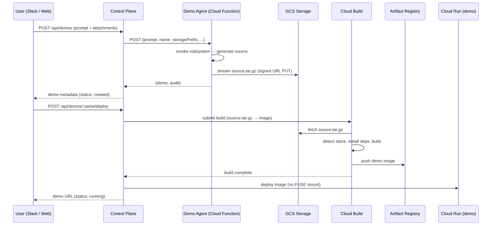
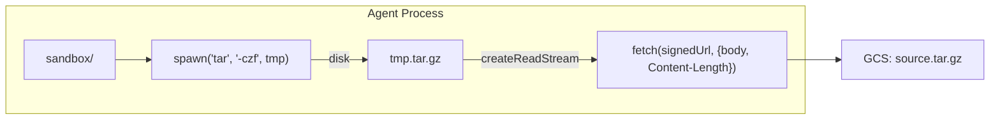

# RFC-007: Demo Serve Architecture

**Status:** Draft
**Authors:** Agent Runtime Team
**Created:** 2026-04-08
**Updated:** 2026-04-08
**Depends on:** RFC-004 (container images, GCS FUSE, signed URLs)

---

## Abstract

Deployed demos currently run from a GCS FUSE volume mount: the demo Cloud Run
service mounts the registry bucket at `/registry/` and executes directly from
the uploaded source tree. This works for small vanilla JavaScript apps but
breaks down as demos grow in complexity:

1. **FUSE + `node_modules`** — Node's module resolution performs thousands of
   small stat/read calls. On a FUSE-backed filesystem, each is a GCS metadata or
   data operation with network latency. Cold starts become unpredictable and
   request-path I/O is measurably slower than local disk.

2. **No build step** — The platform assumes the uploaded source is directly
   runnable. If the agent generates TypeScript, JSX, SCSS, or any other language
   that requires compilation, the demo fails at runtime. There is no
   `npm install`, no `tsc`, no bundler in the deploy path.

3. **Memory constraints** — Demo Cloud Run instances are allocated 512Mi. A
   naive "download everything to `/tmp`" approach risks OOM on large projects.
   The agent Cloud Function (2Gi) and control plane Cloud Run (1Gi) similarly
   cannot afford to buffer entire project trees in memory.

This RFC replaces the FUSE-based serve path with a **build-then-serve**
architecture that is agnostic to the technology stack the agent produces.
Demos are archived as tarballs, built in an isolated Cloud Build step, and
served from a purpose-built container image where all files are on local disk.

---

## Table of Contents

1. [Motivation](#1-motivation)
2. [Design Principles](#2-design-principles)
3. [Architecture Overview](#3-architecture-overview)
4. [Agent Upload Path (Source Archive)](#4-agent-upload-path-source-archive)
5. [Build Step (Cloud Build)](#5-build-step-cloud-build)
6. [Serve Image (Cloud Run)](#6-serve-image-cloud-run)
7. [Memory Budget](#7-memory-budget)
8. [Streaming Archive Upload](#8-streaming-archive-upload)
9. [Prompt Template Changes](#9-prompt-template-changes)
10. [Control Plane Deploy Changes](#10-control-plane-deploy-changes)
11. [Cutover](#11-cutover)
12. [Security](#12-security)
13. [Observability](#13-observability)
14. [Implementation Plan](#14-implementation-plan)
15. [Appendix A: Codebase Bugs & Cleanup](#appendix-a-codebase-bugs--cleanup)

---

## 1. Motivation

### 1.1 FUSE is wrong for app source trees

GCS FUSE is designed for workloads that read a modest number of files with
infrequent access — exactly the pattern for rules and skills (a handful of
small markdown files read once at startup). Demo source trees are the opposite:

- A minimal React + Express app has ~800 files in `node_modules` alone.
- Node's `require()` does cascading stat calls up the directory tree for every
  module resolution. On FUSE, each stat is a GCS metadata RPC (~5–20ms).
- Cold start becomes I/O-bound: a 50-file `node_modules` adds 1–4 seconds of
  pure stat overhead; a realistic 800-file tree adds 15–60 seconds.
- FUSE's stat cache (60s TTL, 32MB max) helps on warm instances but does not
  help cold starts — the cache is empty when the instance boots.

### 1.2 No build step means no TypeScript, no bundlers, no package managers

The current deploy path checks for `server.js` or `dist/index.html` in the
GCS object listing and picks a container image accordingly. There is no step
that runs `npm install`, `tsc`, `vite build`, or any other build command.

This means:

- If the agent writes TypeScript files, the demo fails with a syntax error at
  runtime (`SyntaxError: Cannot use import statement outside a module` or
  `SyntaxError: Unexpected token ':'`).
- If the agent writes a `package.json` with dependencies, those dependencies
  are never installed. `require('express')` fails with `MODULE_NOT_FOUND`.
- If the agent uses a framework like Next.js, Vite, or Astro that requires a
  build, the output is never generated.

The prompt template tells the agent to prefer "pre-built scaffolding" but does
not constrain the output to vanilla JS. As models improve, they naturally reach
for TypeScript, modern frameworks, and npm packages — all of which silently
break in the current architecture.

### 1.3 Memory constraints are real

| Component                   | Memory limit | Role in demo lifecycle          |
| --------------------------- | ------------ | ------------------------------- |
| Demo agent (Cloud Function) | 2Gi          | Generates source, pushes to GCS |
| Control plane (Cloud Run)   | 1Gi          | Orchestrates deploy             |
| Demo service (Cloud Run)    | 512Mi        | Serves the running demo         |

> **Note:** `agent.json` declares `"memory": "4Gi"` but `runSourceDeploy` in
> `agents.ts` hardcodes `memory: '2Gi'` — the manifest value is never read
> during deploy. This is a pre-existing bug documented in
> [Appendix A](#appendix-a-codebase-bugs--cleanup).

The agent already uses most of its 2Gi for the subsystem process. The control
plane handles concurrent requests. The demo service has 512Mi total. Any
solution that buffers full project trees in application memory (rather than
streaming to disk or delegating to Cloud Build) risks OOM at every tier.

---

## 2. Design Principles

1. **Stack-agnostic** — The platform must not assume JavaScript, TypeScript, or
   any specific framework. If the agent writes a `Makefile`, a `Dockerfile`, a
   `package.json`, or a `deno.json`, the platform should detect and handle it.

2. **Build in isolation** — Compilation, dependency installation, and bundling
   happen in a throwaway Cloud Build step with generous resources, not in the
   agent, control plane, or demo service.

3. **Serve from local disk** — The demo service runs from a container image
   where all files are baked into the filesystem. No FUSE, no runtime downloads,
   no signed-URL fetches on the request path.

4. **Stream, never buffer** — Uploads and downloads use streaming I/O. No
   component holds an entire project tree in memory at once.

5. **Fail early with clear errors** — If the build step fails (bad
   `package.json`, TypeScript errors, missing dependency), the user gets the
   build log, not a cryptic runtime crash.

6. **Backward-compatible** — Existing vanilla JS demos (no `package.json`, no
   build step) continue to work without changes.

---

## 3. Architecture Overview



> **Note on deploy trigger:** Today the HTTP API (`POST /`) creates the demo
> but does **not** deploy it — the client must call `POST /:name/deploy`
> separately. The Slack bot calls both `invokeAgent` and `deployContainer`
> inline. This RFC does not change that split; it replaces what happens inside
> the deploy step. A future RFC may unify create-and-deploy into a single call.

The key change: a **Cloud Build step** sits between source upload and Cloud Run
deploy. The build step produces a **self-contained container image** that Cloud
Run serves directly from its overlay filesystem.

---

## 4. Agent Upload Path (Source Archive)

### Current behavior

`AgentStorage.pushRaw` walks the sandbox directory and uploads each file
individually via signed URL PUT. Every file is read with `utf-8` encoding
(binary files like images are corrupted). For a 200-file project, this is 200
sequential HTTP PUTs.

### New behavior

The agent archives the sandbox into a single `source.tar.gz` and uploads it
with one signed URL PUT. This:

- Eliminates the N-request upload overhead
- Preserves binary files (images, fonts, wasm) without encoding issues
- Produces a single GCS object that Cloud Build can fetch directly
- Reduces memory: `tar` streams from disk — no need to hold the tree in RAM

### GCS layout

```
gs://{project}-ar-registry/
  {tenantId}/
    demos/
      {userId}/
        {slug}/
          source.tar.gz        ← new: single archive
          demo.json            ← metadata (unchanged)
```

The per-file `source/` prefix is retired for new demos. Existing demos with
the old layout continue to work during the migration window (see section 11).

### Implementation: `pushArchive`

A new method on `AgentStorage` that creates a tar.gz archive from a directory
and uploads it via signed URL. Because GCS signed URL PUTs require a
`Content-Length` header (chunked transfer encoding is not supported), the
archive is written to a temp file first, then uploaded as a known-size body:

```javascript
async pushArchive(localDir, remotePath) {
  const tmp = path.join(os.tmpdir(), `ar-${Date.now()}.tar.gz`)
  try {
    const pack = spawn('tar', ['-czf', tmp, '-C', localDir, '.'])
    await new Promise((resolve, reject) => {
      pack.on('close', (code) =>
        code === 0 ? resolve() : reject(new Error(`tar exited ${code}`)))
      pack.on('error', reject)
    })

    const url = await this.sign(remotePath, 'PUT', 'application/gzip')
    const stat = fs.statSync(tmp)
    const body = fs.createReadStream(tmp)
    const res = await fetch(url, {
      method: 'PUT',
      headers: {
        'Content-Type': 'application/gzip',
        'Content-Length': String(stat.size),
      },
      body,
      duplex: 'half',
    })
    if (!res.ok) throw new Error(`Upload failed: ${res.status}`)
  } finally {
    fs.unlinkSync(tmp)
  }
}
```

> **Node API note:** `duplex: 'half'` is required when passing a readable
> stream as the fetch body in Node 18+ (via undici). This is a Node-specific
> API, not part of the Fetch spec. `fs.createReadStream` returns a Node
> `Readable` which undici accepts directly.

Memory cost: **low** — `tar` writes to disk, `fetch` streams the file to GCS.
The temp file adds transient disk usage (~size of compressed archive) but no
in-memory buffering. For a typical demo (~5–20MB compressed), this is well
within the agent's `/tmp` disk budget.

---

## 5. Build Step (Cloud Build)

### Why Cloud Build

Cloud Build runs in an isolated VM with configurable memory (up to 32Gi) and
disk. It can run arbitrary Docker builds, has native access to GCS and Artifact
Registry, and is already used for agent image builds (RFC-004). Demo builds
reuse the same infrastructure.

### Build strategy: detect → install → build → package

Cloud Build fetches `source.tar.gz` from GCS, extracts it, and runs a
multi-stage Docker build using a **builder Dockerfile** the control plane
generates dynamically based on what the source tree contains.

#### Stack detection

The builder inspects the extracted source for signals:

| Signal                           | Stack          | Build action                                               |
| -------------------------------- | -------------- | ---------------------------------------------------------- |
| `package.json` + `server.js`     | Node app       | `npm install --production` → serve `server.js`             |
| `package.json` + `build` script  | Node + bundler | `npm install && npm run build` → serve `dist/` or `build/` |
| `package.json` + `tsconfig.json` | TypeScript     | `npm install && npm run build` (or `tsc && node dist/`)    |
| `deno.json` or `deno.jsonc`      | Deno app       | `deno cache` → serve with `deno run`                       |
| `Dockerfile`                     | Custom         | Use the provided Dockerfile as-is                          |
| `index.html` (no `package.json`) | Static site    | Copy to nginx/file-server image                            |
| `server.js` (no `package.json`)  | Vanilla Node   | Copy to node image, run directly                           |

The detection is ordered by specificity: a `Dockerfile` always wins. If none
of the above match, the build fails with an actionable error message listing
what was found and what is expected.

#### Generated Dockerfile (Node example)

```dockerfile
FROM node:22-slim AS build
WORKDIR /app
COPY package*.json ./
RUN npm ci --production=false
COPY . .
RUN if [ -f tsconfig.json ]; then npx tsc; fi
RUN if npm run | grep -q "^  build$"; then npm run build; fi

FROM node:22-slim
WORKDIR /app
COPY --from=build /app .
RUN npm prune --production
ENV PORT=8000
EXPOSE 8000
CMD ["node", "server.js"]
```

#### Generated Dockerfile (static site example)

```dockerfile
FROM node:22-slim AS build
WORKDIR /app
COPY . .
RUN if [ -f package.json ]; then npm ci && npm run build; fi

FROM nginx:alpine
COPY --from=build /app/dist /usr/share/nginx/html
# Fall back order handled by detectAndGenerate: dist/ → build/ → public/ → .
COPY <<'NGINX' /etc/nginx/conf.d/default.conf
server {
    listen 8000;
    location / {
        root /usr/share/nginx/html;
        try_files $uri $uri/ /index.html;
    }
}
NGINX
EXPOSE 8000
CMD ["nginx", "-g", "daemon off;"]
```

Using `nginx:alpine` (~10MB compressed) instead of `denoland/deno` (~150MB)
gives faster image pulls and avoids a runtime network fetch for the file
server module. The `try_files` fallback supports client-side routing (React
Router, Vue Router, etc.).

#### Generated Dockerfile (user-provided Dockerfile)

```dockerfile
# The agent wrote its own Dockerfile — use it directly.
# Only inject PORT if not already set.
```

When the source tree contains a `Dockerfile`, Cloud Build uses it as-is. The
control plane validates that it exposes a port and sets `PORT=8000` as a
default build arg.

### Build resources

| Setting      | Value                        | Rationale                                                       |
| ------------ | ---------------------------- | --------------------------------------------------------------- |
| Machine type | `E2_HIGHCPU_8` (8 vCPU, 8Gi) | Fast `npm install` + `tsc`; same tier as agent container builds |
| Timeout      | 300s                         | Same as agent subsystem timeout                                 |
| Disk         | 100GB (default)              | Ample for `node_modules`                                        |

### Build cost

Cloud Build's free tier (120 min/day) applies only to the default
`E2_STANDARD` machine type. `E2_HIGHCPU_8` is billed at ~$0.016/min. A demo
build takes 30–90s. At 50 demos/day that's ~$12–36/month — well within a
reasonable infra budget. If cost becomes a concern, we can fall back to the
default machine type (2.5GiB RAM) which is sufficient for most builds and
qualifies for the free tier.

### Error handling

If the build fails, the control plane:

1. Fetches the Cloud Build log
2. Stores it in `demo.json` under `buildLog` (truncated to 10KB)
3. Sets `status: 'build_failed'`
4. Returns the log to the user via Slack card or web UI

---

## 6. Serve Image (Cloud Run)

### Current behavior

The demo Cloud Run service uses a stock `node:22-slim` or `denoland/deno`
image and mounts the registry bucket via FUSE. The entrypoint reads source
from `/registry/...`.

### New behavior

The demo Cloud Run service runs the **purpose-built image** from Cloud Build.
All source, dependencies, and build artifacts are baked into the image. No
FUSE mount, no runtime downloads.

```yaml
containers:
  - image: '{region}-docker.pkg.dev/{project}/ar-demos/{tenantId}/{userId}/{slug}:latest'
    ports:
      - containerPort: 8000
    resources:
      limits:
        memory: '512Mi'
        cpu: '1'
# No volumes — no FUSE mount needed
```

### Benefits

- **Cold start:** Image pull (~50–200MB compressed) is one sequential
  operation, cached across instances. No per-file stat overhead.
- **Runtime I/O:** All `require()` / `import` calls hit the container's
  overlay filesystem — local disk speed, no network.
- **Reproducibility:** The image is immutable. Restarting the service always
  serves the same code.

### Artifact Registry

Demo images live in a dedicated repository `ar-demos` (separate from
`ar-agents` to allow different retention policies). Image tags include the
user to prevent collisions when multiple users create demos with the same
slug:

```
{region}-docker.pkg.dev/{project}/ar-demos/{tenantId}/{userId}/{slug}:latest
{region}-docker.pkg.dev/{project}/ar-demos/{tenantId}/{userId}/{slug}:{buildId}
```

The `{buildId}` tag enables rollback. The `latest` tag always points to the
most recent successful build.

---

## 7. Memory Budget

Every component in the pipeline stays within its memory limit by streaming
data rather than buffering it.

### Agent (2Gi, mostly consumed by subsystem)

| Operation                   | Memory model                                         | Peak         |
| --------------------------- | ---------------------------------------------------- | ------------ |
| `pushArchive`               | `tar -czf` to temp file, `fetch` streams file to GCS | <10MB + disk |
| `pullArchive` (update mode) | Signed URL GET → `pipeline` → `tar -xzf`             | <10MB        |

The agent never holds the full project tree in Node memory. `tar` runs as a
child process with its own memory space. `pushArchive` writes to a temp file
(disk, not RAM) and streams it to GCS. `pullArchive` uses `pipeline` for
backpressure-safe streaming from HTTP to tar's stdin.

### Control plane (1Gi)

| Operation          | Memory model                                 | Peak  |
| ------------------ | -------------------------------------------- | ----- |
| Submit Cloud Build | JSON payload with GCS paths, no file content | <1MB  |
| Poll build status  | Periodic GET, small JSON response            | <1MB  |
| Store build log    | Truncated to 10KB                            | <10KB |

The control plane never touches demo source bytes. It passes GCS paths to
Cloud Build and receives image URIs back.

### Demo service (512Mi)

| Operation      | Memory model                          | Peak          |
| -------------- | ------------------------------------- | ------------- |
| Serve requests | Files on local overlay FS, no GCS I/O | App-dependent |

The demo service's memory is entirely available for the application. No FUSE
cache overhead (~37MB savings vs current).

### Cloud Build (8Gi)

Cloud Build has ample memory for `npm install`, `tsc`, and bundler runs. This
is the only component that holds the full dependency tree in memory, and it is
ephemeral — it exists only during the build.

---

## 8. Streaming Archive Upload

The current `pushRaw` method reads every file as `utf-8` strings, corrupting
binary content. The new archive path must handle arbitrary file types.

### Upload (agent → GCS)



Memory in the Node process: **~64KB** — the read stream buffer. The temp file
adds transient disk usage but avoids the `Content-Length` problem with GCS
signed URL PUTs (which reject chunked transfer encoding). The temp file is
deleted after upload.

### Download (Cloud Build ← GCS)

Cloud Build fetches `source.tar.gz` via `storageSource` and automatically
extracts it into `/workspace/`. The source files are immediately available —
no manual `gsutil cp` or `tar` extraction step is needed:

```yaml
source:
  storageSource:
    bucket: '{bucket}'
    object: '{path}/source.tar.gz'
steps:
  - name: 'gcr.io/cloud-builders/docker'
    args: ['build', '-t', '{image}', '/workspace']
```

### Download for updates (GCS → agent sandbox)

When updating an existing demo, the agent needs to stage the prior source.
Currently this uses `pullRaw` (N sequential signed-URL GETs). The new path
downloads and extracts the single tarball:

```javascript
async pullArchive(remotePath, localDir) {
  const { pipeline } = require('stream/promises')
  const url = await this.sign(remotePath, 'GET')
  fs.mkdirSync(localDir, { recursive: true })
  const res = await fetch(url)
  if (!res.ok) throw new Error(`Download failed: ${res.status}`)
  const proc = spawn('tar', ['-xzf', '-', '-C', localDir], {
    stdio: ['pipe', 'ignore', 'pipe'],
  })
  const { Readable } = require('stream')
  await pipeline(Readable.fromWeb(res.body), proc.stdin)
  await new Promise((resolve, reject) => {
    proc.on('close', (code) =>
      code === 0 ? resolve() : reject(new Error(`tar exited ${code}`)))
    proc.on('error', reject)
  })
}
```

Using `pipeline` from `stream/promises` handles backpressure automatically —
if `tar` can't consume as fast as the network delivers, the HTTP stream pauses
rather than buffering unboundedly in Node memory. The exit code check ensures
corrupt archives or disk errors surface as exceptions rather than silent
failures.

Memory: **constant** — `pipeline` manages flow control via the pipe buffer
(~64KB).

---

## 9. Prompt Template Changes

The prompt template must be updated to produce apps that are buildable, not
just runnable-as-is. Key changes:

### Require a `package.json` for Node projects

The current template says nothing about `package.json`. The agent sometimes
generates one, sometimes doesn't. With a build step, `package.json` becomes
the canonical signal for "this is a Node project."

### Allow TypeScript

With `npm install && tsc` in the build step, the agent can generate TypeScript
freely. The template should encourage it when appropriate:

```markdown
<constraints>
...
- If the project uses npm packages, include a complete package.json with all
  dependencies. The platform will run `npm install` during deploy.
- TypeScript is supported. Include a tsconfig.json if using TypeScript. The
  platform will compile it during deploy.
- If the project needs a build step (e.g., Vite, Webpack, esbuild), define it
  as the `build` script in package.json. The platform will run `npm run build`
  during deploy.
- For a static website with no server, ensure the built output lands in `dist/`
  or `public/`.
- For a server application, ensure the entrypoint is `server.js` (or
  `dist/server.js` after build) and it reads `PORT` from the environment
  (default 8000) and binds to 0.0.0.0.
- If you need full control over the container, include a Dockerfile. The
  platform will use it as-is.
- Always include an `ar-build.json` in the project root declaring the stack
  type. Examples: `{"type":"node","entrypoint":"server.js","build":true}` or
  `{"type":"static","outputDir":"dist"}`. This tells the platform how to
  build and serve the project.
...
</constraints>
```

### Describe the deploy model

The agent should understand that its output goes through a build pipeline, not
directly to a running server:

```markdown
<deploy_model>
Your code will be deployed as follows:

1. All files you write to the sandbox are archived and uploaded.
2. A build step runs: npm install, TypeScript compilation, and any `build`
   script in package.json.
3. The built output is packaged into a container image and deployed to Cloud
   Run.
4. The container starts with `node server.js` (server mode) or serves static
   files from `dist/` or `public/` (static mode).

You do NOT need to worry about installing dependencies or compiling TypeScript
at runtime. Write your code as if it will be built before serving.
</deploy_model>
```

---

## 10. Control Plane Deploy Changes

### `deployContainer` rewrite

The function currently constructs a Cloud Run service spec with FUSE volumes
and stock images. It is replaced with a two-phase flow:

**Phase 1: Build**

```typescript
async function buildDemo(
  cfg: GcpConfig,
  tenantId: string,
  userId: string,
  slug: string,
): Promise<string> {
  const bucket = `${cfg.project}-ar-registry`
  const sourcePath = `${tenantId}/demos/${userId}/${slug}/source.tar.gz`
  const image = demoImage(cfg, tenantId, userId, slug)

  const buildId = await platform.cloudBuildSubmit({
    project: cfg.project,
    source: { bucket, object: sourcePath },
    steps: [
      {
        name: 'bash',
        entrypoint: 'bash',
        args: ['-c', detectStackScript()],
      },
      {
        name: 'bash',
        entrypoint: 'bash',
        args: ['-c', generateDockerfileScript()],
      },
      {
        name: 'gcr.io/cloud-builders/docker',
        args: ['build', '-t', image, '/workspace'],
      },
    ],
    images: [image],
    timeout: '300s',
  })

  await platform.waitForBuild(cfg.project, buildId)
  return image
}
```

Cloud Build's `storageSource` automatically extracts `source.tar.gz` into
`/workspace/` before any steps run. Two shell helpers then run as build steps:

- `detectStackScript()` — reads `ar-build.json` from `/workspace/` or runs
  heuristic detection, and writes `build-config.json` to `/workspace/`.
- `generateDockerfileScript()` — reads `/workspace/build-config.json` and
  writes the appropriate `Dockerfile` into `/workspace/` (unless one already
  exists for `type: "custom"`).

All detection and Dockerfile generation happens inside Cloud Build, not on
the control plane.

**Phase 2: Deploy**

```typescript
async function deployDemo(
  cfg: GcpConfig,
  tenantId: string,
  userId: string,
  slug: string,
  image: string,
): Promise<string> {
  const svc = serviceName(tenantId, userId, slug)

  const serviceBody = {
    template: {
      containers: [{
        image,
        ports: [{ containerPort: 8000 }],
        resources: { limits: { memory: '512Mi', cpu: '1' } },
        env: [{ name: 'DEMO_NAME', value: slug }],
      }],
      scaling: { minInstanceCount: 0, maxInstanceCount: 1 },
      serviceAccount: cfg.runtimeAccount,
    },
    ingress: 'INGRESS_TRAFFIC_ALL',
  }

  // create-or-update Cloud Run service (same pattern as today)
  // ...

  return serviceUri
}
```

### `detectAndGenerate`

Stack detection runs as the **first Cloud Build step** — Cloud Build extracts
the tarball and inspects its contents. This avoids downloading or parsing the
archive on the control plane (which would add memory pressure and latency to
the 1Gi CP).

The primary strategy is an **`ar-build.json` manifest** the agent includes in
the sandbox root. This is explicit, cheap to parse, and gives the agent full
control. The prompt template (section 9) instructs the agent to produce it.

```json
{
  "type": "node",
  "entrypoint": "server.js",
  "build": true
}
```

Or for static:

```json
{
  "type": "static",
  "outputDir": "dist"
}
```

If `ar-build.json` is absent, the build step falls back to **heuristic
detection** by running `ls` in the extracted source and matching against the
table in section 5. This handles legacy demos and demos from agents that
don't produce the manifest. The detection script is a small shell block in
the first Cloud Build step:

```yaml
steps:
  - name: 'bash'
    entrypoint: 'bash'
    args:
      - '-c'
      - |
          cd /workspace
          if [ -f ar-build.json ]; then
            cp ar-build.json build-config.json
          else
            if [ -f Dockerfile ]; then
              echo '{"type":"custom"}' > build-config.json
            elif [ -f package.json ]; then
              echo '{"type":"node"}' > build-config.json
            elif [ -f deno.json ] || [ -f deno.jsonc ]; then
              echo '{"type":"deno"}' > build-config.json
            elif [ -f index.html ]; then
              echo '{"type":"static","outputDir":"."}' > build-config.json
            elif [ -f server.js ]; then
              echo '{"type":"node","entrypoint":"server.js"}' > build-config.json
            else
              echo '{"type":"unknown"}' > build-config.json
            fi
          fi
```

Cloud Build's `storageSource` extracts `source.tar.gz` into `/workspace/`
before any steps run — no manual tar extraction is needed. The detection step
inspects `/workspace/` directly and writes `build-config.json` alongside the
source. A subsequent step reads this config and generates the appropriate
`Dockerfile` into `/workspace/` before the `docker build` step runs. Because
all detection and Dockerfile generation happens inside Cloud Build, the CP
never downloads or parses the archive itself.

### Artifact Registry repository

On first demo build, the control plane creates `ar-demos`:

```
gcloud artifacts repositories create ar-demos \
  --repository-format=docker \
  --location={region} \
  --project={project}
```

---

## 11. Cutover

The demo system is not yet in production. The old FUSE-based code is replaced
outright — no migration path, feature flag, or dual-path fallback is needed.
Any existing test demos in GCS with the old `source/` per-file layout can be
recreated after the cutover.

---

## 12. Security

### Source archive

- Archives are uploaded to the same GCS bucket with the same IAM controls.
- Signed URLs have a 5-minute TTL (same as current `pushRaw`).
- Archives are scoped to `{tenantId}/demos/{userId}/{slug}/` — no cross-tenant
  access.

### Cloud Build

- Runs in the project's Cloud Build service account with minimal permissions.
- Cloud Build has full network access by default (required for `npm install`
  to fetch packages from the npm registry). To restrict egress in the future,
  use a private pool with VPC network controls — this is not required for the
  initial implementation.
- Build logs are retained for audit.

### Container images

- Images are stored in Artifact Registry with the same IAM as agent images.
- Cloud Run pulls images with the worker service account
  (`roles/artifactregistry.reader`).
- Images are immutable once built. Updates create new tags.

### Demo service

- No FUSE mount means no `roles/storage.objectViewer` needed on the worker
  service account for demo services (reduced blast radius).
- The demo service runs with the same service account and IAM as today.

---

## 13. Observability

### Build phase

- Cloud Build logs are accessible via `gcloud builds log {id}` and the CP API
  (`GET /api/artifacts/builds/:id/logs`).
- Build duration, success/failure, and image size are recorded in `demo.json`.
- Failed builds surface the log to the user.

### Serve phase

- Cloud Run logs (same as today).
- Cold start times should improve measurably — track via Cloud Run metrics
  (`container/startup_latency`).

### Metrics to track

| Metric                   | Current (FUSE)     | Expected (image) |
| ------------------------ | ------------------ | ---------------- |
| Cold start (vanilla JS)  | 2–8s               | 1–3s             |
| Cold start (50-dep Node) | 15–60s             | 1–3s             |
| Build time               | N/A                | 30–90s           |
| Deploy time (total)      | 10–30s             | 60–120s          |
| Runtime memory overhead  | ~37MB (FUSE cache) | 0                |

Total deploy time increases (build step added) but runtime performance and
reliability improve significantly. The tradeoff is favorable: deploys are
infrequent, requests are continuous.

---

## 14. Implementation Plan

### Phase 0: Pre-requisite bug fixes (see Appendix A)

These are existing bugs that must be fixed before or alongside Phase 1. They
can ship as a separate cleanup PR.

| Step | File(s)                                             | Change                                                                                                   | Appendix      |
| ---- | --------------------------------------------------- | -------------------------------------------------------------------------------------------------------- | ------------- |
| 0a   | `sdk-agent-nodejs/src/storage.ts`                   | Add `node_modules`/`.git`/`.env` exclusion to `walkDir`                                                  | A.6           |
| 0b   | `sdk-agent-nodejs/src/storage.ts`                   | Fix `readRaw`/`pullRaw` to use `arrayBuffer()` + `Buffer` for binary-safe I/O                            | A.1           |
| 0c   | `default-registry/agents/demo-agent/0.0.1/index.js` | Switch from `pull`/`list` to `pullRaw`/`listRaw`; add `writeRaw` for `demo.json`; remove `process.chdir` | A.2, A.4, A.5 |
| 0d   | `sdk-client-deno/src/templates/agent-demo.ts`       | Remove `version` reference in audit log                                                                  | A.3           |

### Phase 1: Archive upload + build pipeline

| Step | File(s)                                             | Change                                                                                                                                                                     |
| ---- | --------------------------------------------------- | -------------------------------------------------------------------------------------------------------------------------------------------------------------------------- |
| 1a   | `sdk-agent-nodejs/src/storage.ts`                   | Add `pushArchive` and `pullArchive` using `tar` child process with streaming; add `--exclude node_modules` to tar                                                          |
| 1b   | `default-registry/agents/demo-agent/0.0.1/index.js` | Replace `pushRaw` with `pushArchive`; replace `pullRaw` with `pullArchive`; fix agent→CP callback to use `/deploy` not `/update` (A.11)                                    |
| 1c   | `sdk-client-deno/src/templates/agent-demo.ts`       | Update `HANDLER_TEMPLATE` to match `index.js` changes                                                                                                                      |
| 1d   | `control-plane/src/api/demos/deploy.ts`             | Add `buildDemo` function: submit Cloud Build, wait, return image URI                                                                                                       |
| 1e   | `control-plane/src/api/demos/deploy.ts`             | Replace `deployContainer`: remove FUSE volumes, stock images, `NODE_PATH`; use image from `buildDemo`; add `userId` to `serviceName` (A.12); wait for Cloud Run LRO (A.18) |
| 1f   | `sdk-client-deno/src/platform/gcp-rest.ts`          | Add `cloudBuildSubmit` and `waitForBuild` if not already present                                                                                                           |
| 1g   | `sdk-client-deno/src/operations/demos.ts`           | Rewrite `downloadSource` for archive layout; remove dead `storeFiles` (A.15)                                                                                               |
| 1h   | `control-plane/src/api/demos/routes.ts`             | Update `GET /:name/download` and `GET /:name/archive` endpoints for archive layout (A.16)                                                                                  |

### Phase 2: Stack detection + Dockerfile generation

| Step | File(s)                                                       | Change                                                                                                                                                                                                 |
| ---- | ------------------------------------------------------------- | ------------------------------------------------------------------------------------------------------------------------------------------------------------------------------------------------------ |
| 2a   | `control-plane/src/api/demos/build.ts` (new)                  | Stack detection logic: inspect archive contents, return Dockerfile string                                                                                                                              |
| 2b   | `control-plane/src/api/demos/build.ts`                        | Dockerfile templates for Node, static, Deno, and custom                                                                                                                                                |
| 2c   | `default-registry/agents/demo-agent/0.0.1/prompt-template.md` | Add deploy model description, TypeScript/build guidance, `ar-build.json`                                                                                                                               |
| 2d   | `control-plane/src/api/demos/routes.ts`                       | Add `phase: 'building'` for Cloud Build in SSE stream; surface build logs; fix missing `storagePrefix`/`subsystem` in update route (A.9); fix visibility on auto-redeploy (A.10); remove `meta!` (A.8) |
| 2e   | `control-plane/src/bots/slack/commands/demo.ts`               | Surface deploy errors in card (A.13); pass visibility through all deploy paths                                                                                                                         |
| 2f   | `control-plane/src/bots/slack/actions/handlers.ts`            | Pass `meta.visibility` to `deployContainer` in `demo_deploy` action (A.14)                                                                                                                             |

### Phase 3: Artifact Registry + image lifecycle

| Step | File(s)                                 | Change                                                       |
| ---- | --------------------------------------- | ------------------------------------------------------------ |
| 3a   | `control-plane/src/api/demos/deploy.ts` | Create `ar-demos` repository on first build                  |
| 3b   | `control-plane/src/api/demos/routes.ts` | On demo delete, also delete the image from Artifact Registry |
| 3c   | `docs/iam.md`                           | Document new roles: `artifactregistry.writer` for build SA   |

### Phase 4: Documentation + tests

| Step | File(s)                        | Change                                                           |
| ---- | ------------------------------ | ---------------------------------------------------------------- |
| 4a   | `docs/storage.md`              | Update demo section: archive path, no FUSE for demos             |
| 4b   | `docs/container-builds.md`     | Add demo build section                                           |
| 4c   | `cli/test/`                    | Tests for archive upload, stack detection, Dockerfile generation |
| 4d   | `AGENTS.md`, `CONTRIBUTING.md` | Update references to demo FUSE mounts                            |

### File inventory

| File                                                          | Action                                                                                                                                                             |
| ------------------------------------------------------------- | ------------------------------------------------------------------------------------------------------------------------------------------------------------------ |
| `sdk-agent-nodejs/src/storage.ts`                             | Add `pushArchive`, `pullArchive`; fix binary corruption in `readRaw`/`pullRaw`; add `node_modules` exclusion to `walkDir`                                          |
| `default-registry/agents/demo-agent/0.0.1/index.js`           | Replace `push`/`pull` with archive variants; fix `pull`→`pullRaw` API mismatch; remove `process.chdir`; add `writeRaw` for `demo.json`; fix deploy callback (A.11) |
| `default-registry/agents/demo-agent/0.0.1/agent.json`         | Verify `memory` value matches what `runSourceDeploy` actually uses                                                                                                 |
| `default-registry/agents/demo-agent/0.0.1/prompt-template.md` | Add deploy model description, TypeScript/build guidance, `ar-build.json`                                                                                           |
| `sdk-client-deno/src/templates/agent-demo.ts`                 | Sync handler template; fix `version` ReferenceError; align with `index.js` fixes                                                                                   |
| `control-plane/src/api/demos/deploy.ts`                       | Replace deploy: build step + image-based Cloud Run; remove FUSE code                                                                                               |
| `control-plane/src/api/demos/build.ts`                        | New: stack detection + Dockerfile generation                                                                                                                       |
| `control-plane/src/api/demos/routes.ts`                       | Add building status, build log surfacing; fix update route payload (A.9), visibility (A.10), `meta!` (A.8); update download/archive endpoints (A.16)               |
| `control-plane/src/bots/slack/commands/demo.ts`               | Surface deploy errors (A.13); pass visibility consistently                                                                                                         |
| `control-plane/src/bots/slack/actions/handlers.ts`            | Pass `meta.visibility` in `demo_deploy` action (A.14)                                                                                                              |
| `sdk-client-deno/src/operations/demos.ts`                     | Rewrite `downloadSource` for archive layout; remove dead `storeFiles` (A.15)                                                                                       |
| `sdk-client-deno/src/platform/gcp-rest.ts`                    | Add Cloud Build submit/wait (if needed)                                                                                                                            |
| `docs/storage.md`                                             | Update demo storage section                                                                                                                                        |
| `docs/container-builds.md`                                    | Add demo builds                                                                                                                                                    |
| `docs/iam.md`                                                 | Add demo build roles                                                                                                                                               |

---

## Appendix A: Codebase Bugs & Cleanup

Bugs and inconsistencies discovered during RFC review that should be fixed as
part of this work (or in a prerequisite cleanup PR).

### A.1 Binary file corruption in `AgentStorage` (bug)

**Files:** `sdk-agent-nodejs/src/storage.ts` (lines 150, 166–172, 185–186, 208)

Both `push`/`pushRaw` read files as `utf-8` strings, and `pull`/`pullRaw`
write them back as strings via `res.text()` → `fs.writeFileSync`. Any binary
content (images, fonts, wasm, sqlite) is silently corrupted on round-trip.

**Fix:** `pushArchive`/`pullArchive` inherently solve this for the new path.
The underlying `readRaw`/`writeRaw`/`pushRaw`/`pullRaw` methods should still
be fixed to use `Buffer`-based I/O (`fs.readFileSync` without encoding,
`res.arrayBuffer()` → `Buffer.from()`) since they are used by other callers
beyond the demo pipeline.

### A.2 `pull` vs `pullRaw` API mismatch in shipped agent (bug)

**Files:** `default-registry/agents/demo-agent/0.0.1/index.js` (lines 24, 67),
`sdk-client-deno/src/templates/agent-demo.ts` (lines 96, 146)

The shipped `index.js` uses `AgentStorage.instance.pull()` and `.list()` —
the **prefixed** API that prepends `{tenantId}/agent/{agentId}/files/` to all
paths. But the control plane passes `storagePrefix` as a full GCS path
(`{tenantId}/demos/{email}`), and `pushRaw` writes to that raw path without
a prefix.

The result: `pull` reads from a different GCS prefix than `pushRaw` writes to,
so update-mode staging retrieves nothing (or the wrong files). The template
correctly uses `pullRaw`/`listRaw` for both read and write.

**Fix:** Align `index.js` with the template: use `listRaw`, `pullRaw`, and
`pushRaw` consistently for demo storage paths. This is addressed in Phase 1b.

### A.3 `version` ReferenceError in handler template (bug)

**File:** `sdk-client-deno/src/templates/agent-demo.ts` (line 222)

The `HANDLER_TEMPLATE` audit log references `version: version` but `version`
is never declared in the handler function. At runtime this throws a
`ReferenceError`, causing the storage archive audit log to fail. The
`try/catch` around `pushRaw` swallows it, so the archive still succeeds but
the audit entry is lost.

**Fix:** Remove the `version` field from the audit log or derive it from the
demo metadata. Addressed in Phase 1c.

### A.4 Missing `demo.json` write in shipped agent (bug)

**File:** `default-registry/agents/demo-agent/0.0.1/index.js`

The shipped agent never calls `writeRaw` to persist `demo.json` to GCS. The
template (`agent-demo.ts` lines 230–237) does. This means `hasExisting`
(which looks for `/demo.json` in GCS) always returns `false` for demos
created by the shipped agent, breaking update detection.

**Fix:** Add `writeRaw(gcsBase + '/demo.json', JSON.stringify(demo))` to
`index.js` after the `pushRaw` call. Addressed in Phase 1b.

### A.5 `process.chdir()` concurrency hazard (bug)

**File:** `default-registry/agents/demo-agent/0.0.1/index.js` (lines 136–153)

The handler calls `process.chdir(sandboxPath)` before invoking the subsystem
and restores it in a `finally` block. `process.cwd()` is a process-global —
if two requests overlap (Cloud Functions can handle concurrent requests on a
single instance), the second request's `chdir` corrupts the first's working
directory mid-execution. The template does not use `chdir`.

**Fix:** Remove `process.chdir`. Pass absolute paths to the subsystem via the
prompt template (which already includes `SANDBOX_PATH`). Addressed in
Phase 1b.

### A.6 No `node_modules` exclusion in `walkDir` (bug)

**File:** `sdk-agent-nodejs/src/storage.ts` (lines 213–224)

`walkDir` recurses into every subdirectory with no skip list. If
`node_modules` exists in the sandbox (e.g., the subsystem ran `npm install`
during generation), the entire dependency tree is uploaded file-by-file to
GCS — thousands of files, massive upload time, and potentially leaked
secrets from packages.

**Fix:** Add a skip list to `walkDir` (at minimum: `node_modules`,
`.git`, `.env`). The new `pushArchive` should use `tar --exclude` for the
same set. Addressed in Phase 1a.

### A.7 `agent.json` memory value ignored during deploy (drift)

**Files:** `default-registry/agents/demo-agent/0.0.1/agent.json` (line 9),
`control-plane/src/api/agents.ts` (line 777)

`agent.json` declares `"memory": "4Gi"` but `runSourceDeploy` hardcodes
`memory: '2Gi'` without reading the agent manifest. This means the declared
memory is documentation-only and doesn't reflect the live function.

**Fix:** Either update `agent.json` to say `"2Gi"` to match reality, or
update `runSourceDeploy` to read from the agent config. Out of scope for
this RFC but worth tracking. If the subsystem truly needs 4Gi, the hardcoded
value is the bug; if 2Gi is sufficient, the manifest is misleading.

### A.8 Redundant `meta!` non-null assertion (cleanup)

**File:** `control-plane/src/api/demos/routes.ts` (line 310)

`const current = meta!` — `meta` was already null-checked with an early
return on line 298. TypeScript narrows it automatically; the assertion is
redundant.

**Fix:** `const current = meta`. Addressed in Phase 2d.

### A.9 `POST /:name/update` missing `storagePrefix` and `subsystem` (bug)

**File:** `control-plane/src/api/demos/routes.ts` (lines 327–333)

The update route's `invokeAgent` call omits `storagePrefix` and `subsystem`
that the create route (`POST /`, line 120–128) includes. Without
`storagePrefix`, the agent falls back to `process.env.DEMO_STORAGE_PREFIX`
(often empty), causing source upload/staging to target a different GCS prefix
than where the demo's source actually lives.

**Fix:** Add `storagePrefix: \` ${tenantId}/demos/${email}\``and`subsystem`to the update path's`invokeAgent` payload, matching the create
path. Addressed in Phase 2d.

### A.10 Visibility reset on auto-redeploy after update (bug)

**File:** `control-plane/src/api/demos/routes.ts` (line 347)

When `POST /:name/update` auto-redeploys a running demo, it calls
`deployContainer(cfg, tenantId, email, result.demo)` without passing
`visibility`. This defaults to `'private'`, which strips the `allUsers`
IAM binding from public demos — a running public demo becomes private
after any update.

**Fix:** Pass `current.visibility || 'private'` as the visibility argument.

### A.11 Agent→CP deploy callback sends wrong payload (bug)

**File:** `default-registry/agents/demo-agent/0.0.1/index.js` (lines 191–205)

In update mode, the agent POSTs to `POST /api/demos/:slug/update` with body
`{ name: demoSlug }`. But that route requires `prompt` in the body (line 305)
and returns 400. The deploy callback silently fails (caught by the outer
`try/catch`), so update-mode demos are never auto-redeployed via this path.

The Slack bot and web UI are unaffected because they call `deployContainer`
directly after `invokeAgent` returns.

**Fix:** The agent should call `POST /api/demos/:slug/deploy` (not
`/update`) to trigger a redeploy, since the source is already uploaded.
Alternatively, add a dedicated `POST /api/demos/:slug/redeploy` endpoint
that just rebuilds from existing source. Addressed in Phase 1b.

### A.12 `serviceName` collision across users (bug)

**File:** `control-plane/src/api/demos/deploy.ts` (lines 92–96)

`serviceName(tenantId, name)` does not include `userId`. In a multi-user
tenant, two users creating demos with the same slug share a single Cloud Run
service. The last deploy overwrites the other user's revision. GCS and image
tags are scoped by userId, but the service is not.

**Fix:** Include a hash of `userId` in the service name:
`demo-${tenantId}-${hash(userId)}-${name}` (truncated to 63 chars, the Cloud
Run v2 limit). Addressed in Phase 1e.

### A.13 Silent deploy failure in Slack `handleCreateOrUpdate` (gap)

**File:** `control-plane/src/bots/slack/commands/demo.ts` (lines 345–358)

The `try/catch` around `deployContainer` has an empty `catch` — it sets
`status: 'created'` but the user sees "Demo Ready" with no indication that
deploy failed. The block action handler at
`control-plane/src/bots/slack/actions/handlers.ts` (line 198–208) correctly
surfaces the error.

**Fix:** Show a warning in the Slack card when deploy fails (e.g., "Demo
created but deploy failed — use `demo deploy {name}` to retry").

### A.14 Block action `demo_deploy` ignores visibility (bug)

**File:** `control-plane/src/bots/slack/actions/handlers.ts` (line 186)

`deployContainer(cfg, tenantId, email, meta)` — no visibility argument.
Defaults to `'private'`, which strips public access from public demos
when re-deployed via the button.

**Fix:** Pass `meta.visibility || 'private'`.

### A.15 `storeFiles` is dead code (cleanup)

**File:** `sdk-client-deno/src/operations/demos.ts` (lines 107–120)

`storeFiles` is exported but never imported anywhere in the codebase.
It writes files one-by-one to the `source/` prefix — the pattern this
RFC retires.

**Fix:** Remove after migration window closes (Phase 3).

### A.16 `/download` and `/archive` endpoints break with new GCS layout (gap)

**Files:** `control-plane/src/api/demos/routes.ts` (lines 236–291)

Both `GET /:name/download` and `GET /:name/archive` call `downloadSource`,
which lists per-file objects under `…/source/`. After migration to
`source.tar.gz`, these endpoints return empty results for new-layout demos.

**Fix:** Update `downloadSource` to detect the archive layout and stream
the tarball directly (for `/archive`) or extract-and-return files (for
`/download`). Addressed in Phase 3e — the RFC should explicitly list these
endpoints.

### A.17 `NODE_PATH` env var is FUSE-specific (cleanup)

**File:** `control-plane/src/api/demos/deploy.ts` (line 228)

`deployContainer` sets `NODE_PATH` to `${servePath}/node_modules` — a
workaround for running `node` with a non-standard working directory on FUSE.
The image-based approach uses a standard `/app` working directory where
`node_modules` is a sibling of the entrypoint, so `NODE_PATH` is unnecessary.

**Fix:** Remove from the new `deployDemo` implementation. No action needed
for the FUSE fallback path (it keeps the existing code).

### A.18 Cloud Run create/patch does not wait for LRO (gap)

**File:** `control-plane/src/api/demos/deploy.ts` (lines 273–309)

`deployContainer` ignores the long-running operation from Cloud Run v2
create/patch and polls `GET /services/{svc}` for a `uri` field up to 10
times (30s). The service URI may appear before the revision is fully ready
to serve traffic, causing brief 503s after deploy.

**Fix:** Parse the operation name from the create/patch response and wait
for it via `waitForOperation` (already used for agent deploys in
`gcp-rest.ts`). Addressed in Phase 1e.
