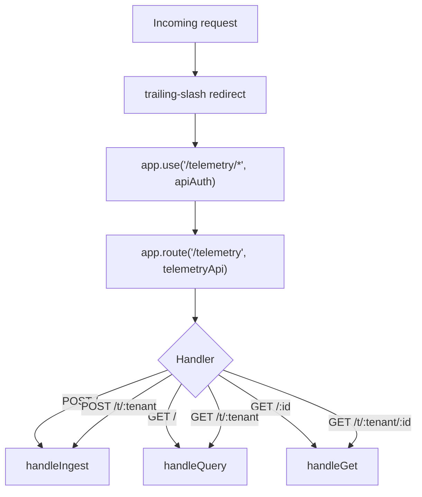
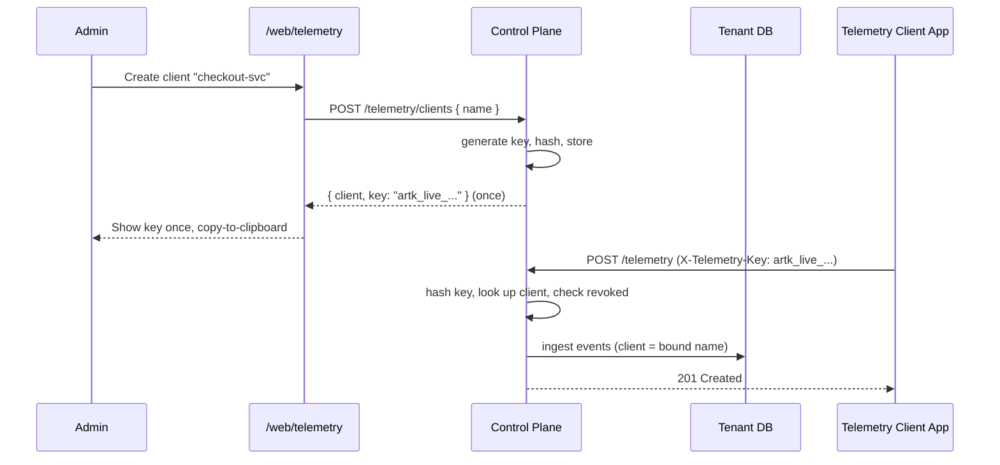

# RFC-008: Telemetry Clients and API Keys

**Status:** Proposed **Authors:** Agent Runtime Team **Created:** 2026-06-10

---

## Abstract

Telemetry ingestion is currently gated by the same `apiAuth` middleware as every
other control-plane API: a request must carry a Google-signed identity token or a
valid web session cookie. This is the wrong trust model for telemetry. Telemetry
is a high-volume, write-mostly firehose that many external and first-party apps
should be able to post to without holding a Google identity in the tenant.

This RFC introduces **telemetry clients**: named, per-tenant principals that own a
**telemetry API key**. Admins create clients on the telemetry page
(`/web/telemetry`), are shown the generated key exactly once, and can rotate or
delete clients later. Posting telemetry (`POST /telemetry`) is re-gated to require
a valid API key passed in an HTTP header. Read and management endpoints
(`GET /telemetry`, client CRUD) remain admin-only via the existing identity auth.

The RFC deliberately re-reviews **every** telemetry endpoint and its auth so the
final implementation lands the right boundary between "anyone with a key can
write" and "only admins can read or administer".

---

## Table of Contents

1. [Motivation](#1-motivation)
2. [Current State and Auth Review](#2-current-state-and-auth-review)
3. [Goals and Non-Goals](#3-goals-and-non-goals)
4. [Design Overview](#4-design-overview)
5. [Data Model](#5-data-model)
6. [API Key Format and Hashing](#6-api-key-format-and-hashing)
7. [Authentication Changes](#7-authentication-changes)
8. [Endpoints](#8-endpoints)
9. [Web UI](#9-web-ui)
10. [Implementation Plan](#10-implementation-plan)
11. [Documentation Changes](#11-documentation-changes)
12. [Test Plan](#12-test-plan)
13. [Config and Settings Changes](#13-config-and-settings-changes)
14. [Security Considerations](#14-security-considerations)
15. [Backward Compatibility and Migration](#15-backward-compatibility-and-migration)
16. [Open Questions](#16-open-questions)

---

## 1. Motivation

The telemetry subsystem (see [docs/telemetry.md](../telemetry.md)) is designed to
collect events from many sources — the CLI, web client, Slack bot, deployed
agents, and external apps. But the only way to reach `POST /telemetry` today is to
present a Google identity token or a tenant session cookie. That means:

- An external app or a deployed agent that just wants to emit events must be
  issued a Google identity and added to the tenant — far too heavyweight for a
  fire-and-forget telemetry post.
- Any authenticated tenant user can post **and** read all telemetry, so the
  ingest credential is over-privileged for a writer and the read surface is
  exposed to every member, not just admins.
- There is no per-source credential. We cannot attribute, rate-limit, rotate, or
  revoke a single noisy or compromised emitter without affecting everyone.

The desired model is the industry-standard one used by analytics/telemetry
products: **admins mint a write-only API key per client; the client posts events
with that key in a header; reading and administration stay behind human identity.**

---

## 2. Current State and Auth Review

A full inventory of the telemetry surface as it exists today.

### 2.1 Routing and middleware



`control-plane/src/mod.ts` mounts the router and the auth middleware:

```
app.use('/telemetry/*', apiAuth)
app.route('/telemetry', telemetryApi)
```

`apiAuth` (`control-plane/src/middleware/auth.ts`) accepts **either** a
Google-signed `Authorization: Bearer <jwt>` (verified against Google JWKS, issuer,
audience, `email_verified`, optional `AR_ALLOWED_DOMAINS`) **or** a decoded web
session cookie. There is no API-key path.

### 2.2 Endpoint inventory (`control-plane/src/api/telemetry.ts`)

| Method & path | Handler | Purpose | Auth today | Auth after this RFC |
| --- | --- | --- | --- | --- |
| `POST /telemetry` | `handleIngest` | Ingest one/batch events for the session tenant | identity/session | **API key (header)** |
| `POST /telemetry/t/:tenant` | `handleIngest` | Ingest scoped to an explicit tenant | identity/session | **API key (header)**; key's tenant must match `:tenant` |
| `GET /telemetry` | `handleQuery` | Query events (filters + pagination) | identity/session | **admin identity only** |
| `GET /telemetry/:id` | `handleGet` | Fetch one event | identity/session | **admin identity only** |
| `GET /telemetry/t/:tenant` | `handleQuery` | Query scoped to a tenant | identity/session | **admin identity only** |
| `GET /telemetry/t/:tenant/:id` | `handleGet` | Fetch one event for a tenant | identity/session | **admin identity only** |

### 2.3 Indirect / internal consumers (must keep working)

- `control-plane/src/api/settings.ts` — the `/api/settings/activity` admin
  endpoint calls `telemetryQuery(...)` directly against the DB (not over HTTP). It
  bypasses the telemetry router entirely and is unaffected by auth changes.
- First-party internal emitters (CLI, web, bot, runtime as documented in
  [docs/telemetry.md](../telemetry.md)) currently write by calling the DB `ingest`
  layer server-side, **not** by calling `POST /telemetry` over HTTP. So tightening
  the HTTP ingest endpoint does not break in-process emitters. Any client that
  emits over HTTP must be issued a key (covered in
  [§15](#15-backward-compatibility-and-migration)).

### 2.4 Conclusion of the review

The clean boundary is:

- **Write (ingest)** → API key, header-based, write-only, per-client.
- **Read (query/get)** → admin human identity only (tightened from "any member").
- **Administer (client CRUD)** → admin human identity only.

This is the boundary the rest of the RFC implements.

---

## 3. Goals and Non-Goals

### Goals

- Admins can create, list, rotate, and delete telemetry clients from
  `/web/telemetry`.
- Each client owns one active API key; the plaintext key is shown exactly once at
  creation/rotation and never again.
- `POST /telemetry` requires a valid, non-revoked API key in a header.
- The `client` field on ingested events is bound to the key's client (no
  spoofing).
- Reading telemetry and managing clients require admin identity.
- Keys are stored only as salted hashes; loss of the DB does not leak usable keys.

### Non-Goals

- Per-key rate limiting / quotas (noted as future work in
  [§16](#16-open-questions)).
- Scoped/granular key permissions beyond "write telemetry".
- OAuth client-credentials flows or JWT-based service identities.
- Multiple simultaneous active keys per client (rotation replaces the key).

---

## 4. Design Overview



A telemetry client is a lightweight, per-tenant principal. It is **not** a `user`
row and has no Google identity. It exists only to authenticate telemetry writes
and to label/attribute them.

---

## 5. Data Model

New per-tenant table `telemetry_client`, added as a new entry in the `MIGRATIONS`
array in `sdk-client-deno/src/db/schema.ts` (and `SCHEMA_VERSION` bumped).

```sql
CREATE TABLE IF NOT EXISTS telemetry_client (
  id TEXT PRIMARY KEY,
  tenant_id TEXT NOT NULL REFERENCES tenant(id),
  name TEXT NOT NULL,
  key_hash TEXT NOT NULL,
  key_prefix TEXT NOT NULL,
  key_last_four TEXT NOT NULL,
  created_by TEXT NOT NULL REFERENCES user(id),
  created_at TEXT NOT NULL DEFAULT (datetime('now')),
  rotated_at TEXT,
  last_used_at TEXT,
  revoked INTEGER NOT NULL DEFAULT 0,
  UNIQUE(tenant_id, name)
);

CREATE INDEX IF NOT EXISTS idx_telemetry_client_tenant
  ON telemetry_client(tenant_id);
CREATE UNIQUE INDEX IF NOT EXISTS idx_telemetry_client_hash
  ON telemetry_client(key_hash);
```

Field notes:

- `key_hash` — SHA-256 of the plaintext key (salted, see [§6](#6-api-key-format-and-hashing)).
  The plaintext is never stored.
- `key_prefix` / `key_last_four` — non-secret display fragments so the UI can show
  `artk_live_…a1b2` for identification.
- `name` — used as the `client` label on ingested events; unique per tenant.
- `revoked` — soft delete on rotate/delete so historical events keep a stable
  reference and so a revoked hash can never re-authenticate.
- `last_used_at` — updated (best-effort, non-fatal) on successful ingest for
  observability and stale-key cleanup.

The new entity gets a DB module `sdk-client-deno/src/db/telemetry-clients.ts`
mirroring the shape of `db/users.ts`, exporting:
`create`, `list`, `get`, `getByHash`, `rotate`, `remove`, `touch`. It is wired
into the workspace subpath exports in `sdk-client-deno/deno.jsonc`
(`"./db/telemetry-clients": "./src/db/telemetry-clients.ts"`).

Because the table lives in the tenant SQLite DB, it is synced to GCS by the
existing `scheduleSync(tenantId)` path automatically — no sync changes needed.

---

## 6. API Key Format and Hashing

### Format

```
artk_live_<32+ url-safe random chars>
```

- `artk` = Agent Runtime telemetry key namespace; `live` reserved for a future
  `test` variant.
- The random component is generated with `crypto.getRandomValues` and base64url
  encoded.
- `key_prefix` stores `artk_live`; `key_last_four` stores the final 4 chars.

### Hashing

- At creation: compute `key_hash = sha256(pepper + plaintext)` using
  `@std/crypto`, where `pepper` is an optional server-side secret
  (`AR_TELEMETRY_KEY_PEPPER`); if unset, the hash is over the plaintext alone.
- Lookups hash the presented key the same way and select by `key_hash` (indexed,
  unique). Comparison is by the indexed equality lookup; no plaintext is ever
  compared or logged.
- The plaintext key is returned to the caller **only** in the HTTP response of the
  create and rotate operations and is never persisted or re-derivable.

---

## 7. Authentication Changes

### 7.1 New middleware: `telemetryKeyAuth`

Add `telemetryKeyAuth` to `control-plane/src/middleware/auth.ts`. It:

1. Reads the key from the header (`X-Telemetry-Key`, and also accepts
   `Authorization: Bearer artk_...` for convenience).
2. Returns `401` if absent or malformed (does not fall through to identity auth).
3. Hashes the key and looks up the client via `db/telemetry-clients.getByHash`.
4. Returns `401` if no match or `403` if the client is `revoked`.
5. Resolves the tenant from the client row, opens the tenant DB, and sets
   `c.set('tenantId', ...)` and a new `c.set('telemetryClient', { id, name })`
   context value (added to `Env` in `control-plane/src/types.ts`).
6. Calls `next()`.

### 7.2 Re-wiring in `mod.ts`

Today a single line guards the whole subtree:

```
app.use('/telemetry/*', apiAuth)
```

Replace with method/path-specific guards so writes use key auth and reads use
identity:

```
// Ingest: API key only
app.use('/telemetry', methodGuard('POST', telemetryKeyAuth))
app.use('/telemetry/t/:tenant', methodGuard('POST', telemetryKeyAuth))

// Read: admin identity (apiAuth + admin assertion in handlers)
app.use('/telemetry/*', apiAuth)

// Client management: admin identity
app.use('/telemetry/clients', apiAuth)
app.use('/telemetry/clients/*', apiAuth)
```

Because Hono runs `use` middleware in registration order, the POST-guarded routes
must be registered before the catch-all `apiAuth`, and `telemetryKeyAuth` must
short-circuit (return a Response) rather than fall through so a POST never reaches
`apiAuth`. The exact composition is an implementation detail; the contract is:
**POST ⇒ key auth, everything else under `/telemetry` ⇒ identity auth.** The
client-management routes are registered under `/telemetry/clients` and must be
matched before the event `/:id` route to avoid `clients` being parsed as an event
id.

### 7.3 Admin assertion on read

`handleQuery` and `handleGet` gain an admin check (mirroring
`api/settings.ts`'s `if (!isAdmin) return 403`), so reads are admin-only rather
than any-member.

### 7.4 Binding `client` to the key

In `handleIngest`, when authenticated via a telemetry key, the event `client`
field is overwritten with the client's `name` from context before calling
`ingest`. This prevents a key holder from impersonating another client. The
`client` field in the request body becomes advisory/ignored for key-authenticated
ingest.

---

## 8. Endpoints

### 8.1 Telemetry ingest (modified)

```
POST /telemetry
POST /telemetry/t/:tenant
Header: X-Telemetry-Key: artk_live_...
```

- Auth: telemetry API key. No identity/session accepted.
- For `/t/:tenant`, the key's tenant must equal `:tenant` else `403`.
- `client` is derived from the key; `action` and `timestamp` remain required.
- Updates `last_used_at` best-effort.

### 8.2 Telemetry read (tightened)

```
GET /telemetry
GET /telemetry/:id
GET /telemetry/t/:tenant
GET /telemetry/t/:tenant/:id
```

- Auth: admin identity (Bearer Google JWT or admin session).

### 8.3 Client management (new, admin-only)

New router `control-plane/src/api/telemetry-clients.ts`, mounted at
`/telemetry/clients`:

| Method & path | Purpose | Response |
| --- | --- | --- |
| `GET /telemetry/clients` | List clients for tenant (no secrets) | `[{ id, name, keyPrefix, keyLastFour, createdBy, createdAt, lastUsedAt, revoked }]` |
| `POST /telemetry/clients` | Create client `{ name }` | `{ client, key }` — **key shown once** |
| `POST /telemetry/clients/:id/rotate` | Generate a new key, revoke old hash | `{ client, key }` — **key shown once** |
| `DELETE /telemetry/clients/:id` | Delete (revoke) a client | `{ ok: true }` |

Name validation matches existing slug/name patterns; duplicate names within a
tenant return `409`.

---

## 9. Web UI

The telemetry island (`web/src/islands/telemetry.tsx`) gains a **Clients** tab
alongside the existing Events / Trace views (page stays admin-only via
`pages.ts`). Per the codebase 250-line guideline, the client-management UI is
extracted into a sibling component file
`web/src/islands/telemetry-clients.tsx` and rendered from the telemetry island.

Features:

- A table of clients: name, key fingerprint (`artk_live_…a1b2`), created by,
  created date, last used, status.
- **Create client**: inline form (name input + button) → calls
  `POST /telemetry/clients` → shows the returned key once in a copy-to-clipboard
  modal with an explicit "you will not see this again" warning.
- **Rotate**: per-row action → `POST /telemetry/clients/:id/rotate` → same
  one-time key reveal modal.
- **Delete**: per-row action with a confirm step → `DELETE /telemetry/clients/:id`.

All calls go through the existing `api()` helper (`web/src/api.ts`), which sends
the session cookie (`credentials: 'include'`), so the admin's identity authorizes
management — no API key is involved in the web flow.

The dev mock (`web/dev/mock.ts`) gains handlers for the four client endpoints so
`npm run dev` works offline.

---

## 10. Implementation Plan

### Phase 1 — Data layer

| File | Change |
| --- | --- |
| `sdk-client-deno/src/db/schema.ts` | Append `telemetry_client` migration; bump `SCHEMA_VERSION` |
| `sdk-client-deno/src/db/telemetry-clients.ts` | New module: `create`, `list`, `get`, `getByHash`, `rotate`, `remove`, `touch` |
| `sdk-client-deno/deno.jsonc` | Add `./db/telemetry-clients` subpath export |

### Phase 2 — Auth and ingest

| File | Change |
| --- | --- |
| `control-plane/src/middleware/auth.ts` | Add `telemetryKeyAuth`; export it |
| `control-plane/src/types.ts` | Add `telemetryClient` to `Env` context vars |
| `control-plane/src/api/telemetry.ts` | Admin assertion on read handlers; bind `client` to key in `handleIngest` |
| `control-plane/src/mod.ts` | Re-wire `/telemetry` guards (POST→key, GET→admin identity); mount clients router |

### Phase 3 — Client management API

| File | Change |
| --- | --- |
| `control-plane/src/api/telemetry-clients.ts` | New admin router: list/create/rotate/delete |
| `control-plane/src/middleware/audit.ts` | Add `telemetry-clients → telemetry-client` to `ENTITY_TYPES` so mutations are audited |

### Phase 4 — Web UI

| File | Change |
| --- | --- |
| `web/src/islands/telemetry.tsx` | Add Clients tab |
| `web/src/islands/telemetry-clients.tsx` | New management component + one-time key modal |
| `web/dev/mock.ts` | Mock client endpoints |

### Phase 5 — Docs, tests, config

Covered in [§11](#11-documentation-changes)–[§13](#13-config-and-settings-changes).

---

## 11. Documentation Changes

- **[docs/telemetry.md](../telemetry.md)** — Rewrite the **Access Control** and
  **Ingestion** sections: ingest now requires `X-Telemetry-Key`; document the key
  format, the header, the one-time reveal, and that the `client` label is derived
  from the key. Update the "Clients" subsection to explain the new managed-client
  concept (vs the old fixed list of source names). Add a "Managing Clients"
  section describing the web flow.
- **[AGENTS.md](../../AGENTS.md)** — Update the diagnostic endpoints table: note
  that `GET /telemetry` is admin identity and `POST /telemetry` requires a
  telemetry API key (not an identity token). Update the curl example accordingly.
- **[README.md](../../README.md)** — If telemetry posting is documented for CLI
  users, add a short note on obtaining and using a telemetry key.
- **[CONFIG.md](../../CONFIG.md)** — Document the new optional
  `AR_TELEMETRY_KEY_PEPPER` secret/setting and its purpose.
- **[CHANGELOG.md](../../CHANGELOG.md)** — Add an entry under the next version
  bump in `cli/deno.jsonc` summarizing the feature.
- This RFC itself; mark **Status: Implemented** once merged and shipped.

---

## 12. Test Plan

### Unit / DB (`sdk-client-deno`, Deno)

- `telemetry-clients` CRUD: create returns plaintext once; stored row has only
  hash + fingerprints; `getByHash` matches the generated key and misses on a wrong
  key; `rotate` invalidates the old hash and issues a new one; `remove` revokes.
- Hashing: same input → same hash; pepper changes hash; plaintext never stored.
- Schema migration: a DB at the previous `SCHEMA_VERSION` migrates up and gains
  the `telemetry_client` table and indexes.

### Control-plane API / middleware

- `POST /telemetry` with a valid key → `201` and event `client` equals the
  client name even if the body sets a different `client`.
- `POST /telemetry` with missing/garbage/revoked key → `401`/`403`; never falls
  through to identity auth.
- `POST /telemetry/t/:tenant` with a key whose tenant differs from `:tenant` →
  `403`.
- `GET /telemetry` with a telemetry key → rejected; with a non-admin identity →
  `403`; with an admin identity → `200`.
- Client management endpoints reject non-admins (`403`) and accept admins.
- `audit` row is written for create/rotate/delete.

### Web

- Extend the existing telemetry-related test
  (`cli/test/web-client-fixes.test.ts`) and/or add a structural test for the
  Clients tab: create surfaces a one-time key, rotate/delete call the right
  endpoints, table renders fingerprints not full keys.
- `web/dev/mock.ts` handlers exercised by the island in dev.

All suites run under `deno task test`; `deno task check` (fmt + lint + types) must
pass.

---

## 13. Config and Settings Changes

- **`default-settings.jsonc`** — Add `AR_TELEMETRY_KEY_PEPPER` to the `"secrets"`
  mapping (Secret Manager name ↔ env var) so it resolves in cloud per the secrets
  resolution order in [AGENTS.md](../../AGENTS.md).
- **`secrets.example.jsonc`** — Add `AR_TELEMETRY_KEY_PEPPER` with an empty value
  and a descriptive comment so local developers know the key exists.
- **`secrets.jsonc`** (local only, untracked) — developers add a value if they
  want a pepper locally; the feature works without it.
- No new Cloud Run env wiring is required beyond surfacing the optional pepper;
  the deploy pipeline already injects mapped secrets as env vars.

---

## 14. Security Considerations

- **Write-only keys.** Keys authorize `POST /telemetry` only. They cannot read
  events, list clients, or touch any other API. Read/admin stays behind human
  identity (and now admin-gated).
- **Hash-at-rest.** Only salted SHA-256 hashes are stored; DB/GCS backup exposure
  does not yield usable keys. Plaintext is shown exactly once.
- **No spoofing.** The `client` label is derived from the authenticated key, so a
  key holder cannot masquerade as another client.
- **Tenant isolation.** A key resolves to exactly one tenant; `/t/:tenant` writes
  must match it. Keys cannot cross tenants.
- **Rotation & revocation.** Rotating issues a new key and immediately invalidates
  the old hash; deleting revokes. Compromise is contained to one client and
  remediated without affecting others.
- **Transport.** Keys travel in a header over TLS (Cloud Run is HTTPS-only).
  Avoid putting keys in query strings (they leak into logs); the header is the
  only supported channel.
- **Logging hygiene.** Never log the plaintext key or the `Authorization`/
  `X-Telemetry-Key` header value. Audit logs reference the client `id`/`name`
  only.
- **Abuse.** Because anyone with a key can write, a leaked key can flood
  telemetry. Per-key rate limiting is out of scope here (see
  [§16](#16-open-questions)); revocation is the mitigation in v1.

---

## 15. Backward Compatibility and Migration

- **In-process emitters are unaffected.** First-party telemetry written via the DB
  `ingest` layer (CLI/web/bot/runtime as wired today) does not call
  `POST /telemetry` over HTTP and continues to work unchanged.
- **HTTP posters need a key.** Any external or out-of-process client that currently
  posts to `POST /telemetry` with an identity token will break once ingest is
  key-gated. Mitigation: ship the feature, have admins mint keys, and update those
  posters to send `X-Telemetry-Key`. Given there are no known external HTTP
  posters today, blast radius is expected to be zero, but this is called out
  explicitly for review.
- **Read tightening.** `GET /telemetry` moving from any-member to admin-only is a
  behavioral change; the web telemetry page is already admin-only, so the UI is
  unaffected. Any non-admin script reading telemetry would now get `403`.
- **Optional staged rollout.** If a softer migration is desired, a transitional
  setting `AR_TELEMETRY_INGEST_ALLOW_IDENTITY=true` could keep identity-based
  ingest working alongside keys for one release, then be removed. Defaulting it
  off matches the RFC's intent; see [§16](#16-open-questions).

---

## 16. Open Questions

1. **Transitional identity ingest.** Do we want the
   `AR_TELEMETRY_INGEST_ALLOW_IDENTITY` escape hatch for one release, or hard-cut
   to key-only immediately? (Default proposal: hard-cut, since no known HTTP
   posters exist.)
2. **Rate limiting / quotas.** Per-key request and volume limits are deferred. Do
   we need at least a coarse global ingest guard in v1?
3. **Multiple active keys per client.** Single active key keeps rotation simple. Is
   overlapping dual-key rotation (issue new before revoking old) needed for
   zero-downtime rotation?
4. **Header name.** `X-Telemetry-Key` vs reusing `Authorization: Bearer artk_...`.
   The RFC supports both; should we standardize on one?
5. **`test` vs `live` key variants.** Reserved in the format but unused in v1 —
   worth implementing now or later?
