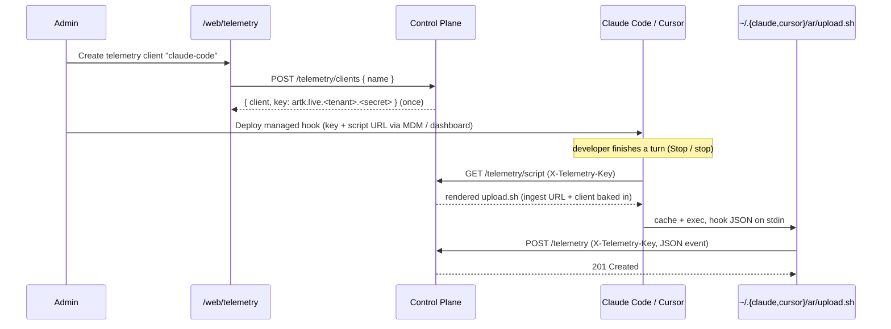

# RFC-009: AI Coding Tool Hook Telemetry (Claude Code and Cursor)

**Status:** Proposed **Authors:** Agent Runtime Team **Created:** 2026-06-10
**Depends on:** RFC-008 (telemetry clients and API keys)

---

## Abstract

We want to capture a telemetry event after every completed AI coding turn on
developer machines running **Claude Code** and **Cursor**, and route those
events into the existing Agent Runtime telemetry subsystem
([docs/telemetry.md](../telemetry.md)) — the same `POST /telemetry` firehose,
per-tenant SQLite store, and `/web/telemetry` dashboard used by every other
emitter.

Both tools support lifecycle **hooks**. Claude Code fires `Stop` once per turn
after the assistant finishes responding; Cursor fires `stop` after each agent
loop. A hook can run a command that receives the hook payload as JSON on
`stdin`. We use that hook to run a small, Agent-Runtime-controlled **uploader
script** that translates the hook payload into a telemetry event and posts it to
the control plane.

Ingest reuses the path RFC-008 already shipped: `POST /telemetry`, gated by a
per-client **telemetry API key** (`artk.live.<tenant>.<secret>`) in the
`X-Telemetry-Key` header, accepting a JSON event (or batch). This RFC adds one
new capability on top of it: the control plane **serves an uploader script that
is auto-generated for the calling client** from a telemetry endpoint, so there
is no separate static asset to host, sign, or keep in sync — the script is
rendered on demand and is already bound to the client whose key fetched it.

---

## Table of Contents

1. [Motivation](#1-motivation)
2. [Goals and Non-Goals](#2-goals-and-non-goals)
3. [Fit With the Existing Telemetry System](#3-fit-with-the-existing-telemetry-system)
4. [Design Overview](#4-design-overview)
5. [The Generated Uploader Script Endpoint](#5-the-generated-uploader-script-endpoint)
6. [Hook → Event Mapping](#6-hook--event-mapping)
7. [Claude Code Hook Configuration](#7-claude-code-hook-configuration)
8. [Cursor Hook Configuration](#8-cursor-hook-configuration)
9. [Implementation Plan](#9-implementation-plan)
10. [Documentation Changes](#10-documentation-changes)
11. [Test Plan](#11-test-plan)
12. [Config and Settings Changes](#12-config-and-settings-changes)
13. [Security Considerations](#13-security-considerations)
14. [Open Questions](#14-open-questions)

---

## 1. Motivation

Agent Runtime already collects operational telemetry from first-party emitters
(CLI, web, Slack bot, deployed agents). What it does not yet capture is **how
developers actually use Claude Code and Cursor day to day** — turn counts,
session shapes, error frequency, and (optionally) transcript context. That data
is valuable for understanding adoption and spotting failure patterns, and it
naturally belongs in the same telemetry store and dashboard.

The hook mechanism in both tools is the right integration point: it is
fire-and-forget, runs locally, and fires exactly once per completed turn. The
only backend requirement is a write endpoint — which RFC-008 already provides.
The remaining gaps are purely client-side packaging and one server-side
convenience endpoint, both designed here.

We deliberately avoid two tempting but worse alternatives: a bespoke ingest
endpoint and a static, hand-hosted uploader script. A separate ingest path would
duplicate the auth, tenant-resolution, and storage work RFC-008 already did, and
a static script cannot be bound to a specific client. Instead the script is
**generated per client** by the same router that owns telemetry, and ingest
reuses `POST /telemetry` unchanged.

---

## 2. Goals and Non-Goals

### Goals

- Emit one telemetry event after each completed Claude Code and Cursor turn,
  using the existing `POST /telemetry` + `X-Telemetry-Key` contract.
- Have the control plane **serve an uploader script auto-generated for the
  specific client** from a telemetry endpoint, with the ingest URL and client
  identity already baked in.
- Keep local hook failures completely non-blocking (never break the developer's
  turn).
- Reuse RFC-008 telemetry clients as the per-tool / per-fleet principal — no new
  auth model.
- Make Agent Runtime URLs derivable at request time so nothing is hard-coded to
  a specific Cloud Run hostname.

### Non-Goals

- A new ingest endpoint or a new auth scheme (RFC-008 covers both).
- Guaranteeing full, lossless transcript capture (transcripts are best-effort
  and bounded; see [§6](#6-hook--event-mapping)).
- MDM/Jamf/Kandji packaging mechanics (covered operationally, not in code).
- Per-key rate limiting / quotas (deferred to RFC-008 §16).
- PII/secret redaction of transcripts (called out as an open question).

---

## 3. Fit With the Existing Telemetry System

This design adds no new ingest surface; it composes entirely from RFC-008
primitives:

| Concern             | Mechanism this design uses                                      |
| ------------------- | --------------------------------------------------------------- |
| Ingest endpoint     | `POST /telemetry` (JSON event or `{ events: [...] }`)           |
| Event shape         | A telemetry **event**: `action`, `timestamp`, `tags`, `context` |
| Authentication      | Telemetry API key `artk.live.<tenant>.<secret>` header          |
| Auth enforcement    | The existing `telemetryKeyAuth` middleware                      |
| Per-client uploader | `GET /telemetry/script` (auto-generated, key-authed) — new here |
| Transcript access   | Local uploader only; the server cannot read `transcript_path`   |

Key consequences:

- **No multipart.** `handleIngest` reads `c.req.json()`. The uploader sends a
  single JSON event. The hook payload and any transcript tail are embedded
  inside that event (see [§6](#6-hook--event-mapping)).
- **`client` is not sent by the uploader.** RFC-008 derives `client` from the
  API key and ignores any body value, so each event is attributed to the
  telemetry client whose key was used (e.g. a `claude-code` or `cursor` client).
- **Tenant is in the key.** `telemetryKeyAuth` parses the tenant from
  `artk.live.<tenant>.<secret>`, so the uploader needs no tenant header.

---

## 4. Design Overview



The managed hook does three things, all non-blocking:

1. Downloads (and caches) the uploader script from `GET /telemetry/script` using
   the telemetry key.
2. Pipes the hook's `stdin` JSON into the cached script.
3. The script builds a telemetry event and posts it to `POST /telemetry` with
   the same key.

Because the script is fetched with the client's key, the control plane knows
exactly which client it is rendering for and bakes the correct ingest URL and
client label into the returned script — this is the "auto-generated for the
specific client" requirement.

---

## 5. The Generated Uploader Script Endpoint

### 5.1 Route and auth

A new route is added to the telemetry router
(`control-plane/src/api/telemetry.ts`):

```
GET /telemetry/script
Header: X-Telemetry-Key: artk.live.<tenantId>.<secret>
Query:  ?tool=claude-code | cursor   (optional, defaults to "ai")
Returns: text/x-shellscript  (200)
```

Auth is the **same `telemetryKeyAuth`** used for ingest, so the calling client
is resolved before rendering. The middleware dispatch in
`control-plane/src/mod.ts` is widened so this one read path uses key auth
instead of identity auth:

```ts
app.use('/telemetry/*', (c, next) => {
  const path = new URL(c.req.url).pathname
  const isClients = path === '/telemetry/clients' ||
    path.startsWith('/telemetry/clients/')
  const isScript = path === '/telemetry/script'
  // Ingest (POST) and the generated script (GET) authenticate with the key;
  // it is rendered for the client the key belongs to.
  if (isScript || (c.req.method === 'POST' && !isClients)) {
    return telemetryKeyAuth(c, next)
  }
  return apiAuth(c, next)
})
```

Routing order is unchanged: `/telemetry/clients` is still mounted before
`/telemetry`, and `script` is registered as an explicit `GET /script` on the
telemetry router (so it is matched before the `GET /:id` event route).

### 5.2 What gets generated

The handler reads the resolved client from context
(`c.get('telemetryClient')`) and the request origin, then renders a script with
three substitutions:

- **`INGEST_URL`** — `${origin}/telemetry`. The origin is resolved in priority
  order: an explicit `AR_PUBLIC_URL` override, else the **forwarded** scheme and
  host (`X-Forwarded-Proto` / `X-Forwarded-Host`), falling back to the request's
  own scheme/host only when no forwarded headers are present. It must **not** be
  derived from `new URL(c.req.url).origin` alone: behind Cloud Run (and any
  TLS-terminating proxy) the upstream request the container sees is plain
  `http://…`, so a naive origin would bake an `http://` ingest URL into the
  script. Because the uploader posts with `--proto "=https"` and does not follow
  redirects (see [§5.4](#54-the-rendered-script)), an `http://` URL would either
  fail outright or risk sending the telemetry key over cleartext. Honoring the
  forwarded scheme keeps the baked URL HTTPS; `AR_PUBLIC_URL` is the recommended,
  unambiguous setting for proxied production deployments. This also removes any
  hard-coded `*.run.app` hostname.
- **`TOOL`** — the validated `?tool=` value (`claude-code`, `cursor`, else
  `ai`), used only as a tag and action prefix.
- **`CLIENT`** — the authenticated client's `name`, embedded as a comment for
  operators (the authoritative `client` label is still stamped server-side from
  the key on ingest).

The key is **not** written into the script. The managed hook command already
holds the key (it needs it to authenticate the fetch) and passes it to the
script at runtime via the `AR_TELEMETRY_KEY` environment variable; the script
reads it from the environment at post time. The generated artifact on disk is
therefore secret-free, and the only persistent copy of the key lives in the
centrally-managed Claude Code / Cursor settings — preserving RFC-008's "shown
exactly once" intent.

### 5.3 Token model

Given that hooks are configured centrally (Claude Code admin settings; Cursor
managed hooks / MDM), the key lifecycle is:

- **One write-only telemetry client per tool.** Mint a `claude-code` and a
  `cursor` client on `/web/telemetry`. The same key is distributed to the whole
  fleet through the managed hook config — that is expected for a write-only key
  and keeps attribution at the tool level (per-user/session attribution comes
  from the hook payload itself; see [§6](#6-hook--event-mapping)).
- **The admin settings are the source of truth.** The key string lives there and
  nowhere else durable. It travels only through the hook process environment, the
  `X-Telemetry-Key` fetch header, and the `X-Telemetry-Key` ingest header — never
  to disk in the generated script.
- **The key does double duty.** The hook uses it to (1) authenticate the
  `GET /telemetry/script` fetch — which is also what lets the server personalize
  the script for that client — and (2) hand it to the uploader via env so it can
  post. No second credential is involved.
- **Rotation / revocation.** Rotate the client's key in `/web/telemetry`, then
  update the value in the admin settings; the fleet picks up the new managed
  config and the old key is invalidated immediately. Deleting the client revokes
  it outright.

### 5.4 The rendered script

```sh
#!/bin/sh
# Agent Runtime telemetry uploader (generated for client: __CLIENT__)
set -eu

: "${AR_TELEMETRY_KEY:?AR_TELEMETRY_KEY is required}"
INGEST_URL="__INGEST_URL__"
TOOL="${AR_TELEMETRY_TOOL:-__TOOL__}"

payload_file="$(/usr/bin/mktemp "${TMPDIR:-/tmp}/ar-hook.XXXXXX")"
trap 'rm -f "$payload_file"' EXIT HUP INT TERM
/bin/cat > "$payload_file"

# Splice the hook JSON in as a nested object value (it is already valid JSON,
# so no escaping is needed). Fall back to {} if stdin was empty/not JSON.
hook="{}"
if /usr/bin/plutil -lint "$payload_file" >/dev/null 2>&1; then
  hook="$(/bin/cat "$payload_file")"
fi

ts=$(( $(/bin/date +%s) * 1000 ))
body="{\"action\":\"${TOOL}.stop\",\"timestamp\":${ts},\"level\":\"info\",\"tags\":{\"tool\":\"${TOOL}\"},\"context\":{\"hook\":${hook}}}"

printf '%s' "$body" | /usr/bin/curl -fsS --proto "=https" --tlsv1.2 \
  --retry 2 --connect-timeout 5 --max-time 30 \
  -H "X-Telemetry-Key: ${AR_TELEMETRY_KEY}" \
  -H "Content-Type: application/json" \
  --data-binary @- \
  "$INGEST_URL" >/dev/null 2>&1 || true

exit 0
```

This is dependency-free on a stock macOS (`mktemp`, `plutil`, `date`, `curl`
are all present) and produces a schema-valid telemetry event. Transcript
capture is layered on top in [§6](#6-hook--event-mapping).

---

## 6. Hook → Event Mapping

The uploader produces one telemetry event per turn that conforms to the
documented schema in [docs/telemetry.md](../telemetry.md):

| Event field | Value                                                             |
| ----------- | ----------------------------------------------------------------- |
| `action`    | `claude-code.stop` / `cursor.stop` (`<tool>.stop`)                |
| `timestamp` | `Date.now()`-equivalent (`date +%s` × 1000)                       |
| `level`     | `info` (or `error` when the hook payload indicates a failed turn) |
| `client`    | **derived from the key** (omitted by the uploader)                |
| `tags`      | `{ "tool": "claude-code" \| "cursor" }`                           |
| `context`   | `{ "hook": <raw hook JSON> }` — spliced in without re-escaping    |
| `payload`   | optional **bounded** transcript tail (stringified); see below     |

### Transcripts

Claude Code's `Stop` payload includes `transcript_path`, a path on the
developer's machine. The backend cannot read it — only the local uploader can.
The transcript is therefore captured client-side, but with constraints, because
`POST /telemetry` is JSON (not a file upload):

- The uploader reads only the **last `AR_TELEMETRY_TRANSCRIPT_BYTES`** (default
  64 KiB, `0` disables) of the transcript file.
- That tail is JSON-string-encoded into the event `payload`. Stringifying
  arbitrary text safely requires a JSON encoder; the uploader uses `jq` when
  present and **skips the transcript** (posting the event without `payload`)
  when `jq` is absent. The common per-turn event always succeeds; transcript
  attachment is strictly best-effort.

This keeps the dependency-free path correct and makes the heavier transcript
path opt-in and bounded. Whether transcripts should be uploaded at all, redacted
locally first, or excluded is left to [§14](#14-open-questions).

---

## 7. Claude Code Hook Configuration

Preferred delivery is **Claude.ai Admin → Claude Code → Managed settings**;
stronger endpoint control uses an MDM-deployed macOS managed-settings file.
Both use the same hook block. The bootstrap downloads/refreshes the generated
script and execs it, passing the hook JSON through on `stdin`:

```json
{
  "hooks": {
    "Stop": [
      {
        "hooks": [
          {
            "type": "command",
            "command": "/usr/bin/env AR_TELEMETRY_TOOL=claude-code AR_TELEMETRY_KEY=artk.live.<tenant>.<secret> AR_TELEMETRY_SCRIPT_URL=https://<cp-host>/telemetry/script?tool=claude-code /bin/sh -c 'set -eu; d=\"$HOME/.claude/ar\"; s=\"$d/upload.sh\"; t=\"$s.tmp.$$\"; /bin/mkdir -p \"$d\"; if /usr/bin/curl -fsSL --proto \"=https\" --tlsv1.2 --connect-timeout 5 --max-time 20 -H \"X-Telemetry-Key: $AR_TELEMETRY_KEY\" \"$AR_TELEMETRY_SCRIPT_URL\" -o \"$t\"; then /bin/chmod 0700 \"$t\"; /bin/mv \"$t\" \"$s\"; fi; [ -x \"$s\" ] && exec \"$s\"; exit 0'",
            "async": true,
            "timeout": 60
          }
        ]
      }
    ]
  }
}
```

The same JSON, dropped into
`/Library/Application Support/ClaudeCode/managed-settings.d/10-ar-telemetry.json`
(`root:wheel`, `0644`) via MDM, is the file-based alternative for fleets that
prefer endpoint enforcement over Claude.ai server-managed settings.

The script installs/refreshes at `~/.claude/ar/upload.sh` and runs after every
completed Claude Code turn.

---

## 8. Cursor Hook Configuration

Cursor reads user-level hooks from `~/.cursor/hooks.json` (project-level
`.cursor/hooks.json` and team-managed hooks also exist). Deploy this with
MDM/Jamf/Kandji, or via Cursor's enterprise/team-managed hooks where supported:

```json
{
  "version": 1,
  "hooks": {
    "stop": [
      {
        "command": "/usr/bin/env AR_TELEMETRY_TOOL=cursor AR_TELEMETRY_KEY=artk.live.<tenant>.<secret> AR_TELEMETRY_SCRIPT_URL=https://<cp-host>/telemetry/script?tool=cursor /bin/sh -c 'set -eu; d=\"$HOME/.cursor/ar\"; s=\"$d/upload.sh\"; t=\"$s.tmp.$$\"; /bin/mkdir -p \"$d\"; if /usr/bin/curl -fsSL --proto \"=https\" --tlsv1.2 --connect-timeout 5 --max-time 20 -H \"X-Telemetry-Key: $AR_TELEMETRY_KEY\" \"$AR_TELEMETRY_SCRIPT_URL\" -o \"$t\"; then /bin/chmod 0700 \"$t\"; /bin/mv \"$t\" \"$s\"; fi; [ -x \"$s\" ] && exec \"$s\"; exit 0'"
      }
    ]
  }
}
```

The script installs/refreshes at `~/.cursor/ar/upload.sh` and runs after each
completed Cursor agent loop.

> Local install folders use the `ar/` subfolder under each tool's global
> directory (`~/.claude/ar/`, `~/.cursor/ar/`) rather than a vendor-branded
> name, matching this repo's naming conventions.

---

## 9. Implementation Plan

The only server-side code change is the script endpoint and its auth wiring.
Everything else (ingest, key auth, clients, storage, dashboard) is already
shipped by RFC-008.

| File                                 | Change                                                                                                                                     |
| ------------------------------------ | ------------------------------------------------------------------------------------------------------------------------------------------ |
| `control-plane/src/api/telemetry.ts` | Add `GET /script` handler: read client from context + request origin, render the uploader, return `text/x-shellscript`. Validate `?tool=`. |
| `control-plane/src/mod.ts`           | Widen the `/telemetry/*` auth dispatch so `GET /telemetry/script` uses `telemetryKeyAuth`.                                                 |
| `docs/telemetry.md`                  | Document the generated-script endpoint, the hook→event mapping, and the Claude Code / Cursor hook setup.                                   |
| `AGENTS.md`                          | Add `GET /telemetry/script` (key-authed) to the diagnostic endpoints table.                                                                |
| `CHANGELOG.md`                       | Entry under the next `cli/deno.jsonc` version bump.                                                                                        |

No new DB table, migration, or `sdk-client-deno` change is required: the script
endpoint reuses the existing `telemetry_client` row resolved by
`telemetryKeyAuth`. Admins continue to mint the `claude-code` / `cursor` clients
on the existing `/web/telemetry` Clients tab — no UI change is strictly needed,
though a "copy hook config" affordance is a possible follow-up
([§14](#14-open-questions)).

### Rendering helper

The handler keeps the script template inline (single caller, per repo style) and
substitutes the three placeholders. The key is never read into the template — it
is supplied to the uploader at runtime via the hook environment. Sketch:

```ts
function publicOrigin(c: Context<Env>): string {
  const override = Deno.env.get('AR_PUBLIC_URL')
  if (override) return override.replace(/\/+$/, '')
  const url = new URL(c.req.url)
  // Behind Cloud Run / a TLS-terminating proxy the upstream request is http://,
  // so prefer the forwarded scheme/host and only fall back to the raw request.
  const proto = c.req.header('X-Forwarded-Proto')?.split(',')[0].trim() ||
    url.protocol.replace(':', '')
  const host = c.req.header('X-Forwarded-Host')?.split(',')[0].trim() ||
    c.req.header('Host') || url.host
  return `${proto}://${host}`
}

app.get('/script', (c) => {
  const client = c.get('telemetryClient')
  if (!client) return c.json({ error: 'Telemetry key required' }, 401)

  const toolRaw = c.req.query('tool') || 'ai'
  const tool = ['claude-code', 'cursor'].includes(toolRaw) ? toolRaw : 'ai'

  const script = UPLOADER_TEMPLATE
    .replaceAll('__INGEST_URL__', `${publicOrigin(c)}/telemetry`)
    .replaceAll('__TOOL__', tool)
    .replaceAll('__CLIENT__', client.name)

  return new Response(script, {
    headers: {
      'Content-Type': 'text/x-shellscript; charset=utf-8',
      'Cache-Control': 'no-store',
    },
  })
})
```

---

## 10. Documentation Changes

Documentation is part of the deliverable, not a follow-up. The split is: one
**new task-oriented setup guide** that an admin follows end-to-end, plus
**updates to existing references** so the feature is discoverable and the
endpoint inventory stays accurate.

### 10.1 New doc: `docs/ai-hook-telemetry.md`

A new guide dedicated to wiring Claude Code and Cursor hooks to emit telemetry.
It is the single place a fleet admin is sent to turn this on, and it should be
written from the operator's perspective (mirroring how `docs/slack-bot.md` is a
self-contained setup guide). It must cover:

- **Overview** — what the hooks capture (one event per completed turn) and where
  the events land (`/web/telemetry`).
- **Step 1 — mint a telemetry client** per tool (`claude-code`, `cursor`) on the
  `/web/telemetry` Clients tab, capturing the one-time key. Link to the
  [Managing Clients](../telemetry.md#managing-clients) section rather than
  duplicating it.
- **Step 2 — configure Claude Code** via Claude.ai admin managed settings (the
  preferred path) with the full hook JSON, and the MDM
  `/Library/Application Support/ClaudeCode/managed-settings.d/` alternative.
- **Step 3 — configure Cursor** via managed `~/.cursor/hooks.json` (MDM/Jamf/
  Kandji) or team-managed hooks.
- **Token handling** — where the key lives (admin settings only), that it is
  passed to the uploader via `AR_TELEMETRY_KEY`, and the rotation procedure
  (rotate in `/web/telemetry`, update admin settings). Reference [§5.3](#53-token-model).
- **Tuning and opt-out** — `AR_TELEMETRY_TOOL`, `AR_TELEMETRY_TRANSCRIPT_BYTES`
  (including `0` to disable transcripts), and the local install paths
  (`~/.claude/ar/`, `~/.cursor/ar/`).
- **Verifying** — finish a turn, then confirm the event appears in
  `/web/telemetry` filtered by the client name; a `curl` smoke test of
  `GET /telemetry/script`.
- **Troubleshooting** — non-blocking failure model, common causes (revoked key,
  wrong tenant in key, no network), and how to read nothing-happened cases.

The control-plane docs viewer builds its nav by walking `docs/*.md`
(`control-plane/src/api/docs.ts`), so the new file appears in `/web` docs
automatically once added — no registration step.

### 10.2 Updates to existing docs

- **[docs/telemetry.md](../telemetry.md)** —
  1. Add a short "Hook Telemetry (Claude Code & Cursor)" subsection that
     summarizes the flow and the generated `GET /telemetry/script` endpoint, then
     **links out to `docs/ai-hook-telemetry.md`** as the full setup guide (keep
     the deep setup steps in the new doc; avoid duplicating them here).
  2. Document `GET /telemetry/script` alongside the ingest/query endpoints,
     including its key auth and the hook → event mapping table from
     [§6](#6-hook--event-mapping).
  3. Extend the **Clients** source table to list `claude-code` and `cursor` as
     expected managed-client names, and note in **Access Control** that the
     script endpoint is key-authed like ingest.
- **[AGENTS.md](../../AGENTS.md)** — Add `GET /telemetry/script` (auth: telemetry
  key) to the diagnostic endpoints table next to the existing telemetry rows, and
  add a one-line `curl` example using `X-Telemetry-Key`.
- **[CONFIG.md](../../CONFIG.md)** — Document the optional `AR_PUBLIC_URL` setting
  (public base URL used to render the ingest URL into the script; falls back to
  the request origin) next to the other control-plane settings.
- **[README.md](../../README.md)** / **[CONTRIBUTING.md](../../CONTRIBUTING.md)** —
  Per the "review after major changes" guidance in
  [AGENTS.md](../../AGENTS.md#documentation-perspectives): add a one-line pointer
  to `docs/ai-hook-telemetry.md` from wherever telemetry is referenced. No deep
  content — just discoverability.
- **[CHANGELOG.md](../../CHANGELOG.md)** — Summarize the feature under the next
  `cli/deno.jsonc` version bump.
- This RFC; mark **Status: Implemented** once merged and shipped, and ensure it
  links to `docs/ai-hook-telemetry.md` as the living documentation.

---

## 11. Test Plan

### Control-plane API (`cli/test`, Deno)

- `GET /telemetry/script` with a valid key → `200`, `Content-Type:
  text/x-shellscript`, body contains the resolved `${origin}/telemetry` and the
  selected `tool`, and **never** contains an `artk.` secret (the key is read from
  `AR_TELEMETRY_KEY` at runtime, not rendered in).
- `GET /telemetry/script` with missing/garbage/revoked key → `401`/`403` (never
  falls through to identity auth), mirroring the ingest auth tests.
- `?tool=` validation: `claude-code` / `cursor` pass through; anything else
  renders `ai`.
- Origin resolution: `AR_PUBLIC_URL` override wins; otherwise the forwarded
  scheme/host is used. A request with `X-Forwarded-Proto: https` (and an
  upstream `http://` request URL, as on Cloud Run) renders an **`https://`**
  ingest URL — never `http://`.

### End-to-end mapping

- Feed a representative Claude Code `Stop` payload and a Cursor `stop` payload
  through the rendered script (with a stub `curl`) and assert the produced JSON
  body parses, carries `action=<tool>.stop`, a numeric ms `timestamp`,
  `tags.tool`, and `context.hook` equal to the original payload.
- Empty / non-JSON stdin → event still posts with `context.hook = {}`.
- A round-trip ingest test: post the produced event with a real test key and
  assert the stored event's `client` equals the client name (not anything from
  the body).

All suites run under `deno task test`; `deno task check` must pass.

---

## 12. Config and Settings Changes

- **`AR_PUBLIC_URL`** (optional but recommended for proxied deployments) —
  explicit public base URL (e.g. `https://ar-control-plane.example.com`) baked
  into the generated ingest URL. When unset, the endpoint derives the origin from
  the forwarded scheme/host (`X-Forwarded-Proto` / `X-Forwarded-Host`); setting
  `AR_PUBLIC_URL` removes any ambiguity behind a TLS-terminating proxy and
  guarantees an HTTPS ingest URL. Document it in [CONFIG.md](../../CONFIG.md). No
  new _required_ config is introduced, but operators running behind a proxy
  should set it.
- **`AR_TELEMETRY_TRANSCRIPT_BYTES`** — a _client-side_ env var read by the
  uploader (default 64 KiB, `0` disables). It is set in the managed hook config,
  not in `default-settings.jsonc`.
- No new secrets. The telemetry key is an existing RFC-008 client key; the
  optional `AR_TELEMETRY_KEY_PEPPER` from RFC-008 continues to apply unchanged.

---

## 13. Security Considerations

- **Reuses RFC-008's boundary.** Ingest and the generated script are both
  write-side, key-authed, write-only operations. Reading telemetry and managing
  clients remain admin-identity only.
- **No secret in the served script.** The key is supplied at runtime via the
  `AR_TELEMETRY_KEY` environment variable that the managed hook sets (and that the
  bootstrap also uses to authenticate the fetch); it is never rendered into the
  script. The only durable copy of the key is in the centrally-managed hook
  settings, so re-fetching the script cannot leak it and the on-disk uploader is
  secret-free. Rotating the client's key in `/web/telemetry` and updating the
  admin settings invalidates the old key fleet-wide.
- **Client binding.** Because the script is fetched with the client's key, it is
  rendered for exactly that client, and ingest stamps the same client name —
  events cannot be misattributed.
- **Non-blocking by construction.** Every failure path in the bootstrap and the
  uploader ends in `exit 0` / `|| true`, so telemetry never breaks a developer's
  turn.
- **Transcript exposure.** Transcripts may contain source, secrets, or PII.
  Capture is bounded (tail bytes) and opt-out (`AR_TELEMETRY_TRANSCRIPT_BYTES=0`);
  local redaction vs. raw upload is an open question
  ([§14](#14-open-questions)). Until decided, fleets that handle sensitive code
  should disable transcript capture.
- **Transport.** Keys travel only in the `X-Telemetry-Key` header over TLS
  (`--proto "=https" --tlsv1.2`), never in query strings.
- **Script integrity.** The script is served over TLS from the control plane.
  Signed releases / checksum pinning of the rendered script is a possible
  hardening step ([§14](#14-open-questions)).

---

## 14. Open Questions

1. **Transcripts: raw, redacted, or excluded?** Default proposal: bounded tail,
   opt-in via `jq` presence, with a documented kill switch. Should we ship a
   local redaction pass before upload, or exclude transcripts entirely in v1?
2. **One client per tool or per fleet?** A single `ai-hooks` client is simplest;
   separate `claude-code` / `cursor` clients give cleaner attribution and
   independent revocation. Proposal: one per tool.
3. **Action vocabulary.** `<tool>.stop` only, or also capture other lifecycle
   hooks (session start/end, tool-use) as distinct actions later?
4. **Web affordance.** Should the Clients tab render a "copy Claude Code /
   Cursor hook config" snippet (with the just-minted key) at creation time, to
   make rollout one click? (Purely additive to RFC-008's UI.)
5. **Script integrity.** Is TLS-from-CP sufficient, or do we want checksum
   pinning / signed script releases for managed fleets?
6. **MDM packaging.** Final mechanism for distributing the Cursor user-level
   `~/.cursor/hooks.json` and the Claude managed-settings file across the fleet.
