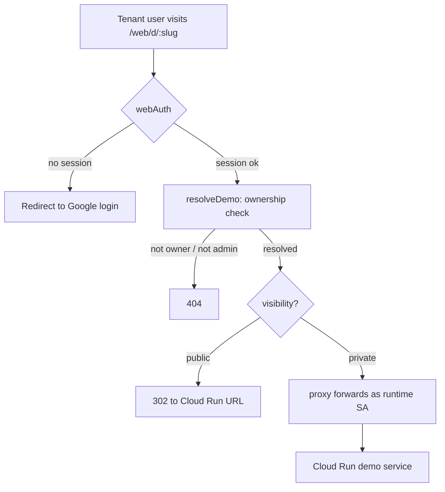

# RFC-010: Demo Sharing — Viewers and Editors

**Status:** Proposed **Authors:** Agent Runtime Team **Created:** 2026-07-09
**Depends on:** RFC-007 (demo serve architecture), RFC-005 (Slack demo command)

---

## Abstract

Today a demo belongs to exactly one person: the user who created it. Their email
scopes the GCS source archive, the Cloud Run service name, the Artifact Registry
image, and the `demo.json` metadata. Only that user (or a tenant admin) can view
a private demo, push changes, download the source, or deploy it. There is no way
for the creator to bring a colleague in.

This RFC adds **demo sharing**: the creator of a demo — working from either the
Slack bot or the control-plane web UI — can grant other users in the same tenant
one of two roles on a specific demo:

- **Viewer** — may open the running demo through the authenticated demo proxy.
- **Editor** — may do everything the owner can: view, iterate on the demo,
  redeploy, change visibility, download the source, and **invite further users**
  (as viewers or editors).

Sharing is stored in a new per-tenant `demo_share` table and enforced at the two
existing access chokepoints: the `/web/d/{slug}` demo proxy (viewing) and the
`/api/demos/*` routes (editing). No change to Cloud Run IAM is required — private
demos are already served through the control plane acting as the runtime service
account, so extending _who_ the proxy will forward for is a pure
application-layer change.

---

## Table of Contents

1. [Motivation](#1-motivation)
2. [Goals and Non-Goals](#2-goals-and-non-goals)
3. [How Access Works Today (and Why There Is No IAP)](#3-how-access-works-today-and-why-there-is-no-iap)
4. [Roles and Capabilities](#4-roles-and-capabilities)
5. [Who Can Be Shared With](#5-who-can-be-shared-with)
6. [Data Model](#6-data-model)
7. [Access Resolution](#7-access-resolution)
8. [API Changes](#8-api-changes)
9. [Web UI Changes](#9-web-ui-changes)
10. [Slack Bot Changes](#10-slack-bot-changes)
11. [Notifications](#11-notifications)
12. [Security Considerations](#12-security-considerations)
13. [Implementation Plan](#13-implementation-plan)
14. [Documentation Changes](#14-documentation-changes)
15. [Test Plan](#15-test-plan)
16. [Config and Settings Changes](#16-config-and-settings-changes)
17. [Open Questions](#17-open-questions)

---

## 1. Motivation

Demos are collaborative by nature. A demo is usually built for a customer
conversation, an internal review, or a shared prototype — situations where more
than one person needs to see the running app, and often more than one person
needs to iterate on it. The current single-owner model forces awkward
workarounds:

- **To let a teammate view a private demo**, the creator either makes it fully
  public (`allUsers` on the Cloud Run service — anyone with the URL, inside or
  outside the tenant) or asks an admin to look, since admins are the only other
  principals `resolveDemo` will honor
  (`control-plane/src/api/demos/proxy.ts` lines 22–37).
- **To let a teammate edit**, there is no option at all. Source, service, and
  image are all scoped to the creator's email
  (`demoPath` / `serviceName` / `demoImage` in
  `sdk-client-deno/src/operations/demos.ts` and
  `control-plane/src/api/demos/deploy.ts`). A second person cannot push feedback
  or redeploy without impersonating the creator.

Sharing closes this gap with the least possible new machinery: a small
membership table and role checks at the two places access is already decided.

---

## 2. Goals and Non-Goals

### Goals

- Let a demo's owner (or an editor) grant **viewer** or **editor** access on a
  specific demo to another user in the same tenant.
- Let **editors** do everything the owner can — including inviting and removing
  other users — so the grant is a genuine delegation, not a read-only add-on.
- Enforce viewing access at the existing `/web/d/{slug}` proxy and editing
  access at the existing `/api/demos/*` routes, with **no new GCP IAM per
  user**.
- Surface sharing in **both** entry points that create demos today: the web UI
  (`web/src/islands/demos.tsx`) and the Slack bot
  (`control-plane/src/bots/slack/commands/demo.ts`).
- Make "shared with me" demos discoverable: they appear in the demo list
  alongside owned demos, badged with the caller's role.

### Non-Goals

- **Cross-tenant sharing.** A share target must resolve to the same tenant. The
  tenant boundary (separate SQLite DB per tenant) is unchanged.
- **Enumerating the full Google Workspace directory.** The codebase has no
  Directory / Admin SDK integration
  ([§5](#5-who-can-be-shared-with)); the share picker is sourced from the
  tenant's known `user` table plus domain-validated free entry. Full directory
  enumeration is an [open question](#17-open-questions).
- **Introducing IAP.** Private demos are not served behind Identity-Aware Proxy
  today ([§3](#3-how-access-works-today-and-why-there-is-no-iap)); this RFC does
  not add it. Sharing hooks into the existing authenticated proxy instead.
- **Team- or group-based sharing.** Sharing is per-user. Group grants (e.g. a
  Cloud Identity group) are an [open question](#17-open-questions).
- **A new auth model.** Sharing reuses the existing `webAuth` / `apiAuth` /
  `slackBotAuth` identity resolution unchanged; it only adds a per-demo
  authorization check on top.

---

## 3. How Access Works Today (and Why There Is No IAP)

The request that motivated this feature described viewers "viewing the app
through IAP." It is worth stating plainly: **Agent Runtime does not use
Identity-Aware Proxy for demos** (a repo-wide search for `IAP` / `identity-aware`
returns nothing in the control plane; RFC-002 §322–334 explains why IAP is
avoided for the service-to-service path). Private demo access is instead a
**two-layer, application-level** mechanism:



1. **Cloud Run IAM.** A private demo's service grants `roles/run.invoker` to the
   runtime service account only; `allUsers` is stripped
   (`nextDemoBindings` / `setServiceAccess`,
   `control-plane/src/api/demos/deploy.ts` lines 150–256). The raw `*.run.app`
   URL therefore 403s for everyone except that SA.
2. **Control-plane proxy.** Users reach a private demo at
   `{cpBase}/web/d/{slug}` (`demoAccessUrl`, `deploy.ts` lines 122–129). That
   route sits behind `webAuth` (`control-plane/src/api/web.ts` lines 33–34) and
   `resolveDemo`, then `forward()` mints an identity token as the runtime SA and
   proxies the request (`proxy.ts` lines 75–138).

The consequence for this RFC is important and simplifying: **the demo's Cloud
Run service never sees the end user's identity** — it only ever sees the runtime
SA. So "who is allowed to view this private demo" is decided entirely by
`resolveDemo`. Adding viewers and editors means teaching `resolveDemo` (and the
editing routes) about the `demo_share` table. **No per-user Cloud Run invoker
binding is created**, which keeps GCP IAM churn-free and avoids the 250-member
policy limits that per-user bindings would eventually hit.

Editors' _mutations_ (update, deploy, download, invite) do not touch Cloud Run
directly either — they go through the `/api/demos/*` routes, which is the second
chokepoint we extend.

> **Public demos.** A public demo binds `allUsers` and is reachable at its raw
> Cloud Run URL by anyone. Shares still apply to public demos — they govern
> _editing_ rights (iterate/redeploy/download/invite), which remain
> owner/editor-only regardless of visibility. Viewer grants on a public demo are
> allowed but redundant for viewing.

---

## 4. Roles and Capabilities

Every action on a demo maps to a required role. `owner` is the demo's creator
(the email that scopes its storage); `admin` is a tenant admin
(`isAdmin`); `editor` and `viewer` are grants stored in `demo_share`.

| Capability                                | Owner | Editor | Viewer | Admin |
| ----------------------------------------- | :---: | :----: | :----: | :---: |
| View running demo (`/web/d/{slug}`)       |   ✅   |   ✅    |   ✅    |   ✅   |
| List / see metadata (`GET /:name`)        |   ✅   |   ✅    |   ✅    |   ✅   |
| Download source (`/download`, `/archive`) |   ✅   |   ✅    |   ❌    |   ✅   |
| Update via feedback (`/update`)           |   ✅   |   ✅    |   ❌    |   ✅   |
| Deploy / stop (`/deploy`, `/stop`)        |   ✅   |   ✅    |   ❌    |   ✅   |
| Change visibility                         |   ✅   |   ✅    |   ❌    |   ✅   |
| Manage shares (invite / remove)           |   ✅   |   ✅    |   ❌    |   ✅   |
| Delete demo (`DELETE /:name`)             |   ✅   |   ⚠️    |   ❌    |   ✅   |
| Remove the owner / transfer ownership     |   ❌   |   ❌    |   ❌    |   ✅   |

The intent stated in the feature request is that an editor can "do anything else
that the owner could." Editors are therefore a full delegation of the owner's
per-demo powers, with two guardrails:

- **⚠️ Delete.** An editor _can_ delete the demo (it is "something the owner can
  do"), but because delete is destructive and irreversible, the UI and Slack
  flows require an explicit confirmation and label who owns it. Whether editors
  should be able to delete at all is called out in
  [Open Questions](#17-open-questions); the default is "yes, with confirmation."
- **Owner immutability.** No role (except admin) can remove the owner's grant or
  reassign ownership. The owner row is implicit (derived from the GCS path), not
  a `demo_share` row, so it cannot be deleted through the share API. This
  prevents an editor from locking the owner out of their own demo.

Editors act **on the owner's demo**: their redeploys target the owner's Cloud
Run service, their edits write the owner's GCS source archive, and their
downloads read it. There is exactly one logical demo regardless of how many
editors touch it — see [§7](#7-access-resolution).

---

## 5. Who Can Be Shared With

The feature request frames the picker as "Google Workspace users that are in the
current tenant." Two facts from the codebase shape how we honor that:

1. **There is no Google Workspace Directory integration.** The system never
   calls the Admin SDK / Directory API and never reads the `hd` (hosted-domain)
   claim. It cannot enumerate "all users in the domain." Identity comes only
   from Google OAuth sign-in (`control-plane/src/api/auth.ts`) and JWT
   verification (`control-plane/src/middleware/auth.ts`).
2. **Tenant membership is a row in the tenant's `user` table.** A user becomes
   known to a tenant by being invited by an admin
   (`POST /api/settings/users` → `ensure()`), by signing into the web UI, or by
   hitting any API route (the `resolveTenant` middleware calls `ensure(email)`).

Given that, the share picker draws from two sources, in order of preference:

- **Known tenant users.** A new read-only, non-admin endpoint returns the
  tenant's `user` table (id = email, plus name and admin flag) so the picker can
  offer autocomplete over people already in the tenant. This is the closest
  faithful stand-in for "users in the tenant."
- **Domain-validated free entry.** The sharer may also type an email that is not
  yet in the `user` table. It is accepted only if it passes `validateDomain`
  (the deployment-wide `AR_ALLOWED_DOMAINS` gate,
  `control-plane/src/middleware/auth.ts` lines 146–152) — i.e. it belongs to an
  allowed Workspace domain. On share, the address is `ensure()`d into the tenant
  exactly like the admin invite flow, so it becomes a first-class member the
  next time it signs in.

This keeps the picker honest (it never claims to know users it has never seen)
while still letting a creator share with any colleague on an approved domain. If
`AR_ALLOWED_DOMAINS` is unset (all domains allowed), free entry accepts any
well-formed email; deployments that want a hard tenant boundary should set it.

> **Future.** Wiring the Google Workspace Directory API to enumerate the full
> domain directory (and validate the `hd` claim per tenant) is a natural
> extension and is listed in [Open Questions](#17-open-questions). It is
> deliberately out of scope here because it introduces a new Google API
> dependency and a per-tenant Workspace-customer mapping the codebase does not
> yet have.

---

## 6. Data Model

Sharing lives in the per-tenant SQLite database (the same store used for users,
`entity_owner`, and `slack_identity`), synced to GCS as `registry.db`. A demo is
identified by `(tenant, owner email, slug)` — two users may each own a demo with
the same slug — so a share row must carry the owner to disambiguate.

### New table: `demo_share` (schema v10)

Added as migration index 10 in `sdk-client-deno/src/db/schema.ts`, with
`SCHEMA_VERSION` bumped `9 → 10`:

```sql
CREATE TABLE IF NOT EXISTS demo_share (
  tenant_id  TEXT NOT NULL REFERENCES tenant(id),
  owner_id   TEXT NOT NULL,
  slug       TEXT NOT NULL,
  member_id  TEXT NOT NULL,
  role       TEXT NOT NULL CHECK (role IN ('viewer', 'editor')),
  granted_by TEXT NOT NULL,
  created_at TEXT NOT NULL DEFAULT (datetime('now')),
  PRIMARY KEY (tenant_id, owner_id, slug, member_id)
);

CREATE INDEX IF NOT EXISTS demo_share_member
  ON demo_share (tenant_id, member_id);
CREATE INDEX IF NOT EXISTS demo_share_demo
  ON demo_share (tenant_id, owner_id, slug);
```

| Column       | Meaning                                                        |
| ------------ | -------------------------------------------------------------- |
| `owner_id`   | Email that scopes the demo's storage/service (the creator)     |
| `slug`       | Demo slug (`slugify`'d, matches `demo.json` `name`)            |
| `member_id`  | Email the demo is shared with (grantee)                        |
| `role`       | `viewer` or `editor`                                           |
| `granted_by` | Email that created this grant (owner, an editor, or an admin)  |

The `demo_share_member` index powers the "shared with me" query
(`WHERE member_id = ?`); the `demo_share_demo` index powers "who is this demo
shared with" (`WHERE owner_id = ? AND slug = ?`).

### New DB module: `sdk-client-deno/src/db/demo-shares.ts`

A small CRUD module over `demo_share`, following the shape of
`sdk-client-deno/src/db/slack.ts`:

```ts
type DemoShare = {
  ownerId: string
  slug: string
  memberId: string
  role: 'viewer' | 'editor'
  grantedBy: string
  createdAt: string
}

function upsert(tenantId: string, share: Omit<DemoShare, 'createdAt'>): void
function remove(tenantId: string, ownerId: string, slug: string, memberId: string): void
function forMember(tenantId: string, memberId: string): DemoShare[]
function forDemo(tenantId: string, ownerId: string, slug: string): DemoShare[]
function role(tenantId: string, ownerId: string, slug: string, memberId: string): 'viewer' | 'editor' | null

export { forDemo, forMember, remove, role, upsert }
export type { DemoShare }
```

`upsert` re-grants (changing a viewer to editor, or vice versa) by primary-key
replace. `remove` on a slug also runs when a demo is deleted, to reap orphaned
rows.

> **Why not `demo.json`?** Demo metadata lives in GCS keyed by owner
> (`{tenant}/demos/{owner}/{slug}/demo.json`). Storing shares there would make
> "which demos are shared with me?" an O(all demos) bucket scan across every
> owner's prefix. A DB table with a `member_id` index answers it with one query,
> and matches how the codebase already stores co-ownership (`entity_owner`).

---

## 7. Access Resolution

Two chokepoints gain share awareness. Both resolve to a canonical
`{ meta, ownerId, role }` so that all downstream storage/deploy operations act
under the **owner's** scope, never the caller's.

### 7.1 The shared resolver

A new helper in the demos API (e.g. `control-plane/src/api/demos/access.ts`)
centralizes the decision so the routes and the proxy agree:

```ts
type Access = { meta: DemoMeta; ownerId: string; role: DemoRole }
type DemoRole = 'owner' | 'editor' | 'viewer' | 'admin'

// owner? → editor/viewer share? → admin? → null
async function resolveAccess(
  project: string,
  tenantId: string,
  email: string,
  isAdmin: boolean,
  slug: string,
  ownerHint?: string, // disambiguates slug collisions (see §7.3)
): Promise<Access | null>
```

Resolution order:

1. **Owner.** `loadMeta(project, tenantId, email, slug)` — if the caller owns a
   demo with this slug, that wins (preserves today's behavior exactly).
2. **Share.** Look up `demo_share` rows where `member_id = email` and
   `slug = slug`. Each row names an `owner_id`; `loadMeta` that owner's
   `demo.json`. If `ownerHint` is provided, filter to it. The row's `role`
   (`editor`/`viewer`) is attached.
3. **Admin.** Fall back to today's admin path (`listDemos` across the tenant),
   with `role: 'admin'`.
4. Otherwise `null` (→ 404/403).

A capability check (`can(role, action)`) gates each route per the matrix in
[§4](#4-roles-and-capabilities).

### 7.2 Proxy (viewing) — `control-plane/src/api/demos/proxy.ts`

`resolveDemo` (lines 22–37) is replaced by a call to `resolveAccess` with no
role requirement beyond "can view" (owner/editor/viewer/admin all pass), so a
viewer/editor now resolves where previously only the owner or an admin did.
Public demos still 302 to the Cloud Run URL; private demos are still proxied as
the runtime SA.

The one behavioral change beyond resolution is that **the owner hint must
survive the whole proxied session**, not just the first request. The proxy
serves a demo under the flat `/web/d/{slug}` prefix and rewrites URLs against it
(`rewriteHtml` injects `<base href="/web/d/{slug}/">` and rewrites
`href`/`src`/`action`; `rewriteLocation` prefixes redirects — proxy.ts lines
39–64). Those rewrites currently know only `name`, so on a shared demo opened as
`/web/d/foo?owner=alice`, every follow-up request (a relative
`/web/d/foo/main.js`, a root-absolute `/data.json`, or a redirect) would arrive
with no `owner`, and `resolveAccess`'s owner-wins rule (or a second matching
share) could silently route it to the wrong `foo`. To prevent that:

- **`handle()` reads `owner` from the request query, then falls back to the
  `Referer`'s `owner`.** Sub-path assets loaded via the injected `<base href>`
  carry a `Referer` of `/web/d/foo?owner=alice`, so the hint is recoverable even
  when the asset URL itself has no query.
- **`rewriteHtml` / `rewriteLocation` preserve the hint** by carrying `?owner=`
  into the injected `<base href>` and appending it to prefixed root-absolute
  attribute/redirect rewrites, so browser-resolved URLs keep the owner.
- **`referred()` (proxy.ts lines 164–195)** already recovers the demo `name`
  from the `Referer`; it is extended to also parse `owner` from the `Referer`'s
  query and pass it as `ownerHint`, so root-absolute asset requests that bypass
  the `<base href>` still resolve to the right owner.

For owned demos (the common case) `ownerHint` is absent and behavior is
identical to today.

### 7.3 Slug collisions and `ownerHint`

`/web/d/{slug}` carries only the slug. If a caller both owns a demo named `foo`
and is a viewer on someone else's `foo`, or is shared on two different owners'
`foo`, the slug is ambiguous. Resolution rules:

- **Own demo always wins** (rule 1 above), so a caller's own `foo` is never
  shadowed by a share.
- For shares, the access URL generated for shared demos carries the owner as a
  query param: `/web/d/{slug}?owner={ownerEmail}`. `resolveAccess` passes it as
  `ownerHint`. The "shared with me" list ([§8](#8-api-changes)) always emits
  this form for demos the caller does not own, so links are unambiguous in
  practice.
- If a shared link is opened without a hint and more than one share matches, the
  proxy returns a small disambiguation page listing the matching owners
  (rare; only when the same slug is shared from two owners).

### 7.4 Editing routes — `control-plane/src/api/demos/routes.ts`

Every mutating route currently does
`loadMeta(cfg.project, tenantId, email, name)` and then uses `email` as the
storage/deploy scope. Each is refactored to:

```ts
const access = await resolveAccess(project, tenantId, email, isAdmin, name)
if (!access) return c.json({ error: 'Demo not found' }, 404)
if (!can(access.role, 'update')) return c.json({ error: 'Forbidden' }, 403)
const { ownerId, meta } = access
// use ownerId (NOT email) for storeMeta / deployContainer / destroyContainer /
// downloadSource / image / serviceName
```

This is the crux of editor support: `deployContainer(cfg, tenantId, ownerId,
meta, visibility)` builds the owner's image and deploys the owner's service, so
an editor's redeploy updates the one shared demo rather than spawning a
private copy under the editor's email. The create route (`POST /`) is unchanged
— new demos are always owned by their creator.

Fixing the pre-existing gap noted below is folded in: `POST /:name/deploy`
currently does not persist `visibility` back to `demo.json` (routes.ts lines
186–189); since editors can change visibility, the resolved `meta.visibility` is
now written through.

---

## 8. API Changes

All routes are mounted under both `/api/demos` (identity auth) and `/demos`
(`control-plane/src/mod.ts`). New endpoints:

| Method + path                        | Auth role     | Body / query                     | Purpose                                              |
| ------------------------------------ | ------------- | -------------------------------- | ---------------------------------------------------- |
| `GET /:name/shares`                  | owner/editor/admin | `?owner=` (disambiguation)   | List grants on a demo                                |
| `POST /:name/shares`                 | owner/editor/admin | `{ member, role, owner? }`   | Add or update a grant                                |
| `DELETE /:name/shares/:member`       | owner/editor/admin | `?owner=`                    | Revoke a grant                                       |
| `GET /members`                       | any tenant user | —                              | Tenant `user` list for the share picker ([§5](#5-who-can-be-shared-with)) |

`POST /:name/shares` behavior:

1. Resolve the demo via `resolveAccess`; require `manage-shares` capability.
2. Validate `member` against `validateDomain`; reject `403` if the domain is not
   allowed.
3. `ensure(member)` into the tenant `user` table (mirrors the admin invite
   flow).
4. Reject sharing with the owner (no-op) and reject `member === granted_by` when
   it would demote the caller.
5. `upsert` the `demo_share` row; write an audit event.

Changes to existing endpoints:

- **`GET /` (list).** Returns owned demos **plus** shared demos. For each row in
  `forMember(tenantId, email)`, `loadMeta(owner, slug)` and append. Each demo
  gains two response-only fields so the UIs can badge and gate:

  ```jsonc
  {
    "name": "bean-scene",
    "createdBy": "alice@corp.com",
    "visibility": "private",
    "role": "editor",        // caller's role: owner | editor | viewer | admin
    "accessUrl": "/web/d/bean-scene?owner=alice%40corp.com"
  }
  ```

  `role` and `accessUrl` are computed per-caller and are not persisted to
  `demo.json`.
- **`GET /:name`, `/deploy`, `/stop`, `/update`, `/download`, `/archive`,
  `DELETE /:name`.** Switch from `email`-scoped `loadMeta` to `resolveAccess` +
  capability check + `ownerId` scoping, per [§7.4](#74-editing-routes--control-planesrcapidemosroutests).
- **`/cleanup`.** Unchanged (admin TTL sweep already operates cross-user);
  deleting a demo also calls `demoShares.remove` for the slug to reap rows.

The `demo_share` writes are audited as a new `demo-share` audit type (create /
update / revoke), following the `telemetry-client` audit precedent from RFC-008.

---

## 9. Web UI Changes

`web/src/islands/demos.tsx` (the demos island) gains sharing without changing
its overall list/create/feedback structure.

- **List rows.** Demos where `role !== 'owner'` render a small role badge
  (`shared: editor` / `shared: viewer`) and the owner's email. Action buttons
  are gated by `role` using the [§4](#4-roles-and-capabilities) matrix: viewers
  see only **Open**; editors see the full action bar; the existing `isOwner`
  gate (demos.tsx line ~491) is generalized to `canEdit = role === 'owner' ||
  role === 'editor' || isAdmin`.
- **Open link.** Uses the server-provided `accessUrl` (which already carries
  `?owner=` for shared demos), so viewers land on the right demo through the
  proxy.
- **Share panel.** A new expandable "Share" section on each demo the caller can
  manage. It shows current grants (from `GET /:name/shares`), a role dropdown
  (Viewer / Editor) per grant, a remove button, and an add control backed by
  `GET /members` for autocomplete plus domain-validated free entry. Adding calls
  `POST /:name/shares`; removing calls `DELETE /:name/shares/:member`.
- **Create/deploy flow.** Unchanged. Sharing is a post-creation action, matching
  how demos are created first and deployed second today.

The mock API (`web/dev/mock.ts`) gains handlers for the four new endpoints and a
`demo-shares.json` fixture so the island is developable with `npm run dev`.

---

## 10. Slack Bot Changes

The Slack demo command (`control-plane/src/bots/slack/commands/demo.ts`) gains
share subcommands, parsed the same way as the existing
`deploy`/`stop`/`delete`/`visibility` verbs (RFC-005 §7):

| Command                                  | Action                                             |
| ---------------------------------------- | -------------------------------------------------- |
| `demo share {name} {email} [viewer\|editor]` | Grant access (default role: `viewer`)          |
| `demo unshare {name} {email}`            | Revoke access                                      |
| `demo shares {name}`                     | List who a demo is shared with                     |

- **The bot invokes the sharing logic in-process, not over HTTP.** The demo API
  routes are mounted behind `apiAuth` (`/api/demos/*` and `/demos/*` in
  `control-plane/src/mod.ts`), which expects a Google identity bearer the Slack
  handler does not hold; and per AGENTS.md ("the bot imports internal functions
  directly … rather than making HTTP calls to itself") the existing demo command
  already calls `invokeAgent` / `deployContainer` / `destroyContainer` directly.
  The share subcommands follow the same pattern: they call `resolveAccess` +
  `can()` for authorization and the `demo-shares.ts` DB module
  (`upsert`/`remove`/`forDemo`) plus `ensure` / `validateDomain` directly, with
  the caller's email resolved by `slackBotAuth` as today. Authorization is
  therefore identical to the web path because both call the same `resolveAccess`
  helper — not because both hit the same HTTP route.
- The `demos` list command (`commands/demos.ts`) shows shared demos with a role
  suffix, e.g. `● bean-scene (running, private) — shared: editor`.
- Because shared demos are keyed by owner, the bot resolves them through
  `resolveAccess` in-process; the caller only ever types the slug. If a slug is
  ambiguous, `resolveAccess` returns the candidate owners and the bot asks the
  user to disambiguate (`demo shares {name}` shows the owner column).

Wiring, per the AGENTS.md "adding a new command" checklist: extend the parser in
`commands/demo.ts`, keep `dispatch.ts`'s `demo` route (no new top-level
command), update `commands/help.ts`, and add structural tests to
`cli/test/slack-demo.test.ts`. Interactive share buttons on the demo card are an
optional follow-up (`actions/handlers.ts`), not required for v1.

---

## 11. Notifications

When a demo is shared, the grantee benefits from a heads-up. Reusing the Slack
bot, sharing **optionally** DMs the grantee if they are enrolled
(`slack_identity` has a row for their email in the tenant):

> `alice@corp.com shared the demo *bean-scene* with you as an *editor*.`
> `Open it: {cpBase}/web/d/bean-scene?owner=alice%40corp.com`

This is best-effort and non-blocking: if the grantee is not enrolled or the DM
fails, the share still succeeds (mirroring how demo deploy failures are surfaced
but never block the primary action). Email notification is out of scope (no
transactional email system exists in the codebase today).

---

## 12. Security Considerations

- **Tenant boundary preserved.** `demo_share` lives in the per-tenant DB and
  every lookup is scoped by `tenant_id`. A share can only reference a member in
  the same tenant, and `validateDomain` bounds who can be added.
- **No privilege escalation to the platform.** A share grants rights on **one
  demo**, never tenant-admin or cross-demo powers. `isAdmin` is untouched.
- **Owner cannot be locked out.** Ownership is derived from the GCS path, not a
  `demo_share` row, so no share operation can remove or override the owner
  (only an admin can, via direct DB/GCS access). Editors cannot delete the
  owner's grant.
- **Editor scope is per demo.** An editor of demo `foo` gains nothing on demo
  `bar`. Their actions execute under the owner's storage/service scope, so they
  cannot exfiltrate the demo into their own namespace beyond what "download
  source" already allows (which is an explicit editor capability).
- **Viewing still flows through the authenticated proxy.** Viewers never receive
  the raw Cloud Run URL for a private demo and never get a Cloud Run IAM
  binding; they are proxied as the runtime SA exactly like the owner. Revoking a
  share takes effect on the next request because `resolveAccess` reads the DB
  live.
- **Least-change to GCP IAM.** No per-user invoker bindings are created, so the
  Cloud Run IAM policy stays small and there is no new path to make a private
  service publicly invocable by accident.
- **Auditability.** Every grant/revoke is written to the audit log with actor,
  target, demo, and role, so sharing is traceable.
- **Free-entry abuse.** Because free entry `ensure()`s a new user row, a
  malicious sharer could seed arbitrary allowed-domain emails into the `user`
  table. This is the same exposure the existing admin invite and auto-`ensure`
  paths already have, and it is bounded by `AR_ALLOWED_DOMAINS`; it is called out
  so operators can decide whether to restrict who may share
  ([Open Questions](#17-open-questions)).

---

## 13. Implementation Plan

### Phase 1 — Data model

| Step | File | Change |
| ---- | ---- | ------ |
| 1a | `sdk-client-deno/src/db/schema.ts` | Add `demo_share` as migration index 10; bump `SCHEMA_VERSION` 9 → 10 |
| 1b | `sdk-client-deno/src/db/demo-shares.ts` (new) | CRUD module (`upsert`, `remove`, `forMember`, `forDemo`, `role`) |

### Phase 2 — Access resolution and routes

| Step | File | Change |
| ---- | ---- | ------ |
| 2a | `control-plane/src/api/demos/access.ts` (new) | `resolveAccess` + `can(role, action)` capability map |
| 2b | `control-plane/src/api/demos/proxy.ts` | Replace `resolveDemo` with `resolveAccess`; honor `?owner=`; update `referred()` |
| 2c | `control-plane/src/api/demos/routes.ts` | Re-scope all mutating routes to `ownerId`; add capability checks; persist `visibility` on deploy; add `GET/POST/DELETE /:name/shares`, `GET /members`; extend `GET /` with `role`/`accessUrl` and shared demos; reap shares on delete |
| 2d | `sdk-client-deno/src/operations/demos.ts` | No type change required for `demo.json`; `role`/`accessUrl` are response-only (added in the route). Optional: export a small `accessUrl` helper |

### Phase 3 — Web UI

| Step | File | Change |
| ---- | ---- | ------ |
| 3a | `web/src/islands/demos.tsx` | Role badges, capability-gated actions, `accessUrl` open link, Share panel |
| 3b | `web/dev/mock.ts`, `web/dev/fixtures/demo-shares.json` (new) | Mock the four endpoints + fixture |

### Phase 4 — Slack bot

| Step | File | Change |
| ---- | ---- | ------ |
| 4a | `control-plane/src/bots/slack/commands/demo.ts` | Parse `share` / `unshare` / `shares` subcommands |
| 4b | `control-plane/src/bots/slack/commands/demos.ts` | Show role suffix on shared demos |
| 4c | `control-plane/src/bots/slack/commands/help.ts` | Document the new subcommands |
| 4d | `control-plane/src/bots/slack/commands/demo.ts` | Optional Slack DM notification on share (best-effort) |

### Phase 5 — Docs and tests

| Step | File | Change |
| ---- | ---- | ------ |
| 5a | `docs/storage.md`, `docs/iam.md` | Document `demo_share` and the share access model ([§14](#14-documentation-changes)) |
| 5b | `AGENTS.md` | Add the share endpoints to the demo/diagnostic references |
| 5c | `CHANGELOG.md` | Feature entry under the next `cli/deno.jsonc` bump |
| 5d | `cli/test/demo-shares.test.ts` (new), `cli/test/slack-demo.test.ts` | Resolver, route auth, and Slack parser tests ([§15](#15-test-plan)) |
| 5e | This RFC | Mark **Status: Implemented** once merged and shipped |

No `sdk-agent-nodejs` change is required — the demo agent generates source and is
unaware of sharing. Existing tenant DBs migrate automatically to v10 on the next
`open()` (`migrate()` in `schema.ts`).

---

## 14. Documentation Changes

Documentation is part of the deliverable:

- **`docs/storage.md`** — under the demos section, document the `demo_share`
  table (schema v10), that shares are per-`(owner, slug)`, and that shared demos
  are still served through the `/web/d/{slug}` proxy (no new Cloud Run IAM).
- **`docs/iam.md`** — add a "Demo sharing" subsection: the viewer/editor
  capability matrix ([§4](#4-roles-and-capabilities)), that access is enforced
  in the proxy and API (not IAP, not per-user Cloud Run IAM), and how
  `AR_ALLOWED_DOMAINS` bounds share targets. Correct the stale
  `allAuthenticatedUsers` description for private demos while here (it does not
  match the code).
- **`AGENTS.md`** — add the four share endpoints to the demo API references and
  note the `demo share` / `demos` Slack subcommands in the Slack bot section.
- **`CHANGELOG.md`** — summarize the feature under the next version bump.
- **`README.md` / `CONTRIBUTING.md`** — per the "review after major changes"
  guidance, add a one-line pointer to demo sharing wherever demos are described,
  for discoverability.

The control-plane docs viewer builds its nav by walking `docs/*.md`, so updates
appear in `/web` docs automatically.

---

## 15. Test Plan

### DB module (`cli/test`, Deno)

- `upsert` inserts then updates a role in place; `role()` returns the current
  value; `remove` deletes exactly one grant; `forMember` / `forDemo` filter and
  index correctly.
- Migration: opening a pre-v10 DB creates `demo_share` and reports
  `SCHEMA_VERSION === 10`.

### Access resolver and routes

- **Owner-wins:** a caller who owns `foo` resolves to their own demo even when
  also shared on another owner's `foo`.
- **Editor parity:** an editor can `update` / `deploy` / `stop` /
  `visibility` / `download` / manage shares; operations execute under the
  **owner's** scope (assert `deployContainer` / `storeMeta` receive `ownerId`,
  not the editor's email).
- **Viewer limits:** a viewer resolves for the proxy and `GET /:name` but
  receives `403` on every mutating route and on `/download`/`/archive`.
- **Owner protection:** `POST /:name/shares` refuses to add/alter the owner;
  `DELETE .../shares/{owner}` is a no-op/`403`.
- **Domain gate:** sharing with an out-of-domain email `403`s when
  `AR_ALLOWED_DOMAINS` is set; in-domain free entry `ensure()`s the user.
- **Disambiguation:** two owners sharing the same slug with one member →
  `?owner=` resolves each; missing hint returns the candidate list.
- **Delete reaping:** deleting a demo removes its `demo_share` rows.
- **Visibility persistence:** `POST /:name/deploy` now writes `visibility` back
  to `demo.json`.

### Slack parser (`cli/test/slack-demo.test.ts`)

- `demo share bean-scene bob@corp.com editor`, `demo unshare …`,
  `demo shares …` parse to the right handler and API calls; default role is
  `viewer`.

### Proxy

- Extend `cli/test/demo-deploy.test.ts` (or a new proxy test) so a viewer and an
  editor both resolve through `handle()` for a private demo, and a non-shared
  non-admin still gets `notFound`.

All suites run under `deno task test`; `deno task check` must pass.

---

## 16. Config and Settings Changes

- **No new secrets.** Sharing reuses existing auth and the per-tenant DB.
- **No new required settings.** `AR_ALLOWED_DOMAINS` (already documented in
  `CONFIG.md` / `default-settings.jsonc`) gains a second role: it bounds who a
  demo may be shared with. This is behavior clarification, not a new key.
- **Schema version** advances to `10`; the migration is automatic and additive
  (a new table + indexes), so no operator action is needed. Tenant DBs are
  re-synced to GCS on the normal push cycle.

---

## 17. Open Questions

1. **Editor delete rights.** Should an editor be able to `DELETE` the demo
   entirely, or should delete stay owner/admin-only? Default proposal: editors
   can delete with an explicit confirmation, matching "anything the owner can
   do." Restricting delete is a one-line capability-matrix change if preferred.
2. **Google Workspace Directory integration.** Should the share picker enumerate
   the full domain directory via the Admin SDK / Directory API (and validate the
   `hd` claim per tenant), rather than only the tenant's known `user` table plus
   domain-validated free entry? This adds a Google API dependency and a
   per-tenant Workspace-customer mapping.
3. **Group sharing.** Should shares be grantable to a Cloud Identity group
   (already used for Slack authorization) so access follows group membership
   instead of enumerated users?
4. **Who may share.** Should the ability to _create_ shares be restricted (e.g.
   owner-only, or a tenant setting), given that free entry seeds `user` rows?
   Default proposal: owner + editors, bounded by `AR_ALLOWED_DOMAINS`.
5. **Per-user direct access.** Is the authenticated proxy sufficient, or do we
   want an option to grant specific users direct Cloud Run invoker access
   (closer to true IAP) for demos that must be reachable outside the proxy? The
   proxy is preferred here; this is noted only as a possible future mode.
6. **Notification channel.** Beyond the optional Slack DM, is an email or web
   in-app notification of new shares desired? No transactional email system
   exists today.
