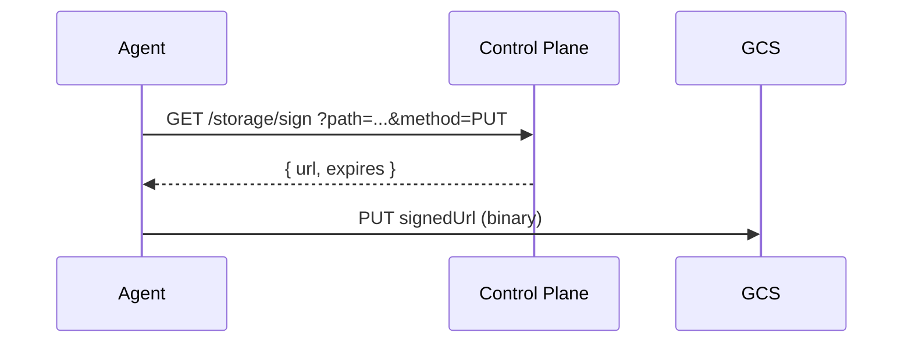

# Agent Storage

How agents read and write data in the Agent Runtime.

---

## Overview

Agents access three categories of data, each with a different delivery
mechanism:

| Data type          | Size          | Frequency             | Mechanism                       |
| ------------------ | ------------- | --------------------- | ------------------------------- |
| Tool binaries      | 50-200MB each | Rarely (per release)  | Baked into base container image |
| Rules and skills   | <50KB each    | Often (user-authored) | GCS FUSE read-only volume mount |
| Agent/tool files   | Up to 50MB    | Per deploy            | Signed URLs (bundled in source) |
| Agent working data | Variable      | Per request           | GCS direct via signed URLs      |

---

## GCS FUSE Volume Mount (Rules + Skills)

In container mode, every agent Cloud Run service has a read-only GCS FUSE
volume mounted at `/registry/`. This gives agents filesystem access to the
entire registry bucket without network round-trips or memory overhead.

### Bucket layout

```
gs://{project}-ar-registry/
  {tenantId}/
    rules/
      my-rule/0.0.1/
        rule.md
        README.md
    skills/
      my-skill/0.0.1/
        skill.md
        README.md
    agents/
      demo-agent/0.0.1/
        source.tar.gz
    demos/
      {userId}/{demoSlug}/
        demo.json
        source.tar.gz
```

### Agent access pattern

The `AgentRegistry` class (`sdk-agent-nodejs/src/registry.ts`) reads rules and
skills from the FUSE mount when available:

```javascript
const registry = AgentRegistry.instance
const rule = await registry.rules('my-rule', '0.0.1')
const skills = await registry.listSkills()
```

When `/registry/` is not available (source mode or local development), it
falls back to CP API calls.

### Update propagation

GCS FUSE uses a stat cache with a default TTL of 60 seconds. When a user
deploys a new rule via `ar rule deploy my-rule`, the rule file is uploaded to
GCS. All running agents see the new content within 60 seconds — no redeploy
needed.

### Memory overhead

- Stat cache: ~32MB max
- Type cache: ~4MB max
- Per-file read: ~1MB per concurrent read
- Total: ~37MB worst case

---

## Agent Working Storage (Signed URLs)

Agents read and write their own working data (demo source files, workspace
artifacts, outputs) through the `AgentStorage` class. All byte-transfer
operations use time-limited signed URLs to access GCS directly, bypassing the
control plane for data transfer.

### Flow



The control plane generates a V4 signed URL scoped to a single GCS object and
HTTP method. The agent then talks to GCS directly. The CP never touches the
bytes.

For reads, the same flow applies with `method=GET` — the agent fetches the
signed URL and GCS returns the data directly.

### Properties

- **No memory amplification**: binary data goes directly to/from GCS
- **CP not a bottleneck**: control plane only generates credentials
- **Time-limited**: URLs expire after 5 minutes by default (max 1 hour)
- **Path-scoped**: each URL is scoped to a single GCS object and HTTP method
- **Tenant-scoped**: the CP validates tenant scope before signing

### Signed URL endpoint

```
GET /storage/sign?path={gcs-path}&method=GET|PUT&ttl=300&contentType=...
-> { url: "https://storage.googleapis.com/...?X-Goog-Signature=...", expires: "..." }
```

The `ttl` parameter must be between 1 and 3600 seconds. Invalid values return
400.

### `AgentStorage` API

```javascript
const storage = AgentStorage.instance

await storage.write('output.json', jsonString)
const data = await storage.read('output.json')

await storage.push('/tmp/demos/my-demo', 'demos/my-demo/source')
await storage.pull('demos/my-demo/source', '/tmp/local')

const files = await storage.list('demos/')
const exists = await storage.exists('output.json')
await storage.remove('output.json')
```

Methods that transfer bytes (`write`, `read`, `push`, `pull`, `writeRaw`,
`readRaw`, `pushRaw`, `pullRaw`) use signed URLs. Methods that transfer only
metadata (`list`, `exists`, `remove`) are thin CP API calls.

The `Raw` variants use absolute GCS paths (no agent prefix). The non-Raw
variants scope paths under `{tenantId}/agent/{agentId}/files/`.

### IAM requirement

The admin SA needs `roles/iam.serviceAccountTokenCreator` to call the
`signBlob` API. This role is provisioned automatically by `ar cp deploy`.

---

## GCS Bucket

The registry bucket `{project}-ar-registry` is created automatically during
`ar cp deploy` if it doesn't exist. It stores:

| Path pattern                                        | Content                |
| --------------------------------------------------- | ---------------------- |
| `{tenantId}/registry.db`                            | SQLite database backup |
| `{tenantId}/agents/{slug}/{version}/source.tar.gz`  | Agent source archive   |
| `{tenantId}/agents/{slug}/{version}/files/`         | Agent user files       |
| `{tenantId}/tools/{slug}/{version}/archive.tar.gz`  | Tool archive           |
| `{tenantId}/tools/{slug}/{version}/files/`          | Tool user files        |
| `{tenantId}/rules/{slug}/{version}/archive.tar.gz`  | Rule archive           |
| `{tenantId}/skills/{slug}/{version}/archive.tar.gz` | Skill archive          |
| `{tenantId}/demos/{userId}/{slug}/source.tar.gz`    | Demo source archive    |
| `{tenantId}/demos/{userId}/{slug}/demo.json`        | Demo metadata          |
| `{tenantId}/access/{userId}/{grantId}/grant.json`   | Access grant metadata  |

The bucket is region-matched to the control plane for lowest latency and
free intra-region transfer.

---

## Demo Sharing

A demo is identified by `(tenant, owner email, slug)` — the owner email scopes
its GCS source archive, `demo.json`, Cloud Run service, and image. Sharing a
demo with another tenant user is recorded in the per-tenant SQLite database
(the same `registry.db` synced to GCS), **not** in `demo.json` — a
`member_id`-indexed table answers "which demos are shared with me?" in one
query instead of scanning every owner's bucket prefix.

The `demo_share` table (schema v10) holds one row per grant:

| Column       | Meaning                                                |
| ------------ | ------------------------------------------------------ |
| `owner_id`   | Email that scopes the demo's storage/service (creator) |
| `slug`       | Demo slug (matches `demo.json` `name`)                 |
| `member_id`  | Email the demo is shared with                          |
| `role`       | `viewer` or `editor`                                   |
| `granted_by` | Email that created the grant (owner, editor, or admin) |

Shared demos are still served through the authenticated `/web/d/{slug}` proxy
(carrying `?owner=` for disambiguation) and edited through `/api/demos/*` under
the **owner's** storage scope — no new Cloud Run IAM binding is created per
member. See [iam.md](iam.md#demo-sharing) for the capability matrix and
[RFC-010](rfc/rfc-010-demo-sharing.md) for the full design.

---

## Agent and Tool Files

Files uploaded to an agent or tool are stored at a predictable `files/`
directory within the entity's version path in GCS:

```
gs://{project}-ar-registry/
  {tenantId}/agents/{slug}/{version}/files/   # agent files
  {tenantId}/tools/{slug}/{version}/files/    # tool files
```

These files are deployed automatically alongside the entity:

- **Source mode (Cloud Functions)**: files are downloaded from GCS and
  bundled into the deploy directory at `files/` (agents) or
  `tools/{slug}/files/` (tools)
- **Container mode**: files are downloaded via signed URLs at runtime
  through the `AgentRegistry` SDK

### Upload (API)

Files are uploaded via signed URLs from the control plane:

```
POST /agents/:id/files/sign   { filename, method?, contentType? }
POST /tools/:id/files/sign    { filename, method?, contentType? }
→ { url, path }
```

The client PUTs the file directly to the returned signed URL. Files can
also be listed:

```
GET /agents/:id/files → { files: string[], prefix }
GET /tools/:id/files  → { files: string[], prefix }
```

### Runtime access (SDK)

Files are accessed via signed URLs through the `AgentRegistry` class, not
FUSE — this avoids memory issues with large files:

```javascript
const registry = AgentRegistry.instance

const files = await registry.listEntityFiles('agents', 'my-agent')
await registry.downloadEntityFile(
  'agents',
  'my-agent',
  'config.json',
  '/tmp/config.json',
)
await registry.downloadAllEntityFiles(
  'tools',
  'my-tool',
  '/tmp/tool-files/',
)
```

In source mode, files are already on disk at `files/` (relative to the
agent source) or `tools/{slug}/` (alongside the tool binary), so they can
be read directly without the SDK.
